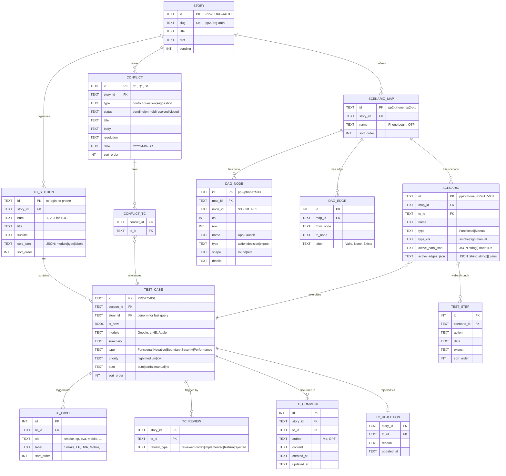

# DB Schema Draft

Covers: story (card details), conflicts, test cases, test steps.

## ER Diagram

## Tables

### `story`
| Column | Type | Notes |
|--------|------|-------|
| `id` | TEXT PK | Jira key: `PP-2`, `ORG-AUTH` |
| `slug` | TEXT UNIQUE | URL slug: `pp2`, `org-auth` |
| `title` | TEXT | Display title |
| `href` | TEXT | Path: `/pp2` |
| `pending` | INT | Count of pending items |

---

### `tc_section`
| Column | Type | Notes |
|--------|------|-------|
| `id` | TEXT PK | `tc-login`, `tc-phone` |
| `story_id` | TEXT FK → story | |
| `num` | TEXT | TOC number: `1`, `2` |
| `title` | TEXT | |
| `subtitle` | TEXT | |
| `cols_json` | TEXT | JSON array: `["module","type","labels"]` |
| `sort_order` | INT | |

---

### `test_case`
| Column | Type | Notes |
|--------|------|-------|
| `id` | TEXT PK | `PP2-TC-001` |
| `section_id` | TEXT FK → tc_section | |
| `story_id` | TEXT FK → story | Denorm for fast query |
| `is_new` | BOOL | ▲ New indicator |
| `module` | TEXT | `Google`, `LINE`, `Apple` |
| `summary` | TEXT | Full description |
| `type` | TEXT | `Functional\|Negative\|Boundary\|Security\|Performance` |
| `priority` | TEXT | `high\|medium\|low` |
| `auto` | TEXT | `auto\|partial\|manual\|no` |
| `sort_order` | INT | |

---

### `tc_label`
| Column | Type | Notes |
|--------|------|-------|
| `id` | INT PK | |
| `tc_id` | TEXT FK → test_case | |
| `cls` | TEXT | CSS class: `smoke`, `ep`, `bva` |
| `label` | TEXT | Display: `Smoke`, `EP`, `BVA` |
| `sort_order` | INT | |

---

### `conflict`
| Column | Type | Notes |
|--------|------|-------|
| `id` | TEXT PK | `C1`, `Q1`, `S1` |
| `story_id` | TEXT FK → story | |
| `type` | TEXT | `conflict\|question\|suggestion` |
| `status` | TEXT | `pending\|on-hold\|resolved\|closed` |
| `title` | TEXT | |
| `body` | TEXT | Full description |
| `resolution` | TEXT | Null if unresolved |
| `date` | TEXT | `YYYY-MM-DD` |
| `sort_order` | INT | |

---

### `conflict_tc` *(junction)*
| Column | Type | Notes |
|--------|------|-------|
| `conflict_id` | TEXT FK → conflict | |
| `tc_id` | TEXT FK → test_case | |

PK: `(conflict_id, tc_id)`

---

### `scenario_map`
| Column | Type | Notes |
|--------|------|-------|
| `id` | TEXT PK | `pp2-phone`, `pp2-otp` |
| `story_id` | TEXT FK → story | |
| `name` | TEXT | `Phone Login`, `OTP` |
| `sort_order` | INT | |

---

### `dag_node`
| Column | Type | Notes |
|--------|------|-------|
| `id` | TEXT PK | `pp2-phone::S33` |
| `map_id` | TEXT FK → scenario_map | |
| `node_id` | TEXT | `S33`, `N1`, `PL1` |
| `col` | INT | Grid column |
| `row` | INT | Grid row |
| `name` | TEXT | May contain `\n` |
| `type` | TEXT | `action\|decision\|expect` |
| `shape` | TEXT | `round\|rect` |
| `details` | TEXT | |

---

### `dag_edge`
| Column | Type | Notes |
|--------|------|-------|
| `id` | INT PK | |
| `map_id` | TEXT FK → scenario_map | |
| `from_node` | TEXT | Node ID |
| `to_node` | TEXT | Node ID |
| `label` | TEXT | `Valid`, `None`, `Exists` |

---

### `scenario`
| Column | Type | Notes |
|--------|------|-------|
| `id` | TEXT PK | `pp2-phone::PP2-TC-031` |
| `map_id` | TEXT FK → scenario_map | |
| `tc_id` | TEXT FK → test_case | |
| `name` | TEXT | |
| `type` | TEXT | `Functional\|Manual` |
| `type_cls` | TEXT | CSS: `smoke\|high\|manual` |
| `active_path_json` | TEXT | JSON `string[]` — node IDs to highlight |
| `active_edges_json` | TEXT | JSON `[string,string][]` — edge pairs to highlight |

---

### `test_step`
| Column | Type | Notes |
|--------|------|-------|
| `id` | INT PK | |
| `scenario_id` | TEXT FK → scenario | |
| `action` | TEXT | Step action |
| `data` | TEXT | Test data / condition |
| `expect` | TEXT | Expected result |
| `sort_order` | INT | |

---

### `tc_review` *(existing, unchanged)*
| Column | Type | Notes |
|--------|------|-------|
| `story_id` | TEXT FK → story | |
| `tc_id` | TEXT FK → test_case | |
| `review_type` | TEXT | `reviewed\|codex\|implemented\|testrun\|rejected` |

PK: `(story_id, tc_id, review_type)`

---

### `tc_comment` *(existing, unchanged)*
| Column | Type | Notes |
|--------|------|-------|
| `id` | INT PK | |
| `story_id` | TEXT FK → story | |
| `tc_id` | TEXT FK → test_case | |
| `author` | TEXT | `Me`, `GPT` |
| `content` | TEXT | |
| `created_at` | TEXT | `datetime('now')` |
| `updated_at` | TEXT | `datetime('now')` |

---

### `tc_rejection` *(existing, unchanged)*
| Column | Type | Notes |
|--------|------|-------|
| `story_id` | TEXT FK → story | |
| `tc_id` | TEXT FK → test_case | |
| `reason` | TEXT | |
| `updated_at` | TEXT | `datetime('now')` |

PK: `(story_id, tc_id)`

---

## Design Notes

- `story_id` is denormalized onto `test_case` to avoid a join through `tc_section` on every review query.
- `tc_label` is a proper table (not JSON) so labels are filterable and queryable.
- `conflict_tc` is a many-to-many junction replacing the old `affectedTc` free-text field.
- `dag_node.id` and `scenario.id` use composite string keys (`map_id::local_id`) to stay human-readable without a surrogate.
- Flow sections (Mermaid chart strings, state/transition label lists) are intentionally excluded — they are render-only and have no edit path.
