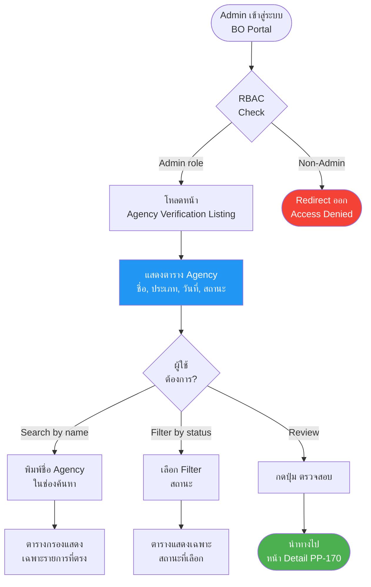
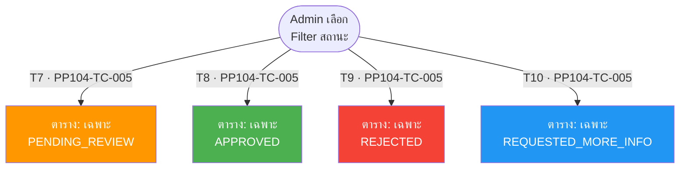
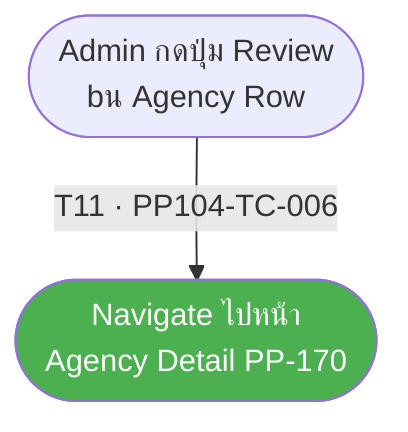
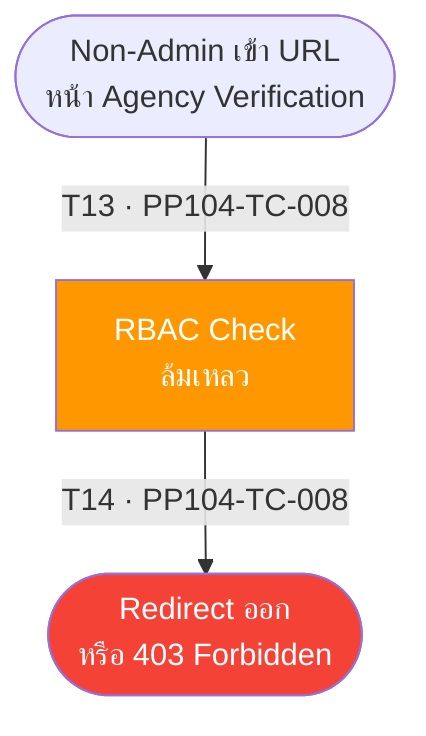

# PP-104 · Agency Verification Listing — Flow Diagram

> Requirements → [PP-104_Agency_Verification_Listing.md](../requirements/PP-104_Agency_Verification_Listing/PP-104_Agency_Verification_Listing.md)
> Jira → [PP-104](https://7-solutions.atlassian.net/browse/PP-104)
> Figma → [App UI Design](https://www.figma.com/design/PKyOOKQydjB98nVMOOyxy4/-PP--App-UI-Design)
> Test Design → [PP-104.design.md](./PP-104.design.md)

---

## Master Flow



---

## Sub-Flow 1: Dashboard List (Scenario 1)

### State & Transition Reference

| Ref ID | Type | Label |
|--------|------|-------|
| S1 | State | Admin เข้าหน้า Agency Verification |
| S2 | State | ระบบโหลดข้อมูลจาก API |
| S3 | State | ตารางแสดงครบทุกคอลัมน์ |
| S4 | State | ไม่มีข้อมูลในระบบ — Empty state |
| T1 | Transition | หน้าโหลดสำเร็จ |
| T2 | Transition | API คืนข้อมูลรายการ |
| T3 | Transition | API คืนรายการว่าง (empty list) |

```mermaid
flowchart TD
    S1([Admin เข้าหน้า\nAgency Verification]) -->|"T1 · PP104-TC-001"| S2[โหลดข้อมูลจาก\nGET /admin/organizers]
    S2 -->|"T2 · PP104-TC-001"| S3[ตารางแสดง:\nชื่อ Agency, ประเภท, วันที่, สถานะ]
    S2 -->|"T3 · PP104-TC-007"| S4([Empty State\n"ไม่มีรายการ"])

    style S3 fill:#4CAF50,color:#fff
    style S4 fill:#FF9800,color:#fff
    style S2 fill:#2196F3,color:#fff
```

---

## Sub-Flow 2: Search by Name (Scenario 2)

### State & Transition Reference

| Ref ID | Type | Label |
|--------|------|-------|
| S5 | State | Admin พิมพ์ชื่อใน Search field |
| S6 | State | ตารางกรองแสดงรายการที่ตรง |
| S7 | State | ไม่มีรายการที่ตรง — "ไม่พบข้อมูล" |
| T4 | Transition | พิมพ์ชื่อที่ตรงกับ Agency ในระบบ |
| T5 | Transition | ผลลัพธ์แสดงรายการที่ตรง |
| T6 | Transition | พิมพ์ชื่อที่ไม่มีในระบบ — ไม่พบ |

```mermaid
flowchart TD
    S5([Admin พิมพ์ชื่อ\nใน Search field]) -->|"T4 · PP104-TC-002 PP104-TC-003"| S6[ตารางกรองแสดง\nรายการที่ตรง]
    S5 -->|"T6 · PP104-TC-004"| S7([ไม่พบรายการ\n"ไม่พบข้อมูล"])

    style S6 fill:#4CAF50,color:#fff
    style S7 fill:#FF9800,color:#fff
```

---

## Sub-Flow 3: Filter by Status (Scenario 3)

### State & Transition Reference

| Ref ID | Type | Label |
|--------|------|-------|
| S8 | State | Admin เลือก Filter สถานะ |
| S9 | State | ตารางแสดงเฉพาะ PENDING_REVIEW |
| S10 | State | ตารางแสดงเฉพาะ APPROVED |
| S11 | State | ตารางแสดงเฉพาะ REJECTED |
| S12 | State | ตารางแสดงเฉพาะ REQUESTED_MORE_INFO |
| T7 | Transition | เลือก Filter = PENDING_REVIEW |
| T8 | Transition | เลือก Filter = APPROVED |
| T9 | Transition | เลือก Filter = REJECTED |
| T10 | Transition | เลือก Filter = REQUESTED_MORE_INFO |



---

## Sub-Flow 4: Review Action (Scenario 4)

### State & Transition Reference

| Ref ID | Type | Label |
|--------|------|-------|
| S13 | State | Admin กดปุ่ม Review บน Agency row |
| S14 | State | ระบบ Navigate ไปหน้า Detail (PP-170) |
| T11 | Transition | กดปุ่ม "ตรวจสอบ (Review)" |
| T12 | Transition | Navigate สำเร็จ — หน้า Detail โหลด |



---

## Sub-Flow 5: RBAC Guard (Scenario 5)

### State & Transition Reference

| Ref ID | Type | Label |
|--------|------|-------|
| S15 | State | Non-Admin พยายามเข้าหน้า Verification Listing |
| S16 | State | RBAC Check ล้มเหลว |
| S17 | State | Redirect / 403 Forbidden |
| T13 | Transition | Non-Admin เข้า URL โดยตรง |
| T14 | Transition | RBAC Guard ปฏิเสธ — Redirect |



---

## State & Transition Coverage Summary

| Ref ID | Type | Label | Covered By TC |
|--------|------|-------|---------------|
| S1 | State | Admin เข้าหน้า Agency Verification | PP104-TC-001 |
| S2 | State | โหลดข้อมูลจาก API | PP104-TC-001 PP104-TC-007 |
| S3 | State | ตารางแสดงครบทุกคอลัมน์ | PP104-TC-001 |
| S4 | State | Empty state | PP104-TC-007 |
| S5 | State | Admin พิมพ์ชื่อใน Search | PP104-TC-002 PP104-TC-003 PP104-TC-004 |
| S6 | State | ตารางกรองแสดงรายการตรง | PP104-TC-002 PP104-TC-003 |
| S7 | State | ไม่พบรายการ | PP104-TC-004 |
| S8 | State | Admin เลือก Filter สถานะ | PP104-TC-005 |
| S9 | State | ตาราง PENDING_REVIEW | PP104-TC-005 |
| S10 | State | ตาราง APPROVED | PP104-TC-005 |
| S11 | State | ตาราง REJECTED | PP104-TC-005 |
| S12 | State | ตาราง REQUESTED_MORE_INFO | PP104-TC-005 |
| S13 | State | Admin กดปุ่ม Review | PP104-TC-006 |
| S14 | State | Navigate ไปหน้า Detail | PP104-TC-006 |
| S15 | State | Non-Admin เข้า URL | PP104-TC-008 |
| S16 | State | RBAC Check ล้มเหลว | PP104-TC-008 |
| S17 | State | Redirect / 403 Forbidden | PP104-TC-008 |
| T1 | Transition | หน้าโหลดสำเร็จ | PP104-TC-001 |
| T2 | Transition | API คืนข้อมูล | PP104-TC-001 |
| T3 | Transition | API คืนรายการว่าง | PP104-TC-007 |
| T4 | Transition | พิมพ์ชื่อตรงกับ Agency | PP104-TC-002 PP104-TC-003 |
| T5 | Transition | ผลลัพธ์แสดงรายการ | PP104-TC-002 PP104-TC-003 |
| T6 | Transition | ไม่พบรายการ | PP104-TC-004 |
| T7 | Transition | Filter = PENDING_REVIEW | PP104-TC-005 |
| T8 | Transition | Filter = APPROVED | PP104-TC-005 |
| T9 | Transition | Filter = REJECTED | PP104-TC-005 |
| T10 | Transition | Filter = REQUESTED_MORE_INFO | PP104-TC-005 |
| T11 | Transition | กดปุ่ม Review | PP104-TC-006 |
| T12 | Transition | Navigate สำเร็จ | PP104-TC-006 |
| T13 | Transition | Non-Admin เข้า URL | PP104-TC-008 |
| T14 | Transition | RBAC Guard Redirect | PP104-TC-008 |
