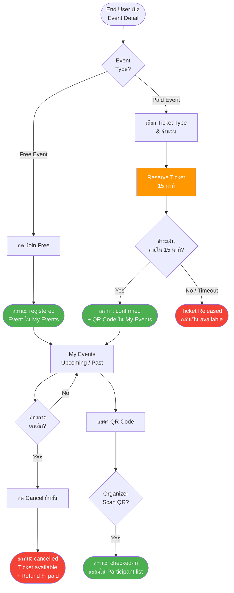
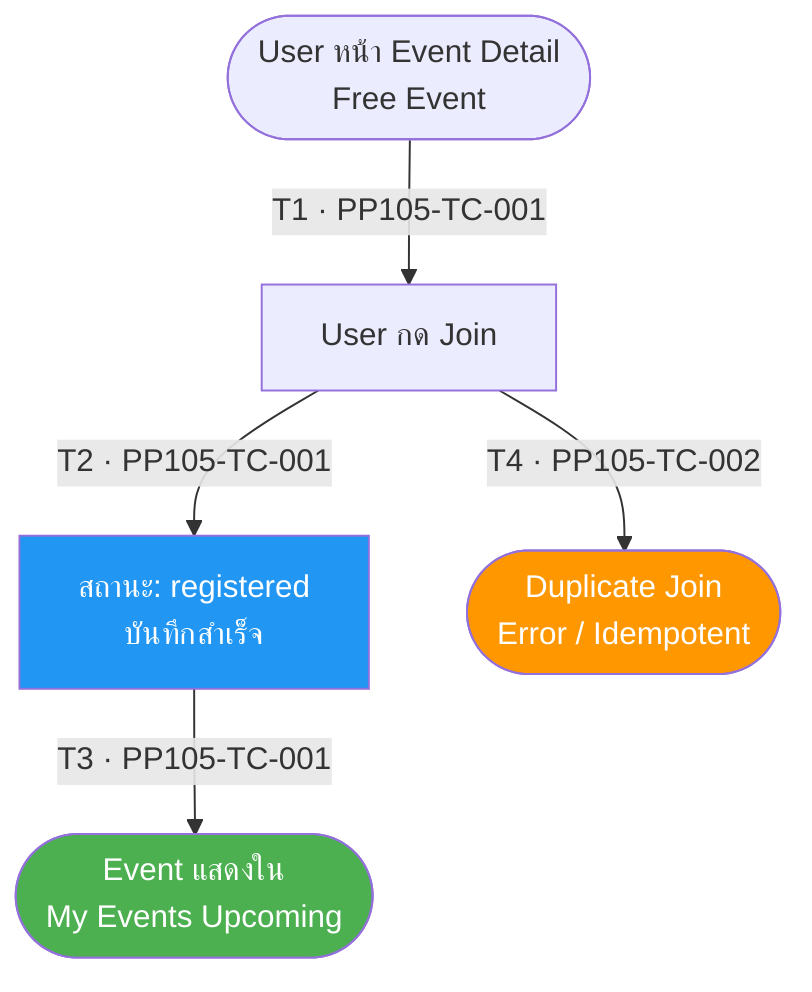
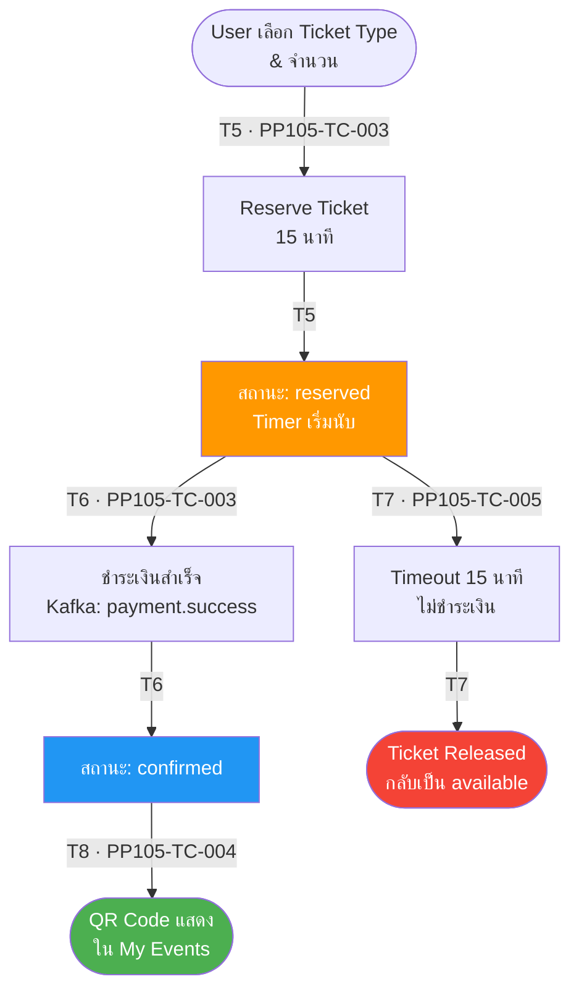
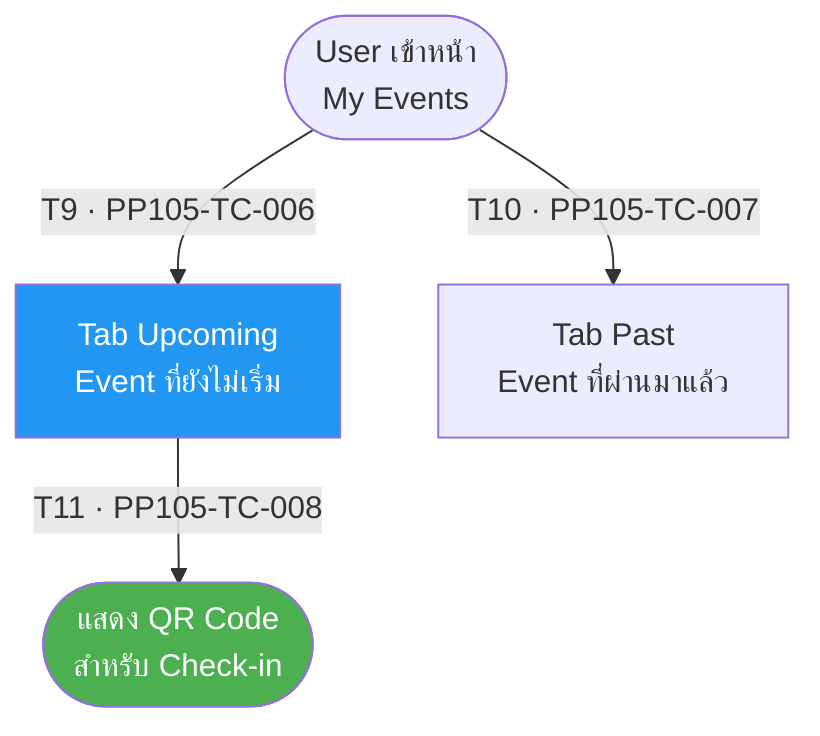
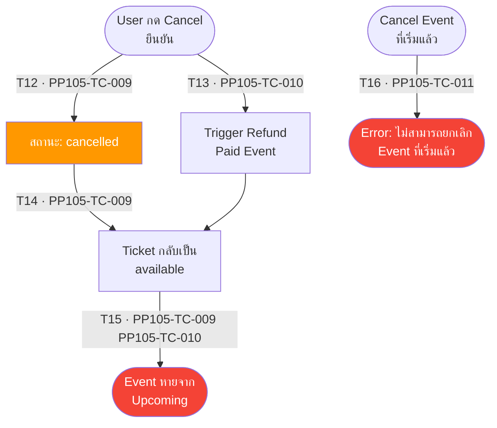
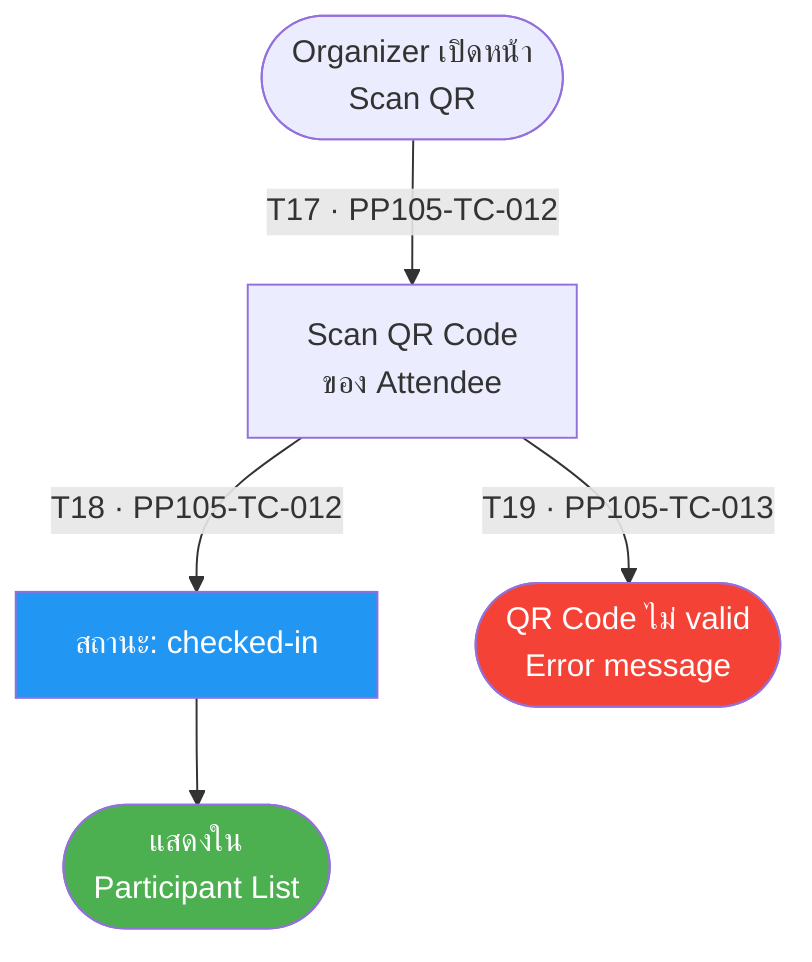

# PP-105 · Event Registration (Join Event) — Flow Diagram

> Requirements → [PP-105_Event_Registration_Join_Event.md](../requirements/PP-105_Event_Registration_Join_Event/PP-105_Event_Registration_Join_Event.md)
> Jira → [PP-105](https://7-solutions.atlassian.net/browse/PP-105)
> Figma → [App UI Design](https://www.figma.com/design/PKyOOKQydjB98nVMOOyxy4/-PP--App-UI-Design)
> Test Design → [PP-105.design.md](./PP-105.design.md)

---

## Master Flow

---

## Sub-Flow 1: Join Free Event (Scenario 1)

### State & Transition Reference

| Ref ID | Type | Label |
|--------|------|-------|
| S1 | State | User อยู่หน้า Event Detail (Free Event) |
| S2 | State | User กด Join |
| S3 | State | สถานะ: registered |
| S4 | State | Event แสดงใน My Events |
| S5 | State | User พยายาม Join Event ซ้ำ |
| T1 | Transition | กด Join (Free Event) |
| T2 | Transition | บันทึก registered สำเร็จ |
| T3 | Transition | Event แสดงใน My Events (Upcoming) |
| T4 | Transition | Duplicate join — idempotent |

---

## Sub-Flow 2: Buy Ticket — Paid Event (Scenario 2)

### State & Transition Reference

| Ref ID | Type | Label |
|--------|------|-------|
| S6 | State | User เลือก Ticket Type & จำนวน |
| S7 | State | ระบบ Reserve Ticket 15 นาที |
| S8 | State | สถานะ: reserved |
| S9 | State | User ชำระเงินสำเร็จภายใน 15 นาที |
| S10 | State | สถานะ: confirmed |
| S11 | State | QR Code แสดงใน My Events |
| S12 | State | Timeout 15 นาที — ไม่ชำระ |
| S13 | State | Ticket Released — กลับเป็น available |
| T5 | Transition | เริ่ม Checkout — Reserve Ticket |
| T6 | Transition | ชำระเงินสำเร็จ → confirmed |
| T7 | Transition | Timeout 15 นาที → release ticket |
| T8 | Transition | QR Code สร้างสำเร็จ |

---

## Sub-Flow 3: My Events (Scenario 3)

### State & Transition Reference

| Ref ID | Type | Label |
|--------|------|-------|
| S14 | State | User เข้าหน้า My Events |
| S15 | State | Tab Upcoming — แสดง Event ที่ยังไม่เริ่ม |
| S16 | State | Tab Past — แสดง Event ที่ผ่านมาแล้ว |
| S17 | State | แสดง QR Code สำหรับ Check-in |
| T9 | Transition | เข้า Tab Upcoming |
| T10 | Transition | เข้า Tab Past |
| T11 | Transition | กด View QR Code |

---

## Sub-Flow 4: Leave Event / Cancellation (Scenario 4)

### State & Transition Reference

| Ref ID | Type | Label |
|--------|------|-------|
| S18 | State | User กด Cancel ยืนยัน |
| S19 | State | สถานะ: cancelled |
| S20 | State | Ticket กลับเป็น available |
| S21 | State | Trigger Refund (Paid Event) |
| S22 | State | Event หายจาก Upcoming |
| S23 | State | User พยายาม Cancel Event ที่เริ่มแล้ว |
| T12 | Transition | กด Cancel + ยืนยัน (Free Event) |
| T13 | Transition | กด Cancel + ยืนยัน (Paid Event) → Trigger Refund |
| T14 | Transition | สถานะ cancelled; Ticket available |
| T15 | Transition | Event หายจาก Upcoming |
| T16 | Transition | Cancel Event ที่ started / ผ่านไปแล้ว — ไม่อนุญาต |

---

## Sub-Flow 5: Check-in via QR Code (Scenario 5)

### State & Transition Reference

| Ref ID | Type | Label |
|--------|------|-------|
| S25 | State | Organizer เปิดหน้า Scan QR |
| S26 | State | Scan QR Code ของ Attendee |
| S27 | State | สถานะ: checked-in |
| S28 | State | แสดงใน Participant List |
| S29 | State | QR Code ไม่ valid หรือ expired |
| T17 | Transition | Scan QR Code สำเร็จ (valid) |
| T18 | Transition | สถานะเปลี่ยนเป็น checked-in |
| T19 | Transition | Scan QR Code ที่ไม่ valid / expired |

---

## State & Transition Coverage Summary

| Ref ID | Type | Label | Covered By TC |
|--------|------|-------|---------------|
| S1 | State | User หน้า Event Detail (Free) | PP105-TC-001 |
| S2 | State | User กด Join | PP105-TC-001 PP105-TC-002 |
| S3 | State | สถานะ: registered | PP105-TC-001 |
| S4 | State | Event แสดงใน My Events | PP105-TC-001 |
| S5 | State | Duplicate Join | PP105-TC-002 |
| S6 | State | User เลือก Ticket Type | PP105-TC-003 |
| S7 | State | Reserve Ticket 15 นาที | PP105-TC-003 PP105-TC-005 |
| S8 | State | สถานะ: reserved | PP105-TC-003 PP105-TC-005 |
| S9 | State | ชำระเงินสำเร็จ | PP105-TC-003 |
| S10 | State | สถานะ: confirmed | PP105-TC-003 PP105-TC-004 |
| S11 | State | QR Code ใน My Events | PP105-TC-004 PP105-TC-008 |
| S12 | State | Timeout 15 นาที | PP105-TC-005 |
| S13 | State | Ticket Released | PP105-TC-005 |
| S14 | State | User เข้าหน้า My Events | PP105-TC-006 PP105-TC-007 |
| S15 | State | Tab Upcoming | PP105-TC-006 |
| S16 | State | Tab Past | PP105-TC-007 |
| S17 | State | QR Code แสดง | PP105-TC-008 |
| S18 | State | User กด Cancel | PP105-TC-009 PP105-TC-010 |
| S19 | State | สถานะ: cancelled | PP105-TC-009 PP105-TC-010 |
| S20 | State | Ticket กลับเป็น available | PP105-TC-009 PP105-TC-010 |
| S21 | State | Trigger Refund (Paid) | PP105-TC-010 |
| S22 | State | Event หายจาก Upcoming | PP105-TC-009 PP105-TC-010 |
| S23 | State | Cancel Event ที่เริ่มแล้ว | PP105-TC-011 |
| S25 | State | Organizer เปิดหน้า Scan QR | PP105-TC-012 PP105-TC-013 |
| S26 | State | Scan QR Code | PP105-TC-012 PP105-TC-013 |
| S27 | State | สถานะ: checked-in | PP105-TC-012 |
| S28 | State | แสดงใน Participant List | PP105-TC-012 |
| S29 | State | QR Code ไม่ valid | PP105-TC-013 |
| T1 | Transition | กด Join (Free Event) | PP105-TC-001 |
| T2 | Transition | บันทึก registered | PP105-TC-001 |
| T3 | Transition | Event ใน My Events | PP105-TC-001 |
| T4 | Transition | Duplicate join — idempotent | PP105-TC-002 |
| T5 | Transition | Reserve Ticket | PP105-TC-003 |
| T6 | Transition | ชำระเงินสำเร็จ → confirmed | PP105-TC-003 |
| T7 | Transition | Timeout → release | PP105-TC-005 |
| T8 | Transition | QR Code สร้างสำเร็จ | PP105-TC-004 |
| T9 | Transition | เข้า Tab Upcoming | PP105-TC-006 |
| T10 | Transition | เข้า Tab Past | PP105-TC-007 |
| T11 | Transition | กด View QR Code | PP105-TC-008 |
| T12 | Transition | Cancel + ยืนยัน (Free) | PP105-TC-009 |
| T13 | Transition | Cancel + Refund (Paid) | PP105-TC-010 |
| T14 | Transition | สถานะ cancelled; Ticket available | PP105-TC-009 PP105-TC-010 |
| T15 | Transition | Event หายจาก Upcoming | PP105-TC-009 PP105-TC-010 |
| T16 | Transition | Cancel ไม่อนุญาต | PP105-TC-011 |
| T17 | Transition | Scan QR Code สำเร็จ | PP105-TC-012 |
| T18 | Transition | สถานะ checked-in | PP105-TC-012 |
| T19 | Transition | QR Code ไม่ valid | PP105-TC-013 |
