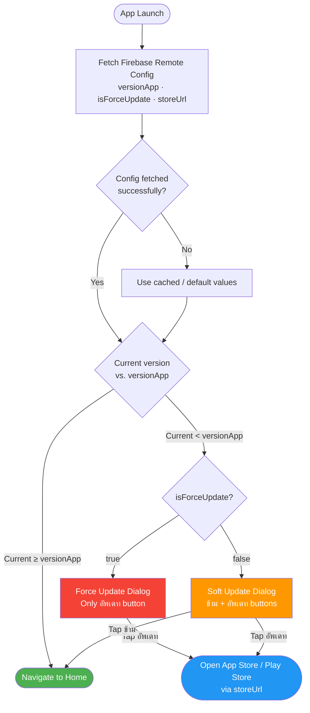
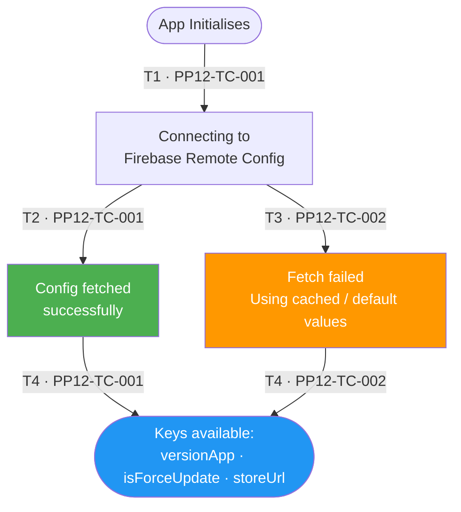
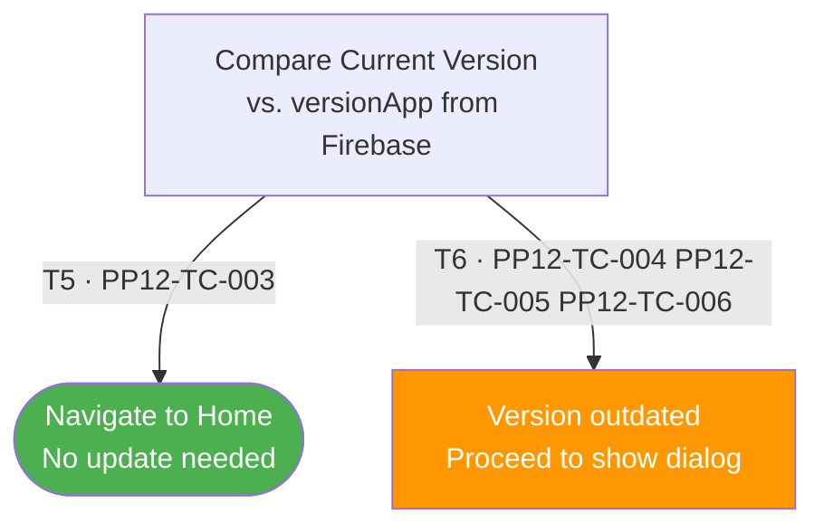
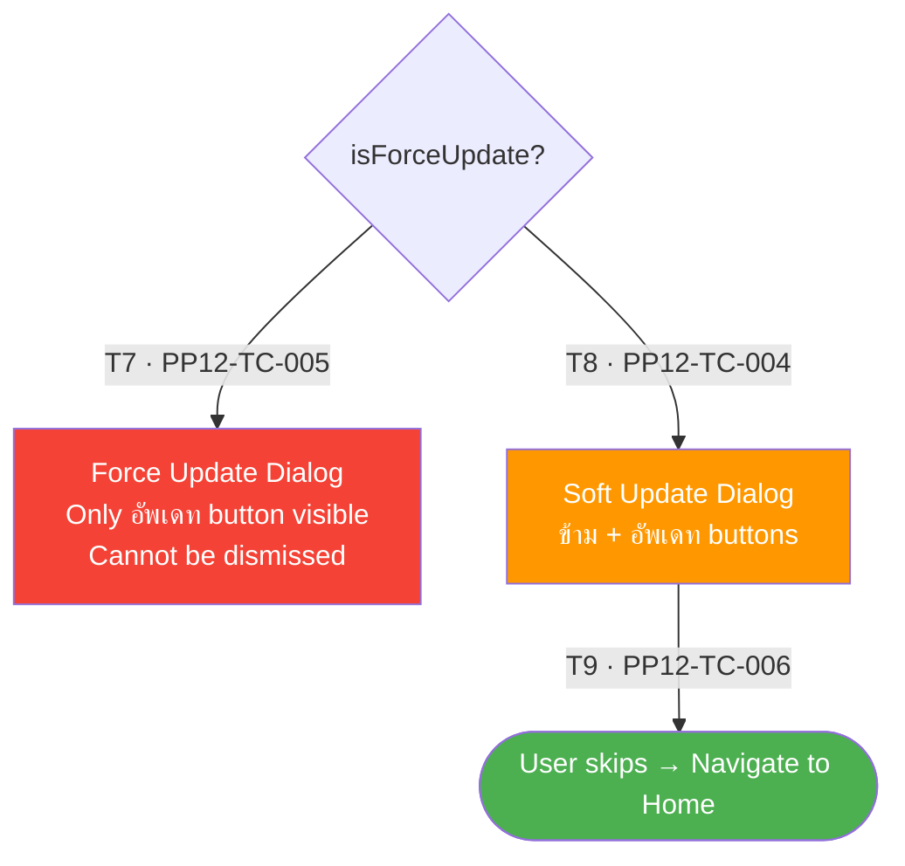
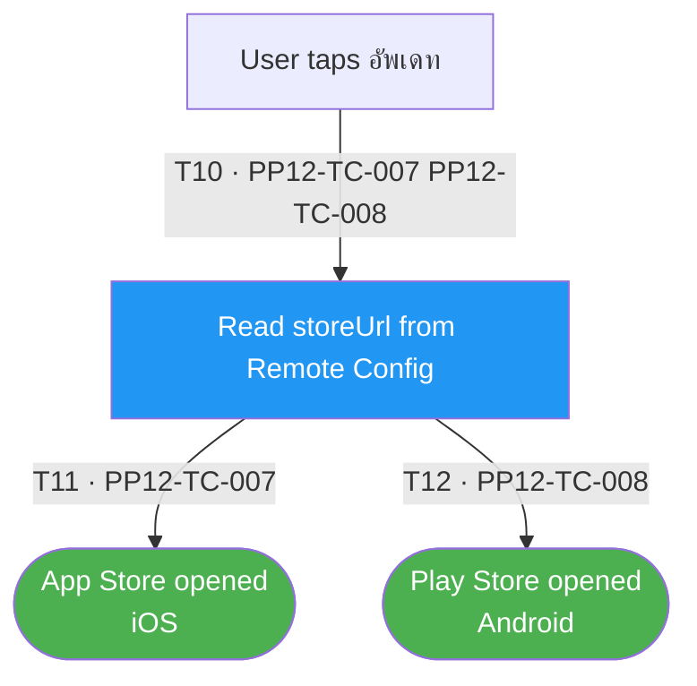

# PP-12 · Remote Config — Flow Diagram

> Requirements → [PP-12_Remote_Config.md](../requirements/PP-12_Remote_Config/PP-12_Remote_Config.md)
> Jira → [PP-12](https://7-solutions.atlassian.net/browse/PP-12)
> Figma → [App UI Design](https://www.figma.com/design/PKyOOKQydjB98nVMOOyxy4/-PP--App-UI-Design)
> Test Design → [PP-12.design.md](./PP-12.design.md)

---

## Master Flow

---

## Sub-Flow 1: Firebase Remote Config Integration (AC1)

### State & Transition Reference

| Ref ID | Type       | Label |
|--------|------------|-------|
| S1     | State      | App initialises |
| S2     | State      | Connecting to Firebase Remote Config |
| S3     | State      | Config fetched successfully |
| S4     | State      | Fetch failed — using cached/default values |
| S5     | State      | Key values available (versionApp, isForceUpdate, storeUrl) |
| T1     | Transition | App startup triggers config fetch |
| T2     | Transition | Firebase connection established — fetch succeeds |
| T3     | Transition | Firebase connection fails / timeout |
| T4     | Transition | Keys extracted from fetched config |

---

## Sub-Flow 2: Version Checking Logic (AC2)

### State & Transition Reference

| Ref ID | Type       | Label |
|--------|------------|-------|
| S6     | State      | Version check — compare current vs. versionApp |
| S7     | State      | Version is up-to-date (current ≥ versionApp) |
| S8     | State      | Version is outdated (current < versionApp) |
| T5     | Transition | current version ≥ versionApp → skip update |
| T6     | Transition | current version < versionApp → show dialog |

---

## Sub-Flow 3: Update Dialog Display (AC3)

### State & Transition Reference

| Ref ID | Type       | Label |
|--------|------------|-------|
| S9     | State      | Evaluate isForceUpdate flag |
| S10    | State      | Force Update Dialog displayed (only "อัพเดท" button) |
| S11    | State      | Soft Update Dialog displayed ("ข้าม" + "อัพเดท" buttons) |
| S12    | State      | User dismisses soft update |
| T7     | Transition | isForceUpdate = true → Force Update dialog |
| T8     | Transition | isForceUpdate = false → Soft Update dialog |
| T9     | Transition | User taps "ข้าม" on Soft Update dialog |

---

## Sub-Flow 4: Store Redirection (AC4)

### State & Transition Reference

| Ref ID | Type       | Label |
|--------|------------|-------|
| S13    | State      | User taps "อัพเดท" button (Force or Soft dialog) |
| S14    | State      | App opens store URL from Firebase |
| S15    | State      | App Store opened (iOS) |
| S16    | State      | Play Store opened (Android) |
| T10    | Transition | Tap "อัพเดท" → read storeUrl |
| T11    | Transition | Platform = iOS → App Store |
| T12    | Transition | Platform = Android → Play Store |

---

## State & Transition Coverage Summary

| Ref ID | Type       | Label                                            | Covered By TC                          |
|--------|------------|--------------------------------------------------|----------------------------------------|
| S1     | State      | App initialises                                  | PP12-TC-001 PP12-TC-002                |
| S2     | State      | Connecting to Firebase Remote Config             | PP12-TC-001 PP12-TC-002                |
| S3     | State      | Config fetched successfully                      | PP12-TC-001                            |
| S4     | State      | Fetch failed — using cached/default values       | PP12-TC-002                            |
| S5     | State      | Key values available                             | PP12-TC-001 PP12-TC-002                |
| S6     | State      | Version check — compare current vs. versionApp  | PP12-TC-003–PP12-TC-006                |
| S7     | State      | Version is up-to-date                            | PP12-TC-003                            |
| S8     | State      | Version is outdated                              | PP12-TC-004–PP12-TC-006                |
| S9     | State      | Evaluate isForceUpdate flag                      | PP12-TC-004 PP12-TC-005                |
| S10    | State      | Force Update Dialog displayed                    | PP12-TC-005                            |
| S11    | State      | Soft Update Dialog displayed                     | PP12-TC-004 PP12-TC-006                |
| S12    | State      | User dismisses soft update                       | PP12-TC-006                            |
| S13    | State      | User taps "อัพเดท" button                       | PP12-TC-007 PP12-TC-008                |
| S14    | State      | App opens store URL from Firebase                | PP12-TC-007 PP12-TC-008                |
| S15    | State      | App Store opened (iOS)                           | PP12-TC-007                            |
| S16    | State      | Play Store opened (Android)                      | PP12-TC-008                            |
| T1     | Transition | App startup triggers config fetch                | PP12-TC-001 PP12-TC-002                |
| T2     | Transition | Firebase connection established — fetch succeeds | PP12-TC-001                            |
| T3     | Transition | Firebase connection fails / timeout              | PP12-TC-002                            |
| T4     | Transition | Keys extracted from fetched config               | PP12-TC-001 PP12-TC-002                |
| T5     | Transition | current version ≥ versionApp → skip update      | PP12-TC-003                            |
| T6     | Transition | current version < versionApp → show dialog       | PP12-TC-004–PP12-TC-006                |
| T7     | Transition | isForceUpdate = true → Force Update dialog       | PP12-TC-005                            |
| T8     | Transition | isForceUpdate = false → Soft Update dialog       | PP12-TC-004 PP12-TC-006                |
| T9     | Transition | User taps "ข้าม" on Soft Update dialog          | PP12-TC-006                            |
| T10    | Transition | Tap "อัพเดท" → read storeUrl                   | PP12-TC-007 PP12-TC-008                |
| T11    | Transition | Platform = iOS → App Store                       | PP12-TC-007                            |
| T12    | Transition | Platform = Android → Play Store                  | PP12-TC-008                            |
