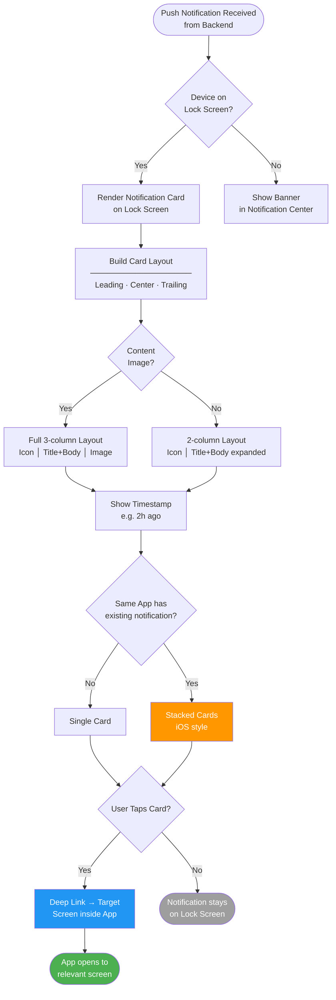
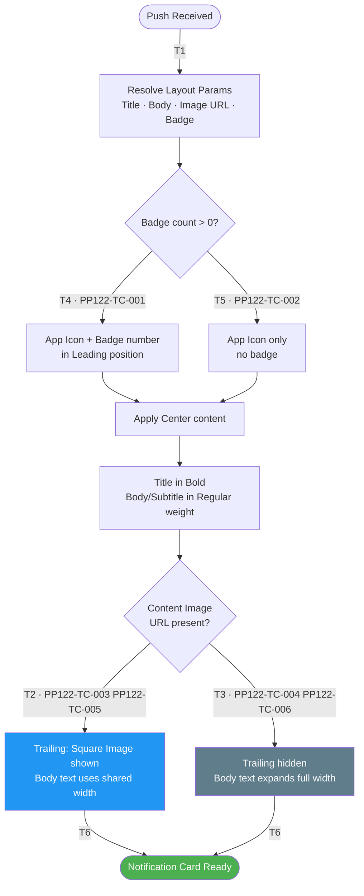
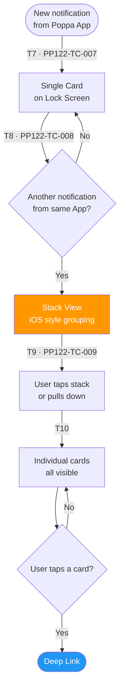
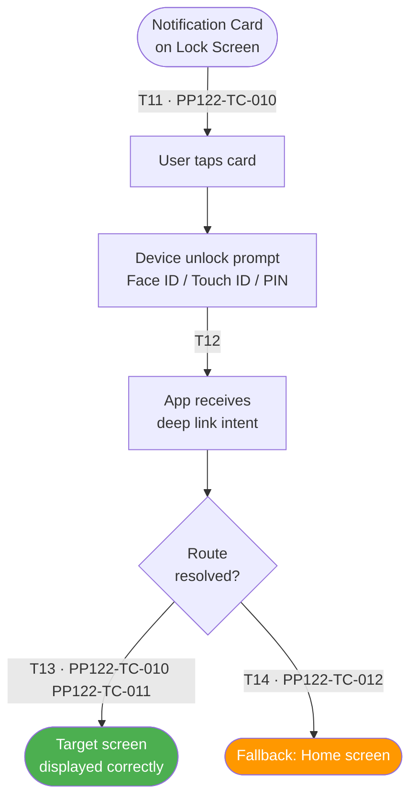
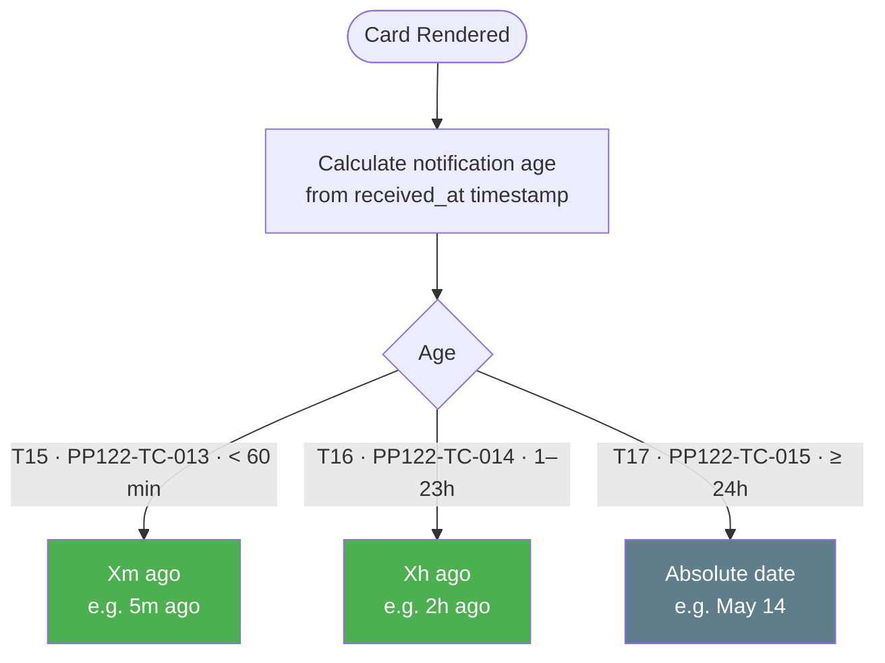

# PP-122 · Push Notification UI — Flow Diagram

> Requirements → [PP-122_Push_Notification_UI.md](../requirements/PP-122_Push_Notification_UI/PP-122_Push_Notification_UI.md)
> Jira → [PP-122](https://7-solutions.atlassian.net/browse/PP-122)
> Figma → [App UI Design node 1861-27078](https://www.figma.com/design/PKyOOKQydjB98nVMOOyxy4/-PP--App-UI-Design?node-id=1861-27078&m=dev)
> Test Design → [PP-122.design.md](./PP-122.design.md)

---

## Master Flow

---

## Sub-Flow 1: Notification Card Layout Rendering (AC1)

### State & Transition Reference

| Ref ID | Type  | Label |
|--------|-------|-------|
| S1  | State      | Push Notification arrives |
| S2  | State      | Resolve layout parameters |
| S3  | State      | Content image URL present? |
| S4  | State      | Full layout — Icon + Title + Body + Image |
| S5  | State      | Compact layout — Icon + Title + Body (expanded) |
| S6  | State      | Apply font hierarchy |
| S7  | State      | App Icon with Badge count |
| S8  | State      | Notification Card ready |
| T1  | Transition | Notification payload received |
| T2  | Transition | Image URL valid → full layout |
| T3  | Transition | Image URL absent/empty → compact layout |
| T4  | Transition | Badge count > 0 — show number |
| T5  | Transition | Badge count = 0 — hide badge |
| T6  | Transition | Layout rendered |

---

## Sub-Flow 2: Notification Stacking (AC2)

### State & Transition Reference

| Ref ID | Type  | Label |
|--------|-------|-------|
| S9  | State      | First notification from App |
| S10 | State      | Single card displayed |
| S11 | State      | Second+ notification from same App arrives |
| S12 | State      | Stack view formed (iOS style) |
| S13 | State      | Stack expanded by user |
| S14 | State      | Individual cards visible |
| T7  | Transition | First notification — render single card |
| T8  | Transition | Additional notification from same app |
| T9  | Transition | Tap stack to expand |
| T10 | Transition | Cards visible individually |

---

## Sub-Flow 3: Deep Link Interaction (AC3)

### State & Transition Reference

| Ref ID | Type  | Label |
|--------|-------|-------|
| S15 | State      | Notification card on Lock Screen |
| S16 | State      | User taps card |
| S17 | State      | Device unlocks (biometric / PIN) |
| S18 | State      | App receives deep link intent |
| S19 | State      | Correct target screen shown |
| S20 | State      | Fallback: Home screen (no matching route) |
| T11 | Transition | Tap notification card |
| T12 | Transition | Device authenticates user |
| T13 | Transition | Deep link route matched |
| T14 | Transition | Deep link route not found — fallback |

---

## Sub-Flow 4: Timestamp Display (AC4)

### State & Transition Reference

| Ref ID | Type  | Label |
|--------|-------|-------|
| S21 | State      | Notification card rendered |
| S22 | State      | Timestamp calculated |
| S23 | State      | Relative time shown (< 1h) |
| S24 | State      | Relative time shown (≥ 1h) |
| S25 | State      | Absolute time shown (> 24h) |
| T15 | Transition | Notification age < 60 minutes |
| T16 | Transition | Notification age ≥ 60 minutes and < 24h |
| T17 | Transition | Notification age ≥ 24 hours |

---

## State & Transition Coverage Summary

| Ref ID | Type       | Label                                    | Covered By TC                          |
|--------|------------|------------------------------------------|----------------------------------------|
| S1     | State      | Push Notification arrives                | PP122-TC-001–PP122-TC-009              |
| S2     | State      | Resolve layout parameters                | PP122-TC-001–PP122-TC-006              |
| S3     | State      | Content image URL present?               | PP122-TC-003–PP122-TC-006              |
| S4     | State      | Full layout (Icon + Body + Image)        | PP122-TC-003 PP122-TC-005              |
| S5     | State      | Compact layout (body expanded)           | PP122-TC-004 PP122-TC-006              |
| S6     | State      | Font hierarchy applied                   | PP122-TC-001–PP122-TC-006              |
| S7     | State      | App Icon with Badge count                | PP122-TC-001 PP122-TC-002              |
| S8     | State      | Notification Card ready                  | PP122-TC-001–PP122-TC-006              |
| S9     | State      | First notification from App              | PP122-TC-007                           |
| S10    | State      | Single card displayed                    | PP122-TC-007                           |
| S11    | State      | Second+ notification from same App       | PP122-TC-008                           |
| S12    | State      | Stack view (iOS style)                   | PP122-TC-008                           |
| S13    | State      | Stack expanded by user                   | PP122-TC-009                           |
| S14    | State      | Individual cards visible                 | PP122-TC-009                           |
| S15    | State      | Notification card on Lock Screen         | PP122-TC-010–PP122-TC-012              |
| S16    | State      | User taps card                           | PP122-TC-010–PP122-TC-012              |
| S17    | State      | Device unlock prompt                     | PP122-TC-010–PP122-TC-012              |
| S18    | State      | App receives deep link intent            | PP122-TC-010–PP122-TC-012              |
| S19    | State      | Target screen displayed correctly        | PP122-TC-010 PP122-TC-011              |
| S20    | State      | Fallback: Home screen                    | PP122-TC-012                           |
| S21    | State      | Card rendered                            | PP122-TC-013–PP122-TC-015              |
| S22    | State      | Timestamp calculated                     | PP122-TC-013–PP122-TC-015              |
| S23    | State      | Relative time < 1h (Xm ago)             | PP122-TC-013                           |
| S24    | State      | Relative time 1–23h (Xh ago)            | PP122-TC-014                           |
| S25    | State      | Absolute date ≥ 24h                      | PP122-TC-015                           |
| T1     | Transition | Notification payload received            | PP122-TC-001–PP122-TC-009              |
| T2     | Transition | Image URL valid → full layout            | PP122-TC-003 PP122-TC-005              |
| T3     | Transition | Image URL absent → compact layout        | PP122-TC-004 PP122-TC-006              |
| T4     | Transition | Badge count > 0                          | PP122-TC-001                           |
| T5     | Transition | Badge count = 0                          | PP122-TC-002                           |
| T6     | Transition | Layout rendered                          | PP122-TC-001–PP122-TC-006              |
| T7     | Transition | First notification — single card         | PP122-TC-007                           |
| T8     | Transition | Additional notification — stack forms    | PP122-TC-008                           |
| T9     | Transition | Tap stack to expand                      | PP122-TC-009                           |
| T10    | Transition | Individual cards visible                 | PP122-TC-009                           |
| T11    | Transition | Tap notification card                    | PP122-TC-010–PP122-TC-012              |
| T12    | Transition | Device authenticates user                | PP122-TC-010–PP122-TC-012              |
| T13    | Transition | Deep link route matched                  | PP122-TC-010 PP122-TC-011              |
| T14    | Transition | Deep link route not found — fallback     | PP122-TC-012                           |
| T15    | Transition | Notification age < 60 min               | PP122-TC-013                           |
| T16    | Transition | Notification age 1–23h                  | PP122-TC-014                           |
| T17    | Transition | Notification age ≥ 24h                  | PP122-TC-015                           |
