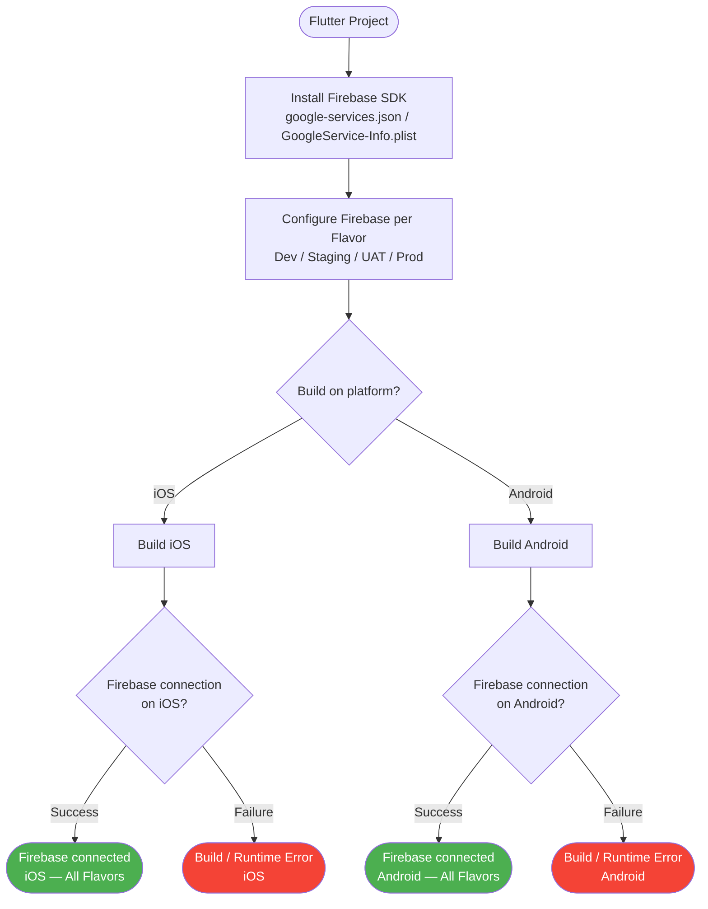
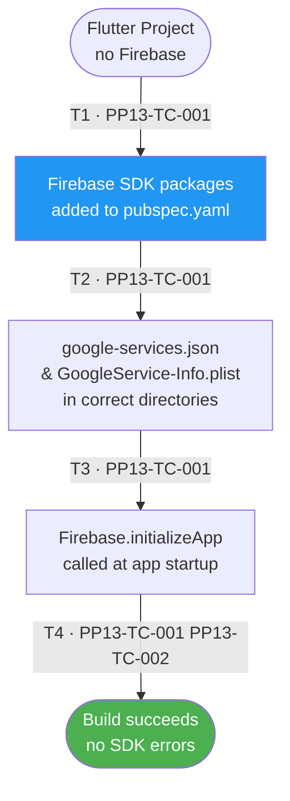
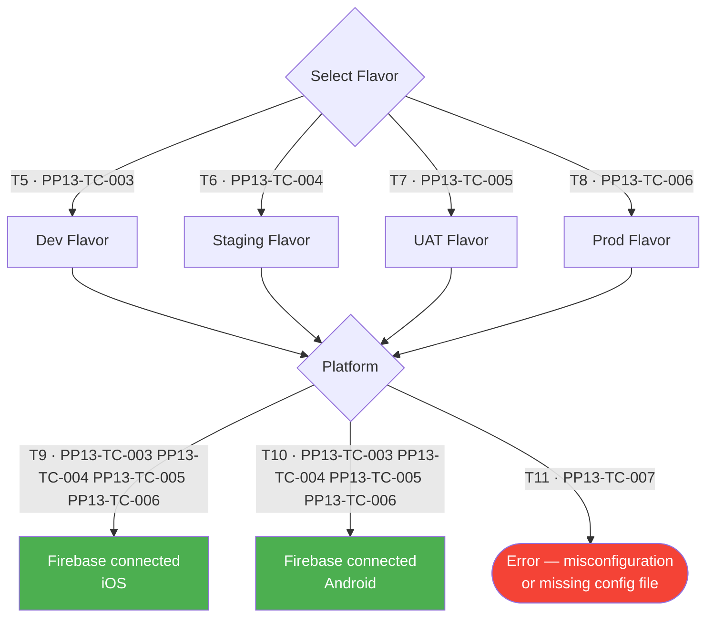

# PP-13 · Integrate Firebase In App — Flow Diagram

> Requirements → [PP-13_Integrate_Firebase_In_App.md](../requirements/PP-13_Integrate_Firebase_In_App/PP-13_Integrate_Firebase_In_App.md)
> Jira → [PP-13](https://7-solutions.atlassian.net/browse/PP-13)
> Figma → [App UI Design](https://www.figma.com/design/PKyOOKQydjB98nVMOOyxy4/-PP--App-UI-Design)
> Test Design → [PP-13.design.md](./PP-13.design.md)

---

## Master Flow

---

## Sub-Flow 1: Firebase SDK Installation & Config (AC 1.1)

### State & Transition Reference

| Ref ID | Type       | Label |
|--------|------------|-------|
| S1     | State      | Flutter project without Firebase |
| S2     | State      | Firebase SDK packages added to pubspec.yaml |
| S3     | State      | google-services.json present (Android) |
| S4     | State      | GoogleService-Info.plist present (iOS) |
| S5     | State      | SDK initialised in main.dart (Firebase.initializeApp) |
| S6     | State      | Build succeeds — no SDK errors |
| T1     | Transition | Add firebase_core and required packages |
| T2     | Transition | Place platform config files in correct directories |
| T3     | Transition | Call Firebase.initializeApp() at startup |
| T4     | Transition | Build completes without error |

---

## Sub-Flow 2: Multi-Flavor Firebase Connection (AC 1.2)

### State & Transition Reference

| Ref ID | Type       | Label |
|--------|------------|-------|
| S6     | State      | Flavor = Dev — Firebase project configured |
| S7     | State      | Flavor = Staging — Firebase project configured |
| S8     | State      | Flavor = UAT — Firebase project configured |
| S9     | State      | Flavor = Prod — Firebase project configured |
| S10    | State      | Firebase connection verified on iOS |
| S11    | State      | Firebase connection verified on Android |
| S12    | State      | Connection failure — misconfiguration detected |
| T5     | Transition | Build Dev flavor → connect to Dev Firebase project |
| T6     | Transition | Build Staging flavor → connect to STG Firebase project |
| T7     | Transition | Build UAT flavor → connect to UAT Firebase project |
| T8     | Transition | Build Prod flavor → connect to Prod Firebase project |
| T9     | Transition | iOS build runs and Firebase initialises |
| T10    | Transition | Android build runs and Firebase initialises |
| T11    | Transition | Config file mismatch or missing → error |

---

## State & Transition Coverage Summary

| Ref ID | Type       | Label                                            | Covered By TC                          |
|--------|------------|--------------------------------------------------|----------------------------------------|
| S1     | State      | Flutter project without Firebase                 | PP13-TC-001                            |
| S2     | State      | Firebase SDK packages added                      | PP13-TC-001                            |
| S3     | State      | Config files in correct directories              | PP13-TC-001                            |
| S4     | State      | Firebase.initializeApp called                    | PP13-TC-001                            |
| S5     | State      | Build succeeds — no SDK errors                   | PP13-TC-001 PP13-TC-002                |
| S6     | State      | Flavor = Dev — Firebase project configured       | PP13-TC-003                            |
| S7     | State      | Flavor = Staging — Firebase project configured   | PP13-TC-004                            |
| S8     | State      | Flavor = UAT — Firebase project configured       | PP13-TC-005                            |
| S9     | State      | Flavor = Prod — Firebase project configured      | PP13-TC-006                            |
| S10    | State      | Firebase connection verified on iOS              | PP13-TC-003–PP13-TC-006                |
| S11    | State      | Firebase connection verified on Android          | PP13-TC-003–PP13-TC-006                |
| S12    | State      | Connection failure — misconfiguration detected   | PP13-TC-007                            |
| T1     | Transition | Add firebase_core and required packages          | PP13-TC-001                            |
| T2     | Transition | Place platform config files in correct dirs      | PP13-TC-001                            |
| T3     | Transition | Call Firebase.initializeApp() at startup         | PP13-TC-001                            |
| T4     | Transition | Build completes without error                    | PP13-TC-001 PP13-TC-002                |
| T5     | Transition | Build Dev flavor → connect to Dev Firebase       | PP13-TC-003                            |
| T6     | Transition | Build Staging flavor → connect to STG Firebase   | PP13-TC-004                            |
| T7     | Transition | Build UAT flavor → connect to UAT Firebase       | PP13-TC-005                            |
| T8     | Transition | Build Prod flavor → connect to Prod Firebase     | PP13-TC-006                            |
| T9     | Transition | iOS build runs and Firebase initialises          | PP13-TC-003–PP13-TC-006                |
| T10    | Transition | Android build runs and Firebase initialises      | PP13-TC-003–PP13-TC-006                |
| T11    | Transition | Config file mismatch or missing → error          | PP13-TC-007                            |
