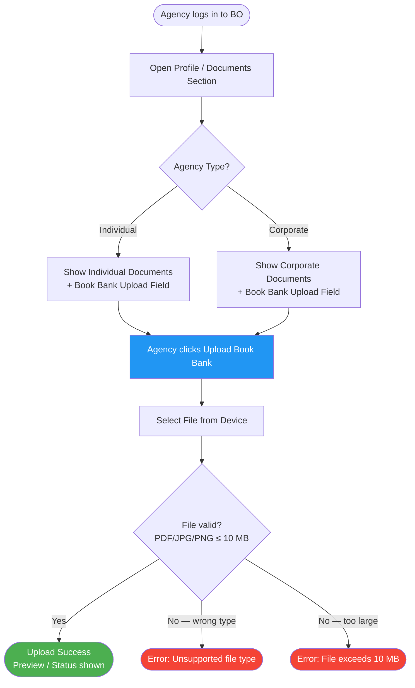
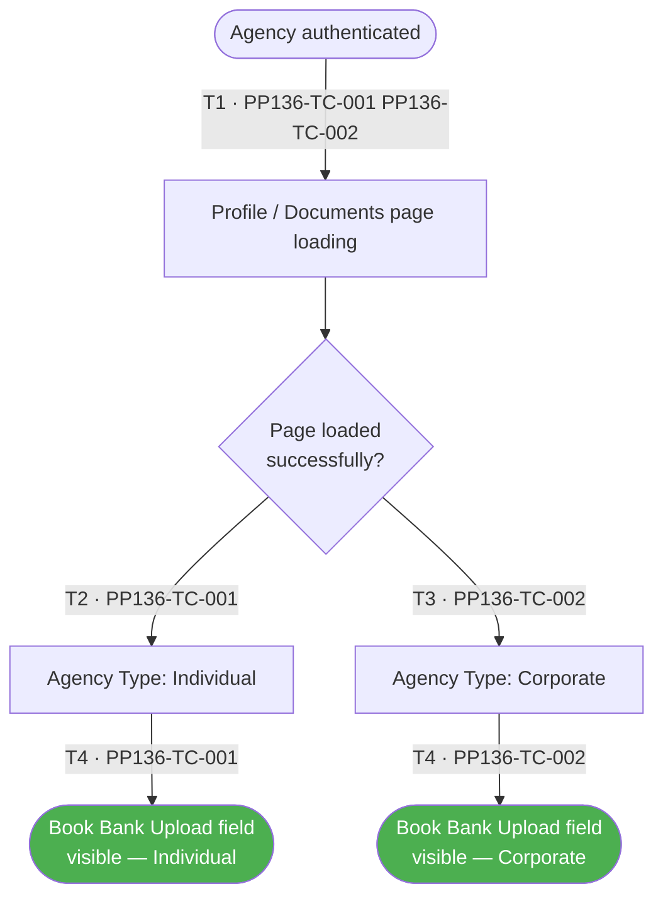
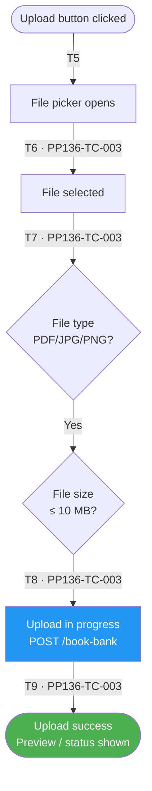
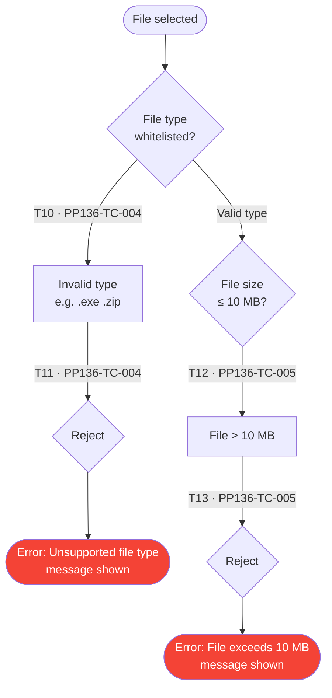

# PP-136 · Update Book Bank Acc — Flow Diagram

> Requirements → [PP-136_Update_Book_Bank_Acc.md](../requirements/PP-136_Update_Book_Bank_Acc/PP-136_Update_Book_Bank_Acc.md)
> Jira → [PP-136](https://7-solutions.atlassian.net/browse/PP-136)
> Figma → [App UI Design](https://www.figma.com/design/PKyOOKQydjB98nVMOOyxy4/-PP--App-UI-Design)
> Test Design → [PP-136.design.md](./PP-136.design.md)

---

## Master Flow

---

## Sub-Flow 1: Book Bank Upload Field Visibility (AC1 & AC2)

### State & Transition Reference

| Ref ID | Type  | Label |
|--------|-------|-------|
| S1  | State      | Agency authenticated in BO |
| S2  | State      | Profile / Documents page loaded |
| S3  | State      | Agency type resolved: Individual |
| S4  | State      | Agency type resolved: Corporate |
| S5  | State      | Book Bank Upload field displayed (Individual) |
| S6  | State      | Book Bank Upload field displayed (Corporate) |
| T1  | Transition | Navigate to Profile / Documents section |
| T2  | Transition | Agency type = Individual |
| T3  | Transition | Agency type = Corporate |
| T4  | Transition | Page load success → field rendered |

---

## Sub-Flow 2: Valid File Upload (AC3)

### State & Transition Reference

| Ref ID | Type  | Label |
|--------|-------|-------|
| S7  | State      | Agency clicks Upload Book Bank |
| S8  | State      | File picker opened |
| S9  | State      | File selected |
| S10 | State      | File type validation |
| S11 | State      | File size validation |
| S12 | State      | Upload in progress |
| S13 | State      | Upload success — preview/status shown |
| T5  | Transition | Click Upload button |
| T6  | Transition | File selected by user |
| T7  | Transition | File type is PDF / JPG / PNG |
| T8  | Transition | File size ≤ 10 MB |
| T9  | Transition | API upload returns success |

---

## Sub-Flow 3: Invalid File Rejection (AC4)

### State & Transition Reference

| Ref ID | Type  | Label |
|--------|-------|-------|
| S14 | State      | Invalid file type selected (.exe, .zip, etc.) |
| S15 | State      | File type rejected by system |
| S16 | State      | Error message shown — unsupported type |
| S17 | State      | File exceeds 10 MB |
| S18 | State      | File size rejected by system |
| S19 | State      | Error message shown — file too large |
| T10 | Transition | User selects unsupported file type |
| T11 | Transition | System rejects: type not in whitelist |
| T12 | Transition | User selects oversized file |
| T13 | Transition | System rejects: size > 10 MB |

---

## State & Transition Coverage Summary

| Ref ID | Type       | Label                                              | Covered By TC                      |
|--------|------------|----------------------------------------------------|------------------------------------|
| S1     | State      | Agency authenticated in BO                         | PP136-TC-001 PP136-TC-002          |
| S2     | State      | Profile / Documents page loaded                    | PP136-TC-001 PP136-TC-002          |
| S3     | State      | Agency type resolved: Individual                   | PP136-TC-001                       |
| S4     | State      | Agency type resolved: Corporate                    | PP136-TC-002                       |
| S5     | State      | Book Bank Upload field displayed (Individual)      | PP136-TC-001                       |
| S6     | State      | Book Bank Upload field displayed (Corporate)       | PP136-TC-002                       |
| S7     | State      | Agency clicks Upload Book Bank                     | PP136-TC-003–PP136-TC-005          |
| S8     | State      | File picker opened                                 | PP136-TC-003–PP136-TC-005          |
| S9     | State      | File selected                                      | PP136-TC-003–PP136-TC-005          |
| S10    | State      | File type validation                               | PP136-TC-003 PP136-TC-004          |
| S11    | State      | File size validation                               | PP136-TC-003 PP136-TC-005          |
| S12    | State      | Upload in progress                                 | PP136-TC-003                       |
| S13    | State      | Upload success — preview/status shown              | PP136-TC-003                       |
| S14    | State      | Invalid file type selected                         | PP136-TC-004                       |
| S15    | State      | File type rejected                                 | PP136-TC-004                       |
| S16    | State      | Error — unsupported type                           | PP136-TC-004                       |
| S17    | State      | File exceeds 10 MB                                 | PP136-TC-005                       |
| S18    | State      | File size rejected                                 | PP136-TC-005                       |
| S19    | State      | Error — file too large                             | PP136-TC-005                       |
| T1     | Transition | Navigate to Profile / Documents section            | PP136-TC-001 PP136-TC-002          |
| T2     | Transition | Agency type = Individual                           | PP136-TC-001                       |
| T3     | Transition | Agency type = Corporate                            | PP136-TC-002                       |
| T4     | Transition | Page load success → field rendered                 | PP136-TC-001 PP136-TC-002          |
| T5     | Transition | Click Upload button                                | PP136-TC-003–PP136-TC-005          |
| T6     | Transition | File selected by user                              | PP136-TC-003–PP136-TC-005          |
| T7     | Transition | File type is PDF / JPG / PNG                       | PP136-TC-003                       |
| T8     | Transition | File size ≤ 10 MB                                  | PP136-TC-003                       |
| T9     | Transition | API upload returns success                         | PP136-TC-003                       |
| T10    | Transition | User selects unsupported file type                 | PP136-TC-004                       |
| T11    | Transition | System rejects: type not in whitelist              | PP136-TC-004                       |
| T12    | Transition | User selects oversized file                        | PP136-TC-005                       |
| T13    | Transition | System rejects: size > 10 MB                       | PP136-TC-005                       |
