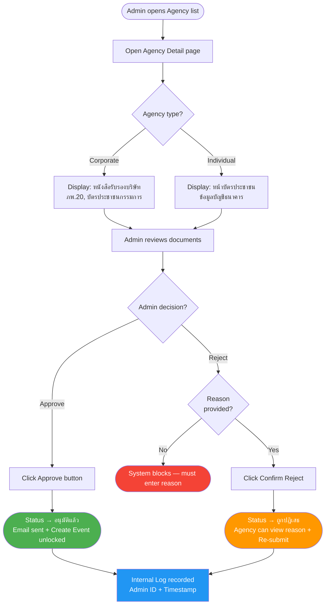
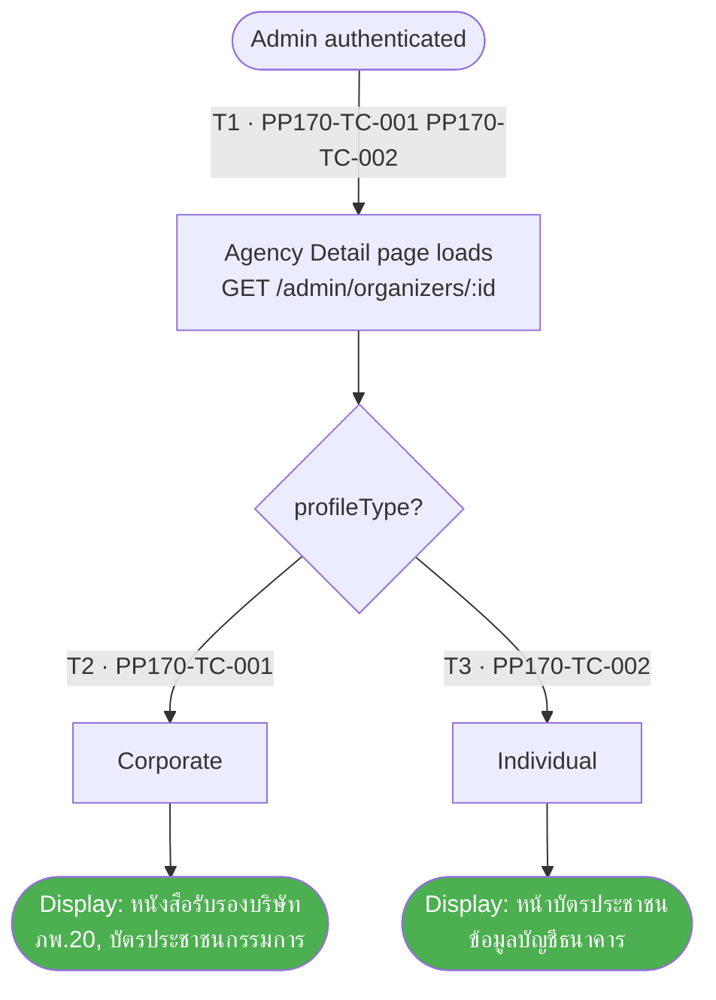
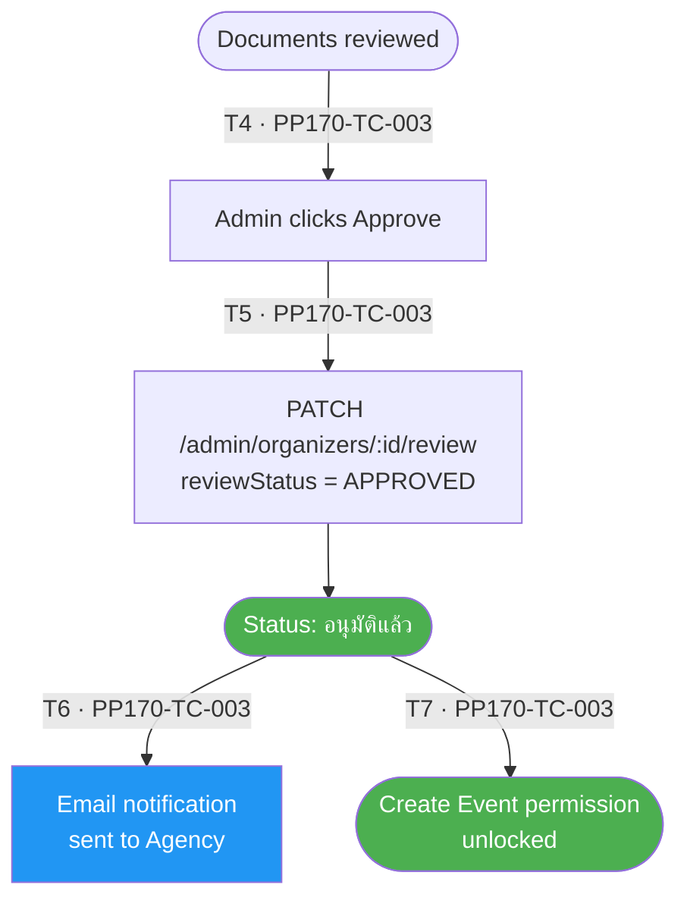
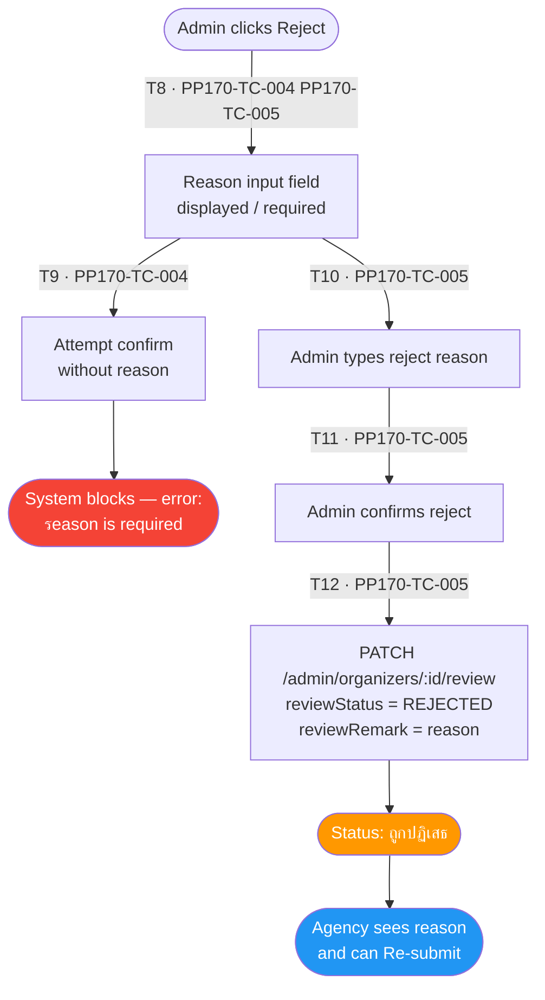
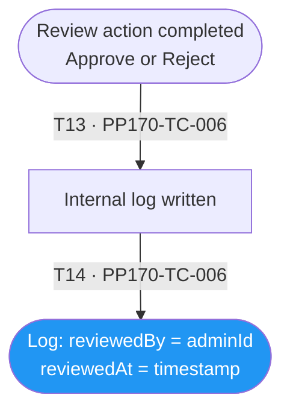

# PP-170 · Document Review & Approval Logic — Flow Diagram

> Requirements → [PP-170_Document_Review_Approval_Logic.md](../requirements/PP-170_Document_Review_Approval_Logic/PP-170_Document_Review_Approval_Logic.md)
> Jira → [PP-170](https://7-solutions.atlassian.net/browse/PP-170)
> Figma → [App UI Design](https://www.figma.com/design/PKyOOKQydjB98nVMOOyxy4/-PP--App-UI-Design)
> Test Design → [PP-170.design.md](./PP-170.design.md)

---

## Master Flow

---

## Sub-Flow 1: Information Display by Agency Type (AC1 & AC2)

### State & Transition Reference

| Ref ID | Type  | Label |
|--------|-------|-------|
| S1  | State      | Admin authenticated in BO |
| S2  | State      | Agency Detail page requested |
| S3  | State      | Agency type = Corporate |
| S4  | State      | Corporate documents displayed (หนังสือรับรอง, ภพ.20, บัตรประชาชนกรรมการ) |
| S5  | State      | Agency type = Individual |
| S6  | State      | Individual documents displayed (บัตรประชาชน, บัญชีธนาคาร) |
| T1  | Transition | Admin opens Agency Detail (GET /admin/organizers/:id) |
| T2  | Transition | profileType = COMPANY → show corporate docs |
| T3  | Transition | profileType = INDIVIDUAL → show individual docs |

---

## Sub-Flow 2: Approve Agency (AC3)

### State & Transition Reference

| Ref ID | Type  | Label |
|--------|-------|-------|
| S7  | State      | Admin reviews documents — ready to decide |
| S8  | State      | Admin clicks Approve button |
| S9  | State      | API PATCH — reviewStatus = APPROVED |
| S10 | State      | Agency status → อนุมัติแล้ว |
| S11 | State      | Email notification sent to Agency |
| S12 | State      | Create Event permission unlocked |
| T4  | Transition | Admin clicks Approve |
| T5  | Transition | API returns success → status updated |
| T6  | Transition | Side effect: Email sent |
| T7  | Transition | Side effect: Create Event unlocked |

---

## Sub-Flow 3: Reject Agency (AC4 & AC5)

### State & Transition Reference

| Ref ID | Type  | Label |
|--------|-------|-------|
| S13 | State      | Admin clicks Reject button |
| S14 | State      | Reason input field displayed |
| S15 | State      | Admin attempts confirm without reason |
| S16 | State      | System blocks reject — validation error |
| S17 | State      | Admin enters reject reason |
| S18 | State      | Admin confirms reject |
| S19 | State      | API PATCH — reviewStatus = REJECTED |
| S20 | State      | Agency status → ถูกปฏิเสธ |
| S21 | State      | Agency can view reason and re-submit |
| T8  | Transition | Admin clicks Reject |
| T9  | Transition | Confirm without reason → validation error |
| T10 | Transition | Admin types reason |
| T11 | Transition | Admin confirms with reason → API call |
| T12 | Transition | API returns success — status updated |

---

## Sub-Flow 4: Internal Log (AC6)

### State & Transition Reference

| Ref ID | Type  | Label |
|--------|-------|-------|
| S22 | State      | Approve or Reject action completed |
| S23 | State      | Internal log entry written |
| S24 | State      | Log contains Admin ID and Timestamp |
| T13 | Transition | Any review action completes |
| T14 | Transition | System writes log entry |

---

## State & Transition Coverage Summary

| Ref ID | Type       | Label                                              | Covered By TC             |
|--------|------------|----------------------------------------------------|---------------------------|
| S1     | State      | Admin authenticated in BO                          | PP170-TC-001 PP170-TC-002 |
| S2     | State      | Agency Detail page requested                       | PP170-TC-001 PP170-TC-002 |
| S3     | State      | Agency type = Corporate                            | PP170-TC-001              |
| S4     | State      | Corporate documents displayed                      | PP170-TC-001              |
| S5     | State      | Agency type = Individual                           | PP170-TC-002              |
| S6     | State      | Individual documents displayed                     | PP170-TC-002              |
| S7     | State      | Admin reviews documents                            | PP170-TC-003–PP170-TC-005 |
| S8     | State      | Admin clicks Approve                               | PP170-TC-003              |
| S9     | State      | API PATCH — APPROVED                               | PP170-TC-003              |
| S10    | State      | Agency status → อนุมัติแล้ว                       | PP170-TC-003              |
| S11    | State      | Email notification sent                            | PP170-TC-003              |
| S12    | State      | Create Event permission unlocked                   | PP170-TC-003              |
| S13    | State      | Admin clicks Reject                                | PP170-TC-004 PP170-TC-005 |
| S14    | State      | Reason input field displayed                       | PP170-TC-004 PP170-TC-005 |
| S15    | State      | Attempt confirm without reason                     | PP170-TC-004              |
| S16    | State      | System blocks — validation error                   | PP170-TC-004              |
| S17    | State      | Admin enters reason                                | PP170-TC-005              |
| S18    | State      | Admin confirms reject                              | PP170-TC-005              |
| S19    | State      | API PATCH — REJECTED                               | PP170-TC-005              |
| S20    | State      | Agency status → ถูกปฏิเสธ                         | PP170-TC-005              |
| S21    | State      | Agency sees reason and can Re-submit               | PP170-TC-005              |
| S22    | State      | Review action completed                            | PP170-TC-006              |
| S23    | State      | Internal log entry written                         | PP170-TC-006              |
| S24    | State      | Log contains Admin ID and Timestamp                | PP170-TC-006              |
| T1     | Transition | Admin opens Agency Detail                          | PP170-TC-001 PP170-TC-002 |
| T2     | Transition | profileType = COMPANY                              | PP170-TC-001              |
| T3     | Transition | profileType = INDIVIDUAL                           | PP170-TC-002              |
| T4     | Transition | Admin clicks Approve                               | PP170-TC-003              |
| T5     | Transition | API returns success — status updated               | PP170-TC-003              |
| T6     | Transition | Side effect: Email sent                            | PP170-TC-003              |
| T7     | Transition | Side effect: Create Event unlocked                 | PP170-TC-003              |
| T8     | Transition | Admin clicks Reject                                | PP170-TC-004 PP170-TC-005 |
| T9     | Transition | Confirm without reason → validation error          | PP170-TC-004              |
| T10    | Transition | Admin types reason                                 | PP170-TC-005              |
| T11    | Transition | Admin confirms with reason → API call              | PP170-TC-005              |
| T12    | Transition | API returns success — status updated               | PP170-TC-005              |
| T13    | Transition | Any review action completes                        | PP170-TC-006              |
| T14    | Transition | System writes log entry                            | PP170-TC-006              |
