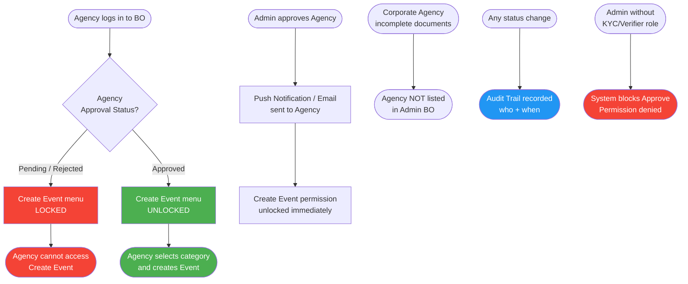
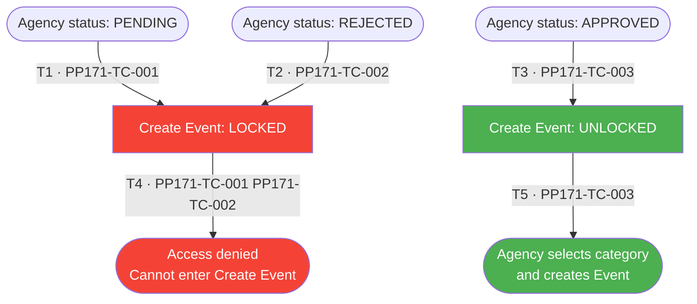
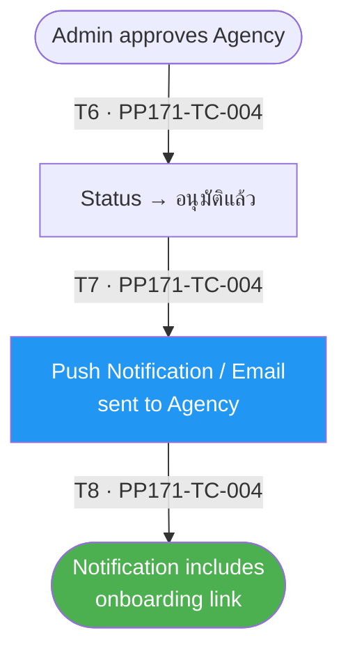
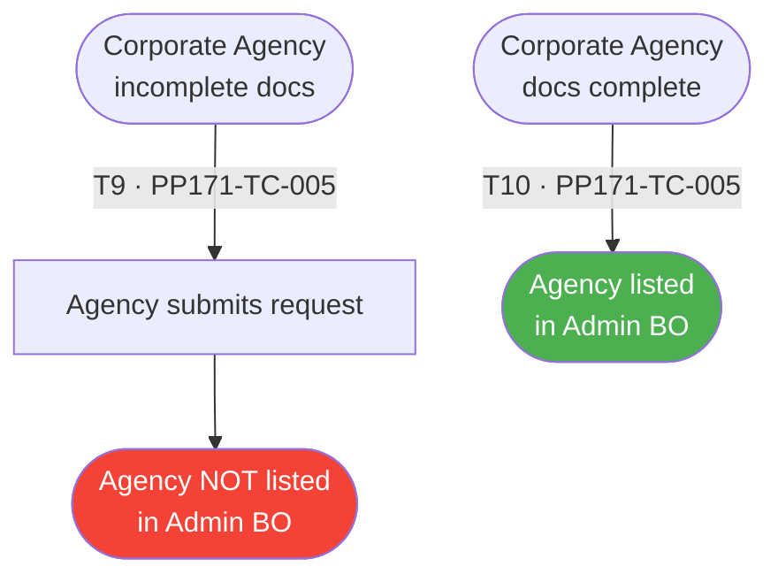
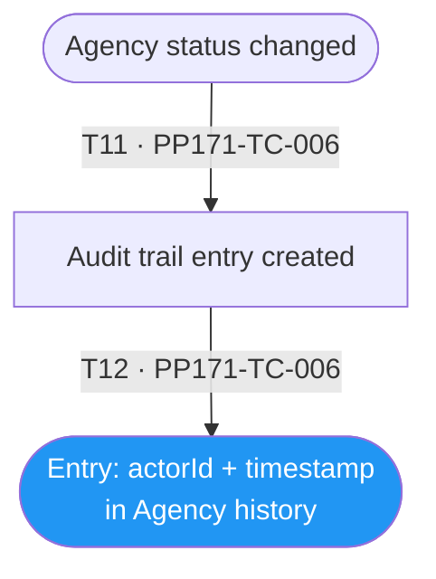
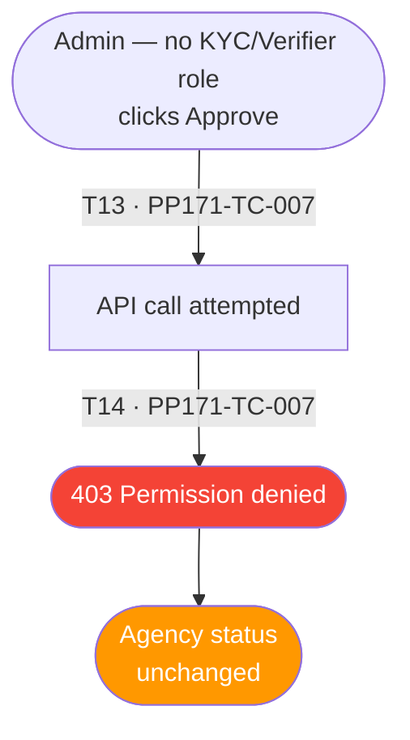
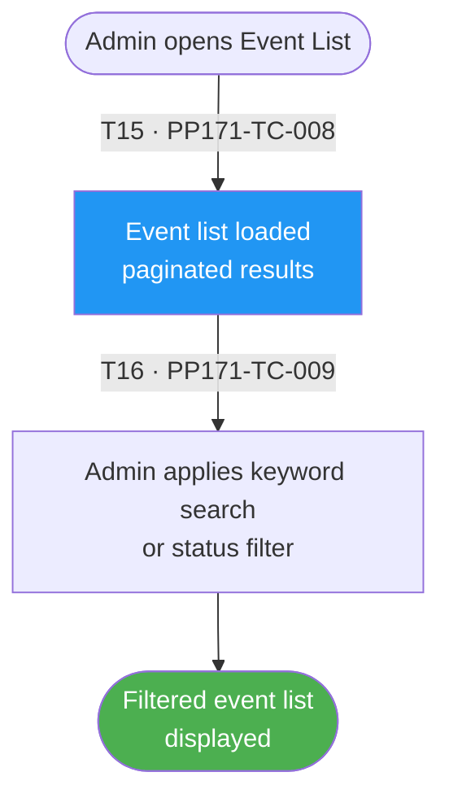
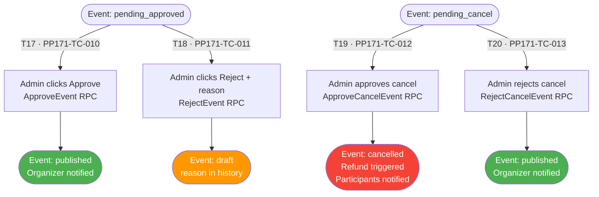

# PP-171 · Permission Activation — Flow Diagram

> Requirements → [PP-171_Permission_Activation.md](../requirements/PP-171_Permission_Activation/PP-171_Permission_Activation.md)
> Jira → [PP-171](https://7-solutions.atlassian.net/browse/PP-171)
> Figma → [App UI Design](https://www.figma.com/design/PKyOOKQydjB98nVMOOyxy4/-PP--App-UI-Design)
> Test Design → [PP-171.design.md](./PP-171.design.md)

---

## Master Flow

---

## Sub-Flow 1: Create Event Access Control (AC1 & AC2)

### State & Transition Reference

| Ref ID | Type  | Label |
|--------|-------|-------|
| S1  | State      | Agency logged in — status = Pending |
| S2  | State      | Create Event menu — LOCKED state |
| S3  | State      | Agency cannot access Create Event page |
| S4  | State      | Agency logged in — status = Rejected |
| S5  | State      | Agency logged in — status = Approved |
| S6  | State      | Create Event menu — UNLOCKED state |
| S7  | State      | Agency accesses Create Event; selects category |
| T1  | Transition | Agency status = PENDING → lock menu |
| T2  | Transition | Agency status = REJECTED → lock menu |
| T3  | Transition | Agency status = APPROVED → unlock menu |
| T4  | Transition | Agency attempts to navigate to Create Event (locked) |
| T5  | Transition | Agency successfully navigates to Create Event (unlocked) |

---

## Sub-Flow 2: Onboarding Notification on Approval (AC3)

### State & Transition Reference

| Ref ID | Type  | Label |
|--------|-------|-------|
| S8  | State      | Admin completes Approve action |
| S9  | State      | Agency status changes to Approved |
| S10 | State      | Push Notification / Email sent to Agency |
| S11 | State      | Notification contains link to start using platform |
| T6  | Transition | Admin triggers Approve |
| T7  | Transition | Status updated → side effect: send notification |
| T8  | Transition | Notification delivered with onboarding link |

---

## Sub-Flow 3: Corporate Document Validation Before Listing (AC4)

### State & Transition Reference

| Ref ID | Type  | Label |
|--------|-------|-------|
| S12 | State      | Corporate Agency — documents incomplete |
| S13 | State      | Agency submits request |
| S14 | State      | Agency NOT visible in Admin BO list |
| S15 | State      | Corporate Agency — all documents complete |
| S16 | State      | Agency appears in Admin BO list |
| T9  | Transition | Submit with incomplete documents → hidden from BO |
| T10 | Transition | Documents complete → visible in BO |

---

## Sub-Flow 4: Audit Trail (AC5)

### State & Transition Reference

| Ref ID | Type  | Label |
|--------|-------|-------|
| S17 | State      | Agency status changes (any direction) |
| S18 | State      | Audit trail entry created |
| S19 | State      | Entry contains: who acted + when |
| T11 | Transition | Status change event triggers audit write |
| T12 | Transition | Audit entry persisted with actor + timestamp |

---

## Sub-Flow 5: RBAC — Only KYC/Verifier Can Approve (AC6)

### State & Transition Reference

| Ref ID | Type  | Label |
|--------|-------|-------|
| S20 | State      | Admin without KYC/Verifier role clicks Approve |
| S21 | State      | API call attempted |
| S22 | State      | System returns permission denied (403) |
| S23 | State      | Status unchanged |
| T13 | Transition | Non-verifier Admin triggers Approve |
| T14 | Transition | RBAC check fails — 403 returned |

---

## Sub-Flow 6: Event List — Admin View (PP-119 / PP-174)

### State & Transition Reference

| Ref ID | Type  | Label |
|--------|-------|-------|
| S24 | State      | Admin opens Event List page |
| S25 | State      | Event list loaded (paginated) |
| S26 | State      | Admin applies search / filter / sort |
| S27 | State      | Filtered event list displayed |
| T15 | Transition | Admin navigates to Event Management |
| T16 | Transition | Search / filter / sort parameters applied |

---

## Sub-Flow 7: Admin Approve / Reject Event (PP-86 / PP-87 / PP-175)

### State & Transition Reference

| Ref ID | Type  | Label |
|--------|-------|-------|
| S28 | State      | Event in pending_approved status |
| S29 | State      | Admin approves event |
| S30 | State      | Event status → published |
| S31 | State      | Admin rejects event (pending_approved) |
| S32 | State      | Event status → draft + reason stored |
| S33 | State      | Event in pending_cancel status |
| S34 | State      | Admin approves cancel |
| S35 | State      | Event status → cancelled; refund triggered |
| S36 | State      | Admin rejects cancel |
| S37 | State      | Event status → published (restored) |
| T17 | Transition | Admin approve (pending_approved → published) |
| T18 | Transition | Admin reject (pending_approved → draft) |
| T19 | Transition | Admin approve cancel (pending_cancel → cancelled) |
| T20 | Transition | Admin reject cancel (pending_cancel → published) |

---

## State & Transition Coverage Summary

| Ref ID | Type       | Label                                                  | Covered By TC             |
|--------|------------|--------------------------------------------------------|---------------------------|
| S1     | State      | Agency logged in — status = Pending                    | PP171-TC-001              |
| S2     | State      | Create Event menu — LOCKED                             | PP171-TC-001 PP171-TC-002 |
| S3     | State      | Agency cannot access Create Event                      | PP171-TC-001 PP171-TC-002 |
| S4     | State      | Agency logged in — status = Rejected                   | PP171-TC-002              |
| S5     | State      | Agency logged in — status = Approved                   | PP171-TC-003              |
| S6     | State      | Create Event menu — UNLOCKED                           | PP171-TC-003              |
| S7     | State      | Agency accesses Create Event                           | PP171-TC-003              |
| S8     | State      | Admin completes Approve action                         | PP171-TC-004              |
| S9     | State      | Agency status → Approved                               | PP171-TC-004              |
| S10    | State      | Push Notification / Email sent                         | PP171-TC-004              |
| S11    | State      | Notification with onboarding link                      | PP171-TC-004              |
| S12    | State      | Corporate Agency — incomplete docs                     | PP171-TC-005              |
| S13    | State      | Agency submits request                                 | PP171-TC-005              |
| S14    | State      | Agency NOT visible in Admin BO                         | PP171-TC-005              |
| S15    | State      | Corporate Agency — complete docs                       | PP171-TC-005              |
| S16    | State      | Agency listed in Admin BO                              | PP171-TC-005              |
| S17    | State      | Agency status changes                                  | PP171-TC-006              |
| S18    | State      | Audit trail entry created                              | PP171-TC-006              |
| S19    | State      | Entry: actorId + timestamp                             | PP171-TC-006              |
| S20    | State      | Admin (no KYC/Verifier role) clicks Approve            | PP171-TC-007              |
| S21    | State      | API call attempted                                     | PP171-TC-007              |
| S22    | State      | 403 Permission denied                                  | PP171-TC-007              |
| S23    | State      | Agency status unchanged                                | PP171-TC-007              |
| S24    | State      | Admin opens Event List                                 | PP171-TC-008              |
| S25    | State      | Event list loaded paginated                            | PP171-TC-008              |
| S26    | State      | Admin applies search / filter                          | PP171-TC-009              |
| S27    | State      | Filtered event list displayed                          | PP171-TC-009              |
| S28    | State      | Event: pending_approved                                | PP171-TC-010 PP171-TC-011 |
| S29    | State      | Admin approves event                                   | PP171-TC-010              |
| S30    | State      | Event: published                                       | PP171-TC-010              |
| S31    | State      | Admin rejects event                                    | PP171-TC-011              |
| S32    | State      | Event: draft                                           | PP171-TC-011              |
| S33    | State      | Event: pending_cancel                                  | PP171-TC-012 PP171-TC-013 |
| S34    | State      | Admin approves cancel                                  | PP171-TC-012              |
| S35    | State      | Event: cancelled; refund triggered                     | PP171-TC-012              |
| S36    | State      | Admin rejects cancel                                   | PP171-TC-013              |
| S37    | State      | Event: published (restored)                            | PP171-TC-013              |
| T1     | Transition | Agency status = PENDING → lock menu                    | PP171-TC-001              |
| T2     | Transition | Agency status = REJECTED → lock menu                   | PP171-TC-002              |
| T3     | Transition | Agency status = APPROVED → unlock menu                 | PP171-TC-003              |
| T4     | Transition | Agency attempts Create Event (locked)                  | PP171-TC-001 PP171-TC-002 |
| T5     | Transition | Agency navigates to Create Event (unlocked)            | PP171-TC-003              |
| T6     | Transition | Admin triggers Approve                                 | PP171-TC-004              |
| T7     | Transition | Status updated → notification sent                     | PP171-TC-004              |
| T8     | Transition | Notification delivered with onboarding link            | PP171-TC-004              |
| T9     | Transition | Incomplete docs → hidden from BO                       | PP171-TC-005              |
| T10    | Transition | Docs complete → visible in BO                          | PP171-TC-005              |
| T11    | Transition | Status change triggers audit write                     | PP171-TC-006              |
| T12    | Transition | Audit entry persisted                                  | PP171-TC-006              |
| T13    | Transition | Non-verifier Admin triggers Approve                    | PP171-TC-007              |
| T14    | Transition | RBAC check fails — 403                                 | PP171-TC-007              |
| T15    | Transition | Admin navigates to Event Management                    | PP171-TC-008              |
| T16    | Transition | Search / filter / sort applied                         | PP171-TC-009              |
| T17    | Transition | Admin approve (pending_approved → published)           | PP171-TC-010              |
| T18    | Transition | Admin reject (pending_approved → draft)                | PP171-TC-011              |
| T19    | Transition | Admin approve cancel (pending_cancel → cancelled)      | PP171-TC-012              |
| T20    | Transition | Admin reject cancel (pending_cancel → published)       | PP171-TC-013              |
