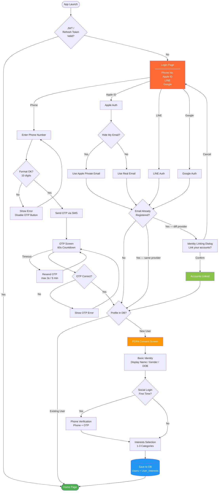
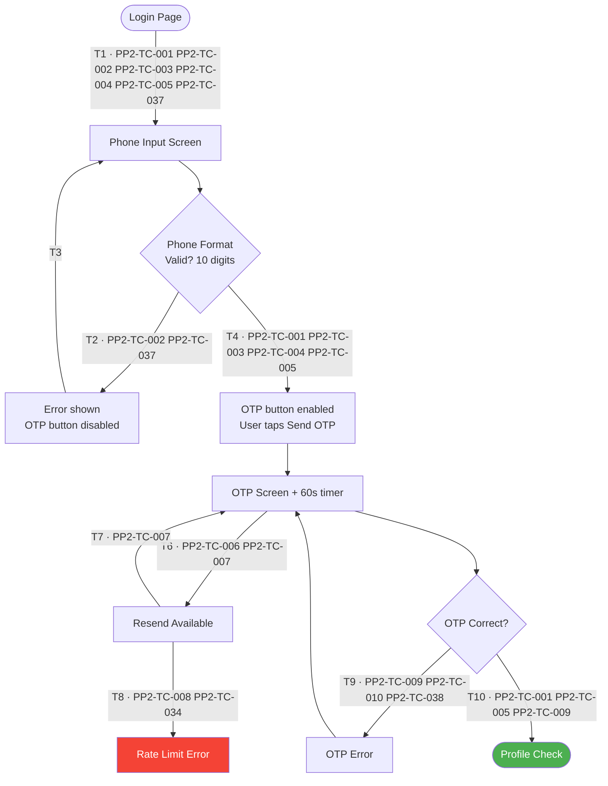
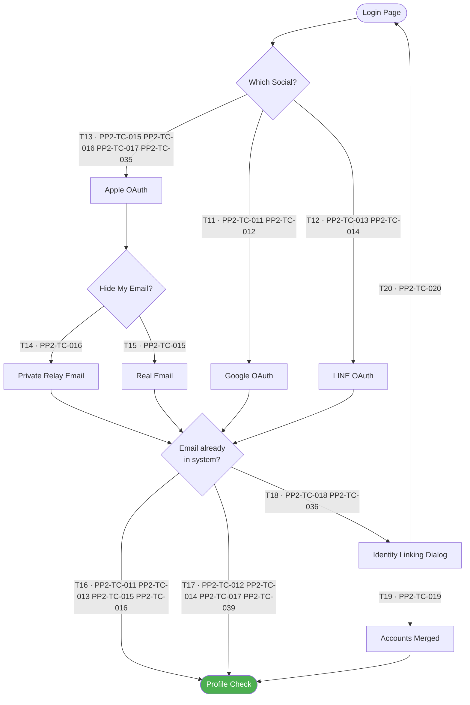
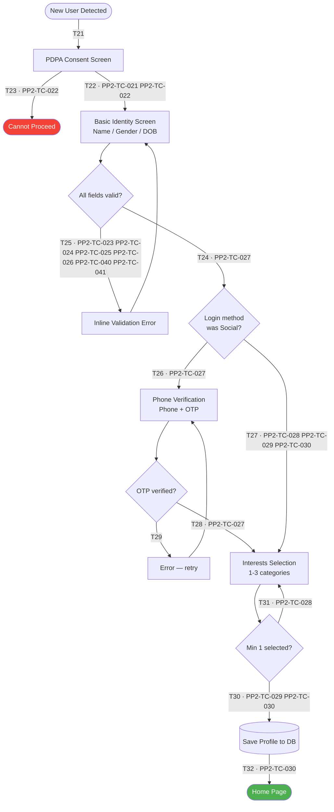
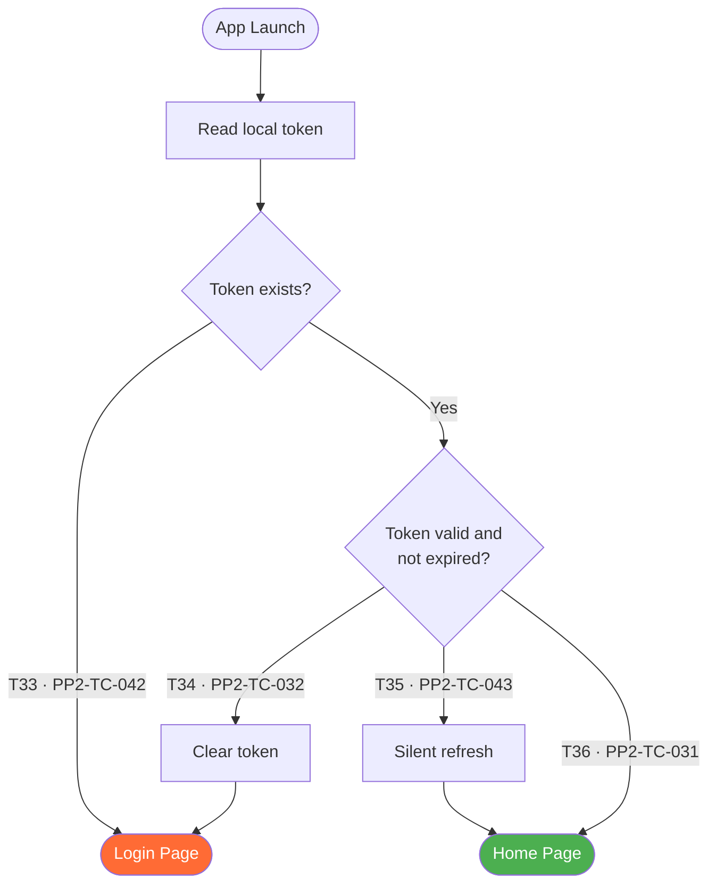

# PP-2 · Registration & Login — Flow Diagram

> Requirements → [PP-2_Registration_Login.md](../requirements/PP-2_Registration_Login.md)
> Jira → [PP-2](https://7-solutions.atlassian.net/browse/PP-2)
> Figma → [App UI Design node 1691-5925](https://www.figma.com/design/PKyOOKQydjB98nVMOOyxy4/-PP--App-UI-Design?node-id=1691-5925)
> Test Design → [PP-2.design.md](./PP-2.design.md)

---

## Master Flow

---

## Sub-Flow 1: Phone Login & OTP

### State & Transition Reference

| Ref ID | Type | Label |
|--------|------|-------|
| S1 | State | Login Page |
| S2 | State | Phone Input Screen |
| S3 | State | Phone Format Valid? |
| S4 | State | Error shown + OTP button disabled |
| S5 | State | OTP Screen (60s countdown active) |
| S6 | State | OTP Correct? |
| S7 | State | OTP Error |
| S8 | State | Resend Available |
| S9 | State | Rate Limit Reached |
| S10 | State | Profile Check |
| T1 | Transition | Tap Phone login |
| T2 | Transition | Phone invalid — show error |
| T3 | Transition | Error cleared — retry input |
| T4 | Transition | Phone valid — send OTP |
| T5 | Transition | OTP screen loaded |
| T6 | Transition | Timer expires — resend available |
| T7 | Transition | Resend under rate limit |
| T8 | Transition | Resend over rate limit — blocked |
| T9 | Transition | OTP wrong — show error |
| T10 | Transition | OTP correct — proceed |

---

## Sub-Flow 2: Social Login & Identity Linking

### State & Transition Reference

| Ref ID | Type | Label |
|--------|------|-------|
| S11 | State | Login Page |
| S12 | State | Google OAuth |
| S13 | State | LINE OAuth |
| S14 | State | Apple OAuth |
| S15 | State | Apple — Hide My Email? |
| S16 | State | Apple Private Relay Email used |
| S17 | State | Apple Real Email used |
| S18 | State | Email Check (already registered?) |
| S19 | State | Identity Linking Dialog |
| S20 | State | Accounts Merged |
| S21 | State | Profile Check |
| T11 | Transition | Tap Google |
| T12 | Transition | Tap LINE |
| T13 | Transition | Tap Apple |
| T14 | Transition | Apple — choose Hide My Email |
| T15 | Transition | Apple — choose Real Email |
| T16 | Transition | Email not registered → Profile Check |
| T17 | Transition | Email registered — same provider → Profile Check (no dialog) |
| T18 | Transition | Email registered — different provider → Linking Dialog |
| T19 | Transition | Confirm link → Merge accounts |
| T20 | Transition | Cancel link → return to Login |

---

## Sub-Flow 3: New User Onboarding

### State & Transition Reference

| Ref ID | Type | Label |
|--------|------|-------|
| S22 | State | New User Detected |
| S23 | State | PDPA Consent Screen |
| S24 | State | Cannot Proceed (PDPA declined) |
| S25 | State | Basic Identity Screen |
| S26 | State | Validation Error on Basic Identity |
| S27 | State | Login method was Social? |
| S28 | State | Phone Verification Screen |
| S29 | State | OTP Error (onboarding phone verify) |
| S30 | State | Interests Selection Screen |
| S31 | State | Save Profile to DB |
| S32 | State | Home Page |
| T21 | Transition | New user detected → PDPA |
| T22 | Transition | PDPA accept → Basic Identity |
| T23 | Transition | PDPA decline / back → blocked |
| T24 | Transition | Basic Identity valid → check login method |
| T25 | Transition | Basic Identity invalid — inline error |
| T26 | Transition | Social login → Phone Verification |
| T27 | Transition | Phone login → skip to Interests |
| T28 | Transition | Phone OTP verified → Interests |
| T29 | Transition | Phone OTP wrong → error → retry |
| T30 | Transition | Min 1 interest selected → Done |
| T31 | Transition | Done tapped with 0 interests — blocked |
| T32 | Transition | Save complete → Home |

---

## Sub-Flow 4: Session Persistence (Auto Login)

### State & Transition Reference

| Ref ID | Type | Label |
|--------|------|-------|
| S33 | State | App Launch |
| S34 | State | Read local token |
| S35 | State | Token exists? |
| S36 | State | Token valid and not expired? |
| S37 | State | Near expiry — silent refresh |
| S38 | State | Clear token |
| S39 | State | Home Page |
| S40 | State | Login Page |
| T33 | Transition | No token → Login |
| T34 | Transition | Token expired → clear → Login |
| T35 | Transition | Token near expiry → silent refresh → Home |
| T36 | Transition | Token valid and fresh → Home |

