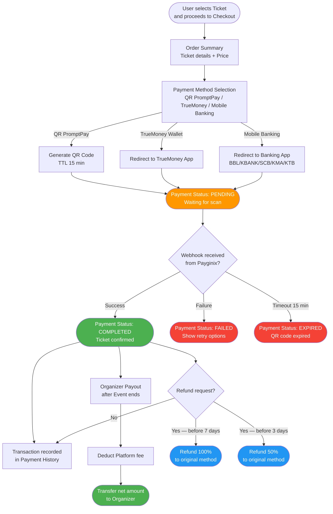
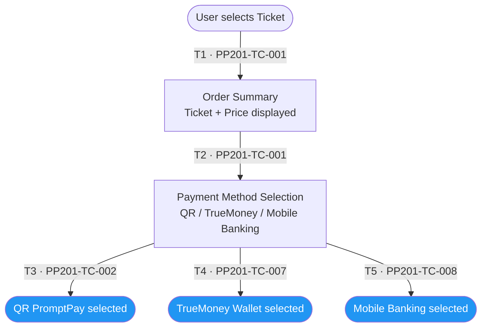
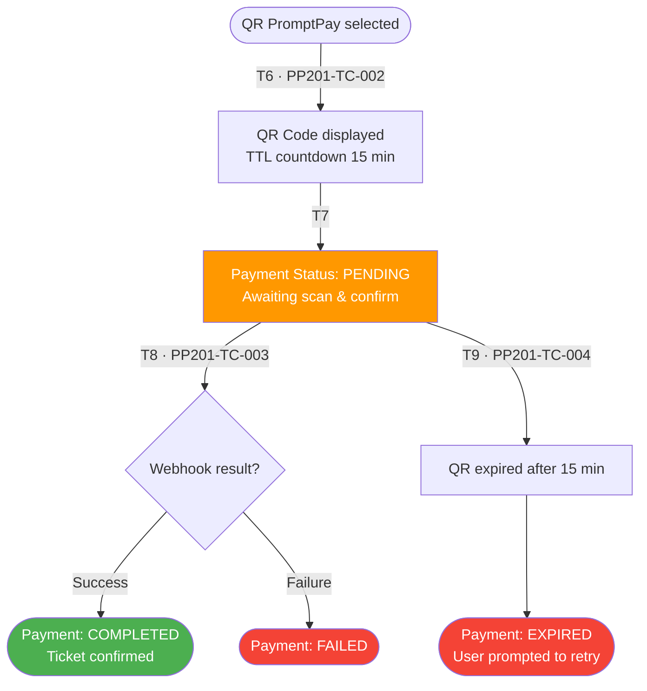
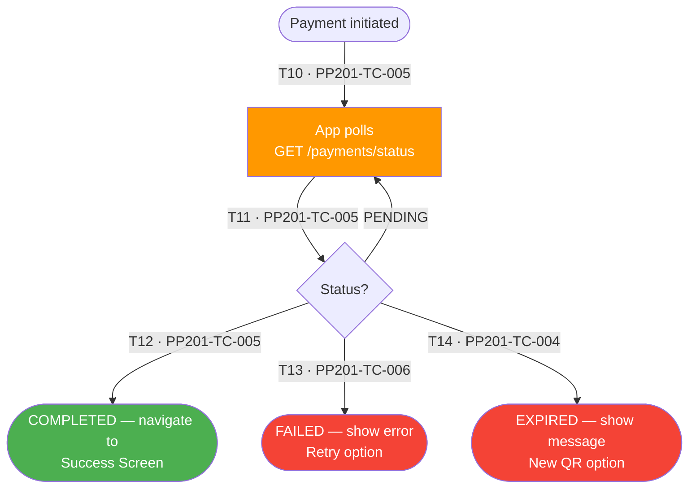
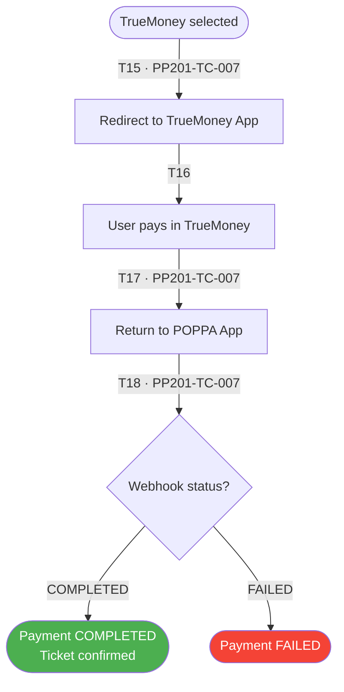
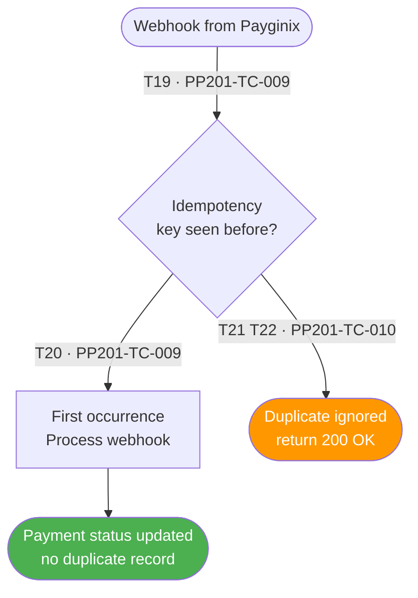
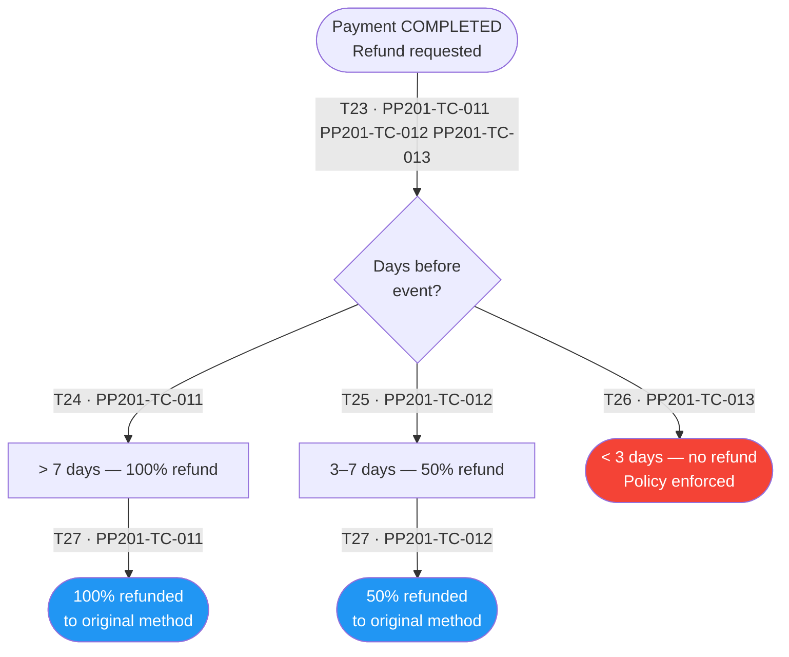
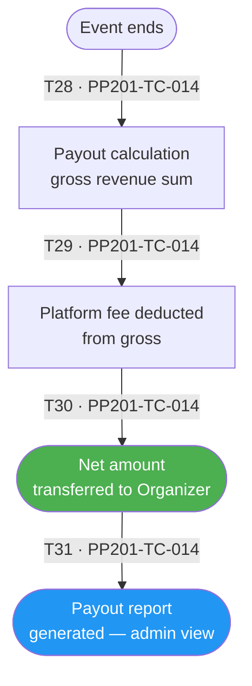

# PP-201 · Payment — Flow Diagram

> Requirements → [PP-201_Payment.md](../requirements/PP-201_Payment/PP-201_Payment.md)
> Jira → [PP-201](https://7-solutions.atlassian.net/browse/PP-201)
> Figma → [App UI Design](https://www.figma.com/design/PKyOOKQydjB98nVMOOyxy4/-PP--App-UI-Design)
> Test Design → [PP-201.design.md](./PP-201.design.md)

---

## Master Flow

---

## Sub-Flow 1: Checkout & Payment Method Selection (AC1)

### State & Transition Reference

| Ref ID | Type  | Label |
|--------|-------|-------|
| S1  | State      | User selects Ticket |
| S2  | State      | Order Summary screen displayed |
| S3  | State      | Payment Method Selection screen |
| S4  | State      | QR PromptPay selected |
| S5  | State      | TrueMoney Wallet selected |
| S6  | State      | Mobile Banking selected |
| T1  | Transition | User proceeds to checkout |
| T2  | Transition | Price confirmed — navigate to method selection |
| T3  | Transition | User selects QR PromptPay |
| T4  | Transition | User selects TrueMoney Wallet |
| T5  | Transition | User selects Mobile Banking |

---

## Sub-Flow 2: QR PromptPay Payment (AC2)

### State & Transition Reference

| Ref ID | Type  | Label |
|--------|-------|-------|
| S7  | State      | QR PromptPay selected |
| S8  | State      | QR Code generated (TTL 15 min) |
| S9  | State      | Payment Status: PENDING |
| S10 | State      | User scans QR and pays |
| S11 | State      | Webhook received — SUCCESS |
| S12 | State      | Payment Status: COMPLETED |
| S13 | State      | QR Code expired (15 min elapsed) |
| S14 | State      | Payment Status: EXPIRED |
| T6  | Transition | System calls Payginix — QR generated |
| T7  | Transition | User scans QR code |
| T8  | Transition | Webhook: payment SUCCESS |
| T9  | Transition | 15-minute TTL elapsed — QR expired |

---

## Sub-Flow 3: Payment Status Polling & Pending UI (AC2 / AC4)

### State & Transition Reference

| Ref ID | Type  | Label |
|--------|-------|-------|
| S15 | State      | Payment initiated — Pending status UI shown |
| S16 | State      | App polls GET /payments/status |
| S17 | State      | Status = PENDING (still waiting) |
| S18 | State      | Status = COMPLETED |
| S19 | State      | Status = FAILED |
| S20 | State      | Status = EXPIRED |
| T10 | Transition | App calls GET /payments/status |
| T11 | Transition | Status remains PENDING — continue polling |
| T12 | Transition | Status changes to COMPLETED |
| T13 | Transition | Status changes to FAILED |
| T14 | Transition | Status changes to EXPIRED |

---

## Sub-Flow 4: TrueMoney Wallet Payment (AC3)

### State & Transition Reference

| Ref ID | Type  | Label |
|--------|-------|-------|
| S21 | State      | TrueMoney selected |
| S22 | State      | Redirect to TrueMoney App |
| S23 | State      | User completes payment in TrueMoney |
| S24 | State      | Return to POPPA App with payment status |
| S25 | State      | Status resolved: COMPLETED or FAILED |
| T15 | Transition | App initiates TrueMoney redirect |
| T16 | Transition | User pays in TrueMoney |
| T17 | Transition | Deep link return to POPPA |
| T18 | Transition | Webhook confirms status |

---

## Sub-Flow 5: Webhook Handling — Idempotency (AC4)

### State & Transition Reference

| Ref ID | Type  | Label |
|--------|-------|-------|
| S28 | State      | Webhook received from Payginix |
| S29 | State      | Idempotency check: payment ID seen before? |
| S30 | State      | First occurrence — process webhook |
| S31 | State      | Payment status updated |
| S32 | State      | Duplicate webhook — ignored |
| T19 | Transition | Webhook arrives first time |
| T20 | Transition | Idempotency key not found — process |
| T21 | Transition | Webhook arrives again (retry) |
| T22 | Transition | Idempotency key found — skip duplicate |

---

## Sub-Flow 6: Refund Flow (AC5)

### State & Transition Reference

| Ref ID | Type  | Label |
|--------|-------|-------|
| S33 | State      | Payment COMPLETED — refund requested |
| S34 | State      | Refund policy check: days before event |
| S35 | State      | Before 7 days → 100% refund |
| S36 | State      | Before 3 days → 50% refund |
| S37 | State      | After 3 days → no refund |
| S38 | State      | Refund processed to original payment method |
| T23 | Transition | User/system initiates refund |
| T24 | Transition | Days remaining > 7 → 100% |
| T25 | Transition | Days remaining 3–7 → 50% |
| T26 | Transition | Days remaining < 3 → refund denied |
| T27 | Transition | Refund amount sent to original channel |

---

## Sub-Flow 7: Organizer Payout (AC6)

### State & Transition Reference

| Ref ID | Type  | Label |
|--------|-------|-------|
| S39 | State      | Event ends |
| S40 | State      | Payout calculation |
| S41 | State      | Platform fee deducted |
| S42 | State      | Net amount transferred to Organizer |
| S43 | State      | Payout report generated |
| T28 | Transition | Event end date reached |
| T29 | Transition | System calculates gross revenue |
| T30 | Transition | Platform fee deducted |
| T31 | Transition | Net amount sent to Organizer bank |

---

## State & Transition Coverage Summary

| Ref ID | Type       | Label                                              | Covered By TC                          |
|--------|------------|----------------------------------------------------|----------------------------------------|
| S1     | State      | User selects Ticket                                | PP201-TC-001                           |
| S2     | State      | Order Summary screen                               | PP201-TC-001                           |
| S3     | State      | Payment Method Selection screen                    | PP201-TC-001–PP201-TC-008              |
| S4     | State      | QR PromptPay selected                              | PP201-TC-002–PP201-TC-006              |
| S5     | State      | TrueMoney Wallet selected                          | PP201-TC-007                           |
| S6     | State      | Mobile Banking selected                            | PP201-TC-008                           |
| S7     | State      | QR PromptPay selected (sub-flow)                   | PP201-TC-002                           |
| S8     | State      | QR Code generated (TTL 15 min)                     | PP201-TC-002                           |
| S9     | State      | Payment Status: PENDING                            | PP201-TC-003 PP201-TC-004 PP201-TC-005 |
| S10    | State      | User scans QR and pays                             | PP201-TC-003                           |
| S11    | State      | Webhook received — SUCCESS                         | PP201-TC-003                           |
| S12    | State      | Payment Status: COMPLETED                          | PP201-TC-003 PP201-TC-005              |
| S13    | State      | QR Code expired                                    | PP201-TC-004                           |
| S14    | State      | Payment Status: EXPIRED                            | PP201-TC-004                           |
| S15    | State      | Pending status UI shown                            | PP201-TC-005                           |
| S16    | State      | App polls GET /payments/status                     | PP201-TC-005                           |
| S17    | State      | Status = PENDING (polling)                         | PP201-TC-005                           |
| S18    | State      | Status = COMPLETED                                 | PP201-TC-005                           |
| S19    | State      | Status = FAILED                                    | PP201-TC-006                           |
| S20    | State      | Status = EXPIRED                                   | PP201-TC-004                           |
| S21    | State      | TrueMoney selected                                 | PP201-TC-007                           |
| S22    | State      | Redirect to TrueMoney App                          | PP201-TC-007                           |
| S23    | State      | User pays in TrueMoney                             | PP201-TC-007                           |
| S24    | State      | Return to POPPA App                                | PP201-TC-007                           |
| S25    | State      | Webhook status resolved                            | PP201-TC-007                           |
| S26    | State      | TrueMoney — COMPLETED                              | PP201-TC-007                           |
| S27    | State      | TrueMoney — FAILED                                 | PP201-TC-007                           |
| S28    | State      | Webhook received from Payginix                     | PP201-TC-009 PP201-TC-010              |
| S29    | State      | Idempotency check                                  | PP201-TC-009 PP201-TC-010              |
| S30    | State      | First occurrence — process webhook                 | PP201-TC-009                           |
| S31    | State      | Payment status updated                             | PP201-TC-009                           |
| S32    | State      | Duplicate webhook ignored                          | PP201-TC-010                           |
| S33    | State      | Refund requested                                   | PP201-TC-011–PP201-TC-013              |
| S34    | State      | Refund policy check                                | PP201-TC-011–PP201-TC-013              |
| S35    | State      | > 7 days — 100% refund                             | PP201-TC-011                           |
| S36    | State      | 3–7 days — 50% refund                              | PP201-TC-012                           |
| S37    | State      | < 3 days — no refund                               | PP201-TC-013                           |
| S38    | State      | 100% refunded to original method                   | PP201-TC-011                           |
| S38B   | State      | 50% refunded to original method                    | PP201-TC-012                           |
| S39    | State      | Event ends                                         | PP201-TC-014                           |
| S40    | State      | Payout calculation                                 | PP201-TC-014                           |
| S41    | State      | Platform fee deducted                              | PP201-TC-014                           |
| S42    | State      | Net amount transferred to Organizer                | PP201-TC-014                           |
| S43    | State      | Payout report generated                            | PP201-TC-014                           |
| T1     | Transition | User proceeds to checkout                          | PP201-TC-001                           |
| T2     | Transition | Price confirmed — navigate to method selection     | PP201-TC-001                           |
| T3     | Transition | User selects QR PromptPay                          | PP201-TC-002                           |
| T4     | Transition | User selects TrueMoney                             | PP201-TC-007                           |
| T5     | Transition | User selects Mobile Banking                        | PP201-TC-008                           |
| T6     | Transition | System calls Payginix — QR generated               | PP201-TC-002                           |
| T7     | Transition | User scans QR                                      | PP201-TC-003                           |
| T8     | Transition | Webhook: payment SUCCESS                           | PP201-TC-003                           |
| T9     | Transition | 15-min TTL elapsed — QR expired                    | PP201-TC-004                           |
| T10    | Transition | App calls GET /payments/status                     | PP201-TC-005                           |
| T11    | Transition | Status remains PENDING                             | PP201-TC-005                           |
| T12    | Transition | Status → COMPLETED                                 | PP201-TC-005                           |
| T13    | Transition | Status → FAILED                                    | PP201-TC-006                           |
| T14    | Transition | Status → EXPIRED                                   | PP201-TC-004                           |
| T15    | Transition | App initiates TrueMoney redirect                   | PP201-TC-007                           |
| T16    | Transition | User pays in TrueMoney                             | PP201-TC-007                           |
| T17    | Transition | Deep link return to POPPA                          | PP201-TC-007                           |
| T18    | Transition | Webhook confirms status                            | PP201-TC-007                           |
| T19    | Transition | Webhook arrives first time                         | PP201-TC-009                           |
| T20    | Transition | Idempotency key not found — process                | PP201-TC-009                           |
| T21    | Transition | Webhook arrives again (retry)                      | PP201-TC-010                           |
| T22    | Transition | Idempotency key found — skip duplicate             | PP201-TC-010                           |
| T23    | Transition | Refund initiated                                   | PP201-TC-011–PP201-TC-013              |
| T24    | Transition | Days > 7 → 100%                                    | PP201-TC-011                           |
| T25    | Transition | Days 3–7 → 50%                                     | PP201-TC-012                           |
| T26    | Transition | Days < 3 → denied                                  | PP201-TC-013                           |
| T27    | Transition | Refund amount sent to original channel             | PP201-TC-011 PP201-TC-012              |
| T28    | Transition | Event end date reached                             | PP201-TC-014                           |
| T29    | Transition | System calculates gross revenue                    | PP201-TC-014                           |
| T30    | Transition | Platform fee deducted                              | PP201-TC-014                           |
| T31    | Transition | Net amount sent to Organizer                       | PP201-TC-014                           |
