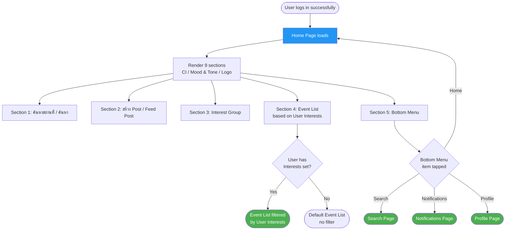
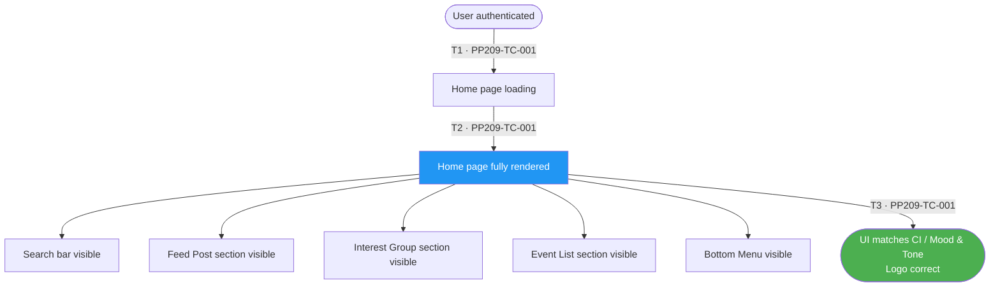
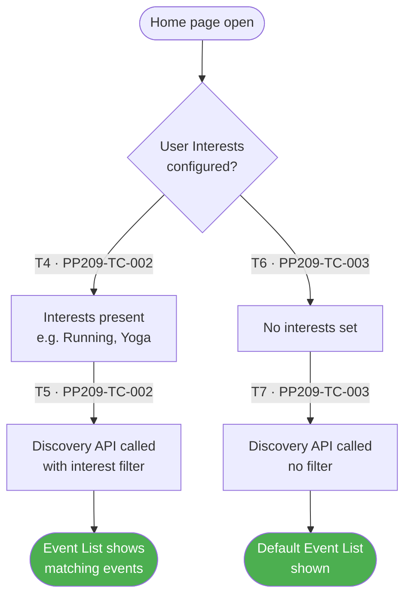
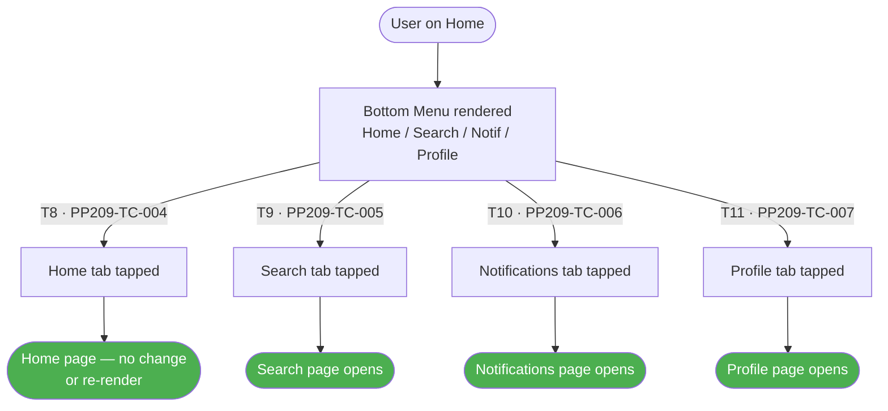
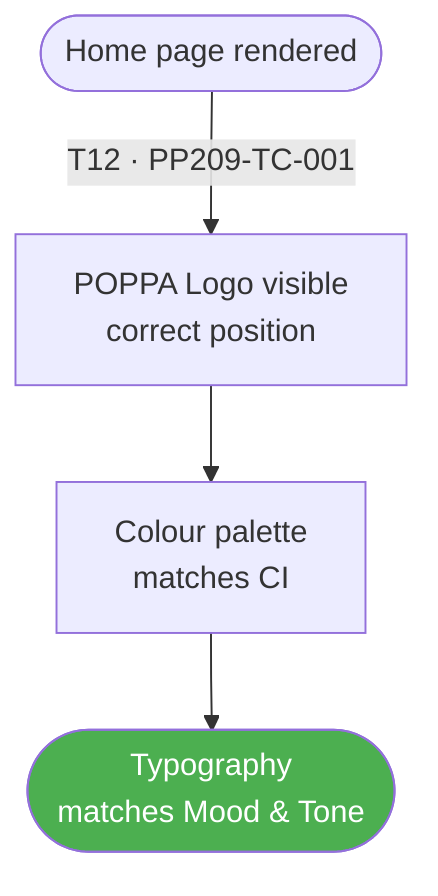

# PP-209 · Home (Main Page) — Flow Diagram

> Requirements → [PP-209_Home_Main_Page.md](../requirements/PP-209_Home_Main_Page/PP-209_Home_Main_Page.md)
> Jira → [PP-209](https://7-solutions.atlassian.net/browse/PP-209)
> Figma → [App UI Design – node 1691-5924](https://www.figma.com/design/PKyOOKQydjB98nVMOOyxy4/-PP--App-UI-Design?node-id=1691-5924&t=ynRyxkW4orN9iKOj-1)
> Test Design → [PP-209.design.md](./PP-209.design.md)

---

## Master Flow

---

## Sub-Flow 1: Home Page Display — All Sections (AC1)

### State & Transition Reference

| Ref ID | Type  | Label |
|--------|-------|-------|
| S1  | State      | User authenticated — navigates to Home |
| S2  | State      | Home page loading |
| S3  | State      | Home page fully rendered |
| S4  | State      | Search bar / location search visible |
| S5  | State      | Post / Feed Post section visible (IG Story style) |
| S6  | State      | Interest Group section visible |
| S7  | State      | Event List section visible |
| S8  | State      | Bottom Menu visible with all items |
| S9  | State      | UI matches CI / Mood & Tone / Logo specification |
| T1  | Transition | Login success → navigate to Home |
| T2  | Transition | API calls complete — sections rendered |
| T3  | Transition | UI validated against Figma spec |

---

## Sub-Flow 2: Event List Personalised by Interest (AC2)

### State & Transition Reference

| Ref ID | Type  | Label |
|--------|-------|-------|
| S10 | State      | Home page open |
| S11 | State      | User has Interests configured |
| S12 | State      | Event discovery API called with interest filter |
| S13 | State      | Personalised Event List displayed |
| S14 | State      | User has NO Interests configured |
| S15 | State      | Event discovery API called — no filter |
| S16 | State      | Default / generic Event List displayed |
| T4  | Transition | User has interests — filter applied |
| T5  | Transition | Events matching interests returned |
| T6  | Transition | User has no interests — no filter |
| T7  | Transition | Default event list returned |

---

## Sub-Flow 3: Bottom Menu Navigation (AC3)

### State & Transition Reference

| Ref ID | Type  | Label |
|--------|-------|-------|
| S17 | State      | User on Home Page |
| S18 | State      | Bottom Menu rendered |
| S19 | State      | Home tab tapped |
| S20 | State      | Stays on / returns to Home |
| S21 | State      | Search tab tapped |
| S22 | State      | Search page opens |
| S23 | State      | Notifications tab tapped |
| S24 | State      | Notifications page opens |
| S25 | State      | Profile tab tapped |
| S26 | State      | Profile page opens |
| T8  | Transition | Home tab tap → stay on Home |
| T9  | Transition | Search tab tap → navigate to Search |
| T10 | Transition | Notifications tab tap → navigate to Notifications |
| T11 | Transition | Profile tab tap → navigate to Profile |

---

## Sub-Flow 4: CI / Branding Compliance

### State & Transition Reference

| Ref ID | Type  | Label |
|--------|-------|-------|
| S27 | State      | Home page rendered |
| S28 | State      | POPPA Logo shown correctly |
| S29 | State      | Colour palette matches CI spec |
| S30 | State      | Typography matches Mood & Tone spec |
| T12 | Transition | Page render complete — assert visual elements |

---

## State & Transition Coverage Summary

| Ref ID | Type       | Label                                          | Covered By TC             |
|--------|------------|------------------------------------------------|---------------------------|
| S1     | State      | User authenticated — navigates to Home         | PP209-TC-001              |
| S2     | State      | Home page loading                              | PP209-TC-001              |
| S3     | State      | Home page fully rendered                       | PP209-TC-001              |
| S4     | State      | Search bar visible                             | PP209-TC-001              |
| S5     | State      | Feed Post section visible                      | PP209-TC-001              |
| S6     | State      | Interest Group section visible                 | PP209-TC-001              |
| S7     | State      | Event List section visible                     | PP209-TC-001–PP209-TC-003 |
| S8     | State      | Bottom Menu visible                            | PP209-TC-001 PP209-TC-004–PP209-TC-007 |
| S9     | State      | UI matches CI / Mood & Tone / Logo             | PP209-TC-001              |
| S10    | State      | Home page open                                 | PP209-TC-002 PP209-TC-003 |
| S11    | State      | User has Interests configured                  | PP209-TC-002              |
| S12    | State      | Discovery API with interest filter             | PP209-TC-002              |
| S13    | State      | Personalised Event List displayed              | PP209-TC-002              |
| S14    | State      | User has no Interests configured               | PP209-TC-003              |
| S15    | State      | Discovery API — no filter                      | PP209-TC-003              |
| S16    | State      | Default Event List displayed                   | PP209-TC-003              |
| S17    | State      | User on Home Page                              | PP209-TC-004–PP209-TC-007 |
| S18    | State      | Bottom Menu rendered                           | PP209-TC-004–PP209-TC-007 |
| S19    | State      | Home tab tapped                                | PP209-TC-004              |
| S20    | State      | Stays on / returns to Home                     | PP209-TC-004              |
| S21    | State      | Search tab tapped                              | PP209-TC-005              |
| S22    | State      | Search page opens                              | PP209-TC-005              |
| S23    | State      | Notifications tab tapped                       | PP209-TC-006              |
| S24    | State      | Notifications page opens                       | PP209-TC-006              |
| S25    | State      | Profile tab tapped                             | PP209-TC-007              |
| S26    | State      | Profile page opens                             | PP209-TC-007              |
| S27    | State      | Home page rendered (branding)                  | PP209-TC-001              |
| S28    | State      | POPPA Logo correct                             | PP209-TC-001              |
| S29    | State      | Colour palette matches CI                      | PP209-TC-001              |
| S30    | State      | Typography matches Mood & Tone                 | PP209-TC-001              |
| T1     | Transition | Login success → navigate to Home               | PP209-TC-001              |
| T2     | Transition | API calls complete — sections rendered         | PP209-TC-001              |
| T3     | Transition | UI validated against Figma spec                | PP209-TC-001              |
| T4     | Transition | User has interests — filter applied            | PP209-TC-002              |
| T5     | Transition | Events matching interests returned             | PP209-TC-002              |
| T6     | Transition | User has no interests — no filter              | PP209-TC-003              |
| T7     | Transition | Default event list returned                    | PP209-TC-003              |
| T8     | Transition | Home tab tap                                   | PP209-TC-004              |
| T9     | Transition | Search tab tap                                 | PP209-TC-005              |
| T10    | Transition | Notifications tab tap                          | PP209-TC-006              |
| T11    | Transition | Profile tab tap                                | PP209-TC-007              |
| T12    | Transition | Page render — assert visual elements           | PP209-TC-001              |
