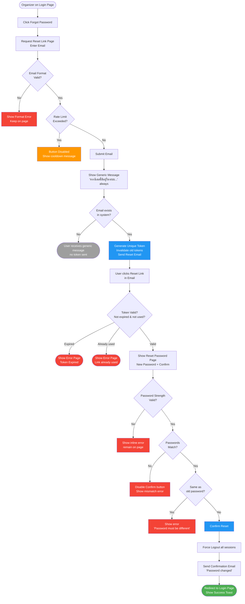
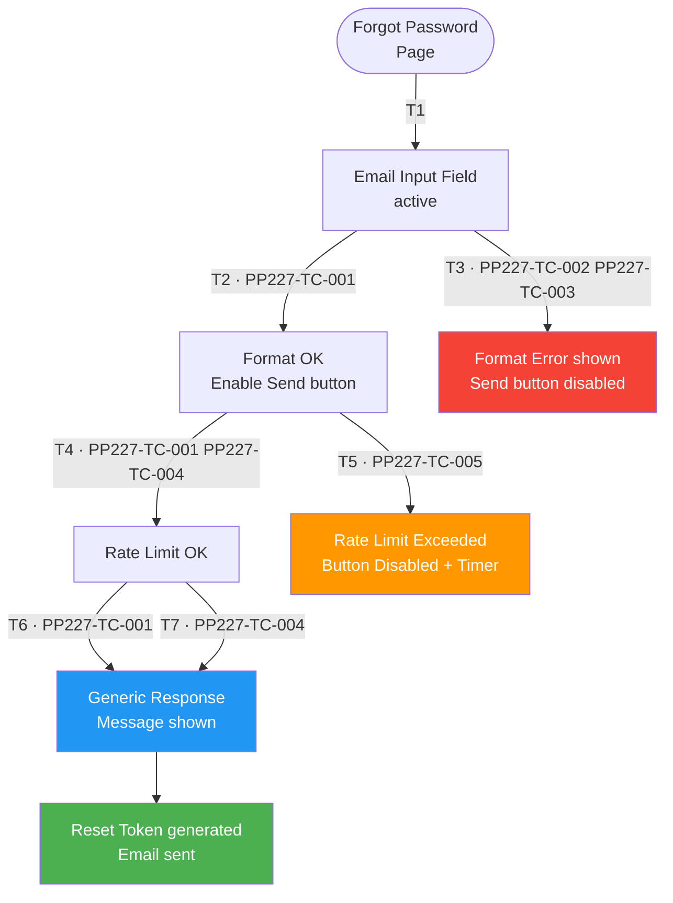
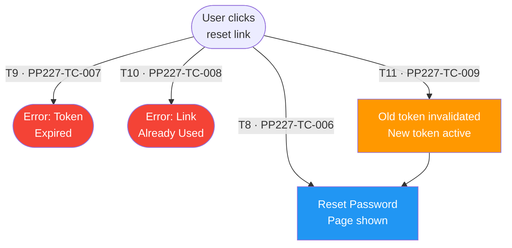
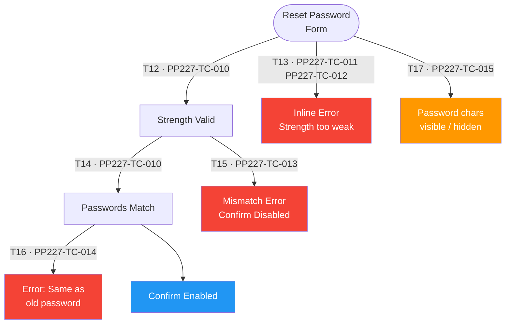
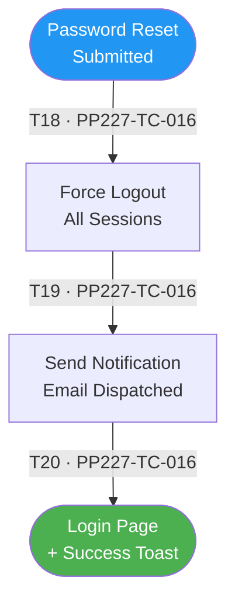

# PP-227 · [Organizer] Forgot Password Flow — Flow Diagram

> Requirements → [PP-227_Forgot_Password_Flow.md](../requirements/PP-227_Forgot_Password_Flow/PP-227_Forgot_Password_Flow.md)
> Jira → [PP-227](https://7-solutions.atlassian.net/browse/PP-227)
> Figma → [App UI Design](https://www.figma.com/design/PKyOOKQydjB98nVMOOyxy4/-PP--App-UI-Design)
> Test Design → [PP-227.design.md](./PP-227.design.md)

---

## Master Flow

---

## Sub-Flow 1: Request Reset Link (AC1 — Email Request)

### State & Transition Reference

| Ref ID | Type | Label |
|--------|------|-------|
| S1 | State | Forgot Password page loaded |
| S2 | State | Email entered |
| S3 | State | Format validation passed |
| S4 | State | Format validation failed — error shown |
| S5 | State | Rate limit check passed |
| S6 | State | Rate limit exceeded — button disabled |
| S7 | State | Generic response shown (always) |
| S8 | State | Reset email sent with unique token |
| T1 | Transition | User opens Forgot Password page |
| T2 | Transition | Valid email format |
| T3 | Transition | Invalid email format |
| T4 | Transition | Rate limit not exceeded |
| T5 | Transition | Rate limit exceeded (> 1 request in 60s) |
| T6 | Transition | Email found in system — token generated |
| T7 | Transition | Email not found — no token, generic reply |

---

## Sub-Flow 2: Token Security (AC2 — Link Validation)

### State & Transition Reference

| Ref ID | Type | Label |
|--------|------|-------|
| S9 | State | User clicks reset link in email |
| S10 | State | Token valid — Reset Password page shown |
| S11 | State | Token expired — Error page |
| S12 | State | Token already used — Error page |
| S13 | State | New link requested — old token invalidated |
| T8 | Transition | Token exists, not expired, not used |
| T9 | Transition | Token has expired (> 30 min) |
| T10 | Transition | Token was already used once |
| T11 | Transition | User requests a new link (old invalidated) |

---

## Sub-Flow 3: Reset Password Logic (AC3 — New Password Entry)

### State & Transition Reference

| Ref ID | Type | Label |
|--------|------|-------|
| S14 | State | Reset Password form active |
| S15 | State | Password strength valid |
| S16 | State | Password strength invalid — inline error |
| S17 | State | Passwords match |
| S18 | State | Passwords do not match — confirm disabled |
| S19 | State | New password same as old — error shown |
| S20 | State | Show/Hide password toggled |
| S21 | State | Confirm button enabled — ready to submit |
| T12 | Transition | Password meets strength policy (8+ chars, upper, lower, digit) |
| T13 | Transition | Password does not meet strength policy |
| T14 | Transition | Confirm password matches new password |
| T15 | Transition | Confirm password does not match |
| T16 | Transition | New password same as old password |
| T17 | Transition | Toggle show/hide password eye icon |

---

## Sub-Flow 4: Post-Success Actions (AC4 — After Reset)

### State & Transition Reference

| Ref ID | Type | Label |
|--------|------|-------|
| S22 | State | Password reset confirmed |
| S23 | State | All sessions force-logged out |
| S24 | State | Confirmation email sent |
| S25 | State | Redirected to Login with success toast |
| T18 | Transition | Password update API succeeds |
| T19 | Transition | Force logout all sessions |
| T20 | Transition | Notification email dispatched |
| T21 | Transition | Redirect to Login page |

---

## State & Transition Coverage Summary

| Ref ID | Type | Label | Covered By TC |
|--------|------|-------|---------------|
| S1 | State | Forgot Password page loaded | PP227-TC-001–PP227-TC-005 |
| S2 | State | Email entered | PP227-TC-001–PP227-TC-005 |
| S3 | State | Format validation passed | PP227-TC-001 PP227-TC-004 PP227-TC-005 |
| S4 | State | Format validation failed | PP227-TC-002 PP227-TC-003 |
| S5 | State | Rate limit check passed | PP227-TC-001 PP227-TC-004 |
| S6 | State | Rate limit exceeded | PP227-TC-005 |
| S7 | State | Generic response shown | PP227-TC-001 PP227-TC-004 |
| S8 | State | Reset email sent with unique token | PP227-TC-001 |
| S9 | State | User clicks reset link | PP227-TC-006–PP227-TC-009 |
| S10 | State | Token valid — Reset Password page | PP227-TC-006 PP227-TC-009 |
| S11 | State | Token expired — Error page | PP227-TC-007 |
| S12 | State | Token already used — Error page | PP227-TC-008 |
| S13 | State | New link — old token invalidated | PP227-TC-009 |
| S14 | State | Reset Password form active | PP227-TC-010–PP227-TC-015 |
| S15 | State | Password strength valid | PP227-TC-010 PP227-TC-013 PP227-TC-014 |
| S16 | State | Password strength invalid | PP227-TC-011 PP227-TC-012 |
| S17 | State | Passwords match | PP227-TC-010 PP227-TC-014 |
| S18 | State | Passwords do not match | PP227-TC-013 |
| S19 | State | New password same as old | PP227-TC-014 |
| S20 | State | Show/Hide password toggled | PP227-TC-015 |
| S21 | State | Confirm button enabled | PP227-TC-010 |
| S22 | State | Password reset confirmed | PP227-TC-016 |
| S23 | State | All sessions force-logged out | PP227-TC-016 |
| S24 | State | Confirmation email sent | PP227-TC-016 |
| S25 | State | Redirected to Login with success toast | PP227-TC-016 |
| T1 | Transition | User opens Forgot Password page | PP227-TC-001–PP227-TC-005 |
| T2 | Transition | Valid email format | PP227-TC-001 PP227-TC-004 PP227-TC-005 |
| T3 | Transition | Invalid email format | PP227-TC-002 PP227-TC-003 |
| T4 | Transition | Rate limit not exceeded | PP227-TC-001 PP227-TC-004 |
| T5 | Transition | Rate limit exceeded | PP227-TC-005 |
| T6 | Transition | Email found — token generated | PP227-TC-001 |
| T7 | Transition | Email not found — generic reply | PP227-TC-004 |
| T8 | Transition | Token valid | PP227-TC-006 |
| T9 | Transition | Token expired | PP227-TC-007 |
| T10 | Transition | Token already used | PP227-TC-008 |
| T11 | Transition | New link requested — old invalidated | PP227-TC-009 |
| T12 | Transition | Password meets strength policy | PP227-TC-010 PP227-TC-013 PP227-TC-014 |
| T13 | Transition | Password does not meet strength policy | PP227-TC-011 PP227-TC-012 |
| T14 | Transition | Confirm password matches | PP227-TC-010 PP227-TC-014 |
| T15 | Transition | Confirm password does not match | PP227-TC-013 |
| T16 | Transition | New password same as old | PP227-TC-014 |
| T17 | Transition | Toggle show/hide password | PP227-TC-015 |
| T18 | Transition | Password update API succeeds | PP227-TC-016 |
| T19 | Transition | Force logout all sessions | PP227-TC-016 |
| T20 | Transition | Notification email dispatched | PP227-TC-016 |
| T21 | Transition | Redirect to Login page | PP227-TC-016 |
