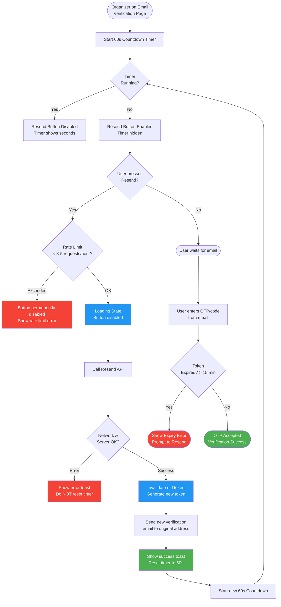
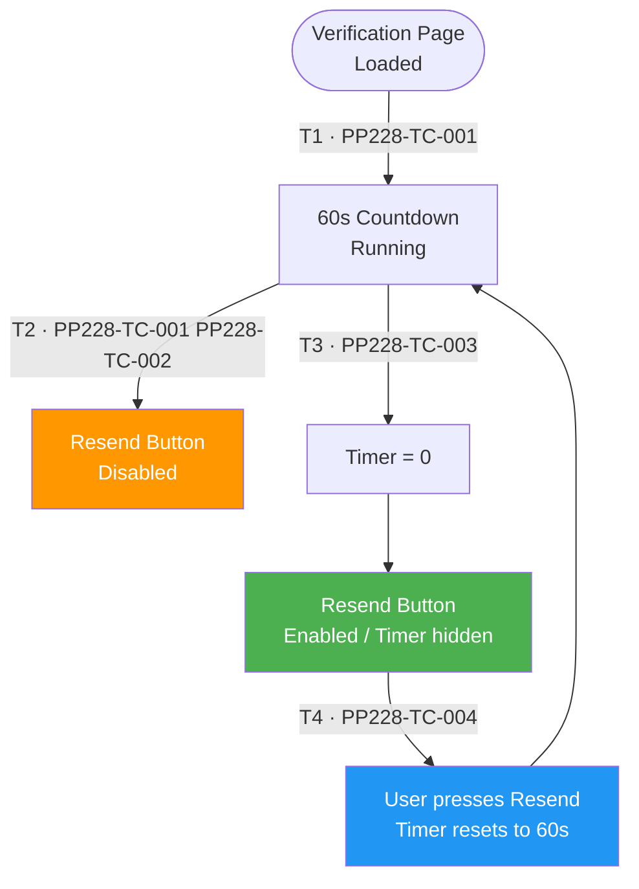
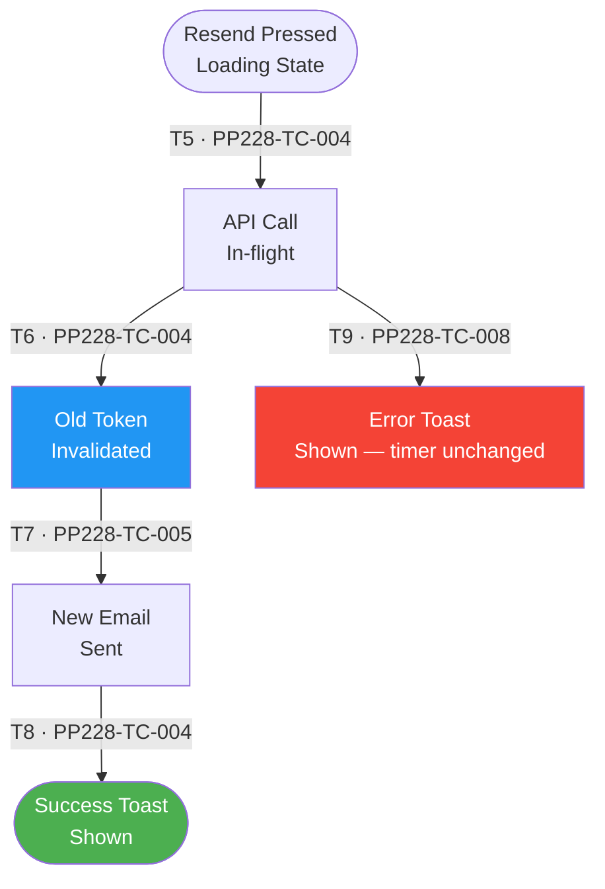
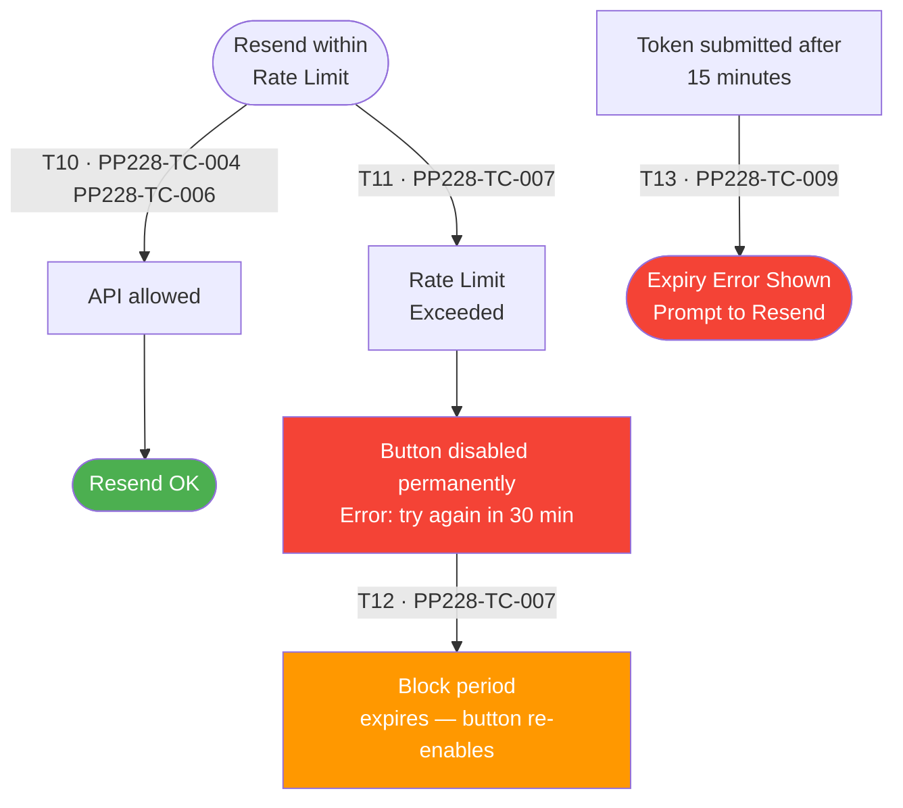
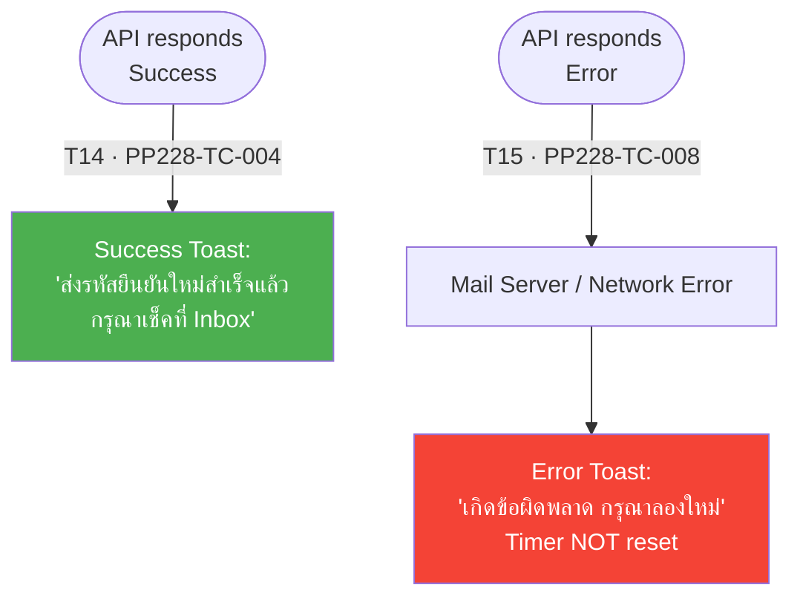

# PP-228 · [Imp-UI][Organizer] Register Flow - Resend Verification Email — Flow Diagram

> Requirements → [PP-228_Resend_Verification_Email.md](../requirements/PP-228_Resend_Verification_Email/PP-228_Resend_Verification_Email.md)
> Jira → [PP-228](https://7-solutions.atlassian.net/browse/PP-228)
> Figma → [App UI Design](https://www.figma.com/design/PKyOOKQydjB98nVMOOyxy4/-PP--App-UI-Design)
> Test Design → [PP-228.design.md](./PP-228.design.md)

---

## Master Flow

---

## Sub-Flow 1: Countdown Timer & Button Control (AC1)

### State & Transition Reference

| Ref ID | Type | Label |
|--------|------|-------|
| S1 | State | Verification page entered — timer starts |
| S2 | State | Countdown active (1–60 seconds remaining) |
| S3 | State | Resend button disabled during countdown |
| S4 | State | Timer reaches zero |
| S5 | State | Resend button enabled — countdown hidden |
| S6 | State | User presses Resend — timer resets to 60s |
| T1 | Transition | Page load triggers 60s countdown |
| T2 | Transition | Timer ticking — button remains disabled |
| T3 | Transition | Timer reaches 0 — button enabled |
| T4 | Transition | User presses Resend — timer resets |

---

## Sub-Flow 2: API & Email Trigger (AC2)

### State & Transition Reference

| Ref ID | Type | Label |
|--------|------|-------|
| S7 | State | Resend pressed — Loading state active |
| S8 | State | API call in-flight |
| S9 | State | API success — old token invalidated |
| S10 | State | New verification email sent |
| S11 | State | Success toast shown |
| S12 | State | API error — error toast shown, timer unchanged |
| T5 | Transition | Press Resend → enter loading state |
| T6 | Transition | API responds success |
| T7 | Transition | Old OTP/link invalidated |
| T8 | Transition | New email dispatched |
| T9 | Transition | API responds with error (network/server) |

---

## Sub-Flow 3: Rate Limiting & Security (AC3)

### State & Transition Reference

| Ref ID | Type | Label |
|--------|------|-------|
| S13 | State | Rate limit threshold not reached (< 3-5/hour) |
| S14 | State | Rate limit exceeded |
| S15 | State | Button permanently disabled + error message shown |
| S16 | State | Rate limit window expires (30 min / 1 hour later) |
| S17 | State | Token expired (> 15 min) — expiry error shown |
| T10 | Transition | Resend count within allowed limit |
| T11 | Transition | Resend count exceeds limit |
| T12 | Transition | Rate limit block period expires |
| T13 | Transition | User submits token after 15-minute expiry |

---

## Sub-Flow 4: Feedback & Notification (AC4)

### State & Transition Reference

| Ref ID | Type | Label |
|--------|------|-------|
| S18 | State | Email sent successfully |
| S19 | State | Success toast visible |
| S20 | State | Mail server error |
| S21 | State | Error toast shown — timer not reset |
| T14 | Transition | Email dispatch succeeds |
| T15 | Transition | Mail server fails / network error |

---

## State & Transition Coverage Summary

| Ref ID | Type | Label | Covered By TC |
|--------|------|-------|---------------|
| S1 | State | Verification page entered — timer starts | PP228-TC-001 |
| S2 | State | Countdown active (1–60 seconds remaining) | PP228-TC-001 PP228-TC-002 PP228-TC-003 |
| S3 | State | Resend button disabled during countdown | PP228-TC-001 PP228-TC-002 |
| S4 | State | Timer reaches zero | PP228-TC-003 |
| S5 | State | Resend button enabled — countdown hidden | PP228-TC-003 |
| S6 | State | User presses Resend — timer resets to 60s | PP228-TC-004 |
| S7 | State | Resend pressed — Loading state active | PP228-TC-004 |
| S8 | State | API call in-flight | PP228-TC-004 PP228-TC-008 |
| S9 | State | API success — old token invalidated | PP228-TC-004 PP228-TC-005 |
| S10 | State | New verification email sent | PP228-TC-004 PP228-TC-005 |
| S11 | State | Success toast shown | PP228-TC-004 |
| S12 | State | API error — error toast, timer unchanged | PP228-TC-008 |
| S13 | State | Rate limit not reached | PP228-TC-004 PP228-TC-006 |
| S14 | State | Rate limit exceeded | PP228-TC-007 |
| S15 | State | Button permanently disabled + error | PP228-TC-007 |
| S16 | State | Rate limit block expires | PP228-TC-007 |
| S17 | State | Token expired (> 15 min) | PP228-TC-009 |
| S18 | State | Email sent successfully | PP228-TC-004 |
| S19 | State | Success toast visible | PP228-TC-004 |
| S20 | State | Mail server / network error | PP228-TC-008 |
| S21 | State | Error toast shown — timer not reset | PP228-TC-008 |
| T1 | Transition | Page load triggers 60s countdown | PP228-TC-001 |
| T2 | Transition | Timer ticking — button remains disabled | PP228-TC-001 PP228-TC-002 |
| T3 | Transition | Timer reaches 0 — button enabled | PP228-TC-003 |
| T4 | Transition | User presses Resend — timer resets | PP228-TC-004 |
| T5 | Transition | Press Resend → loading state | PP228-TC-004 |
| T6 | Transition | API responds success | PP228-TC-004 |
| T7 | Transition | Old OTP invalidated | PP228-TC-005 |
| T8 | Transition | New email dispatched | PP228-TC-004 PP228-TC-005 |
| T9 | Transition | API responds with error | PP228-TC-008 |
| T10 | Transition | Resend within rate limit | PP228-TC-004 PP228-TC-006 |
| T11 | Transition | Resend exceeds rate limit | PP228-TC-007 |
| T12 | Transition | Rate limit block period expires | PP228-TC-007 |
| T13 | Transition | Token submitted after 15-min expiry | PP228-TC-009 |
| T14 | Transition | Email dispatch succeeds | PP228-TC-004 |
| T15 | Transition | Mail server fails | PP228-TC-008 |
