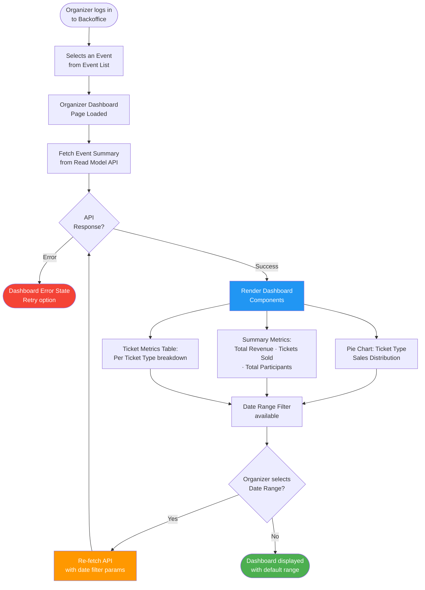
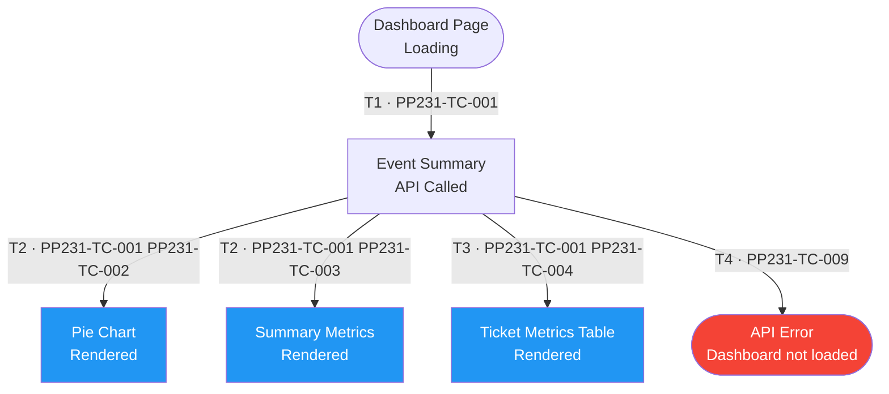
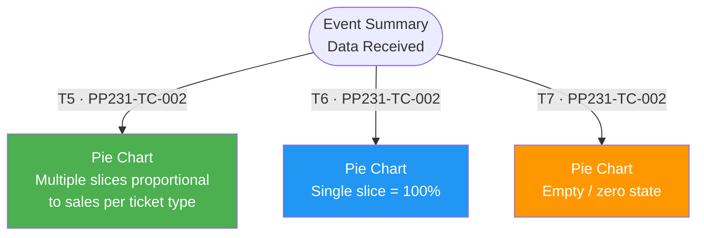
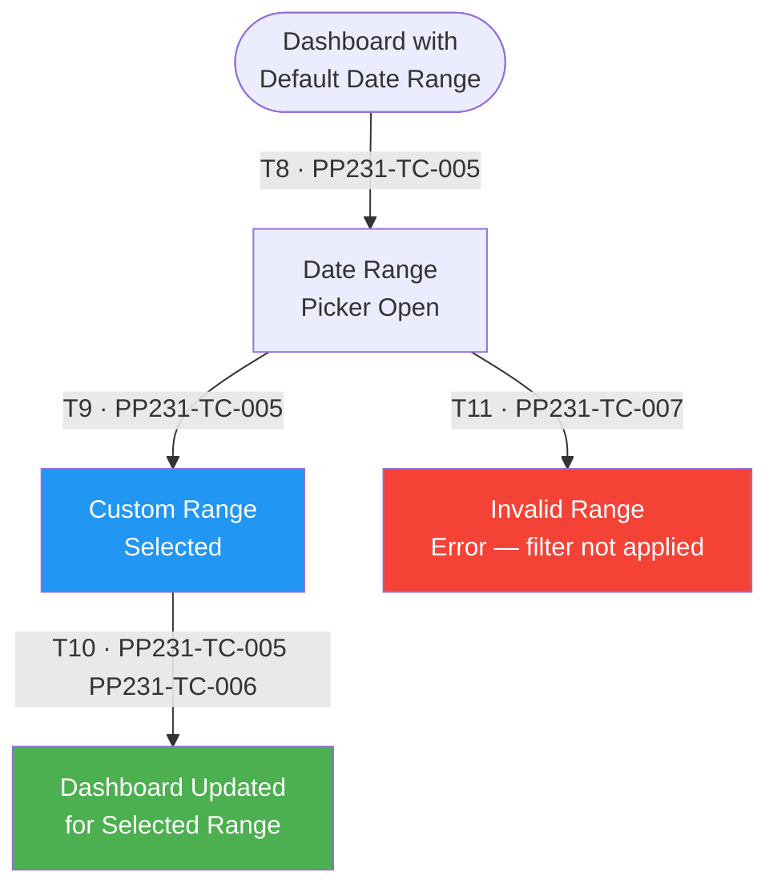
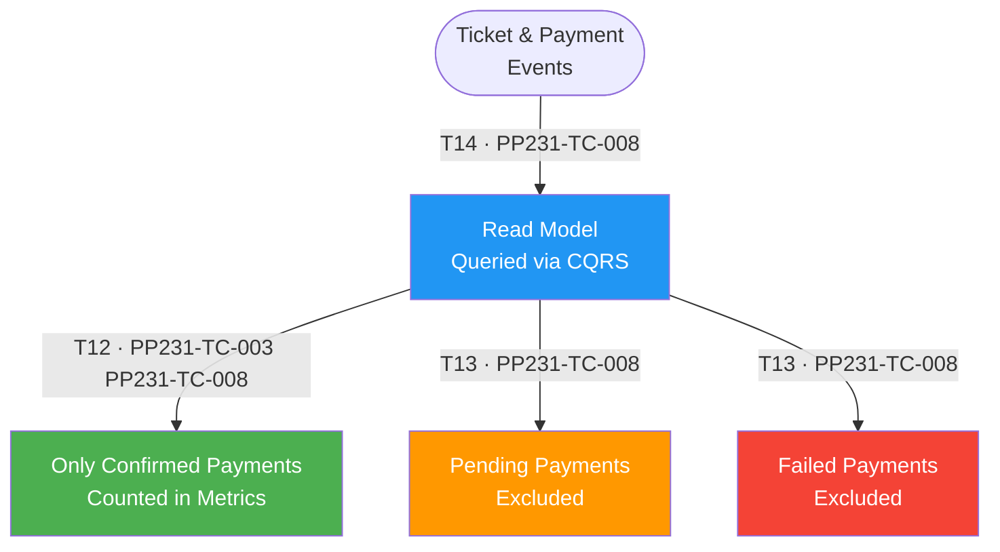

# PP-231 · [BO][Organizer] Organizer Dashboard (Event Detail Dashboard) — Flow Diagram

> Requirements → [PP-231_Organizer_Dashboard.md](../requirements/PP-231_Organizer_Dashboard/PP-231_Organizer_Dashboard.md)
> Jira → [PP-231](https://7-solutions.atlassian.net/browse/PP-231)
> Figma → [App UI Design node 228-1338](https://www.figma.com/design/PKyOOKQydjB98nVMOOyxy4/-PP--App-UI-Design?node-id=228-1338)
> Test Design → [PP-231.design.md](./PP-231.design.md)

---

## Master Flow

---

## Sub-Flow 1: Dashboard Metrics Display (AC1)

### State & Transition Reference

| Ref ID | Type | Label |
|--------|------|-------|
| S1 | State | Dashboard page loading |
| S2 | State | Event Summary API call in-flight |
| S3 | State | Pie Chart rendered — ticket type distribution |
| S4 | State | Summary metrics rendered (Revenue, Sold, Participants) |
| S5 | State | Ticket Metrics table rendered (per ticket type) |
| S6 | State | API error — dashboard not loaded |
| T1 | Transition | Organizer navigates to dashboard |
| T2 | Transition | API returns event summary data |
| T3 | Transition | API returns ticket metrics data |
| T4 | Transition | API fails — error state |

---

## Sub-Flow 2: Pie Chart — Ticket Type Distribution (AC1.1)

### State & Transition Reference

| Ref ID | Type | Label |
|--------|------|-------|
| S7 | State | Pie Chart with multiple ticket types |
| S8 | State | Pie Chart with single ticket type (100% slice) |
| S9 | State | Pie Chart with no sold tickets (empty state) |
| T5 | Transition | Multiple ticket types sold — proportional slices |
| T6 | Transition | Only one ticket type sold |
| T7 | Transition | No tickets sold — empty chart |

---

## Sub-Flow 3: Filtering & Date Range (AC2)

### State & Transition Reference

| Ref ID | Type | Label |
|--------|------|-------|
| S10 | State | Default date range displayed (all time / event period) |
| S11 | State | Date range picker open |
| S12 | State | Custom date range selected |
| S13 | State | Dashboard data refreshed for selected range |
| S14 | State | Invalid date range selected (end before start) |
| T8 | Transition | Organizer opens date range filter |
| T9 | Transition | Valid date range confirmed |
| T10 | Transition | Dashboard data re-fetched and updated |
| T11 | Transition | Invalid date range — filter rejected |

---

## Sub-Flow 4: Data Accuracy & CQRS (AC3)

### State & Transition Reference

| Ref ID | Type | Label |
|--------|------|-------|
| S15 | State | Dashboard shows only confirmed-payment tickets |
| S16 | State | Pending payment tickets excluded from metrics |
| S17 | State | Failed payment tickets excluded from metrics |
| S18 | State | Read Model queried (CQRS — separate from write path) |
| T12 | Transition | Only payment_status = confirmed counted in metrics |
| T13 | Transition | Pending/failed payments not reflected in revenue or sold count |
| T14 | Transition | Metrics served from Read Model (event-sourced projection) |

---

## State & Transition Coverage Summary

| Ref ID | Type | Label | Covered By TC |
|--------|------|-------|---------------|
| S1 | State | Dashboard page loading | PP231-TC-001 |
| S2 | State | Event Summary API call in-flight | PP231-TC-001–PP231-TC-005 |
| S3 | State | Pie Chart rendered | PP231-TC-001 PP231-TC-002 |
| S4 | State | Summary metrics rendered | PP231-TC-001 PP231-TC-003 |
| S5 | State | Ticket Metrics table rendered | PP231-TC-001 PP231-TC-004 |
| S6 | State | API error — dashboard not loaded | PP231-TC-009 |
| S7 | State | Pie Chart with multiple ticket types | PP231-TC-002 |
| S8 | State | Pie Chart with single ticket type | PP231-TC-002 |
| S9 | State | Pie Chart with no sold tickets (empty) | PP231-TC-002 |
| S10 | State | Default date range displayed | PP231-TC-001 PP231-TC-005 |
| S11 | State | Date range picker open | PP231-TC-005 PP231-TC-007 |
| S12 | State | Custom date range selected | PP231-TC-005 PP231-TC-006 |
| S13 | State | Dashboard data refreshed for selected range | PP231-TC-005 PP231-TC-006 |
| S14 | State | Invalid date range — filter rejected | PP231-TC-007 |
| S15 | State | Only confirmed-payment tickets in metrics | PP231-TC-003 PP231-TC-008 |
| S16 | State | Pending payments excluded | PP231-TC-008 |
| S17 | State | Failed payments excluded | PP231-TC-008 |
| S18 | State | Read Model queried (CQRS) | PP231-TC-008 |
| T1 | Transition | Organizer navigates to dashboard | PP231-TC-001 |
| T2 | Transition | API returns event summary data | PP231-TC-001–PP231-TC-004 |
| T3 | Transition | API returns ticket metrics data | PP231-TC-001 PP231-TC-004 |
| T4 | Transition | API fails — error state | PP231-TC-009 |
| T5 | Transition | Multiple ticket types sold | PP231-TC-002 |
| T6 | Transition | Single ticket type sold | PP231-TC-002 |
| T7 | Transition | No tickets sold — empty chart | PP231-TC-002 |
| T8 | Transition | Organizer opens date range filter | PP231-TC-005 PP231-TC-007 |
| T9 | Transition | Valid date range confirmed | PP231-TC-005 PP231-TC-006 |
| T10 | Transition | Dashboard data re-fetched and updated | PP231-TC-005 PP231-TC-006 |
| T11 | Transition | Invalid date range — filter rejected | PP231-TC-007 |
| T12 | Transition | Only confirmed payments counted | PP231-TC-003 PP231-TC-008 |
| T13 | Transition | Pending/failed payments excluded | PP231-TC-008 |
| T14 | Transition | Read Model queried (CQRS) | PP231-TC-008 |
