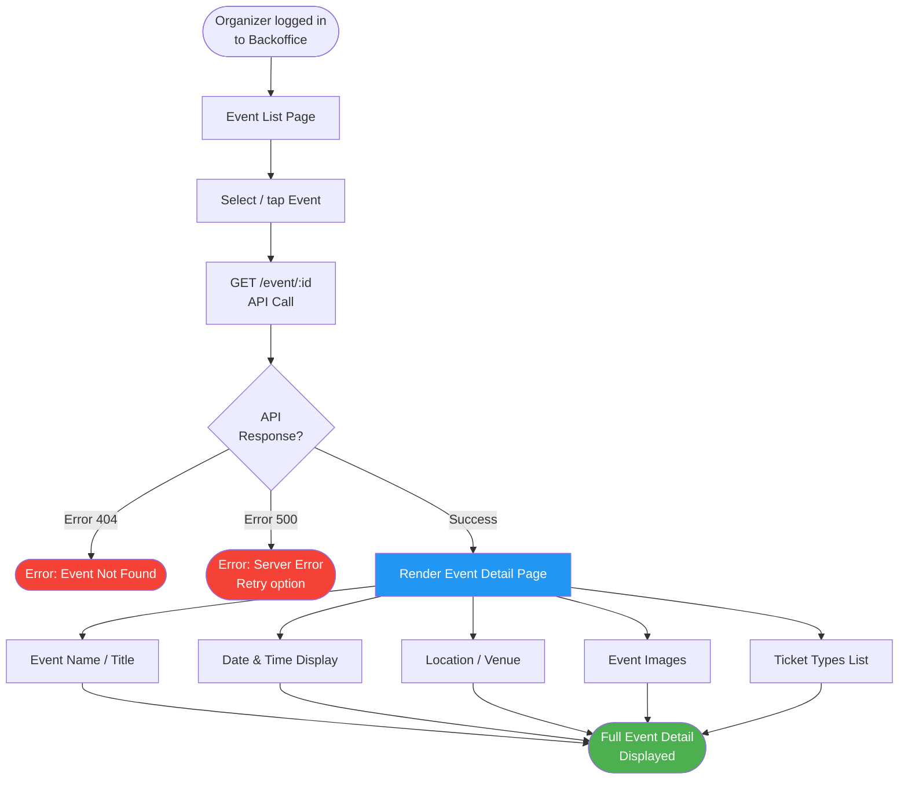
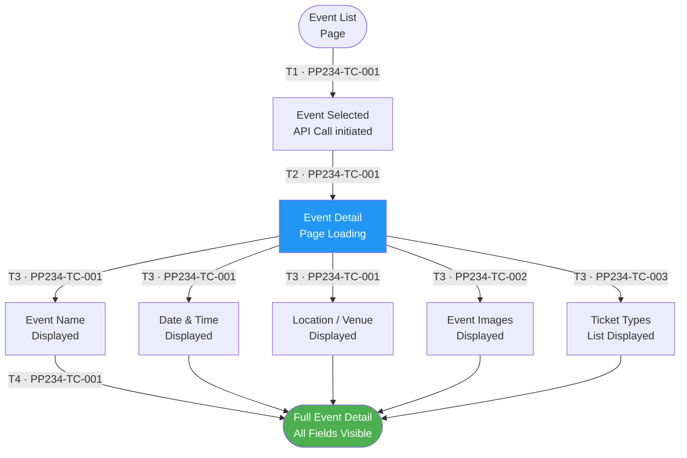
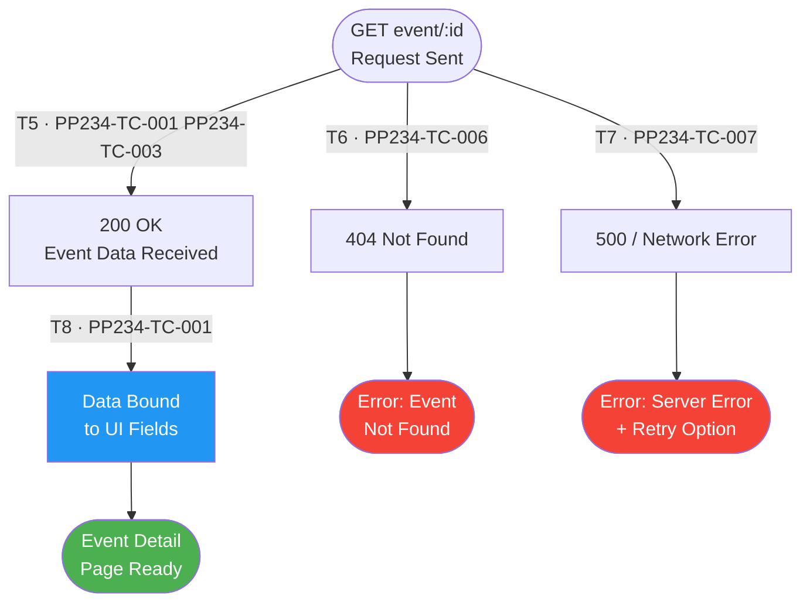
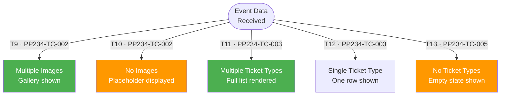
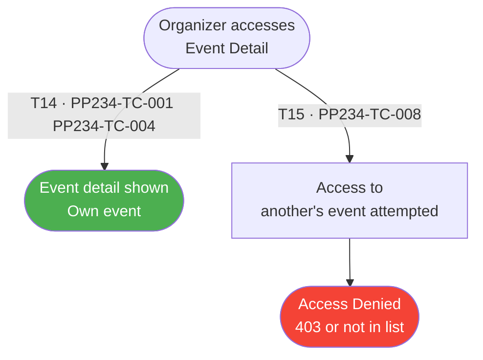

# PP-234 · [BO][Organizer] Organizer Event Detail — Flow Diagram

> Requirements → [PP-234_Organizer_Event_Detail.md](../requirements/PP-234_Organizer_Event_Detail/PP-234_Organizer_Event_Detail.md)
> Jira → [PP-234](https://7-solutions.atlassian.net/browse/PP-234)
> Figma → [App UI Design](https://www.figma.com/design/PKyOOKQydjB98nVMOOyxy4/-PP--App-UI-Design)
> Test Design → [PP-234.design.md](./PP-234.design.md)

---

## Master Flow

---

## Sub-Flow 1: Event Detail Information Display (AC1.1)

### State & Transition Reference

| Ref ID | Type | Label |
|--------|------|-------|
| S1 | State | Organizer on Event List page |
| S2 | State | Event selected — API call initiated |
| S3 | State | Event Detail page loading |
| S4 | State | Event Name displayed |
| S5 | State | Date & Time displayed |
| S6 | State | Location / Venue displayed |
| S7 | State | Event images displayed |
| S8 | State | Ticket Types list displayed |
| S9 | State | All event detail information visible |
| T1 | Transition | Organizer selects event from list |
| T2 | Transition | API call initiated |
| T3 | Transition | API returns event data — page renders |
| T4 | Transition | All detail components mounted |

---

## Sub-Flow 2: API Integration (AC1.2)

### State & Transition Reference

| Ref ID | Type | Label |
|--------|------|-------|
| S10 | State | GET /event/:id request sent |
| S11 | State | Response 200 — event data received |
| S12 | State | Response 404 — event not found |
| S13 | State | Response 500 / network error |
| S14 | State | Event data bound to UI fields |
| S15 | State | Error page shown — event not found |
| S16 | State | Error page shown — server error with retry |
| T5 | Transition | Valid event ID → 200 OK |
| T6 | Transition | Invalid or deleted event ID → 404 |
| T7 | Transition | Server error → 500 or network timeout |
| T8 | Transition | Bind API response data to UI |

---

## Sub-Flow 3: Field-by-Field Content Validation

### State & Transition Reference

| Ref ID | Type | Label |
|--------|------|-------|
| S17 | State | Event has multiple images |
| S18 | State | Event has no images — placeholder shown |
| S19 | State | Event has multiple ticket types |
| S20 | State | Event has a single ticket type |
| S21 | State | Event has no ticket types defined |
| T9 | Transition | Event images exist → gallery rendered |
| T10 | Transition | No images → placeholder/fallback shown |
| T11 | Transition | Multiple ticket types → full list rendered |
| T12 | Transition | Single ticket type → single row |
| T13 | Transition | No ticket types → empty state shown |

---

## Sub-Flow 4: Data Freshness — Organizer Sees Own Event Only

### State & Transition Reference

| Ref ID | Type | Label |
|--------|------|-------|
| S22 | State | Organizer accesses their own event |
| S23 | State | Correct event data displayed (ownership validated) |
| S24 | State | Organizer attempts to access another organizer's event |
| S25 | State | Access denied / 403 or not visible in list |
| T14 | Transition | Event belongs to authenticated Organizer |
| T15 | Transition | Event belongs to another Organizer |

---

## State & Transition Coverage Summary

| Ref ID | Type | Label | Covered By TC |
|--------|------|-------|---------------|
| S1 | State | Organizer on Event List page | PP234-TC-001–PP234-TC-008 |
| S2 | State | Event selected — API call initiated | PP234-TC-001–PP234-TC-003 PP234-TC-006 PP234-TC-007 |
| S3 | State | Event Detail page loading | PP234-TC-001–PP234-TC-003 |
| S4 | State | Event Name displayed | PP234-TC-001 |
| S5 | State | Date & Time displayed | PP234-TC-001 |
| S6 | State | Location / Venue displayed | PP234-TC-001 |
| S7 | State | Event images displayed | PP234-TC-002 |
| S8 | State | Ticket Types list displayed | PP234-TC-003 |
| S9 | State | Full event detail all fields visible | PP234-TC-001 |
| S10 | State | GET /event/:id request sent | PP234-TC-001–PP234-TC-003 PP234-TC-006 PP234-TC-007 |
| S11 | State | Response 200 — event data received | PP234-TC-001–PP234-TC-004 |
| S12 | State | Response 404 — event not found | PP234-TC-006 |
| S13 | State | Response 500 / network error | PP234-TC-007 |
| S14 | State | Event data bound to UI fields | PP234-TC-001 |
| S15 | State | Error page — event not found | PP234-TC-006 |
| S16 | State | Error page — server error with retry | PP234-TC-007 |
| S17 | State | Event has multiple images — gallery | PP234-TC-002 |
| S18 | State | Event has no images — placeholder | PP234-TC-002 |
| S19 | State | Multiple ticket types — full list | PP234-TC-003 |
| S20 | State | Single ticket type — one row | PP234-TC-003 |
| S21 | State | No ticket types — empty state | PP234-TC-005 |
| S22 | State | Organizer accesses their own event | PP234-TC-001 PP234-TC-004 |
| S23 | State | Correct event data displayed | PP234-TC-001 PP234-TC-004 |
| S24 | State | Another organizer's event attempted | PP234-TC-008 |
| S25 | State | Access denied / 403 | PP234-TC-008 |
| T1 | Transition | Organizer selects event from list | PP234-TC-001–PP234-TC-003 |
| T2 | Transition | API call initiated | PP234-TC-001–PP234-TC-003 PP234-TC-006 PP234-TC-007 |
| T3 | Transition | API returns event data — page renders | PP234-TC-001–PP234-TC-004 |
| T4 | Transition | All detail components mounted | PP234-TC-001 |
| T5 | Transition | Valid event ID → 200 OK | PP234-TC-001–PP234-TC-004 |
| T6 | Transition | Invalid event ID → 404 | PP234-TC-006 |
| T7 | Transition | Server error → 500 / timeout | PP234-TC-007 |
| T8 | Transition | Bind API response data to UI | PP234-TC-001 |
| T9 | Transition | Images exist → gallery rendered | PP234-TC-002 |
| T10 | Transition | No images → placeholder | PP234-TC-002 |
| T11 | Transition | Multiple ticket types → list | PP234-TC-003 |
| T12 | Transition | Single ticket type → one row | PP234-TC-003 |
| T13 | Transition | No ticket types → empty state | PP234-TC-005 |
| T14 | Transition | Event belongs to Organizer | PP234-TC-001 PP234-TC-004 |
| T15 | Transition | Event belongs to another Organizer | PP234-TC-008 |
