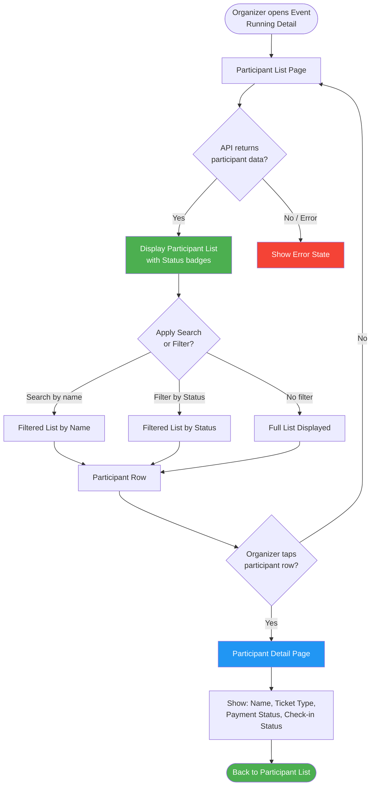
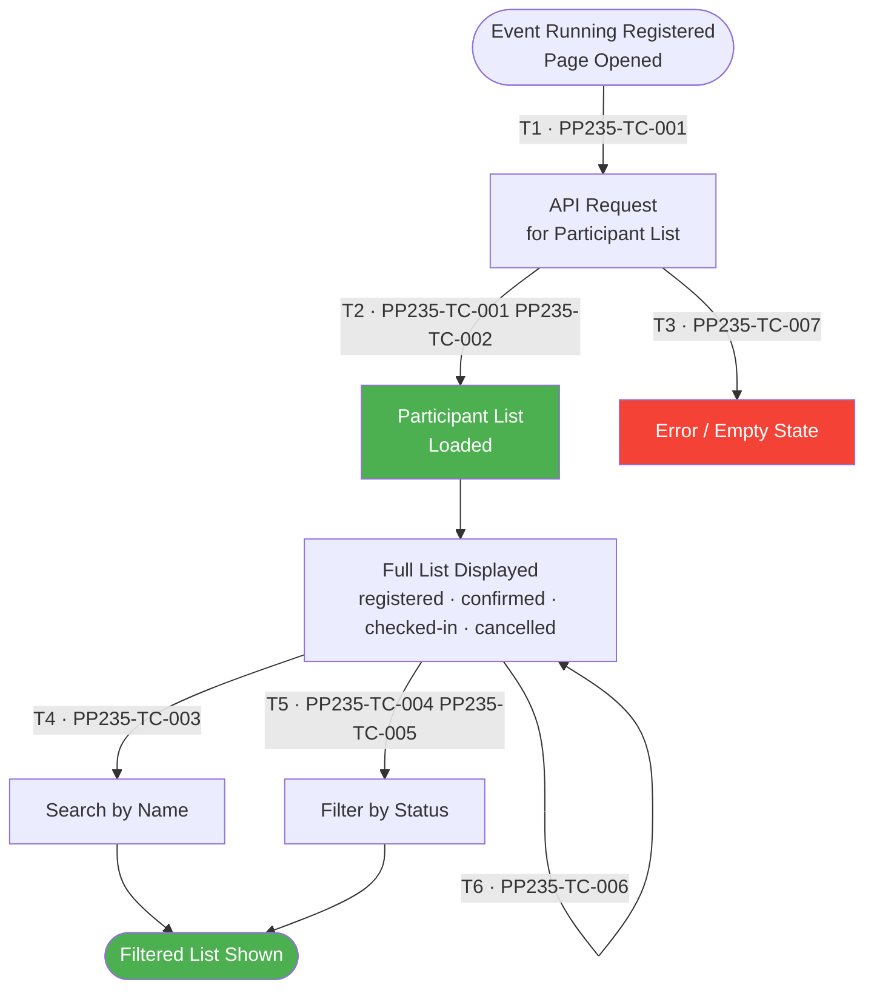
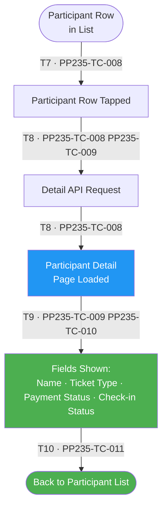

# PP-235 · [BO][Organizer] Event Running Registered — Flow Diagram

> Requirements → [PP-235_Event_Running_Registered.md](../requirements/PP-235_Event_Running_Registered/PP-235_Event_Running_Registered.md)
> Jira → [PP-235](https://7-solutions.atlassian.net/browse/PP-235)
> Figma → [App UI Design](https://www.figma.com/design/PKyOOKQydjB98nVMOOyxy4/-PP--App-UI-Design)
> Test Design → [PP-235.design.md](./PP-235.design.md)

---

## Master Flow

---

## Sub-Flow 1: Participant List Display (AC1.1 / AC1.2)

### State & Transition Reference

| Ref ID | Type  | Label |
|--------|-------|-------|
| S1  | State      | Organizer navigates to Event Running Registered page |
| S2  | State      | API request sent for participant list |
| S3  | State      | Participant list loaded successfully |
| S4  | State      | Error state — API failure / empty data |
| S5  | State      | Full participant list displayed (all statuses) |
| S6  | State      | Search input active |
| S7  | State      | Filter by Status active |
| S8  | State      | Filtered participant list displayed |
| T1  | Transition | Page navigated to |
| T2  | Transition | API responds 200 with participant data |
| T3  | Transition | API error or no data returned |
| T4  | Transition | Organizer types search keyword |
| T5  | Transition | Organizer selects status filter |
| T6  | Transition | Filter/search cleared — full list restored |

---

## Sub-Flow 2: Participant Detail (AC2.1 / AC2.2)

### State & Transition Reference

| Ref ID | Type  | Label |
|--------|-------|-------|
| S9  | State      | Participant row visible in list |
| S10 | State      | Organizer taps participant row |
| S11 | State      | Participant Detail API request sent |
| S12 | State      | Participant Detail page loaded |
| S13 | State      | Detail fields rendered: Name, Ticket Type, Payment Status, Check-in Status |
| S14 | State      | Organizer navigates back to participant list |
| T7  | Transition | Tap participant row |
| T8  | Transition | Detail API responds with participant data |
| T9  | Transition | Detail fields verified |
| T10 | Transition | Back navigation |

---

## State & Transition Coverage Summary

| Ref ID | Type       | Label                                           | Covered By TC                      |
|--------|-----------|-------------------------------------------------|------------------------------------|
| S1     | State      | Event Running Registered page opened            | PP235-TC-001                       |
| S2     | State      | API request sent for participant list           | PP235-TC-001 PP235-TC-007          |
| S3     | State      | Participant list loaded successfully            | PP235-TC-001–PP235-TC-006          |
| S4     | State      | Error / empty state                             | PP235-TC-007                       |
| S5     | State      | Full participant list displayed                 | PP235-TC-001 PP235-TC-002          |
| S6     | State      | Search by name active                           | PP235-TC-003                       |
| S7     | State      | Filter by status active                         | PP235-TC-004 PP235-TC-005          |
| S8     | State      | Filtered list displayed                         | PP235-TC-003–PP235-TC-006          |
| S9     | State      | Participant row visible in list                 | PP235-TC-008                       |
| S10    | State      | Organizer taps participant row                  | PP235-TC-008                       |
| S11    | State      | Participant detail API request sent             | PP235-TC-008 PP235-TC-009          |
| S12    | State      | Participant detail page loaded                  | PP235-TC-008–PP235-TC-011          |
| S13    | State      | Detail fields rendered                          | PP235-TC-009 PP235-TC-010          |
| S14    | State      | Back to participant list                        | PP235-TC-011                       |
| T1     | Transition | Page navigated to                               | PP235-TC-001                       |
| T2     | Transition | API responds 200 with participant data          | PP235-TC-001 PP235-TC-002          |
| T3     | Transition | API error or no data                            | PP235-TC-007                       |
| T4     | Transition | Search by name typed                            | PP235-TC-003                       |
| T5     | Transition | Status filter selected                          | PP235-TC-004 PP235-TC-005          |
| T6     | Transition | Filter cleared — full list restored             | PP235-TC-006                       |
| T7     | Transition | Tap participant row                             | PP235-TC-008                       |
| T8     | Transition | Detail API responds with data                   | PP235-TC-008 PP235-TC-009          |
| T9     | Transition | Detail fields verified                          | PP235-TC-009 PP235-TC-010          |
| T10    | Transition | Back navigation                                 | PP235-TC-011                       |
