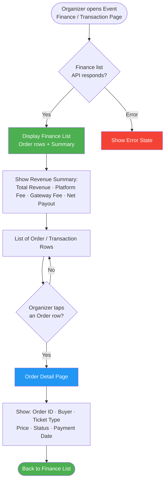
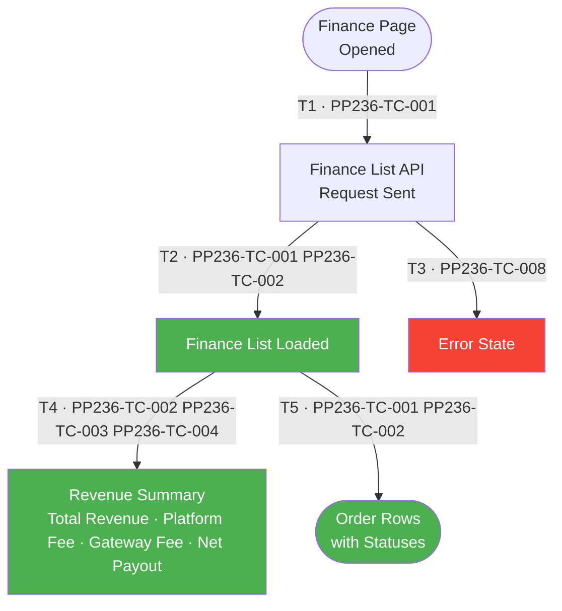
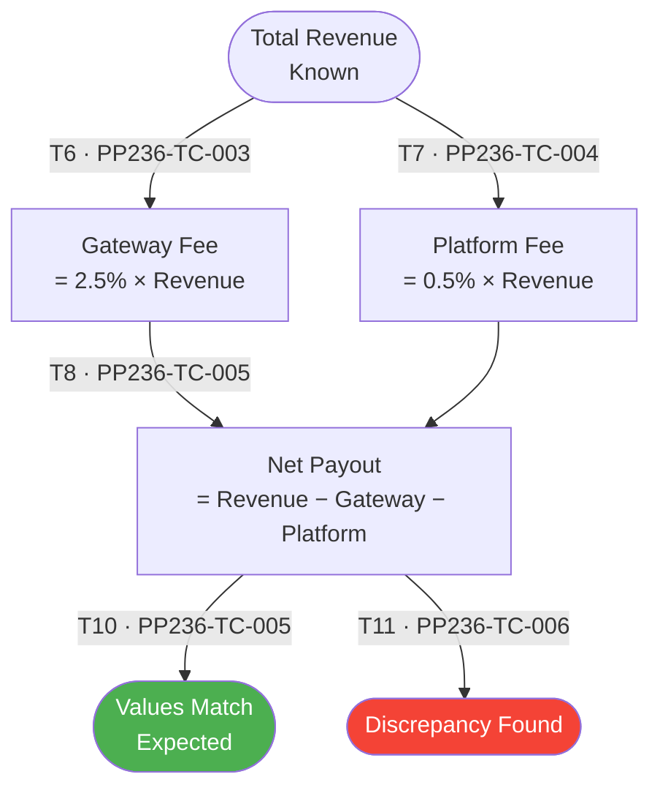
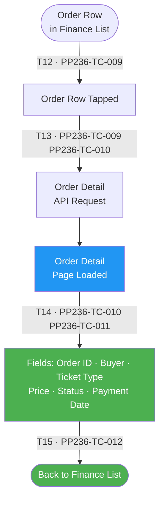

# PP-236 · [BO][Organizer] Transaction & Payment (Finance Page) — Flow Diagram

> Requirements → [PP-236_Transaction_Payment.md](../requirements/PP-236_Transaction_Payment/PP-236_Transaction_Payment.md)
> Jira → [PP-236](https://7-solutions.atlassian.net/browse/PP-236)
> Figma → [App UI Design](https://www.figma.com/design/PKyOOKQydjB98nVMOOyxy4/-PP--App-UI-Design)
> Test Design → [PP-236.design.md](./PP-236.design.md)

---

## Master Flow

---

## Sub-Flow 1: Finance List Display (AC1.1 / AC1.2)

### State & Transition Reference

| Ref ID | Type  | Label |
|--------|-------|-------|
| S1  | State      | Organizer navigates to Finance page |
| S2  | State      | Finance list API request sent |
| S3  | State      | Finance list loaded — order rows visible |
| S4  | State      | Error state — API failure |
| S5  | State      | Revenue summary rendered (Total Revenue, Fees, Net Payout) |
| S6  | State      | Order rows with status labels displayed |
| T1  | Transition | Navigate to finance page |
| T2  | Transition | API responds 200 with finance data |
| T3  | Transition | API error / timeout |
| T4  | Transition | Summary section rendered |
| T5  | Transition | Order rows rendered |

---

## Sub-Flow 2: Fee Calculation Verification (AC3.1 / AC3.2 / AC3.3)

### State & Transition Reference

| Ref ID | Type  | Label |
|--------|-------|-------|
| S7  | State      | Total Revenue known |
| S8  | State      | Gateway Fee calculated (2.5% of Total Revenue) |
| S9  | State      | Platform Fee calculated (0.5% of Total Revenue) |
| S10 | State      | Net Payout calculated (Total Revenue − Gateway Fee − Platform Fee) |
| S11 | State      | Displayed values match expected calculations |
| S12 | State      | Displayed values do not match — discrepancy |
| T6  | Transition | Revenue value confirmed from API |
| T7  | Transition | Gateway Fee = 2.5% × Revenue |
| T8  | Transition | Platform Fee = 0.5% × Revenue |
| T9  | Transition | Net Payout = Revenue − Gateway − Platform |
| T10 | Transition | UI values verified correct |
| T11 | Transition | UI values differ from expected — bug |

---

## Sub-Flow 3: Order Detail (AC2.1 / AC2.2)

### State & Transition Reference

| Ref ID | Type  | Label |
|--------|-------|-------|
| S13 | State      | Order row visible in finance list |
| S14 | State      | Organizer taps Order row |
| S15 | State      | Order Detail API request sent |
| S16 | State      | Order Detail page loaded |
| S17 | State      | Order fields rendered: Order ID, Buyer, Ticket Type, Price, Status, Payment Date |
| S18 | State      | Organizer navigates back to finance list |
| T12 | Transition | Tap order row |
| T13 | Transition | Order Detail API responds |
| T14 | Transition | Fields verified |
| T15 | Transition | Back navigation |

---

## State & Transition Coverage Summary

| Ref ID | Type       | Label                                                    | Covered By TC                       |
|--------|------------|----------------------------------------------------------|-------------------------------------|
| S1     | State      | Finance page opened                                      | PP236-TC-001                        |
| S2     | State      | Finance list API request sent                            | PP236-TC-001 PP236-TC-008           |
| S3     | State      | Finance list loaded                                      | PP236-TC-001–PP236-TC-007           |
| S4     | State      | Error state                                              | PP236-TC-008                        |
| S5     | State      | Revenue summary rendered                                 | PP236-TC-002–PP236-TC-005           |
| S6     | State      | Order rows with statuses displayed                       | PP236-TC-001 PP236-TC-002           |
| S7     | State      | Total revenue known                                      | PP236-TC-003–PP236-TC-005           |
| S8     | State      | Gateway Fee calculated (2.5%)                            | PP236-TC-003                        |
| S9     | State      | Platform Fee calculated (0.5%)                           | PP236-TC-004                        |
| S10    | State      | Net Payout calculated                                    | PP236-TC-005                        |
| S11    | State      | Displayed values match expected                          | PP236-TC-005                        |
| S12    | State      | Discrepancy found                                        | PP236-TC-006                        |
| S13    | State      | Order row visible in finance list                        | PP236-TC-009                        |
| S14    | State      | Organizer taps order row                                 | PP236-TC-009                        |
| S15    | State      | Order detail API request sent                            | PP236-TC-009 PP236-TC-010           |
| S16    | State      | Order detail page loaded                                 | PP236-TC-009–PP236-TC-012           |
| S17    | State      | Order fields rendered                                    | PP236-TC-010 PP236-TC-011           |
| S18    | State      | Back to finance list                                     | PP236-TC-012                        |
| T1     | Transition | Navigate to finance page                                 | PP236-TC-001                        |
| T2     | Transition | API responds 200 with finance data                       | PP236-TC-001 PP236-TC-002           |
| T3     | Transition | API error / timeout                                      | PP236-TC-008                        |
| T4     | Transition | Summary section rendered                                 | PP236-TC-002–PP236-TC-005           |
| T5     | Transition | Order rows rendered                                      | PP236-TC-001 PP236-TC-002           |
| T6     | Transition | Revenue value confirmed from API                         | PP236-TC-003                        |
| T7     | Transition | Gateway Fee = 2.5% × Revenue                             | PP236-TC-003                        |
| T8     | Transition | Platform Fee = 0.5% × Revenue                            | PP236-TC-004                        |
| T9     | Transition | Net Payout = Revenue − Gateway − Platform                | PP236-TC-005                        |
| T10    | Transition | UI values verified correct                               | PP236-TC-005                        |
| T11    | Transition | UI values differ — bug                                   | PP236-TC-006                        |
| T12    | Transition | Tap order row                                            | PP236-TC-009                        |
| T13    | Transition | Order Detail API responds                                | PP236-TC-009 PP236-TC-010           |
| T14    | Transition | Fields verified                                          | PP236-TC-010 PP236-TC-011           |
| T15    | Transition | Back navigation                                          | PP236-TC-012                        |
