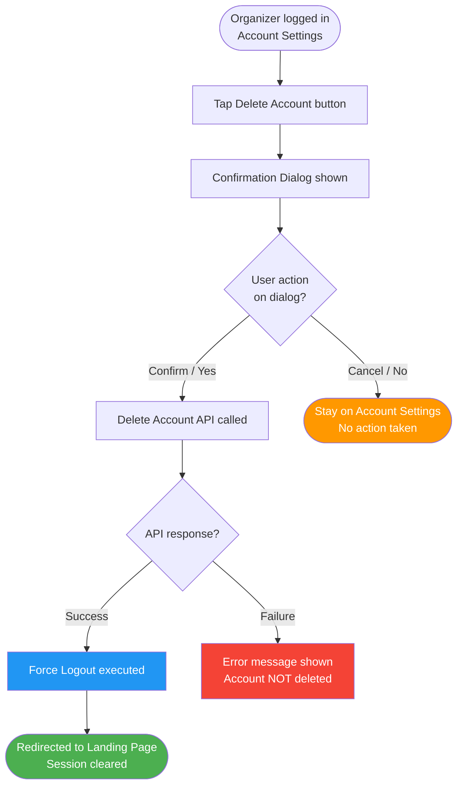
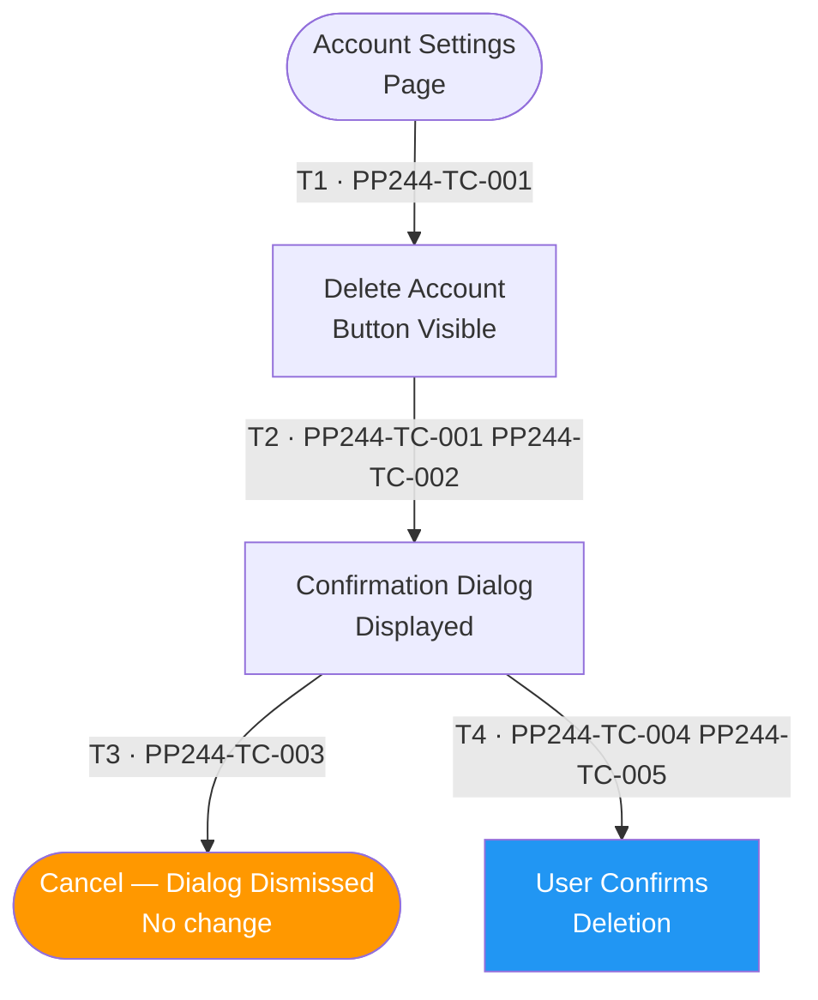
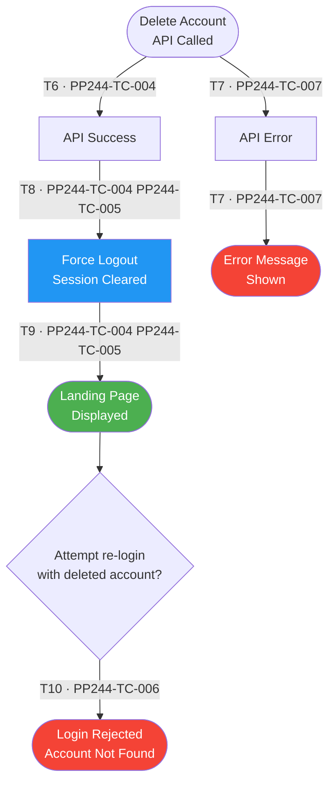

# PP-244 · [BO][Organizer] Delete Organizer Account — Flow Diagram

> Requirements → [PP-244_Delete_Organizer_Account.md](../requirements/PP-244_Delete_Organizer_Account/PP-244_Delete_Organizer_Account.md)
> Jira → [PP-244](https://7-solutions.atlassian.net/browse/PP-244)
> Figma → [App UI Design](https://www.figma.com/design/PKyOOKQydjB98nVMOOyxy4/-PP--App-UI-Design)
> Test Design → [PP-244.design.md](./PP-244.design.md)

---

## Master Flow

---

## Sub-Flow 1: Delete Account Confirmation Dialog (AC1.1 / AC1.2)

### State & Transition Reference

| Ref ID | Type  | Label |
|--------|-------|-------|
| S1  | State      | Organizer is on Account Settings page |
| S2  | State      | Delete Account button visible |
| S3  | State      | Confirmation Dialog displayed |
| S4  | State      | User cancels — dialog dismissed |
| S5  | State      | User confirms — deletion initiated |
| T1  | Transition | Tap Delete Account button |
| T2  | Transition | Confirmation dialog appears |
| T3  | Transition | User taps Cancel / No |
| T4  | Transition | User taps Confirm / Yes |

---

## Sub-Flow 2: Account Deletion and Force Logout (AC1.3)

### State & Transition Reference

| Ref ID | Type  | Label |
|--------|-------|-------|
| S6  | State      | Delete Account API request sent |
| S7  | State      | API responds with success |
| S8  | State      | API responds with error |
| S9  | State      | Force logout executed — session cleared |
| S10 | State      | Redirected to Landing Page |
| S11 | State      | Error message displayed — account not deleted |
| S12 | State      | Re-login attempt after deletion |
| S13 | State      | Re-login rejected — account does not exist |
| T5  | Transition | Deletion API called (after confirmation) |
| T6  | Transition | API returns 200 / success |
| T7  | Transition | API returns error (4xx / 5xx) |
| T8  | Transition | Force logout clears local session |
| T9  | Transition | Redirect to landing page |
| T10 | Transition | Attempt login with deleted account credentials |
| T11 | Transition | Login fails — account not found |

---

## State & Transition Coverage Summary

| Ref ID | Type       | Label                                              | Covered By TC                       |
|--------|------------|----------------------------------------------------|-------------------------------------|
| S1     | State      | Account Settings page                              | PP244-TC-001                        |
| S2     | State      | Delete Account button visible                      | PP244-TC-001 PP244-TC-002           |
| S3     | State      | Confirmation dialog displayed                      | PP244-TC-002 PP244-TC-003           |
| S4     | State      | Cancel — dialog dismissed, no change               | PP244-TC-003                        |
| S5     | State      | User confirms deletion                             | PP244-TC-004 PP244-TC-005           |
| S6     | State      | Delete account API request sent                    | PP244-TC-004 PP244-TC-007           |
| S7     | State      | API responds with success                          | PP244-TC-004 PP244-TC-005           |
| S8     | State      | API responds with error                            | PP244-TC-007                        |
| S9     | State      | Force logout executed                              | PP244-TC-004 PP244-TC-005           |
| S10    | State      | Landing page displayed                             | PP244-TC-004 PP244-TC-005           |
| S11    | State      | Error message displayed                            | PP244-TC-007                        |
| S12    | State      | Re-login attempt after deletion                    | PP244-TC-006                        |
| S13    | State      | Login rejected — account not found                 | PP244-TC-006                        |
| T1     | Transition | Tap Delete Account button                          | PP244-TC-001                        |
| T2     | Transition | Confirmation dialog appears                        | PP244-TC-001 PP244-TC-002           |
| T3     | Transition | User taps Cancel                                   | PP244-TC-003                        |
| T4     | Transition | User taps Confirm                                  | PP244-TC-004 PP244-TC-005           |
| T5     | Transition | Deletion API called                                | PP244-TC-004 PP244-TC-007           |
| T6     | Transition | API returns success                                | PP244-TC-004 PP244-TC-005           |
| T7     | Transition | API returns error                                  | PP244-TC-007                        |
| T8     | Transition | Force logout clears session                        | PP244-TC-004 PP244-TC-005           |
| T9     | Transition | Redirect to landing page                           | PP244-TC-004 PP244-TC-005           |
| T10    | Transition | Attempt login with deleted credentials             | PP244-TC-006                        |
| T11    | Transition | Login fails — account not found                    | PP244-TC-006                        |
