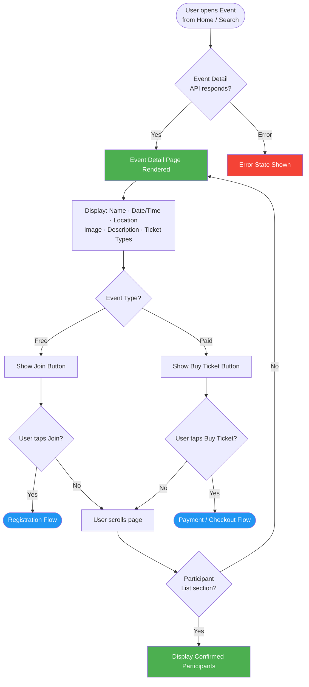
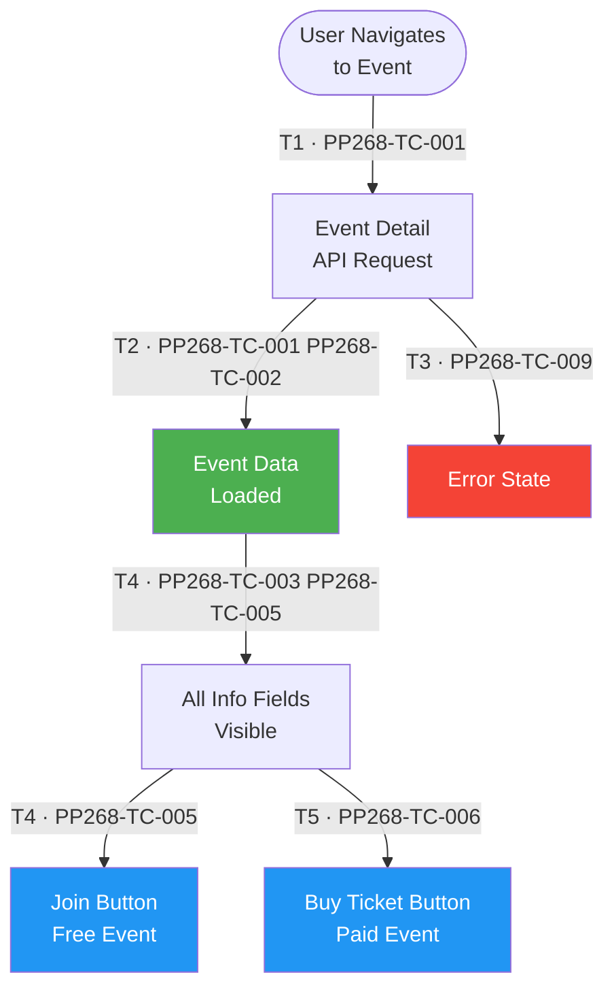
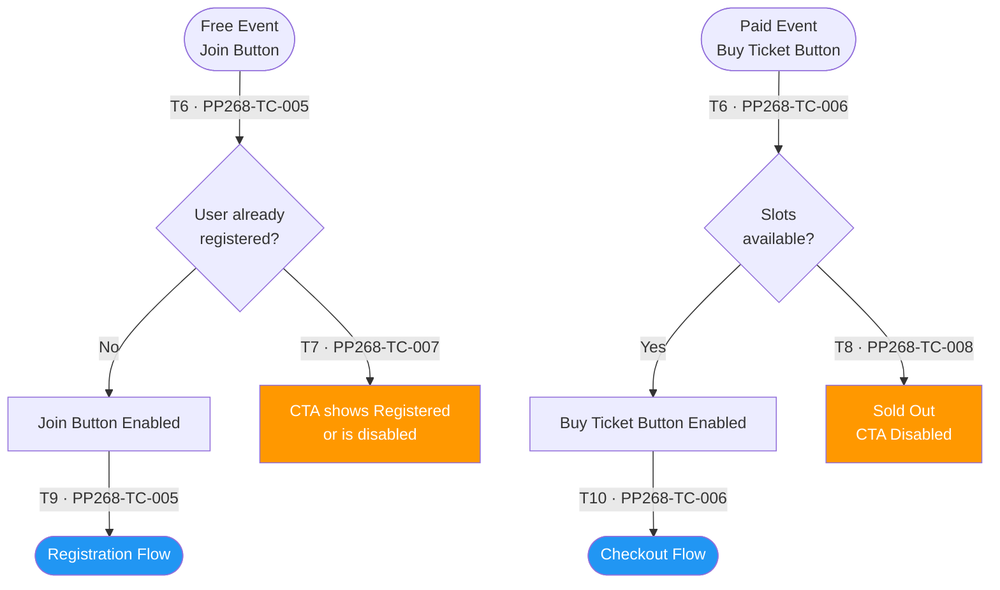
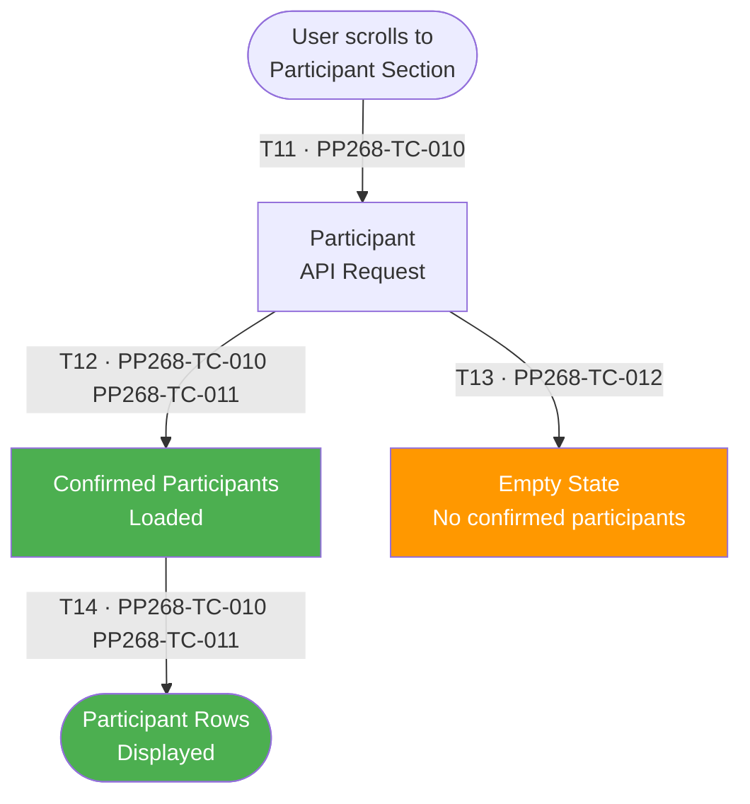

# PP-268 · [M-App][End-User] Event Detail (Mobile App) — Flow Diagram

> Requirements → [PP-268_Event_Detail_Mobile.md](../requirements/PP-268_Event_Detail_Mobile/PP-268_Event_Detail_Mobile.md)
> Jira → [PP-268](https://7-solutions.atlassian.net/browse/PP-268)
> Figma → [App UI Design](https://www.figma.com/design/PKyOOKQydjB98nVMOOyxy4/-PP--App-UI-Design)
> Test Design → [PP-268.design.md](./PP-268.design.md)

---

## Master Flow

---

## Sub-Flow 1: Event Detail Display (AC1.1 / AC1.2)

### State & Transition Reference

| Ref ID | Type  | Label |
|--------|-------|-------|
| S1  | State      | User navigates to Event Detail |
| S2  | State      | Event Detail API request sent |
| S3  | State      | Event data loaded — page rendered |
| S4  | State      | API error — event detail cannot load |
| S5  | State      | All event info fields visible (name, date/time, location, image, description, ticket types) |
| S6  | State      | CTA button shown — Join (Free event) |
| S7  | State      | CTA button shown — Buy Ticket (Paid event) |
| T1  | Transition | Navigate to event from home or search result |
| T2  | Transition | API responds 200 with event data |
| T3  | Transition | API error / timeout |
| T4  | Transition | Event type = Free → Join CTA |
| T5  | Transition | Event type = Paid → Buy Ticket CTA |

---

## Sub-Flow 2: CTA Button States (AC1.2)

### State & Transition Reference

| Ref ID | Type  | Label |
|--------|-------|-------|
| S8  | State      | Free event — Join button enabled |
| S9  | State      | Paid event — Buy Ticket button enabled |
| S10 | State      | User already registered — CTA disabled or shows "Registered" |
| S11 | State      | Event full / sold out — CTA disabled |
| S12 | State      | User taps Join → Registration flow starts |
| S13 | State      | User taps Buy Ticket → Checkout flow starts |
| T6  | Transition | User not registered, slots available → CTA enabled |
| T7  | Transition | User already registered → CTA state changes |
| T8  | Transition | Event capacity full → CTA disabled |
| T9  | Transition | Tap Join button |
| T10 | Transition | Tap Buy Ticket button |

---

## Sub-Flow 3: Participant List (AC2.1 / AC2.2)

### State & Transition Reference

| Ref ID | Type  | Label |
|--------|-------|-------|
| S14 | State      | User scrolls to participant section on Event Detail |
| S15 | State      | Participant list API request sent |
| S16 | State      | Confirmed participants list loaded |
| S17 | State      | Participant rows displayed (confirmed status only) |
| S18 | State      | Participant list is empty (no confirmed participants) |
| T11 | Transition | User scrolls to participant section |
| T12 | Transition | Participant API responds with confirmed participants |
| T13 | Transition | No confirmed participants — empty state |
| T14 | Transition | Rows rendered for each confirmed participant |

---

## State & Transition Coverage Summary

| Ref ID | Type       | Label                                                    | Covered By TC                        |
|--------|------------|----------------------------------------------------------|--------------------------------------|
| S1     | State      | User navigates to Event Detail                           | PP268-TC-001                         |
| S2     | State      | Event Detail API request sent                            | PP268-TC-001 PP268-TC-009            |
| S3     | State      | Event data loaded — page rendered                        | PP268-TC-001–PP268-TC-008            |
| S4     | State      | API error — event detail cannot load                     | PP268-TC-009                         |
| S5     | State      | All event info fields visible                            | PP268-TC-002 PP268-TC-003            |
| S6     | State      | Join button shown (Free event)                           | PP268-TC-005                         |
| S7     | State      | Buy Ticket button shown (Paid event)                     | PP268-TC-006                         |
| S8     | State      | Free event Join button                                   | PP268-TC-005 PP268-TC-007            |
| S9     | State      | Paid event Buy Ticket button                             | PP268-TC-006 PP268-TC-008            |
| S10    | State      | CTA shows Registered / disabled (already registered)     | PP268-TC-007                         |
| S11    | State      | Sold out — CTA disabled                                  | PP268-TC-008                         |
| S12    | State      | Registration flow starts                                 | PP268-TC-005                         |
| S13    | State      | Checkout flow starts                                     | PP268-TC-006                         |
| S14    | State      | User scrolls to participant section                      | PP268-TC-010                         |
| S15    | State      | Participant API request sent                             | PP268-TC-010–PP268-TC-012            |
| S16    | State      | Confirmed participants loaded                            | PP268-TC-010 PP268-TC-011            |
| S17    | State      | Participant rows displayed                               | PP268-TC-010 PP268-TC-011            |
| S18    | State      | Empty state — no confirmed participants                  | PP268-TC-012                         |
| T1     | Transition | Navigate to event                                        | PP268-TC-001                         |
| T2     | Transition | API responds 200 with event data                         | PP268-TC-001 PP268-TC-002            |
| T3     | Transition | API error / timeout                                      | PP268-TC-009                         |
| T4     | Transition | Free event → Join CTA                                    | PP268-TC-005                         |
| T5     | Transition | Paid event → Buy Ticket CTA                              | PP268-TC-006                         |
| T6     | Transition | Slots available → CTA enabled                            | PP268-TC-005 PP268-TC-006            |
| T7     | Transition | User already registered → CTA state changes              | PP268-TC-007                         |
| T8     | Transition | Event full → CTA disabled                                | PP268-TC-008                         |
| T9     | Transition | Tap Join button                                          | PP268-TC-005                         |
| T10    | Transition | Tap Buy Ticket button                                    | PP268-TC-006                         |
| T11    | Transition | User scrolls to participant section                      | PP268-TC-010                         |
| T12    | Transition | Participant API responds with confirmed participants      | PP268-TC-010 PP268-TC-011            |
| T13    | Transition | No confirmed participants — empty state                  | PP268-TC-012                         |
| T14    | Transition | Rows rendered for each confirmed participant             | PP268-TC-010 PP268-TC-011            |
