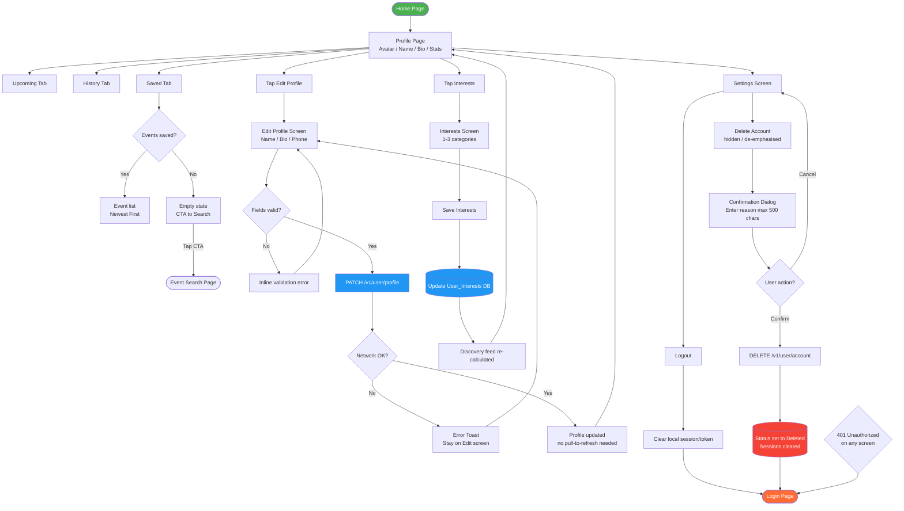
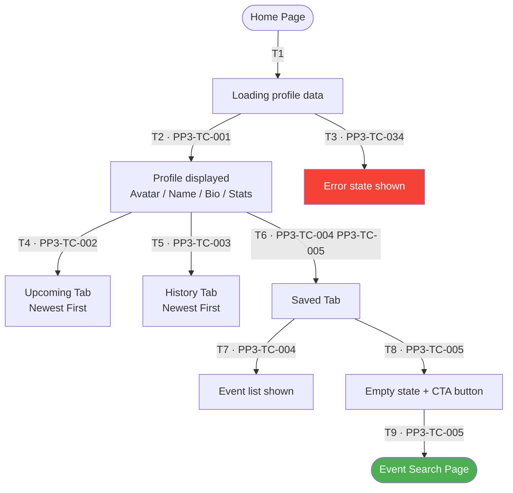
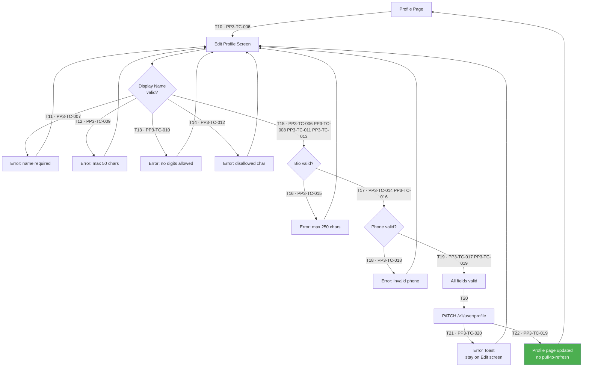
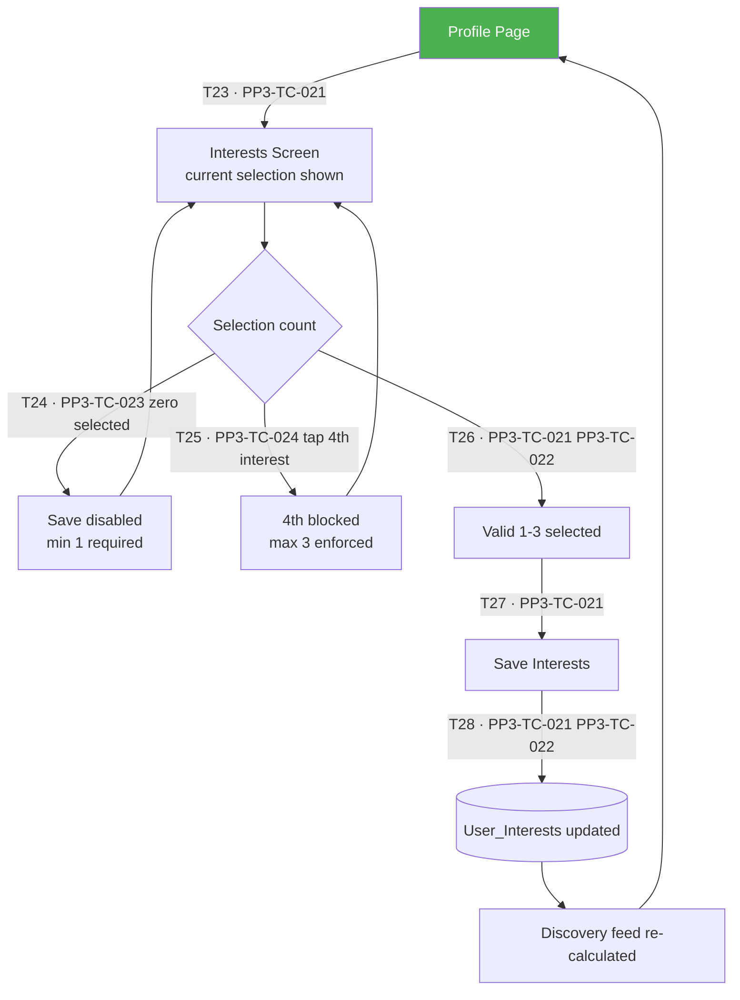
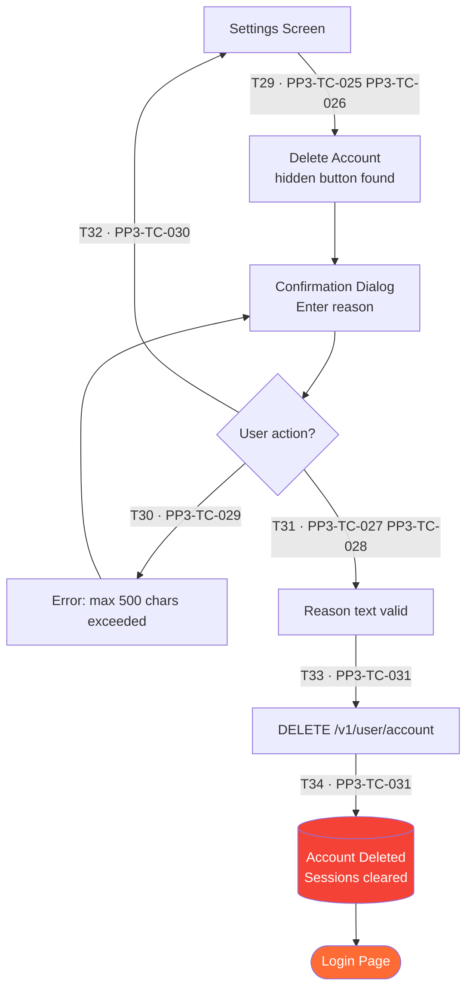
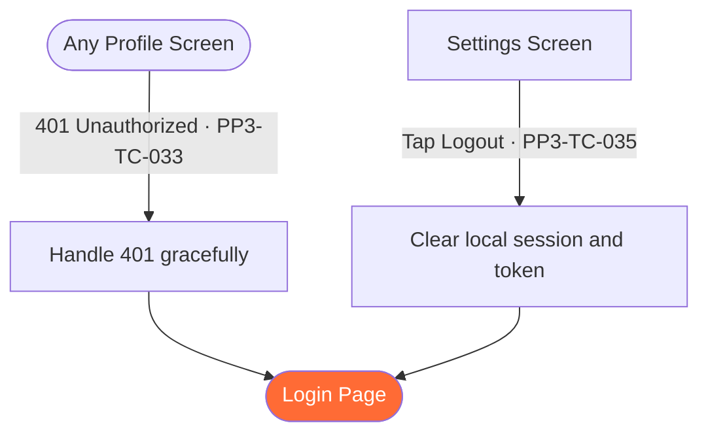

# PP-3 · User Profile & Account Settings — Flow Diagram

> Requirements → [PP-3_User_Profile_Account_Settings.md](../requirements/PP-3_User_Profile_Account_Settings.md)
> Jira → [PP-3](https://7-solutions.atlassian.net/browse/PP-3)
> Figma → [App UI Design node 1691-6015](https://www.figma.com/design/PKyOOKQydjB98nVMOOyxy4/-PP--App-UI-Design?node-id=1691-6015)
> Test Design → [PP-3.design.md](./PP-3.design.md)

---

## Master Flow

---

## Sub-Flow 1: View Profile & Activity Tabs

### State & Transition Reference

| Ref ID | Type | Label |
|---|---|---|
| S1 | State | Home Page |
| S2 | State | Profile Page (GET /v1/user/profile) |
| S3 | State | API loading |
| S4 | State | Profile data displayed (Avatar, Name, Bio, Stats) |
| S5 | State | Upcoming Tab |
| S6 | State | History Tab |
| S7 | State | Saved Tab |
| S8 | State | Saved tab — events exist |
| S9 | State | Saved tab — empty state with CTA |
| S10 | State | Event Search Page |
| T1 | Transition | Navigate to Profile |
| T2 | Transition | API returns data |
| T3 | Transition | API returns error / network fail |
| T4 | Transition | Tap Upcoming tab |
| T5 | Transition | Tap History tab |
| T6 | Transition | Tap Saved tab |
| T7 | Transition | Saved has events |
| T8 | Transition | Saved is empty |
| T9 | Transition | Tap CTA in empty Saved |

---

## Sub-Flow 2: Edit Profile

### State & Transition Reference

| Ref ID | Type | Label |
|---|---|---|
| S11 | State | Profile Page |
| S12 | State | Edit Profile Screen |
| S13 | State | Display Name validation |
| S14 | State | Name error — empty |
| S15 | State | Name error — exceeds 50 chars |
| S16 | State | Name error — contains digits |
| S17 | State | Name error — disallowed special char |
| S18 | State | Bio validation |
| S19 | State | Bio error — exceeds 250 chars |
| S20 | State | Phone validation |
| S21 | State | Phone error — invalid format |
| S22 | State | All fields valid |
| S23 | State | PATCH /v1/user/profile |
| S24 | State | Network error — Error Toast |
| S25 | State | Profile updated (no pull-to-refresh) |
| T10 | Transition | Tap Edit Profile |
| T11 | Transition | Name empty — error |
| T12 | Transition | Name over 50 chars — error |
| T13 | Transition | Name contains digit — error |
| T14 | Transition | Name has disallowed special char — error |
| T15 | Transition | Name valid |
| T16 | Transition | Bio over 250 chars — error |
| T17 | Transition | Bio valid |
| T18 | Transition | Phone invalid — error |
| T19 | Transition | Phone valid |
| T20 | Transition | Tap Save — all valid |
| T21 | Transition | Network failure during PATCH |
| T22 | Transition | PATCH success |

---

## Sub-Flow 3: Update Interests

### State & Transition Reference

| Ref ID | Type | Label |
|---|---|---|
| S26 | State | Profile Page |
| S27 | State | Interests Screen |
| S28 | State | Selection valid (1–3 interests) |
| S29 | State | Selection invalid (0 interests) |
| S30 | State | Save Interests |
| S31 | State | User_Interests DB updated |
| S32 | State | Discovery feed re-calculated |
| T23 | Transition | Tap Interests |
| T24 | Transition | Deselect all — below minimum |
| T25 | Transition | Select 4th interest — blocked |
| T26 | Transition | Valid selection (1–3) |
| T27 | Transition | Tap Save |
| T28 | Transition | DB update + feed re-calculation |

---

## Sub-Flow 4: Delete Account

### State & Transition Reference

| Ref ID | Type | Label |
|---|---|---|
| S33 | State | Settings Screen |
| S34 | State | Delete Account button (hidden) |
| S35 | State | Confirmation Dialog |
| S36 | State | Reason text valid (1–500 chars) |
| S37 | State | Reason text error (over 500 chars) |
| S38 | State | DELETE /v1/user/account |
| S39 | State | Account deleted — sessions cleared |
| S40 | State | Login Page |
| T29 | Transition | Tap Delete Account (hidden button) |
| T30 | Transition | Enter reason — over 500 chars |
| T31 | Transition | Enter reason — within limit |
| T32 | Transition | Cancel — return to Settings |
| T33 | Transition | Confirm — send DELETE request |
| T34 | Transition | DELETE success — clear sessions |

---

## Sub-Flow 5: Session Expiry & Logout

