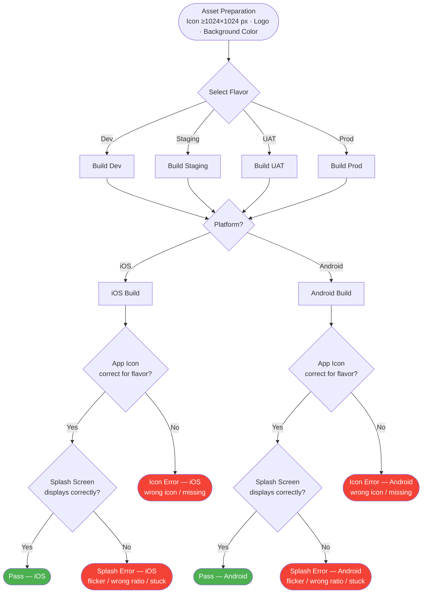
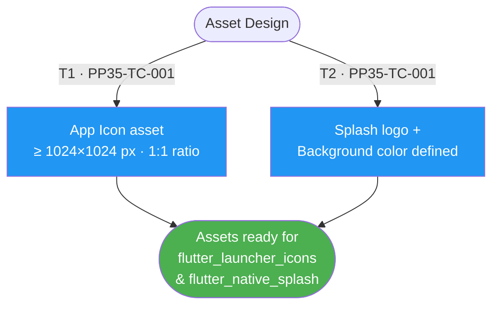
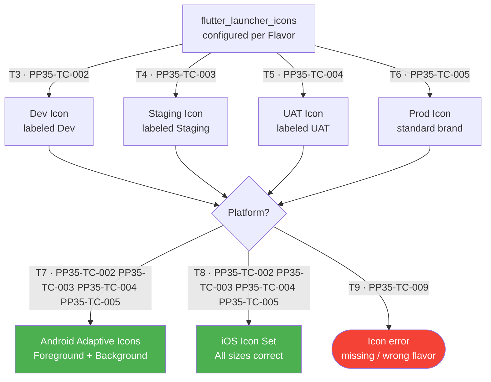
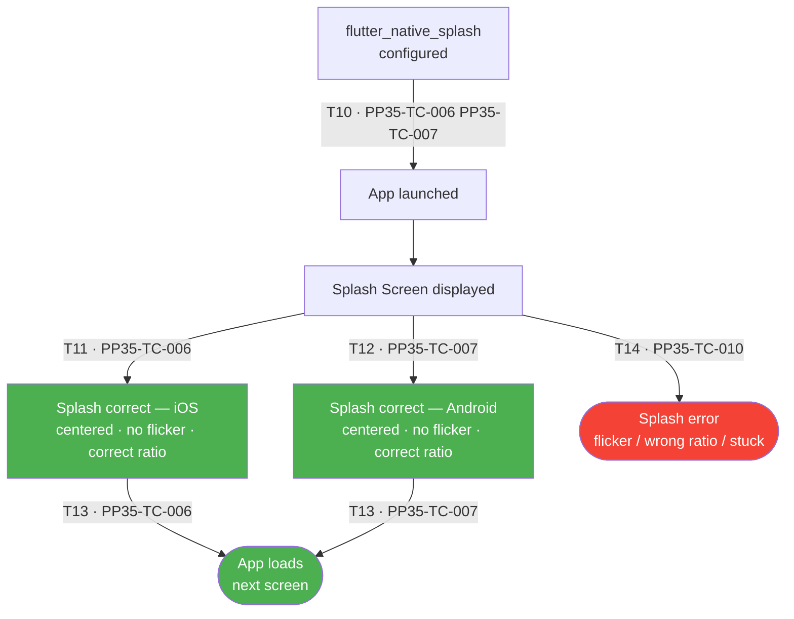
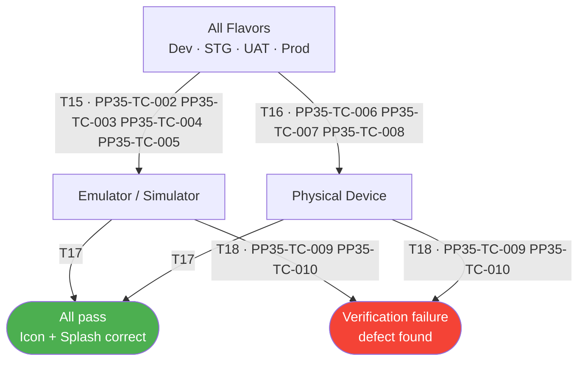

# PP-35 · App Visuals: AppIcon & Native Splash — Flow Diagram

> Requirements → [PP-35_App_Visuals_AppIcon_Native_Splash.md](../requirements/PP-35_App_Visuals_AppIcon_Native_Splash/PP-35_App_Visuals_AppIcon_Native_Splash.md)
> Jira → [PP-35](https://7-solutions.atlassian.net/browse/PP-35)
> Figma → [App UI Design](https://www.figma.com/design/PKyOOKQydjB98nVMOOyxy4/-PP--App-UI-Design)
> Test Design → [PP-35.design.md](./PP-35.design.md)

---

## Master Flow

---

## Sub-Flow 1: Asset Preparation (AC1)

### State & Transition Reference

| Ref ID | Type       | Label |
|--------|------------|-------|
| S1     | State      | App Icon source asset prepared (≥ 1024×1024 px, 1:1 ratio) |
| S2     | State      | Splash Screen logo and background color defined |
| S3     | State      | Assets ready for flutter_launcher_icons and flutter_native_splash |
| T1     | Transition | Designer provides icon asset meeting spec |
| T2     | Transition | Splash logo and background color confirmed |

---

## Sub-Flow 2: AppIcon Implementation — Multi-Flavor (AC2)

### State & Transition Reference

| Ref ID | Type       | Label |
|--------|------------|-------|
| S4     | State      | flutter_launcher_icons configured per Flavor |
| S5     | State      | Android Adaptive Icons generated (foreground + background) |
| S6     | State      | iOS icon set generated (all required sizes) |
| S7     | State      | Dev flavor icon — labeled "Dev" |
| S8     | State      | Staging flavor icon — labeled "Staging" |
| S9     | State      | UAT flavor icon — labeled "UAT" |
| S10    | State      | Prod flavor icon — standard brand icon |
| S11    | State      | Icon incorrect or missing for a flavor |
| T3     | Transition | Run flutter_launcher_icons for Dev |
| T4     | Transition | Run flutter_launcher_icons for Staging |
| T5     | Transition | Run flutter_launcher_icons for UAT |
| T6     | Transition | Run flutter_launcher_icons for Prod |
| T7     | Transition | Android adaptive icon assets generated correctly |
| T8     | Transition | iOS icon sizes generated correctly |
| T9     | Transition | Icon generation fails or produces incorrect output |

---

## Sub-Flow 3: Native Splash Implementation (AC3)

### State & Transition Reference

| Ref ID | Type       | Label |
|--------|------------|-------|
| S12    | State      | flutter_native_splash configured (duration, resize, background color) |
| S13    | State      | App launched |
| S14    | State      | Splash Screen displayed |
| S15    | State      | Splash renders correctly (centered logo, correct background, no flicker) |
| S16    | State      | Splash dismissed → app loads |
| S17    | State      | Splash error (flicker / wrong ratio / screen stuck) |
| T10    | Transition | App launch triggers native splash |
| T11    | Transition | Splash renders correctly on iOS |
| T12    | Transition | Splash renders correctly on Android |
| T13    | Transition | Splash completes → navigate to next screen |
| T14    | Transition | Splash renders incorrectly |

---

## Sub-Flow 4: Multi-Environment Verification (AC4)

### State & Transition Reference

| Ref ID | Type       | Label |
|--------|------------|-------|
| S18    | State      | Build on Emulator / Simulator |
| S19    | State      | Build on Physical Device |
| S20    | State      | All flavors verified — icons and splash correct |
| S21    | State      | Verification failure — icon missing or splash wrong |
| T15    | Transition | Run all flavors on Emulator / Simulator |
| T16    | Transition | Run all flavors on physical device |
| T17    | Transition | All checks pass |
| T18    | Transition | Check fails — defect found |

---

## State & Transition Coverage Summary

| Ref ID | Type       | Label                                                | Covered By TC                          |
|--------|------------|------------------------------------------------------|----------------------------------------|
| S1     | State      | App Icon source asset prepared                       | PP35-TC-001                            |
| S2     | State      | Splash logo and background color defined             | PP35-TC-001                            |
| S3     | State      | Assets ready for tools                               | PP35-TC-001                            |
| S4     | State      | flutter_launcher_icons configured per Flavor         | PP35-TC-002–PP35-TC-005                |
| S5     | State      | Android Adaptive Icons generated                     | PP35-TC-002–PP35-TC-005                |
| S6     | State      | iOS icon set generated                               | PP35-TC-002–PP35-TC-005                |
| S7     | State      | Dev flavor icon labeled "Dev"                        | PP35-TC-002                            |
| S8     | State      | Staging flavor icon labeled "Staging"                | PP35-TC-003                            |
| S9     | State      | UAT flavor icon labeled "UAT"                        | PP35-TC-004                            |
| S10    | State      | Prod flavor icon — standard brand                    | PP35-TC-005                            |
| S11    | State      | Icon incorrect or missing for a flavor               | PP35-TC-009                            |
| S12    | State      | flutter_native_splash configured                     | PP35-TC-006 PP35-TC-007                |
| S13    | State      | App launched                                         | PP35-TC-006–PP35-TC-008                |
| S14    | State      | Splash Screen displayed                              | PP35-TC-006–PP35-TC-008                |
| S15    | State      | Splash renders correctly                             | PP35-TC-006 PP35-TC-007                |
| S16    | State      | Splash dismissed → app loads                         | PP35-TC-006 PP35-TC-007                |
| S17    | State      | Splash error                                         | PP35-TC-010                            |
| S18    | State      | Build on Emulator / Simulator                        | PP35-TC-002–PP35-TC-005                |
| S19    | State      | Build on Physical Device                             | PP35-TC-006–PP35-TC-008                |
| S20    | State      | All flavors verified — pass                          | PP35-TC-001–PP35-TC-008                |
| S21    | State      | Verification failure                                 | PP35-TC-009 PP35-TC-010                |
| T1     | Transition | Designer provides icon asset meeting spec            | PP35-TC-001                            |
| T2     | Transition | Splash logo and background color confirmed           | PP35-TC-001                            |
| T3     | Transition | Run flutter_launcher_icons for Dev                   | PP35-TC-002                            |
| T4     | Transition | Run flutter_launcher_icons for Staging               | PP35-TC-003                            |
| T5     | Transition | Run flutter_launcher_icons for UAT                   | PP35-TC-004                            |
| T6     | Transition | Run flutter_launcher_icons for Prod                  | PP35-TC-005                            |
| T7     | Transition | Android adaptive icon assets generated correctly     | PP35-TC-002–PP35-TC-005                |
| T8     | Transition | iOS icon sizes generated correctly                   | PP35-TC-002–PP35-TC-005                |
| T9     | Transition | Icon generation fails or produces incorrect output   | PP35-TC-009                            |
| T10    | Transition | App launch triggers native splash                    | PP35-TC-006 PP35-TC-007                |
| T11    | Transition | Splash renders correctly on iOS                      | PP35-TC-006                            |
| T12    | Transition | Splash renders correctly on Android                  | PP35-TC-007                            |
| T13    | Transition | Splash completes → navigate to next screen           | PP35-TC-006 PP35-TC-007                |
| T14    | Transition | Splash renders incorrectly                           | PP35-TC-010                            |
| T15    | Transition | Run all flavors on Emulator / Simulator              | PP35-TC-002–PP35-TC-005                |
| T16    | Transition | Run all flavors on physical device                   | PP35-TC-006–PP35-TC-008                |
| T17    | Transition | All checks pass                                      | PP35-TC-001–PP35-TC-008                |
| T18    | Transition | Check fails — defect found                           | PP35-TC-009 PP35-TC-010                |
