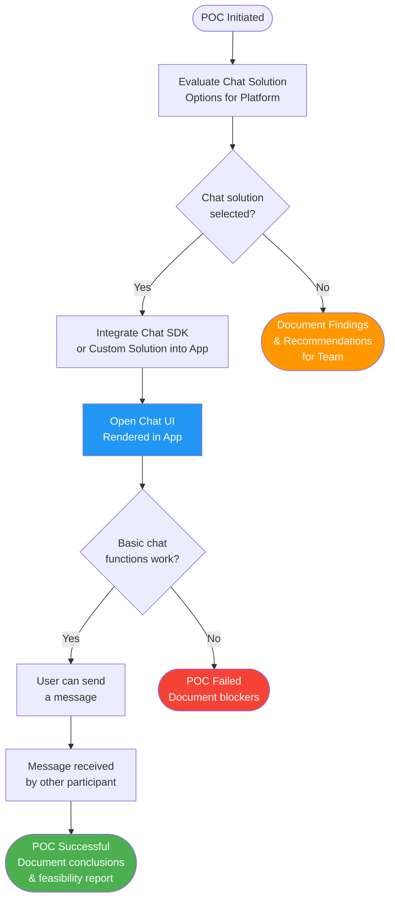
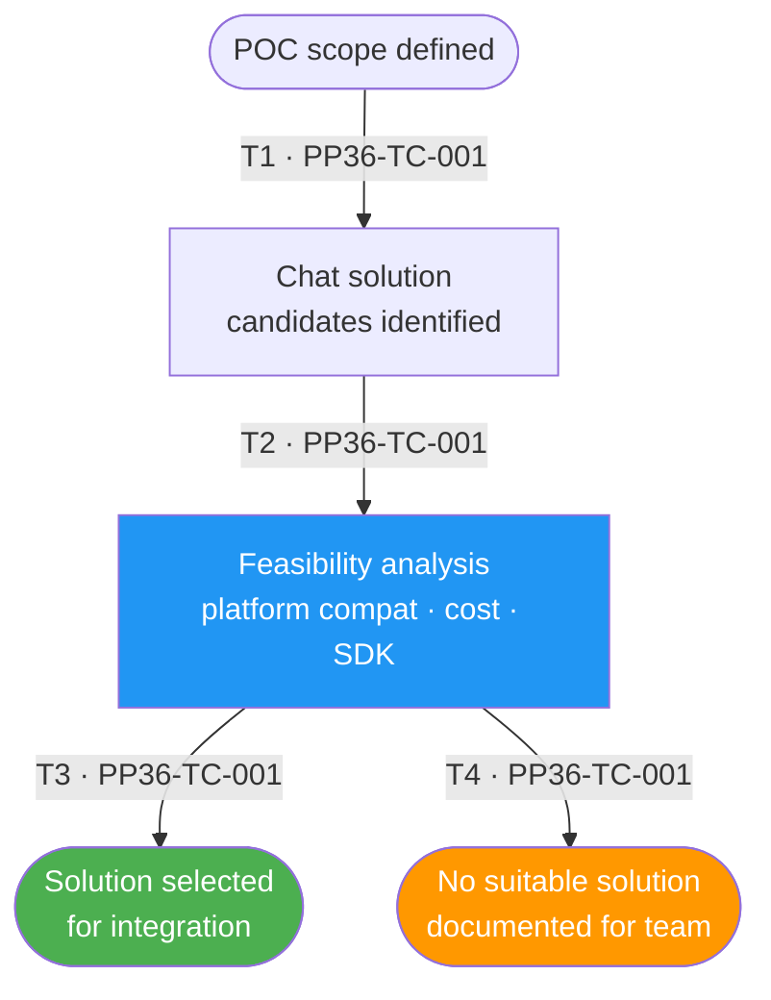
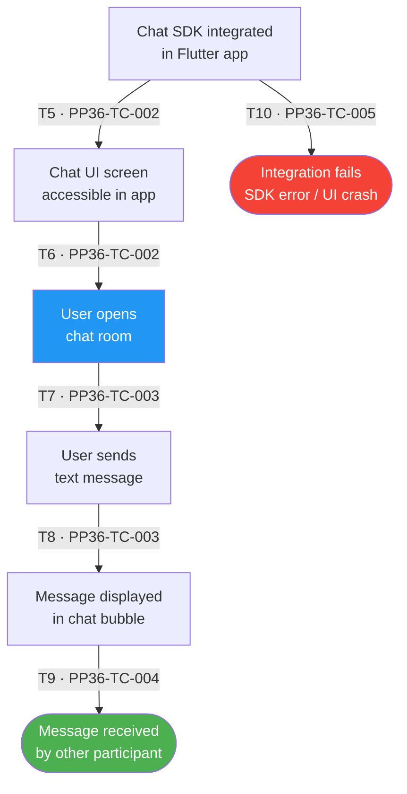
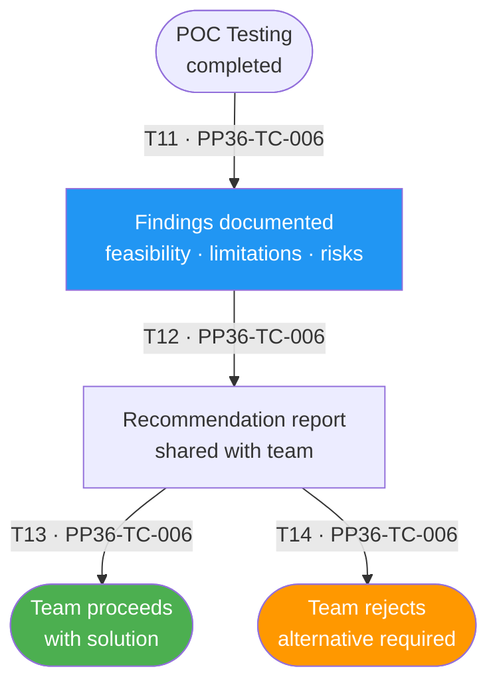

# PP-36 · POC Open Chat — Flow Diagram

> Requirements → [PP-36_POC_Open_Chat.md](../requirements/PP-36_POC_Open_Chat/PP-36_POC_Open_Chat.md)
> Jira → [PP-36](https://7-solutions.atlassian.net/browse/PP-36)
> Figma → [App UI Design](https://www.figma.com/design/PKyOOKQydjB98nVMOOyxy4/-PP--App-UI-Design)
> Test Design → [PP-36.design.md](./PP-36.design.md)

---

## Master Flow

---

## Sub-Flow 1: Chat Solution Evaluation (AC 1.1, AC 1.2)

### State & Transition Reference

| Ref ID | Type       | Label |
|--------|------------|-------|
| S1     | State      | POC scope defined |
| S2     | State      | Chat solution candidates identified |
| S3     | State      | Feasibility analysis performed (platform compatibility, cost, SDK support) |
| S4     | State      | Solution selected for integration |
| S5     | State      | No suitable solution — documented for team |
| T1     | Transition | Identify candidate chat solutions |
| T2     | Transition | Evaluate each solution against platform requirements |
| T3     | Transition | Select best-fit solution |
| T4     | Transition | No solution meets criteria — stop and document |

---

## Sub-Flow 2: Open Chat Integration & UI (AC 1.1)

### State & Transition Reference

| Ref ID | Type       | Label |
|--------|------------|-------|
| S6     | State      | Chat SDK / solution integrated into Flutter app |
| S7     | State      | Chat UI screen accessible in app |
| S8     | State      | User can open a chat room / conversation |
| S9     | State      | User sends a text message |
| S10    | State      | Message delivered and displayed in chat |
| S11    | State      | Other participant receives message |
| S12    | State      | Integration fails — SDK error or UI crash |
| T5     | Transition | SDK added to pubspec and configured |
| T6     | Transition | Navigate to Chat screen |
| T7     | Transition | Open a chat room |
| T8     | Transition | Send text message |
| T9     | Transition | Message delivered to recipient |
| T10    | Transition | SDK throws exception or UI crashes |

---

## Sub-Flow 3: POC Outcome & Documentation (AC 1.2)

### State & Transition Reference

| Ref ID | Type       | Label |
|--------|------------|-------|
| S13    | State      | POC testing completed |
| S14    | State      | Findings documented (feasibility, limitations, risks) |
| S15    | State      | Recommendation report shared with team |
| S16    | State      | Team decides to proceed with solution |
| S17    | State      | Team decides not to proceed — alternative required |
| T11    | Transition | POC results evaluated |
| T12    | Transition | Feasibility report created |
| T13    | Transition | Team reviews and decides to adopt |
| T14    | Transition | Team reviews and decides to reject |

---

## State & Transition Coverage Summary

| Ref ID | Type       | Label                                                | Covered By TC                          |
|--------|------------|------------------------------------------------------|----------------------------------------|
| S1     | State      | POC scope defined                                    | PP36-TC-001                            |
| S2     | State      | Chat solution candidates identified                  | PP36-TC-001                            |
| S3     | State      | Feasibility analysis performed                       | PP36-TC-001                            |
| S4     | State      | Solution selected for integration                    | PP36-TC-001                            |
| S5     | State      | No suitable solution — documented for team           | PP36-TC-001                            |
| S6     | State      | Chat SDK integrated into Flutter app                 | PP36-TC-002                            |
| S7     | State      | Chat UI screen accessible in app                     | PP36-TC-002                            |
| S8     | State      | User can open a chat room / conversation             | PP36-TC-002                            |
| S9     | State      | User sends a text message                            | PP36-TC-003                            |
| S10    | State      | Message displayed in chat                            | PP36-TC-003                            |
| S11    | State      | Other participant receives message                   | PP36-TC-004                            |
| S12    | State      | Integration fails — SDK error or UI crash            | PP36-TC-005                            |
| S13    | State      | POC testing completed                                | PP36-TC-006                            |
| S14    | State      | Findings documented                                  | PP36-TC-006                            |
| S15    | State      | Recommendation report shared with team               | PP36-TC-006                            |
| S16    | State      | Team decides to proceed with solution                | PP36-TC-006                            |
| S17    | State      | Team decides not to proceed                          | PP36-TC-006                            |
| T1     | Transition | Identify candidate chat solutions                    | PP36-TC-001                            |
| T2     | Transition | Evaluate each solution against requirements          | PP36-TC-001                            |
| T3     | Transition | Select best-fit solution                             | PP36-TC-001                            |
| T4     | Transition | No solution meets criteria — stop and document       | PP36-TC-001                            |
| T5     | Transition | SDK added to pubspec and configured                  | PP36-TC-002                            |
| T6     | Transition | Navigate to Chat screen                              | PP36-TC-002                            |
| T7     | Transition | Open a chat room                                     | PP36-TC-002                            |
| T8     | Transition | Send text message                                    | PP36-TC-003                            |
| T9     | Transition | Message delivered to recipient                       | PP36-TC-004                            |
| T10    | Transition | SDK throws exception or UI crashes                   | PP36-TC-005                            |
| T11    | Transition | POC results evaluated                                | PP36-TC-006                            |
| T12    | Transition | Feasibility report created                           | PP36-TC-006                            |
| T13    | Transition | Team reviews and decides to adopt                    | PP36-TC-006                            |
| T14    | Transition | Team reviews and decides to reject                   | PP36-TC-006                            |
