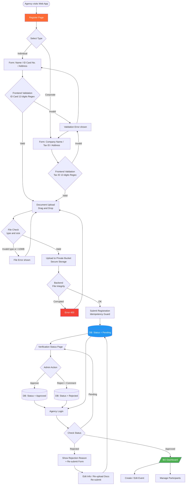
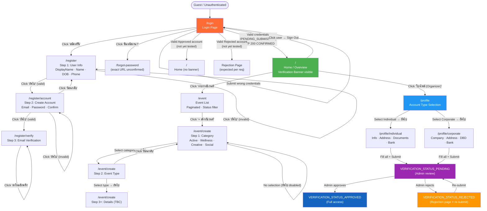
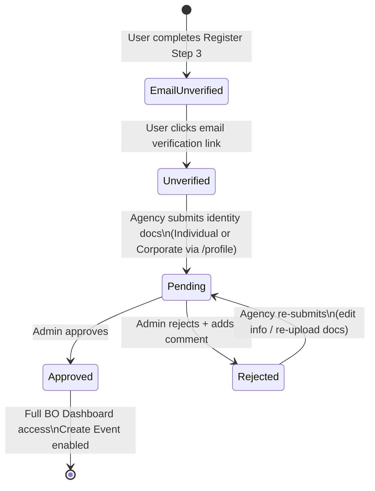
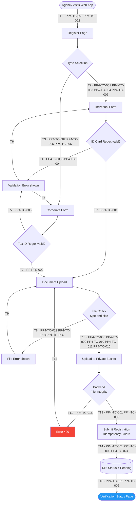
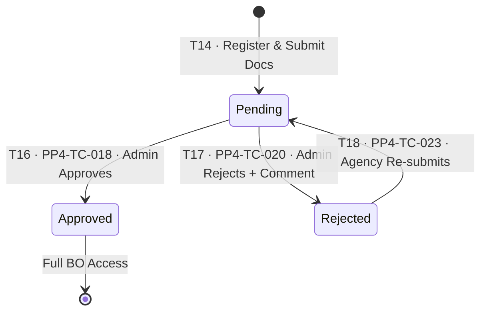
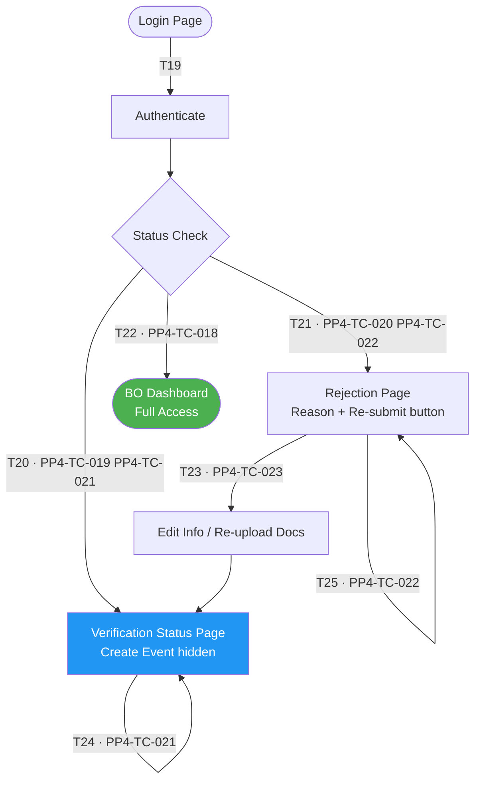

# PP-4 · [BO][Agency] Register & Login — Diagram & Exploration

> Requirements → [PP-4_Agency_Register_Login.md](../requirements/PP-4_Agency_Register_Login.md)
> Test Design → [PP-4.design.md](./PP-4.design.md)
> Jira → [PP-4](https://7-solutions.atlassian.net/browse/PP-4)
> Figma → [Organizer – Register Login node 104-17](https://www.figma.com/design/Wb6LSfgyIj4mfKMHy8MLHK/Organizer---Register-Login?node-id=104-17&t=FISjyd7YriKLHjgz-1)

**Exploration Date:** 2026-05-05 (updated with authenticated run 2026-05-05)
**Explorer:** QA Automation Agent (Playwright, Chromium 1440×900)
**Target:** `https://stg-poppa-agency-bo.poppa.com/`

---

## 1. Exploration Summary

A full automated Playwright exploration was conducted against the STG environment using headless Chromium at 1440×900 viewport. The exploration covered guest routes, the 3-step registration wizard, all login element states, and the full authenticated section (home, event list, create event wizard, profile/document upload flow).

### Key Findings

1. **Registration wizard is 3 steps** — no Individual/Corporate type selection in registration. Individual/Corporate selection and document upload are in `/profile` post-login.
2. **Login confirmed working** — HTTP 200; test account `sattawat.w@7solutions.co.th` status is `VERIFICATION_STATUS_PENDING_SUBMISSION`.
3. **App uses "Organizer"** — UI branding, API paths, and all copy use "Organizer / ผู้จัดงาน" not "Agency".
4. **Identity verification in `/profile`** — drag-and-drop document upload (PDF/PNG/JPG, max 10MB) found in `/profile/individual` and `/profile/corporate`.
5. **Verification lifecycle partially testable** — Pending status confirmed; Approved and Rejected states not testable without admin access or additional test accounts.

### Route Access Summary

| Route | Guest | Authenticated | Notes |
|---|---|---|---|
| `/login` | ✅ Landing | Redirects to `/` | Root redirect for guests |
| `/register` | ✅ | ✅ | Step 1 wizard |
| `/register/account` | ✅ | ✅ | Step 2 — directly accessible |
| `/register/verify` | ✅ | ✅ | Step 3 — directly accessible |
| `/` | Redirects `/login` | ✅ | Home — verification banner shown |
| `/event` | Redirects `/login` | ✅ | Event list — paginated |
| `/event/create` | Redirects `/login` | ✅ | Create Event wizard |
| `/profile` | Redirects `/login` | ✅ | Account type selection |
| `/profile/individual` | Redirects `/login` | ✅ | Individual form — 4 sections |
| `/profile/corporate` | Redirects `/login` | ✅ (inferred) | Corporate form — 4 sections |
| `/dashboard`, `/settings`, `/verification-status` | 404 | 404 | Not deployed on STG |

---

## 2. Page / Module Inventory

| # | URL | Page Name (EN) | Page Name (TH) | Guest | Auth | Notes |
|---|---|---|---|---|---|---|
| 1 | `/login` | Login | เข้าสู่ระบบ | Yes | Redirects | Guest landing page |
| 2 | `/register` | Register Step 1: User Info | ข้อมูลผู้ใช้งาน | Yes | Yes | No type selection |
| 3 | `/register/account` | Register Step 2: Create Account | สร้างบัญชีของคุณ | Yes | Yes | Email + password |
| 4 | `/register/verify` | Register Step 3: Email Verify | ยืนยันตัวตน | Yes | Yes | Resend email only |
| 5 | `/` | Home / Overview | ภาพรวม | Redirects | Yes | Verification banner persistent |
| 6 | `/event` | Event List | รายการอีเวนต์ | Redirects | Yes | Paginated, 10 pages, status filter |
| 7 | `/event/create` | Create Event Wizard | สร้างอีเวนต์ | Redirects | Yes | Multi-step same URL |
| 8 | `/profile` | Account Type Selection | เลือกประเภทบัญชี | Redirects | Yes | Individual / Corporate choice |
| 9 | `/profile/individual` | Individual Profile Form | ข้อมูลบุคคลทั่วไป | Redirects | Yes | 4 sections: info, address, docs, bank |
| 10 | `/profile/corporate` | Corporate Profile Form | ข้อมูลองค์กร / บริษัท | Redirects | Yes | 4 sections: company, address, docs, bank |

---

## 3. Flow Diagrams

### 3.1 Requirements-Based Master Flow

Based on PP-4 requirements spec — what the full flow should be after complete implementation.

---

### 3.2 Observed STG Navigation Flow

Based on actual Playwright exploration against STG — confirmed routes and transitions only.

---

### 3.3 Verification Status Lifecycle

---

## 4. Sub-Flow Diagrams (with Ref IDs)

### 4.1 Registration & Form Validation

#### State & Transition Reference

| Ref ID | Type | Label |
|---|---|---|
| S1 | State | Agency visits Web App |
| S2 | State | Register Page |
| S3 | State | Type Selection |
| S4 | State | Individual Form (Name, ID Card, Address) |
| S5 | State | Corporate Form (Company Name, Tax ID, Address) |
| S6 | State | Frontend Validation — ID Card (Regex 13 digits) |
| S7 | State | Frontend Validation — Tax ID (Regex 13 digits) |
| S8 | State | Validation Error shown |
| S9 | State | Document Upload (Drag & Drop) |
| S10 | State | File Check (type & size ≤10MB) |
| S11 | State | File Error (invalid type or over 10MB) |
| S12 | State | Upload to Private Bucket |
| S13 | State | Backend File Integrity Check |
| S14 | State | Error 400 (corrupted file) |
| S15 | State | Registration Submit (Idempotency Guard) |
| S16 | State | DB Status = Pending |
| S17 | State | Verification Status Page |
| T1 | Transition | Navigate to Register page |
| T2 | Transition | Select Individual |
| T3 | Transition | Select Corporate |
| T4 | Transition | ID Card format invalid — show error |
| T5 | Transition | Tax ID format invalid — show error |
| T6 | Transition | Error cleared — retry input |
| T7 | Transition | Validation OK — proceed to upload |
| T8 | Transition | File type invalid or size >10MB — show error |
| T9 | Transition | Error cleared — retry upload |
| T10 | Transition | File valid — upload to bucket |
| T11 | Transition | Backend: file corrupted — Error 400 |
| T12 | Transition | Error 400 — retry upload |
| T13 | Transition | Backend: file OK — submit registration |
| T14 | Transition | Submit with idempotency guard → DB Pending |
| T15 | Transition | DB Pending → Verification Status Page |

---

### 4.2 Verification Status State Machine

#### State & Transition Reference

| Ref ID | Type | Label |
|---|---|---|
| S18 | State | Pending |
| S19 | State | Admin Reviews |
| S20 | State | Approved |
| S21 | State | Rejected (with rejection comment) |
| S22 | State | Re-submit Form (edit info / re-upload docs) |
| T16 | Transition | Admin approves → status Approved |
| T17 | Transition | Admin rejects → status Rejected with comment |
| T18 | Transition | Agency re-submits → status back to Pending |

---

### 4.3 Login & RBAC

#### State & Transition Reference

| Ref ID | Type | Label |
|---|---|---|
| S23 | State | Login Page |
| S24 | State | Authenticate |
| S25 | State | Status Check |
| S26 | State | Verification Status Page (Pending) |
| S27 | State | Rejection Page (Rejected — reason + Re-submit) |
| S28 | State | Re-submit Form |
| S29 | State | BO Dashboard (Approved — full access) |
| T19 | Transition | Login with credentials |
| T20 | Transition | Status = Pending → Verification Status page |
| T21 | Transition | Status = Rejected → show reason + Re-submit form |
| T22 | Transition | Status = Approved → BO Dashboard |
| T23 | Transition | Edit info / re-upload docs → Re-submit → Pending |
| T24 | Transition | RBAC guard — direct URL blocked for Pending user |
| T25 | Transition | RBAC guard — direct URL blocked for Rejected user |

---

## 5. Element State Inventory

### 5.1 Login Page (`/login`)

| Element | State | Description | Screenshot | Figma Design |
|---|---|---|---|---|
| Email input | Default (empty) | Placeholder: "กรอกอีเมล" |  |  |
| Email input | Focused | Blue/ring outline on click |  | ⚠️ No Figma frame for focused state |
| Email input | Filled (no password) | Email typed, password empty |  | ⚠️ No dedicated Figma frame |
| Both inputs | Filled (valid) | Both email+password filled |  |  |
| Password input | Visible (toggle) | Eye icon toggled to show plain text |  |  |
| Form | Error — API | Message: "อีเมลหรือรหัสผ่านไม่ถูกต้อง กรุณาลองอีกครั้ง" shown below both fields |  |  |
| Form | Empty validation | Client-side: form submitted empty |  | ⚠️ No Figma frame |
| Page | Full page (default) | Left: POPPA ORGANIZER branding; right: login form |  |  |

**Confirmed elements:** `name="email"` placeholder "กรอกอีเมล" · `name="password"` placeholder "กรอกรหัสผ่าน" · Button "เข้าสู่ระบบ" · Eye toggle · Link "ลืมรหัสผ่าน?" · Link "สมัครที่นี่"

---

### 5.2 Register — Step 1: User Info (`/register`)

| Element | State | Description | Screenshot | Figma Design |
|---|---|---|---|---|
| Full page | Default | 3-step progress bar + User Info form |  |  |
| All fields | Validation errors | Required messages appear below each field |  | ⚠️ No Figma frame for error state |
| All text fields | Filled (DOB missing) | Name, firstName, lastName, phone filled |  |  |
| DOB Dropdown | Open | Thai months + Buddhist year picker |  | ⚠️ No Figma frame for picker open state |
| Phone field | Focused | Focus ring visible |  | ⚠️ No Figma frame |

**Confirmed fields:** displayName · firstName · lastName · DOB (Thai months + BE years) · phone
**Validation messages:** "กรุณากรอกชื่อผู้ใช้งาน" · "กรุณากรอกชื่อ" · "กรุณากรอกนามสกุล" · "กรุณาเลือกวันเดือนปีเกิด" · "กรุณากรอกเบอร์โทร"

---

### 5.3 Register — Step 2: Create Account (`/register/account`)

| Element | State | Description | Screenshot | Figma Design |
|---|---|---|---|---|
| Full page | Default | Step 2/3; email + password + confirm password |  |  |
| All fields | Validation errors | Error messages below each field |  |  |
| Password field | Focused (requirements shown) | Password rules: ≥8 chars, a-z, 0-9 |  |  |
| Confirm password | Mismatch | Confirm differs from password |  | ⚠️ No Figma frame |
| Form | Fully filled | Email + password + confirm all filled |  |  |

**Password rules:** อย่างน้อย 8 ตัวอักษร · ต้องมีตัวอักษร (a-z) · ต้องมีตัวเลข (0-9)

---

### 5.4 Register — Step 3: Email Verification (`/register/verify`)

| Element | State | Description | Screenshot | Figma Design |
|---|---|---|---|---|
| Full page | Default | Confirmation message + "Resend" button |  |  |
| Resend button | Clicked | "ส่งใหม่อีกครั้ง" clicked |  | ⚠️ No Figma frame for resend clicked state |

---

### 5.5 Home / Overview Page (`/`)

| Element | State | Description | Screenshot | Figma Design |
|---|---|---|---|---|
| Full page | Default (PENDING_SUBMISSION) | Sidebar + verification banner |  |  ⚠️ Figma shows Welcome screen — banner not in design |
| Verification banner | Visible | "อีกนิด! สถานะของผู้จัดงานขณะนี้คือ 'รอยื่นเอกสาร'…" |  | ⚠️ No Figma frame |
| Sidebar | Default | POPPA ORGANIZER V1.0; nav items; user: jojoe test / Super Admin |  | ⚠️ No dedicated Figma frame |
| Sidebar | Events submenu expanded | อีเวนต์ → รายการอีเวนต์, รายการแบบร่าง |  | ⚠️ No dedicated Figma frame |
| User menu | Open | Dropdown: "Sign Out" |  | ⚠️ No dedicated Figma frame |

---

### 5.6 Event List (`/event`)

| Element | State | Description | Screenshot | Figma Design |
|---|---|---|---|---|
| Full page | Default | Paginated table, 5 rows, 10 pages |  | ⚠️ Not in Register/Login Figma file |
| Status filter | Open | ทั้งหมด / อนุมัติ / รอตรวจสอบ / ยกเลิก / ถูกปฏิเสธ |  | ⚠️ No Figma frame |
| Pagination | Page 2 | Second page of events |  | ⚠️ No Figma frame |
| Row | Hover state | Action controls appear |  | ⚠️ No Figma frame |

**Confirmed columns:** รูปภาพ · ชื่ออีเวนต์ · หมวดหมู่ · วันที่เริ่มงาน · วันที่สิ้นสุดงาน · รับสมัครทั้งหมด · สถานะ · เครื่องมือ

---

### 5.7 Create Event Wizard (`/event/create`)

| Element | State | Description | Screenshot | Figma Design |
|---|---|---|---|---|
| Step 1 | Default | 4 category cards: Active, Wellness, Creative, Social |  | ⚠️ Not in Register/Login Figma file |
| Step 1 | Active selected | "Active กิจกรรมเคลื่อนไหว" highlighted |  | ⚠️ No Figma frame |
| Step 2 | Default | Sub-types for selected category |  | ⚠️ No Figma frame |
| Step 2 | Running selected | "Running / Marathon" selected |  | ⚠️ No Figma frame |

---

### 5.8 Profile — Account Type Selection & Document Submission

| Element | State | Description | Screenshot | Figma Design |
|---|---|---|---|---|
| `/profile` | Default | Two cards: องค์กร / บริษัท and บุคคลทั่วไป |  |  |
| Individual card | Selected | "บุคคลทั่วไป" radio selected |  |  |
| Corporate card | Selected | "องค์กร / บริษัท" radio selected |  |  |
| `/profile/individual` | Default | 4-section form |  |  |
| `/profile/individual` | Validation errors | All required fields show errors |  | ⚠️ No Figma frame for error state |
| `/profile/corporate` | Default | 4-section form |  |  |

**Individual form sections:** ข้อมูลทั่วไป (Name · DOB · Phone · National ID 13-digit) · ข้อมูลที่อยู่ (Address · Province · District · Sub-district · Postal code) · เอกสารสำคัญ (ID card front/back · Photo with ID · House registration — PDF/PNG/JPG max 10MB) · ข้อมูลบัญชีธนาคาร (Account name/number · Bank name · Branch · Bank book image)

**Corporate form sections:** ข้อมูลทั่วไป (Company name · Branch · Tax ID · Contact phone/email) · ข้อมูลที่อยู่ (same as individual) · เอกสารสำคัญ (DBD certificate · ภ.พ.20 optional · Primary contact ID card) · ข้อมูลบัญชีธนาคาร (same as individual)

---

### 5.9 Verification Status Banner (Persistent)

| Element | State | Description | Screenshot | Figma Design |
|---|---|---|---|---|
| Banner | PENDING_SUBMISSION | "อีกนิด! สถานะของผู้จัดงานขณะนี้คือ 'รอยื่นเอกสาร' กรุณา ยื่นเอกสาร เพื่อยืนยัน…" |  | ⚠️ Not in Register/Login design file |

**Appears on:** `/` · `/event` · all authenticated pages
**API source:** `GET /api/v1/organizer/verification/{organizationId}` returns `data: null` for PENDING_SUBMISSION

---

## 6. Transition Flow

| Source | Trigger / Condition | Destination | Notes |
|---|---|---|---|
| Guest (any URL) | Navigate to root | `/login` | Auth redirect |
| `/login` | Click "สมัครที่นี่" | `/register` | — |
| `/login` | Click "ลืมรหัสผ่าน?" | `/forgot-password` (unconfirmed) | — |
| `/login` | Submit empty / wrong credentials | `/login` + error | "อีเมลหรือรหัสผ่านไม่ถูกต้อง กรุณาลองอีกครั้ง" |
| `/login` | Submit valid (PENDING_SUBMISSION) | `/` | HTTP 200 ✓ CONFIRMED |
| `/login` | Submit valid (Approved) | `/` (no banner) | Not yet tested |
| `/login` | Submit valid (Rejected) | Rejection page | Not yet tested |
| `/register` | ถัดไป (valid) | `/register/account` | — |
| `/register` | ถัดไป (invalid) | stays | Validation errors shown |
| `/register/account` | ย้อนกลับ | `/register` | — |
| `/register/account` | ถัดไป (valid) | `/register/verify` | — |
| `/register/verify` | ส่งใหม่อีกครั้ง | stays | Resend email |
| `/` | Click รายการอีเวนต์ | `/event` | — |
| `/` | Click โปรไฟล์ (Organizer) | `/profile` | — |
| `/` | Click user → Sign Out | `/login` | — |
| `/event` | Click + สร้างอีเวนต์ | `/event/create` | — |
| `/event` | Click status filter | stays | Filter dropdown opens |
| `/event/create` | Select category → ถัดไป | step 2 (same URL) | Breadcrumb shown |
| `/event/create` (step 2) | Select type → ถัดไป | step 3+ (same URL) | Form fields TBC |
| `/event/create` (step 2) | ย้อนกลับ | step 1 | — |
| `/profile` | Select Individual → ถัดไป | `/profile/individual` | — |
| `/profile` | Select Corporate → ถัดไป | `/profile/corporate` | — |
| `/profile/individual` | Submit empty | stays | Validation errors |
| `/event/create`, `/profile` | Guest access | `/login` | RBAC guard CONFIRMED |
| `/dashboard` | Any | 404 | Not deployed |

---

## 7. Screenshot Gallery

### Login Page
| Screenshot | Caption |
|---|---|
|  | Login form — default |
|  | Login page full — branding + form |
|  | Login form — error state |
|  | Password visibility toggle active |

### Register Steps 1–3
| Screenshot | Caption |
|---|---|
|  | Step 1 — default with progress bar |
|  | Step 1 — all validation errors |
|  | Step 1 — DOB picker (Thai months + BE year) |
|  | Step 1 — all text fields filled |
|  | Step 2 — default |
|  | Step 2 — validation errors |
|  | Step 2 — password requirements on focus |
|  | Step 2 — confirm password mismatch |
|  | Step 2 — fully filled |
|  | Step 3 — email verification waiting |
|  | Step 3 — after Resend clicked |

### Post-Login
| Screenshot | Caption |
|---|---|
|  | Home — post-login with verification banner |
|  | Sidebar — default |
|  | Sidebar — อีเวนต์ submenu expanded |
|  | Event list — default with banner |
|  | Event list — status filter open |
|  | Create Event Step 1 — category selection |
|  | Create Event Step 2 — type selection |
|  | Profile Step 1 — account type selection |
|  | Profile — Individual form |
|  | Profile — Corporate form |

---

## 8. QA Notes

### Critical Risks

| # | Risk | Severity | Status |
|---|---|---|---|
| R1 | Verification Status page (dedicated route) not deployed | High | Open — banner shown instead |
| R2 | Dashboard route returns 404 | High | `/` serves as dashboard |
| R3 | Draft events list not routed (`/#`) | Medium | "รายการแบบร่าง" is a dead link |
| R4 | Event create wizard steps 3+ not fully explored | Medium | Form fields unknown |
| R5 | Document upload end-to-end not tested | High | UI confirmed; backend submission untested |
| R6 | "Sign Out" label is English, not Thai | Low | Localization inconsistency |

### Behavioral Observations

| # | Observation | Type |
|---|---|---|
| O1 | Error message appears below BOTH email and password fields (not just once) | UI Bug Risk |
| O2 | Register Steps 2 and 3 directly accessible via URL without completing Step 1 | Security/UX Gap |
| O3 | DOB picker uses Thai months + Buddhist Era years | Localization |
| O4 | Page title is `agency-bo` but UI branding says "Organizer management system" | Brand inconsistency |
| O5 | `/register/verify` is email verification, NOT identity document upload — docs are in `/profile` post-login | Implementation clarified |
| O6 | Phone field is `type="text"` not `type="tel"` | Minor UX |
| O7 | Password eye-toggle button has empty text content (icon-only) | Accessibility |
| O8 | Event list dates shown in Thai Buddhist calendar: "12/05/2569" | Localization |
| O9 | "รายการแบบร่าง" sidebar link → `/#` (no-op) | Incomplete route |
| O10 | Test account role shows "Super Admin" — not standard Organizer | Account config |

---

## 9. Clarification Points

All items tracked in [PP-4_clarifications.md](../../.agents/review-notes/req-clarify/PP-4_clarifications.md).

| # | Question | Status |
|---|---|---|
| CL1 | Test account login | ✅ Resolved — HTTP 200 confirmed |
| CL2 | Individual/Corporate selection location | ✅ Resolved — in `/profile` post-login |
| CL3 | Post-email-verify next step | ✅ Resolved — login → `/profile` → document upload |
| CL4 | Route for Rejected status page | ⏸️ On Hold (Mockup) |
| CL5 | DOB: Buddhist Era vs Common Era | ✅ Resolved — FE converts BE → CE before API |
| CL6 | "Agency" vs "Organizer" naming | ✅ Resolved — use "Organizer" throughout |
| CL7 | Register wizard step guard | ✅ Closed (Suggestion) |
| CL8 | Test accounts for Approved/Rejected status | ⏸️ On Hold (Mockup) |
| CL9 | Forgot password exact route | ⏳ Pending (PPUI-125 On Hold) |
| CL10 | File upload end-to-end / Private Bucket domain | ⏳ Pending |
| CL11 | "รายการแบบร่าง" route incomplete | ✅ Closed (Suggestion) |
| CL12 | Test account role "Super Admin" | ⏸️ On Hold (Mockup) |
| CL13 | Create Event wizard steps 3+ fields | ⏸️ On Hold (Mockup) |

---

## 10. Confidence Level

| Area | Confidence | Notes |
|---|---|---|
| Login page | 95% | All elements captured; HTTP 200 confirmed |
| Register Step 1 | 90% | All fields; validation messages confirmed |
| Register Step 2 | 92% | All fields; password rules confirmed |
| Register Step 3 | 88% | Page structure confirmed; email content not testable |
| Home / Overview | 88% | Banner and sidebar fully mapped |
| Event list | 85% | Table, pagination, status filter confirmed |
| Create Event Step 1 | 90% | 4 categories confirmed |
| Create Event Step 2 | 88% | Sub-types confirmed |
| Create Event Step 3+ | 20% | Not reachable |
| Profile — type selection | 92% | Both cards confirmed |
| Profile — Individual form | 80% | All 4 sections confirmed; submission not tested |
| Profile — Corporate form | 78% | All 4 sections confirmed; submission not tested |
| RBAC guards | 85% | Auth guard on `/event/create` and `/profile` confirmed |
| Verification lifecycle | 25% | Pending only; Approved/Rejected not testable |

**Overall Confidence: 72%**

Remaining gaps to reach 90%+: Approved + Rejected test accounts · Admin account for approval/rejection · File upload end-to-end · Create Event steps 3+ form fields

---

## Appendix A — API Endpoints Observed

| Endpoint | Method | Status | Notes |
|---|---|---|---|
| `/api/v1/auth/organizer/login` | POST | 200 | Login — confirmed working |
| `/api/v1/organizer/me` | GET | 200 | `{ name: "jojoe test", organizationId: "..." }` |
| `/api/v1/organizer/organizations` | GET | 200 | Returns `verificationStatus: "VERIFICATION_STATUS_PENDING_SUBMISSION"` |
| `/api/v1/organizer/verification/{orgId}` | GET | 200 | Returns `{ data: null }` for PENDING_SUBMISSION |
| `/api/v1/presets/event-category` | GET | 200 | Event categories with CDN image URLs |
| CDN: `storage.googleapis.com/poppa-media-staging/p/preset-api/category/{name}.png` | GET | 200 | Category images |

## Appendix B — STG Account Data

| Field | Value |
|---|---|
| Email | `sattawat.w@7solutions.co.th` |
| Display name | jojoe test |
| Role | Super Admin |
| Organization ID | `69f9cb15fcbd2d49e9f0c87f` |
| Organization name | Jojoe test |
| Verification status | `VERIFICATION_STATUS_PENDING_SUBMISSION` |

## Appendix C — Technical Environment

| Property | Value |
|---|---|
| Target URL | `https://stg-poppa-agency-bo.poppa.com/` |
| API Gateway | `https://stg-organizer-api-gateway.poppa.com` |
| Browser | Chromium (Playwright) 1440×900 |
| Screenshots | `assets/capture/` (gitignored) — 123 total |
| Exploration dates | 2026-05-05 (guest + authenticated) |
