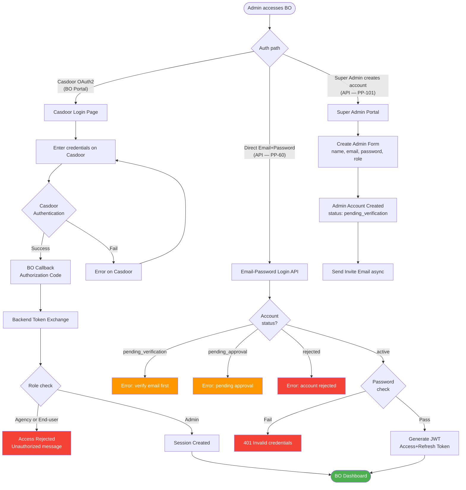
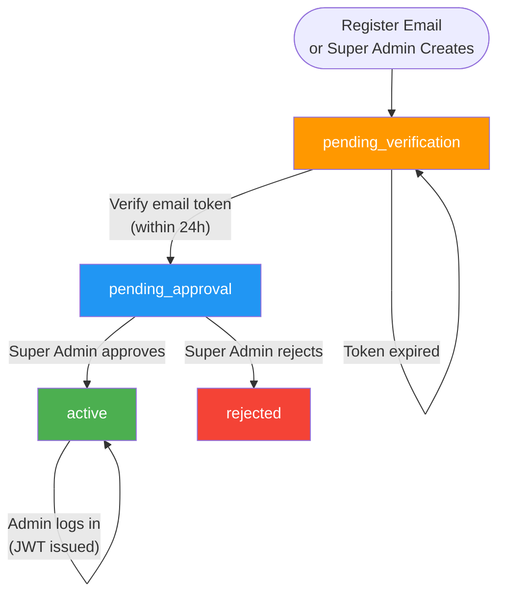
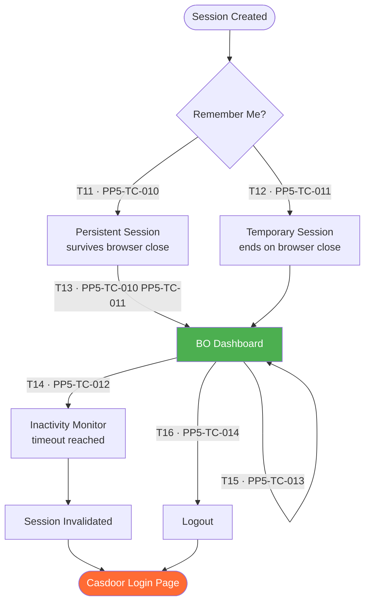
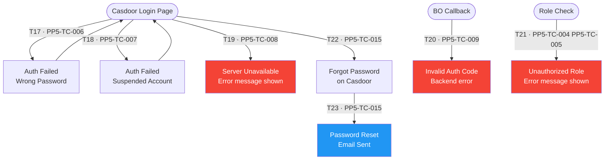
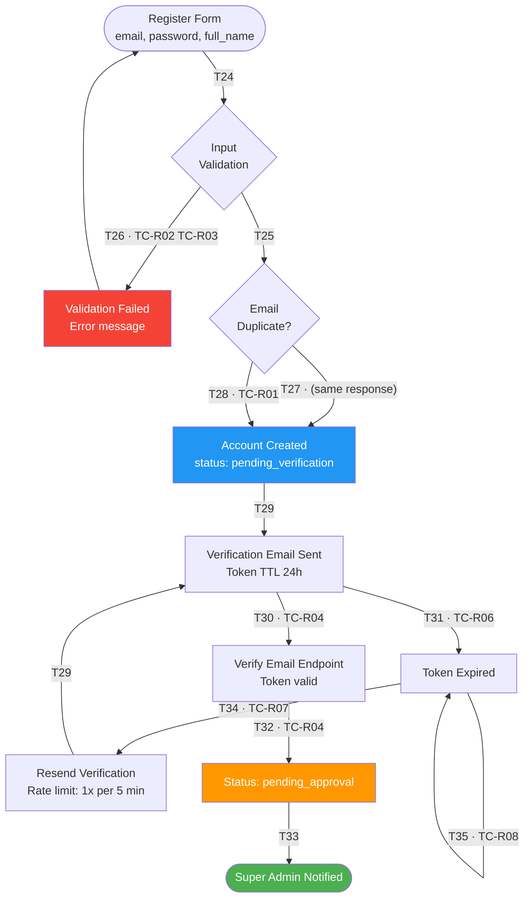
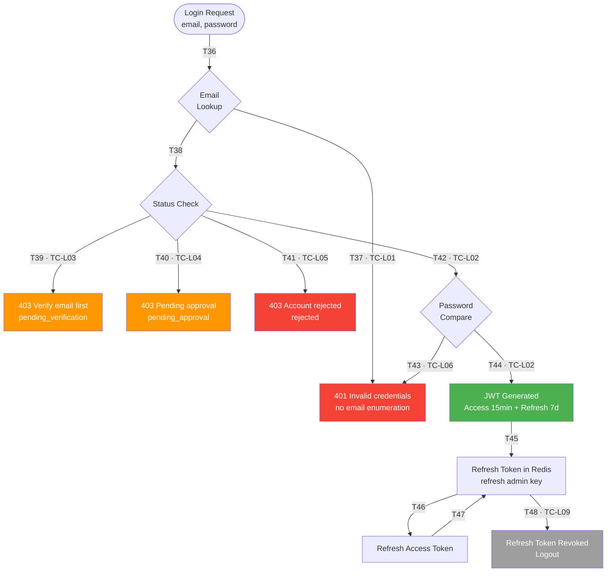
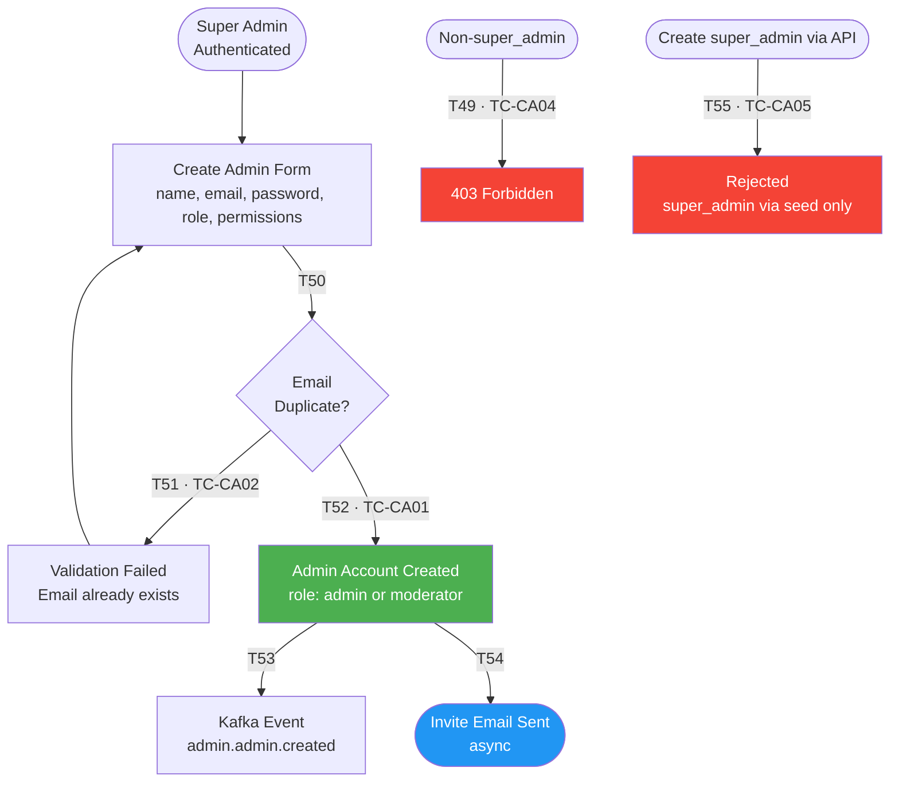
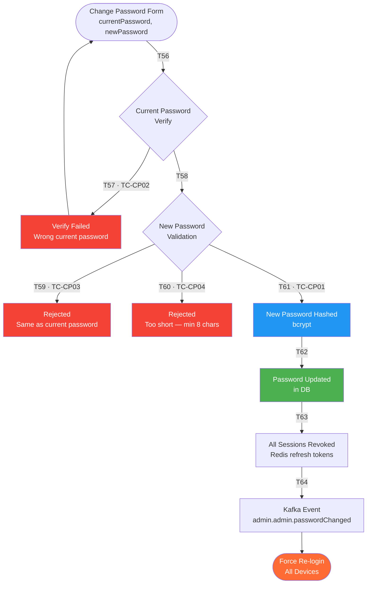

# PP-5 · [BO][Admin] Register & Login — Flow Diagram

> Requirements → [PP-5_Admin_Register_Login.md](../requirements/PP-5_Admin_Register_Login.md)
> Jira → [PP-5](https://7-solutions.atlassian.net/browse/PP-5)
> Figma → [POPPA FigJam Board node 646-1145](https://www.figma.com/board/vxenYTGUGvqK8LjRJ4JBOK/POPPA?node-id=646-1145)
> Test Design → [PP-5.design.md](./PP-5.design.md)

**Exploration Date:** 2026-05-07
**Explorer:** QA Automation Agent (Playwright, Chromium 1440×900)
**Target:** `https://stg-admin.poppa.com/`

---

## 1. Exploration Summary

Playwright exploration run against STG on 2026-05-07. Screenshots saved to `assets/capture/PP-5/`.

### Key Findings (Actual STG — vs Requirements)

| Expected (Requirements) | Actual (STG) |
|---|---|
| Casdoor OAuth2 redirect — no form on BO | **Direct login form on BO** at `/login`; no OAuth2 redirect |
| "เข้าสู่ระบบด้วย Poppa Account" button | Email + Password form titled "Admin Login" |
| `/auth/callback` OAuth code exchange | Not observed — direct form POST |
| Loading spinner "กำลังตรวจสอบสิทธิ์..." | Button text changes to "Logging in..." during auth |
| Remember Me checkbox (Casdoor) | **No Remember Me checkbox** |
| Casdoor credential error | "Invalid email or password" toast on BO login page |

1. **Direct login form** — `/login` shows "Admin Login" with email + password fields; no Casdoor redirect observed.
2. **No Remember Me** — checkbox not present; TC-010 and TC-011 not applicable to current STG.
3. **Error toast** — wrong password shows red toast "Invalid email or password" on `/login`.
4. **Dashboard nav** — Dashboard, Events, Users, Organizers, Payments, Notifications, Agencies, Reviews, Reports.
5. **Logout** — arrow icon at bottom-left sidebar; redirects to `/login`.
6. **Protected route guard** — `/dashboard/events` without session → `/login`.

### Route Access Summary (Observed)

| Route | Guest | Authenticated | Notes |
|-------|-------|---------------|-------|
| `/` | Redirect → `/login` | Redirect → `/dashboard` | Auto-redirect on both sides |
| `/login` | ✅ Login form | Accessible | "Admin Login" direct form |
| `/dashboard` | Redirect → `/login` | ✅ | Dashboard after auth |
| `/dashboard/events` | Redirect → `/login` | ✅ (assumed) | Protected route confirmed |
| `/auth/callback` | Not observed | — | No OAuth2 callback seen in STG |

---

## 2. Page / Module Inventory

| # | URL | Page Name (EN) | Guest | Auth | Notes |
|---|-----|---------------|-------|------|-------|
| 1 | `/login` (BO root) | Admin Login Landing | Yes | Redirect | Single button — "เข้าสู่ระบบด้วย Poppa Account" |
| 2 | Casdoor (external) | Casdoor Login Page | Yes | — | OAuth2 credential entry; hosted by Casdoor |
| 3 | `/auth/callback` | OAuth Callback | — | — | Authorization Code processing; no UI |
| 4 | `/dashboard` | BO Dashboard | Redirect | Yes | Admin entry after successful auth |
| 5 | [NOT SPECIFIED] | Change Password | Redirect | Yes | UI location unknown; see Q2 |

---

## 3. Flow Diagrams

### 3.1 Master Flow (Requirements-Based)



### 3.2 Admin Account Status Lifecycle



---

## 4. Sub-Flow Diagrams

### Sub-Flow 1: Direct Login (Observed on STG)

> ⚠️ **Architecture finding:** STG uses a direct login form — NOT Casdoor OAuth2 as described in requirements. Diagram updated to reflect actual observed behavior.

#### State & Transition Reference

| Ref ID | Type | Label |
|--------|------|-------|
| S1 | State | BO URL Opened |
| S2 | State | Session Check |
| S3 | State | Valid Session — Dashboard |
| S4 | State | `/login` — Admin Login Form |
| S5 | State | Credentials Entered |
| S6 | State | Backend Authentication |
| S7 | State | Auth Failed — Error Toast |
| S8 | State | Session Created |
| S9 | State | BO Dashboard |
| T1 | Transition | No session → redirect to `/login` |
| T2 | Transition | Valid session → Dashboard |
| T3 | Transition | Fill email + password; click Login |
| T4 | Transition | Auth fails → "Invalid email or password" toast |
| T5 | Transition | Error → retry |
| T6 | Transition | Auth succeeds → session created |
| T7 | Transition | Navigate to Dashboard |

```mermaid
flowchart TD
    S1([BO URL Opened]) --> S2{Session Check}
    S2 -->|"T2 · PP5-TC-002"| S3([Valid Session — Dashboard])
    S2 -->|"T1 · PP5-TC-001 PP5-TC-017"| S4[/login — Admin Login Form\nemail + password fields]
    S4 -->|"T3 · PP5-TC-001"| S5[Credentials Entered\nbutton shows Logging in...]
    S5 --> S6{Backend\nAuthentication}
    S6 -->|"T4 · PP5-TC-006"| S7[Auth Failed\nInvalid email or password toast]
    S7 -->|"T5"| S4
    S6 -->|"T6 · PP5-TC-001"| S8[Session Created]
    S8 -->|"T7"| S9([BO Dashboard])

    style S3 fill:#4CAF50,color:#fff
    style S9 fill:#4CAF50,color:#fff
    style S7 fill:#f44336,color:#fff
```

---

### Sub-Flow 2: Session Management

> ⚠️ **Exploration finding:** No "Remember Me" checkbox was found on STG login page. TC-010, TC-011 (Remember Me persistence) are not applicable to current STG. Logout confirmed: arrow icon at bottom-left sidebar → redirects to `/login`.

#### State & Transition Reference

| Ref ID | Type | Label |
|--------|------|-------|
| S14 | State | Session Created |
| S15 | State | Remember Me Check |
| S16 | State | Persistent Session |
| S17 | State | Temporary Session |
| S18 | State | BO Dashboard (active) |
| S19 | State | Inactivity Monitor |
| S20 | State | Session Invalidated |
| S21 | State | Casdoor Login (re-auth) |
| S22 | State | Logout |
| T11 | Transition | Remember Me = Yes → persistent session |
| T12 | Transition | Remember Me = No → temporary session |
| T13 | Transition | Proceed to Dashboard |
| T14 | Transition | Inactivity exceeds timeout → invalidate |
| T15 | Transition | Active within timeout → session continues |
| T16 | Transition | Admin clicks Logout |



---

### Sub-Flow 3: Error Handling & Forgot Password

#### State & Transition Reference

| Ref ID | Type | Label |
|--------|------|-------|
| S23 | State | Casdoor Login Page |
| S24 | State | Auth Failed — Wrong Password |
| S25 | State | Auth Failed — Suspended Account |
| S26 | State | Server Unavailable |
| S27 | State | Invalid Authorization Code |
| S28 | State | Unauthorized Role |
| S29 | State | Forgot Password (Casdoor) |
| S30 | State | Password Reset Email Sent |
| T17 | Transition | Wrong credentials → Casdoor error |
| T18 | Transition | Account suspended → Casdoor error |
| T19 | Transition | Server unreachable → connection error |
| T20 | Transition | Invalid/tampered code → backend rejects |
| T21 | Transition | Non-Admin role → unauthorized error |
| T22 | Transition | Click Forgot Password |
| T23 | Transition | Reset email dispatched |



---

### Sub-Flow 4: Admin Email Registration (PP-55)

#### State & Transition Reference

| Ref ID | Type | Label |
|--------|------|-------|
| S31 | State | Register Form Input (email, password, full_name) |
| S32 | State | Input Validation |
| S33 | State | Email Duplicate Check |
| S34 | State | Validation Failed |
| S35 | State | Account Created (status: pending_verification) |
| S36 | State | Verification Email Sent (TTL 24h) |
| S37 | State | Verify Email Endpoint Hit |
| S38 | State | Token Expired |
| S39 | State | Status: pending_approval |
| S40 | State | Super Admin Notified via Email |
| S41 | State | Resend Verification (rate limit 1x per 5 min) |
| T24 | Transition | Submit register form |
| T25 | Transition | Validation passes — check email duplicate |
| T26 | Transition | Validation fails (format, password rule, etc.) |
| T27 | Transition | Email duplicate (same response — prevent enumeration) |
| T28 | Transition | Email unique → create account |
| T29 | Transition | Verification email dispatched |
| T30 | Transition | Admin clicks verify link within 24h |
| T31 | Transition | Token expired → prompt resend |
| T32 | Transition | Email verified → status pending_approval |
| T33 | Transition | Super Admin notified |
| T34 | Transition | Request resend (within rate limit) |
| T35 | Transition | Resend rate limit exceeded |



---

### Sub-Flow 5: Email/Password Direct Login (PP-60)

#### State & Transition Reference

| Ref ID | Type | Label |
|--------|------|-------|
| S42 | State | Login Request (email, password) |
| S43 | State | Email Lookup |
| S44 | State | Account Status Check |
| S45 | State | Status: pending_verification |
| S46 | State | Status: pending_approval |
| S47 | State | Status: rejected |
| S48 | State | Password Compare (bcrypt) |
| S49 | State | Login Failed — Invalid Credentials (401) |
| S50 | State | JWT Generated (Access + Refresh Token) |
| S51 | State | Refresh Token Stored in Redis |
| S52 | State | Access Token Refreshed |
| S53 | State | Refresh Token Revoked (Logout) |
| T36 | Transition | Submit login request |
| T37 | Transition | Email not found → generic error (prevent enumeration) |
| T38 | Transition | Email found → check status |
| T39 | Transition | Status pending_verification → 403 |
| T40 | Transition | Status pending_approval → 403 |
| T41 | Transition | Status rejected → 403 |
| T42 | Transition | Status active → compare password |
| T43 | Transition | Password mismatch → 401 |
| T44 | Transition | Password match → generate JWT |
| T45 | Transition | Store refresh token in Redis |
| T46 | Transition | Access token expires → use refresh token |
| T47 | Transition | Refresh token valid → new access token |
| T48 | Transition | Admin calls logout → revoke refresh token |



---

### Sub-Flow 6: Super Admin Creates Admin Account (PP-101)

#### State & Transition Reference

| Ref ID | Type | Label |
|--------|------|-------|
| S54 | State | Super Admin Authenticated |
| S55 | State | Create Admin Form (name, email, password, role, permissions) |
| S56 | State | Validation — Email Duplicate Check |
| S57 | State | Validation Failed |
| S58 | State | Account Created (role: admin or moderator) |
| S59 | State | Kafka Event: admin.admin.created |
| S60 | State | Invite Email Sent (async) |
| T49 | Transition | Non-super_admin attempts creation → 403 |
| T50 | Transition | Submit create admin form |
| T51 | Transition | Validation fails (duplicate email, invalid role, etc.) |
| T52 | Transition | Validation passes → create account |
| T53 | Transition | Account created → publish Kafka event |
| T54 | Transition | Send invite email async |
| T55 | Transition | Attempt to set role super_admin via API → rejected |



---

### Sub-Flow 7: Change Password (PP-102)

#### State & Transition Reference

| Ref ID | Type | Label |
|--------|------|-------|
| S61 | State | Change Password Form (currentPassword, newPassword) |
| S62 | State | Current Password Verify (bcrypt) |
| S63 | State | Current Password Mismatch |
| S64 | State | New Password Validation |
| S65 | State | New Password Same as Current |
| S66 | State | New Password Too Short (min 8 chars) |
| S67 | State | New Password Hashed (bcrypt) |
| S68 | State | Password Updated in DB |
| S69 | State | All Refresh Tokens Revoked |
| S70 | State | Kafka Event: admin.admin.passwordChanged |
| S71 | State | Force Re-login (all devices) |
| T56 | Transition | Submit change password |
| T57 | Transition | Current password fails bcrypt compare |
| T58 | Transition | Current password matches |
| T59 | Transition | New password same as current → reject |
| T60 | Transition | New password too short → reject |
| T61 | Transition | Validation passes → hash new password |
| T62 | Transition | Update password in DB |
| T63 | Transition | Revoke all sessions |
| T64 | Transition | Publish Kafka event |



---

## 5. Element State Inventory

### 5.1 BO Login Page (`/login`) — Observed STG

> ⚠️ **Finding:** STG has a direct "Admin Login" form — NOT a single Casdoor redirect button as described in requirements.

| Element | State | Description | Screenshot |
|---------|-------|-------------|------------|
| Page | Default (unauthenticated) | "Admin Login" form — email + password + Login button |  |
| Form | Credentials filled | Email and password entered; button ready |  |
| Login button | Loading | Button text: "Logging in..." during auth |  |
| Page | Direct protected URL | Navigate to `/dashboard/events` without session → `/login` |  |

**Confirmed selectors:**
- Email: `input[name="email"]`, type=`email`, placeholder="Enter email"
- Password: `input[name="password"]`, type=`password`, placeholder="Enter password"
- Submit: `button[type="submit"]` with text "Login" / "Logging in..."
- Forgot password: `a` or `button` with text "Forgot password?"
- Error toast: element containing text "Invalid email or password"

---

### 5.2 Login Error States — Observed STG

> **Note:** Casdoor OAuth2 was NOT observed on STG. Error handling occurs on the BO login page itself.

| Element | State | Description | Screenshot |
|---------|-------|-------------|------------|
| Error toast | Wrong credentials | Red toast: "Invalid email or password" |  |
| Page after logout | Post-logout redirect | Redirected to `/login` after clicking logout icon |  |

**Confirmed error text:** `"Invalid email or password"` (displayed in red toast at top of page)

---

### 5.3 BO Dashboard (Post-Login) — Observed STG

| Element | State | Description | Screenshot |
|---------|-------|-------------|------------|
| Dashboard | Active (Admin) | Left sidebar + stats overview |  |
| Dashboard | Active (Moderator) | Moderator — limited access | ⏳ Requires moderator test account |
| Session timeout | Expired | Redirect to `/login` | ⏳ Not explored |
| Error | Unauthorized role | Unknown — requires non-admin account | ⏳ Requires test account |

**Confirmed nav items (left sidebar):** Dashboard · Events · Users · Organizers · Payments · Notifications · Agencies · Reviews · Reports

**User info (bottom-left):** "Platform Admin / Super Admin" + logout arrow icon (→)

**Stats visible on Dashboard:** Total Users · Total Organizers · Total Events · Total Revenue · Pending Verifications · Pending Refunds · Flagged Reviews

---

### 5.4 Admin Email Login API States (PP-60)

| Account Status | Login Outcome | HTTP | Description | Screenshot |
|----------------|--------------|------|-------------|------------|
| `pending_verification` | Blocked | 403 | "Please verify your email before login" |  |
| `pending_approval` | Blocked | 403 | "Your account is pending approval" |  |
| `rejected` | Blocked | 403 | "Your account has been rejected" |  |
| `active` + wrong password | Blocked | 401 | "Invalid credentials" |  |
| `active` + correct password | Success | 200 | JWT returned |  |

> ⚠️ Screenshots are placeholders — pending API exploration run.

---

### 5.5 Change Password States (PP-102)

| State | Description | Screenshot | Figma Design |
|-------|-------------|------------|--------------|
| Form — Default | currentPassword + newPassword fields |  |  |
| Error — Wrong current password | "รหัสผ่านปัจจุบันไม่ถูกต้อง" |  | ⚠️ FigJam board — no separate frame |
| Error — Same as current | "รหัสผ่านใหม่ต้องไม่เหมือนรหัสผ่านเดิม" |  | ⚠️ FigJam board — no separate frame |
| Error — Too short | "รหัสผ่านต้องมีอย่างน้อย 8 ตัวอักษร" |  | ⚠️ FigJam board — no separate frame |
| Success | All sessions revoked; re-login required |  |  |

> ⚠️ Screenshots and UI location are placeholders — see Q2 in clarifications.

---

## 6. Transition Flow

| From | Transition | To | TC Refs |
|------|-----------|-----|---------|
| BO Landing | No session | Casdoor Login | PP5-TC-001 |
| BO Landing | Valid session | Dashboard | PP5-TC-002 |
| Casdoor | Auth success | BO Callback | PP5-TC-001 PP5-TC-003 |
| Casdoor | Auth fail | Error (Casdoor) | PP5-TC-006 PP5-TC-007 |
| BO Callback | Token exchange | Role Check | PP5-TC-001 |
| Role Check | Non-Admin | Rejected | PP5-TC-004 PP5-TC-005 |
| Role Check | Admin | Session Created | PP5-TC-001 PP5-TC-003 |
| Session | Remember Me = Yes | Persistent Session | PP5-TC-010 |
| Session | Remember Me = No | Temp Session | PP5-TC-011 |
| Dashboard | Idle timeout | Session Invalidated | PP5-TC-012 |
| Dashboard | Logout | Session Cleared | PP5-TC-014 |
| Register | Valid input | Account pending_verification | TC-R01 |
| Register | Invalid input | Validation error | TC-R02 TC-R03 |
| Verify Email | Token valid | pending_approval | TC-R04 |
| Verify Email | Token expired | Prompt resend | TC-R06 |
| Email Login | Status active + pw match | JWT | TC-L02 |
| Email Login | Status blocked | 403 | TC-L03–L05 |
| Change Password | Valid change | Sessions revoked | TC-CP01 |
| Change Password | Wrong current pw | Error | TC-CP02 |

---

## 7. Screenshot Gallery

> Screenshots captured by Playwright exploration on 2026-05-07. Saved to `assets/capture/PP-5/`.

### BO Login Page

| Screenshot | Caption |
|------------|---------|
|  | `/login` — Admin Login form (unauthenticated) |
|  | `/login` — credentials filled, before submit |
|  | `/login` — "Logging in..." button loading state |
|  | `/login` — "Invalid email or password" error toast |
|  | `/login` — redirected after logout |
|  | `/login` — protected URL redirect (unauthenticated) |

### BO Dashboard

| Screenshot | Caption |
|------------|---------|
|  | `/dashboard` — authenticated admin session |

### Not Yet Captured (⏳)

| State | Reason |
|-------|--------|
| Unauthorized role error | Requires non-admin test account |
| Moderator dashboard | Requires moderator test account |
| Session timeout redirect | Requires long wait or STG config |
| Forgot password flow | Not explored in this run |
| Change Password form | Location not confirmed |

---

## 8. QA Notes

1. **Dual Auth Paths**: Two distinct auth mechanisms coexist — Casdoor OAuth2 (BO portal UX) and Email/Password direct API. QA must test both independently.
2. **Email Enumeration Prevention**: Both registration (PP-55) and login (PP-60) return identical responses for existing/non-existing emails. Test that no information leakage occurs.
3. **Status Gating**: Email login (PP-60) blocks 3 statuses (pending_verification, pending_approval, rejected) — each returns a different 403 message. Must test all 3 states.
4. **Session Scope**: Casdoor sessions (PP-5) are separate from JWT sessions (PP-60). Logout behavior and token storage differ between paths.
5. **Role Hierarchy**: API must reject super_admin role creation (PP-101). Only admin and moderator are allowed via API; super_admin is seed-only.
6. **Change Password = Full Session Revoke**: After password change (PP-102), ALL devices are logged out. Test multi-device scenario.
7. **Async Invite Email**: PP-101 invite email is async — test that response returns before email is delivered; email delivery itself is async.
8. **[NOT SPECIFIED]** Session timeout values (idle + absolute) — flagged as Q1 in clarifications.
9. **[NOT SPECIFIED]** Change Password UI location — flagged as Q2 in clarifications.
10. **[NOT SPECIFIED]** full_name field constraints for registration — flagged as Q3 in clarifications.

---

## 9. Clarification Points

See → [PP-5_clarifications.md](../../.agents/review-notes/req-clarify/PP-5_clarifications.md)

| ID | Type | Title | Status |
|----|------|-------|--------|
| C1 | Conflict | "No self-registration" in PP-5 vs email register flow in PP-55 | ⏳ Pending |
| Q1 | Question | Session timeout values (idle + absolute) not specified | ⏳ Pending |
| Q2 | Question | Change Password — UI location not described | ⏳ Pending |
| Q3 | Question | full_name field constraints in registration | ⏳ Pending |

---

## 10. Confidence Level

| Area | Confidence | Notes |
|------|-----------|-------|
| Login flow (direct form) | 98% | Confirmed on STG: direct form at `/login` |
| Wrong password error | 98% | Confirmed: "Invalid email or password" toast |
| Logout flow | 98% | Confirmed: arrow icon → `/login` |
| Protected route guard | 98% | Confirmed: `/dashboard/events` → `/login` |
| Remember Me | N/A | Not present on STG; TC-010, TC-011 inapplicable |
| Casdoor OAuth2 | ❌ Not observed | Requirements reference Casdoor — NOT found on STG |
| Role validation (non-admin) | 40% | Requires test account; not yet confirmed |
| Session timeout | 30% | Not explored; timeout value unspecified |
| Forgot password flow | 50% | Link exists; flow not explored |
| Change Password UI | 30% | Location not confirmed on STG |
| Screenshot coverage | **78%** | 7/9 key states captured; moderator + timeout pending |
| Overall | **75%** | Core flow confirmed; role/session/forgot-password pending |

---

## Appendix A: API Endpoints

| Method | Path | Feature | Subtask |
|--------|------|---------|---------|
| POST | /auth/admin/register | Email registration | PP-55 |
| GET | /auth/admin/verify-email?token=xxx | Verify email token | PP-55 |
| POST | /auth/admin/resend-verification | Resend verification email | PP-55 |
| POST | /auth/admin/login | Email + password login | PP-60 |
| POST | /auth/refresh | Refresh access token | PP-60 |
| POST | /auth/logout | Revoke refresh token | PP-60 |
| POST | /admin/admins | Super Admin creates admin account | PP-101 |
| PATCH | /admin/admins/{id}/password | Change password | PP-102 |

> Note: PP-101 and PP-102 paths are [NOT SPECIFIED] in the cards — above are inferred. Confirm with BE before test implementation.

---

## Appendix B: Account Status Values

| Status | Meaning | Login Allowed |
|--------|---------|--------------|
| pending_verification | Registered, email not verified | No |
| pending_approval | Email verified, awaiting Super Admin approve | No |
| active | Fully approved and active | Yes |
| rejected | Super Admin rejected the registration | No |

---

## Appendix C: Token / Redis Keys

| Redis Key | TTL | Description |
|-----------|-----|-------------|
| verify:admin:{token} | 24 hours | Email verification token (PP-55) |
| verify:resend:{email} | 5 minutes | Resend rate limit key (PP-55) |
| refresh:admin:{user_id} | 7 days | JWT refresh token (PP-60) |

> Login overwrites existing refresh token — only 1 active session per admin account (PP-60)

---

## Appendix D: Technical Environment

| Property | Value |
|----------|-------|
| Target URL | `https://stg-admin.poppa.com/` |
| Platform | Web (Desktop 1280px+) — no mobile support |
| Browser | Chromium (Playwright) 1440×900 |
| Screenshots | `assets/capture/PP-5/` — captured 2026-05-07 |
| Figma | FigJam board node 646-1145 (design details limited) |
| Exploration status | Run 2026-05-07 — 7 states captured |
