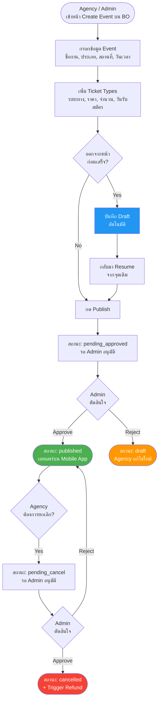
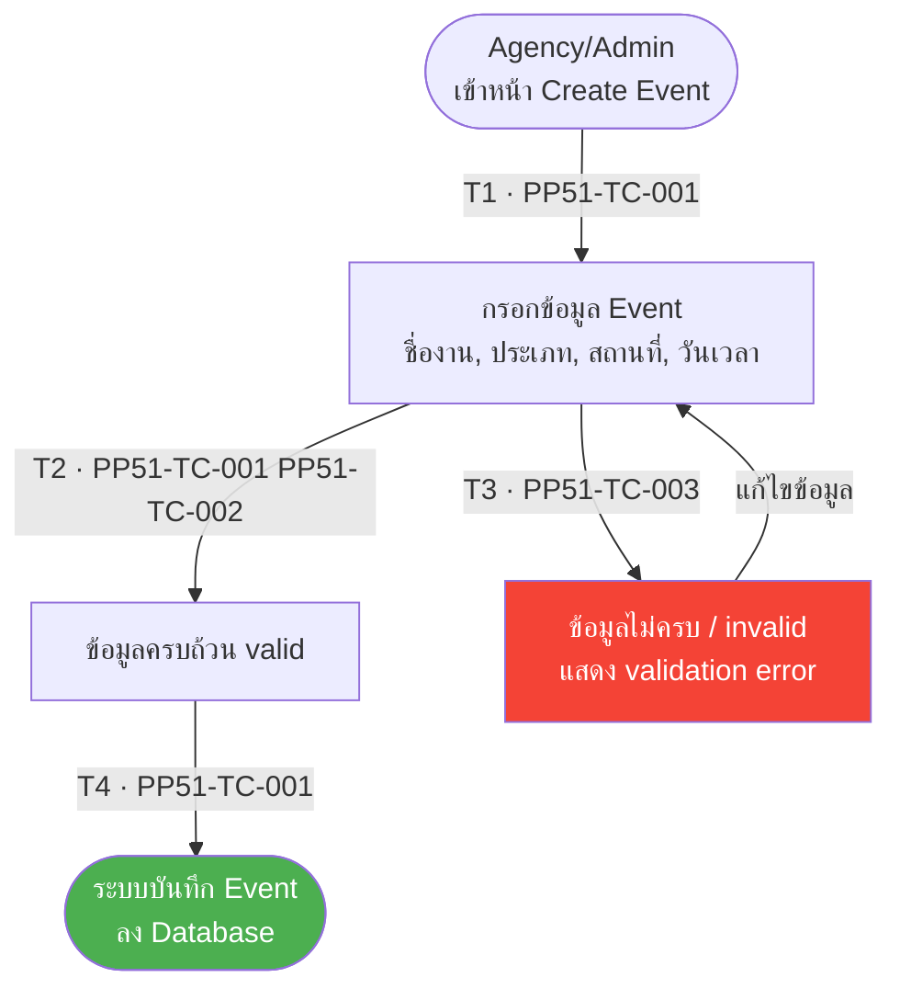
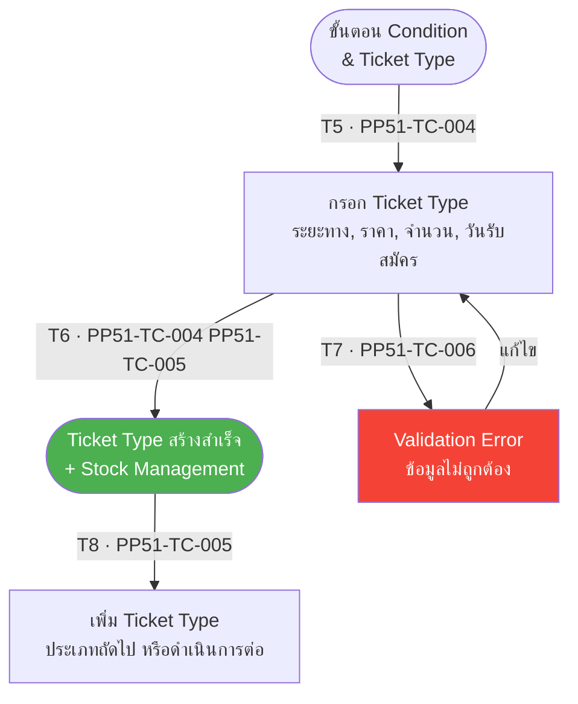
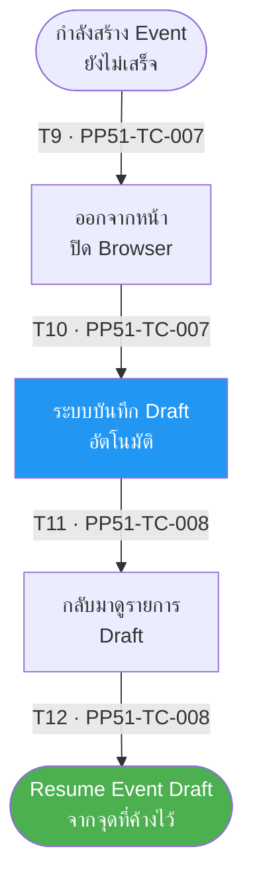
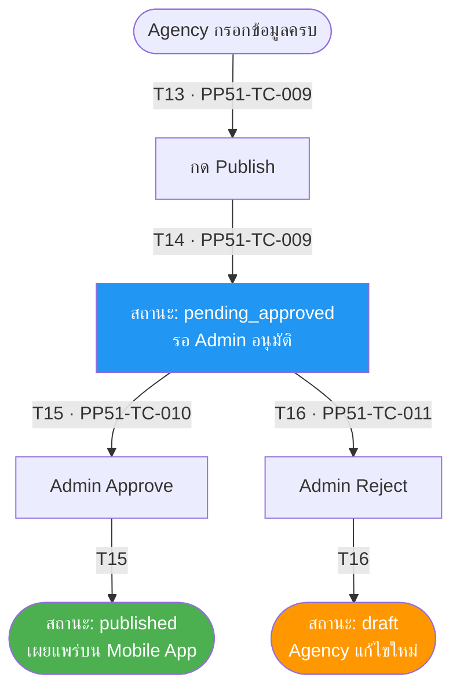
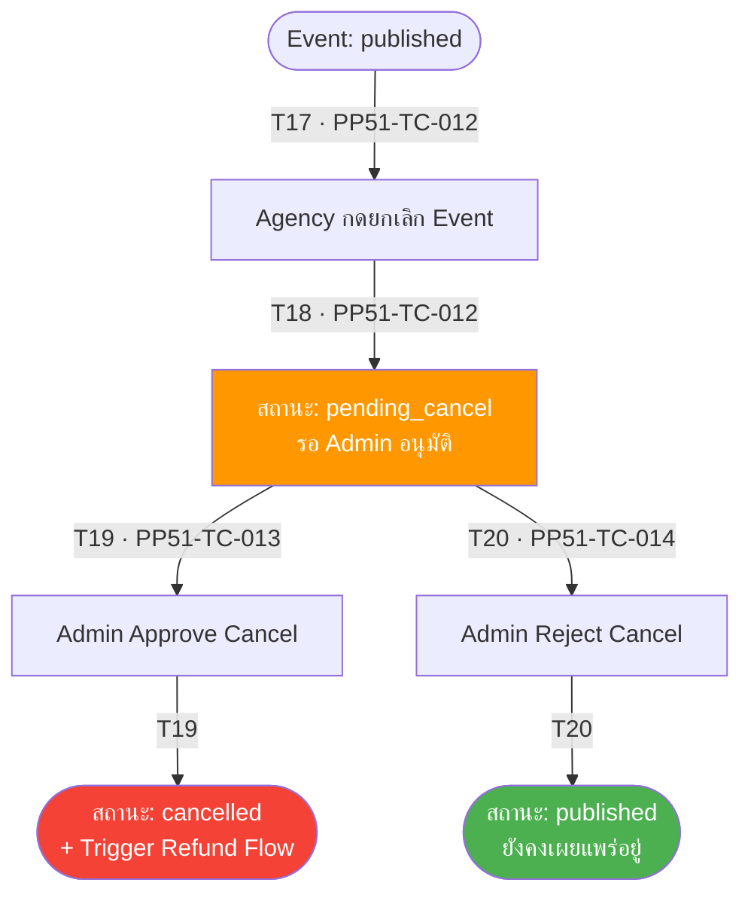

# PP-51 · Create Event Running — Flow Diagram

> Requirements → [PP-51_Create_Event_Running.md](../requirements/PP-51_Create_Event_Running/PP-51_Create_Event_Running.md)
> Jira → [PP-51](https://7-solutions.atlassian.net/browse/PP-51)
> Figma → [App UI Design](https://www.figma.com/design/PKyOOKQydjB98nVMOOyxy4/-PP--App-UI-Design)
> Test Design → [PP-51.design.md](./PP-51.design.md)

---

## Master Flow

---

## Sub-Flow 1: Create Event Information (Scenario 1)

### State & Transition Reference

| Ref ID | Type | Label |
|--------|------|-------|
| S1 | State | Agency/Admin อยู่ที่หน้า Create Event |
| S2 | State | กรอกข้อมูลพื้นฐาน (ชื่องาน, ประเภท, สถานที่, วันเวลา) |
| S3 | State | ข้อมูลครบถ้วน valid |
| S4 | State | ข้อมูลไม่ครบ / invalid |
| S5 | State | ระบบบันทึก Event ลง Database |
| T1 | Transition | เข้าหน้า Create Event |
| T2 | Transition | กรอกข้อมูลครบถ้วนและถูกต้อง |
| T3 | Transition | ข้อมูลไม่ครบหรือ invalid |
| T4 | Transition | บันทึกข้อมูลสำเร็จ |

---

## Sub-Flow 2: Event Items & Ticket Types (Scenario 2)

### State & Transition Reference

| Ref ID | Type | Label |
|--------|------|-------|
| S6 | State | ขั้นตอน Condition & Ticket Type |
| S7 | State | เพิ่ม Ticket Type (ระยะทาง, ราคา, จำนวน, วันรับสมัคร) |
| S8 | State | Ticket Type สร้างสำเร็จ + Stock Management |
| S9 | State | Ticket Type ข้อมูลไม่ถูกต้อง |
| T5 | Transition | เข้าขั้นตอน Ticket Type |
| T6 | Transition | เพิ่ม Ticket Type ข้อมูลถูกต้อง |
| T7 | Transition | Ticket Type ข้อมูลไม่ถูกต้อง (ราคา/จำนวนเป็น 0 หรือว่าง) |
| T8 | Transition | ระบบสร้าง Ticket Type + Stock |

---

## Sub-Flow 3: Event Draft (Scenario 3)

### State & Transition Reference

| Ref ID | Type | Label |
|--------|------|-------|
| S11 | State | กำลังสร้าง Event (ยังไม่เสร็จ) |
| S12 | State | ออกจากหน้า / ปิด Browser |
| S13 | State | ระบบบันทึก Draft อัตโนมัติ |
| S14 | State | กลับมา Resume จากจุดเดิม |
| T9 | Transition | ออกจากหน้าก่อนกด Publish |
| T10 | Transition | บันทึก Draft อัตโนมัติสำเร็จ |
| T11 | Transition | กลับเข้ามาดู Draft |
| T12 | Transition | Resume Event Draft จากจุดที่ค้างไว้ |

---

## Sub-Flow 4: Publish Event — Pending Approval (Scenario 4)

### State & Transition Reference

| Ref ID | Type | Label |
|--------|------|-------|
| S16 | State | Agency กรอกข้อมูล Event ครบถ้วน |
| S17 | State | กด Publish |
| S18 | State | สถานะ: pending_approved |
| S19 | State | Admin อนุมัติ |
| S20 | State | สถานะ: published |
| S21 | State | Admin ปฏิเสธ |
| S22 | State | สถานะ: draft (rejected) |
| T13 | Transition | กด Publish |
| T14 | Transition | สถานะเปลี่ยนเป็น pending_approved |
| T15 | Transition | Admin Approve → published |
| T16 | Transition | Admin Reject → draft |

---

## Sub-Flow 5: Cancel Event (Scenario 5)

### State & Transition Reference

| Ref ID | Type | Label |
|--------|------|-------|
| S23 | State | Event สถานะ published |
| S24 | State | Agency กดยกเลิก Event |
| S25 | State | สถานะ: pending_cancel |
| S26 | State | Admin อนุมัติ Cancel |
| S27 | State | สถานะ: cancelled + Trigger Refund |
| S28 | State | Admin ปฏิเสธ Cancel |
| S29 | State | สถานะ: published (ยังคงอยู่) |
| T17 | Transition | Agency กดยกเลิก Event |
| T18 | Transition | สถานะเปลี่ยนเป็น pending_cancel |
| T19 | Transition | Admin Approve Cancel → cancelled |
| T20 | Transition | Admin Reject Cancel → คงสถานะ published |

---

## State & Transition Coverage Summary

| Ref ID | Type | Label | Covered By TC |
|--------|------|-------|---------------|
| S1 | State | Agency/Admin อยู่ที่หน้า Create Event | PP51-TC-001 |
| S2 | State | กรอกข้อมูลพื้นฐาน | PP51-TC-001 PP51-TC-002 PP51-TC-003 |
| S3 | State | ข้อมูลครบถ้วน valid | PP51-TC-001 PP51-TC-002 |
| S4 | State | ข้อมูลไม่ครบ / invalid | PP51-TC-003 |
| S5 | State | ระบบบันทึก Event ลง Database | PP51-TC-001 |
| S6 | State | ขั้นตอน Condition & Ticket Type | PP51-TC-004 |
| S7 | State | กรอก Ticket Type | PP51-TC-004 PP51-TC-005 PP51-TC-006 |
| S8 | State | Ticket Type สร้างสำเร็จ + Stock | PP51-TC-004 PP51-TC-005 |
| S9 | State | Validation Error Ticket Type | PP51-TC-006 |
| S11 | State | กำลังสร้าง Event ยังไม่เสร็จ | PP51-TC-007 |
| S12 | State | ออกจากหน้า / ปิด Browser | PP51-TC-007 |
| S13 | State | ระบบบันทึก Draft อัตโนมัติ | PP51-TC-007 |
| S14 | State | กลับมา Resume Draft | PP51-TC-008 |
| S16 | State | Agency กรอกข้อมูลครบ | PP51-TC-009 |
| S17 | State | กด Publish | PP51-TC-009 |
| S18 | State | สถานะ: pending_approved | PP51-TC-009 PP51-TC-010 PP51-TC-011 |
| S19 | State | Admin Approve | PP51-TC-010 |
| S20 | State | สถานะ: published | PP51-TC-010 PP51-TC-014 |
| S21 | State | Admin Reject | PP51-TC-011 |
| S22 | State | สถานะ: draft (rejected) | PP51-TC-011 |
| S23 | State | Event: published | PP51-TC-012 |
| S24 | State | Agency กดยกเลิก | PP51-TC-012 |
| S25 | State | สถานะ: pending_cancel | PP51-TC-012 PP51-TC-013 PP51-TC-014 |
| S26 | State | Admin Approve Cancel | PP51-TC-013 |
| S27 | State | สถานะ: cancelled + Refund | PP51-TC-013 |
| S28 | State | Admin Reject Cancel | PP51-TC-014 |
| S29 | State | สถานะ: published (ยังคงอยู่) | PP51-TC-014 |
| T1 | Transition | เข้าหน้า Create Event | PP51-TC-001 |
| T2 | Transition | กรอกข้อมูลครบถ้วนและถูกต้อง | PP51-TC-001 PP51-TC-002 |
| T3 | Transition | ข้อมูลไม่ครบหรือ invalid | PP51-TC-003 |
| T4 | Transition | บันทึกข้อมูลสำเร็จ | PP51-TC-001 |
| T5 | Transition | เข้าขั้นตอน Ticket Type | PP51-TC-004 |
| T6 | Transition | เพิ่ม Ticket Type ข้อมูลถูกต้อง | PP51-TC-004 PP51-TC-005 |
| T7 | Transition | Ticket Type ข้อมูลไม่ถูกต้อง | PP51-TC-006 |
| T8 | Transition | ระบบสร้าง Ticket Type + Stock | PP51-TC-004 PP51-TC-005 |
| T9 | Transition | ออกจากหน้าก่อนกด Publish | PP51-TC-007 |
| T10 | Transition | บันทึก Draft อัตโนมัติสำเร็จ | PP51-TC-007 |
| T11 | Transition | กลับเข้ามาดู Draft | PP51-TC-008 |
| T12 | Transition | Resume Event Draft | PP51-TC-008 |
| T13 | Transition | กด Publish | PP51-TC-009 |
| T14 | Transition | สถานะเปลี่ยนเป็น pending_approved | PP51-TC-009 |
| T15 | Transition | Admin Approve → published | PP51-TC-010 |
| T16 | Transition | Admin Reject → draft | PP51-TC-011 |
| T17 | Transition | Agency กดยกเลิก Event | PP51-TC-012 |
| T18 | Transition | สถานะเปลี่ยนเป็น pending_cancel | PP51-TC-012 |
| T19 | Transition | Admin Approve Cancel → cancelled | PP51-TC-013 |
| T20 | Transition | Admin Reject Cancel → published | PP51-TC-014 |
