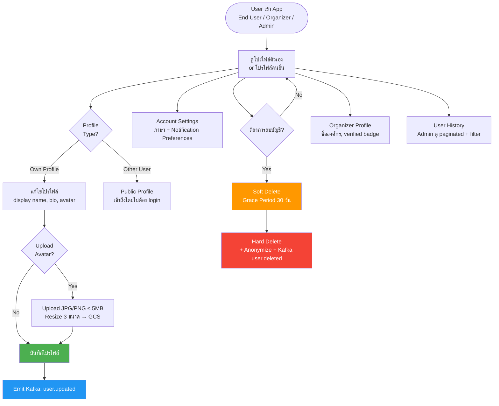
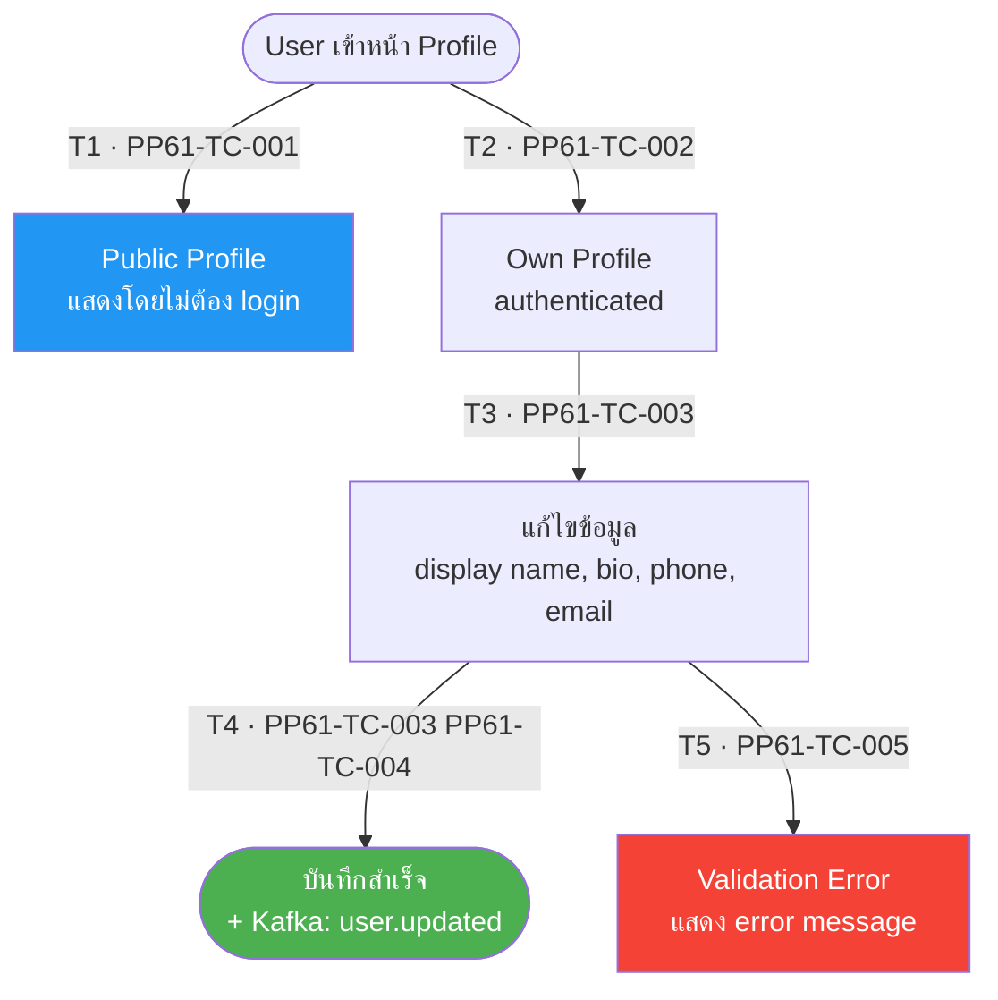
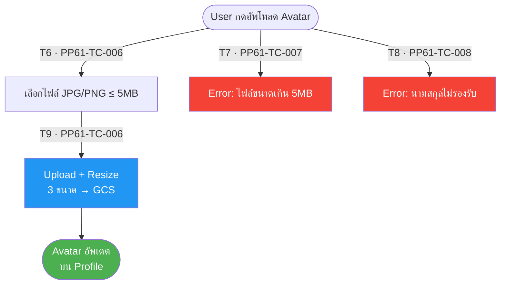
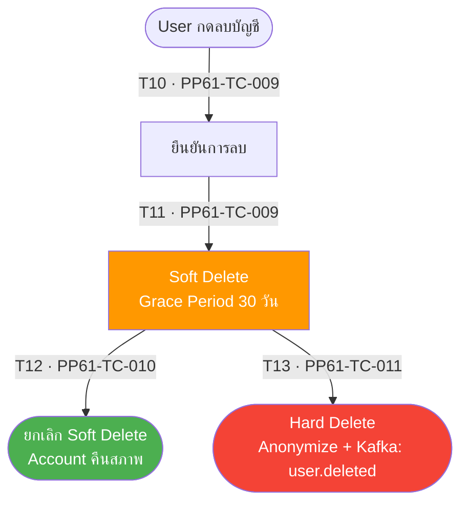
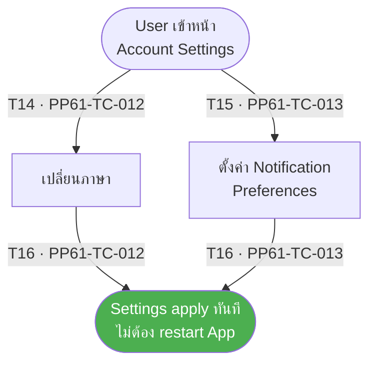
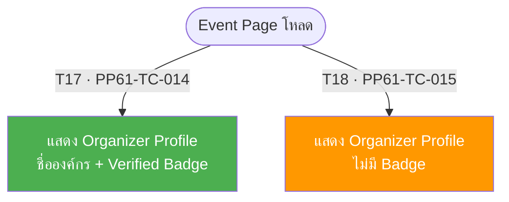
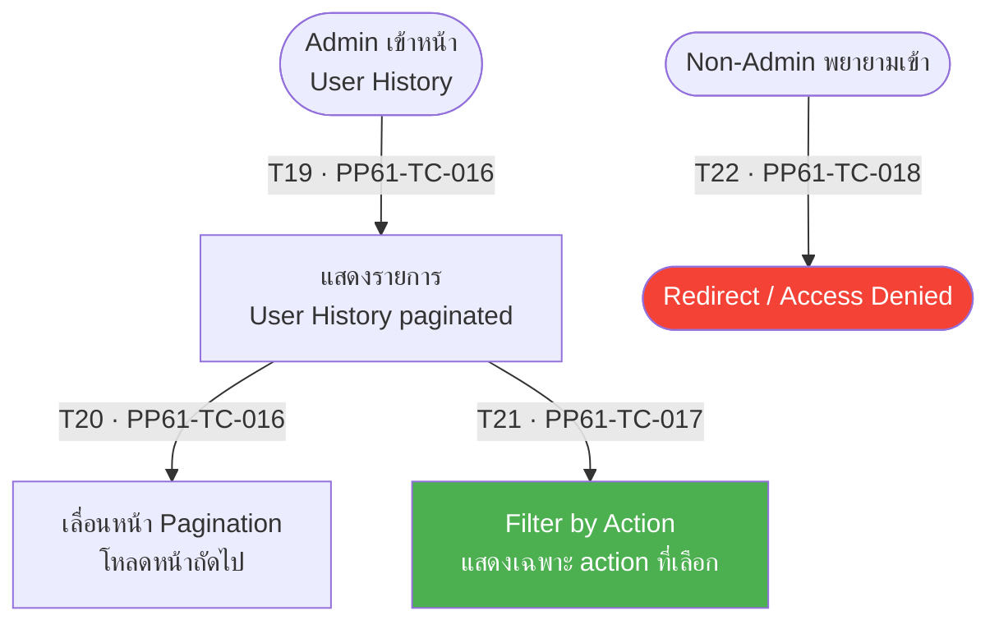

# PP-61 · Epic 2 — User Profile — Flow Diagram

> Requirements → [PP-61_Epic_2_User_Profile.md](../requirements/PP-61_Epic_2_User_Profile/PP-61_Epic_2_User_Profile.md)
> Jira → [PP-61](https://7-solutions.atlassian.net/browse/PP-61)
> Figma → [App UI Design](https://www.figma.com/design/PKyOOKQydjB98nVMOOyxy4/-PP--App-UI-Design)
> Test Design → [PP-61.design.md](./PP-61.design.md)

---

## Master Flow

---

## Sub-Flow 1: View & Edit Profile (AC 1.1, 1.2)

### State & Transition Reference

| Ref ID | Type | Label |
|--------|------|-------|
| S1 | State | User เข้าหน้า Profile |
| S2 | State | แสดง Public Profile (ไม่ต้อง login) |
| S3 | State | แสดง Own Profile |
| S4 | State | แก้ไขข้อมูล (display name, bio, phone, email) |
| S5 | State | ข้อมูล valid — บันทึกสำเร็จ |
| S6 | State | ข้อมูล invalid — แสดง validation error |
| T1 | Transition | ดู Public Profile โดยไม่ล็อกอิน |
| T2 | Transition | ดู Own Profile (authenticated) |
| T3 | Transition | กดแก้ไขโปรไฟล์ |
| T4 | Transition | กรอกข้อมูลถูกต้อง กดบันทึก |
| T5 | Transition | กรอกข้อมูลไม่ถูกต้อง |

---

## Sub-Flow 2: Avatar Upload (AC 2.1)

### State & Transition Reference

| Ref ID | Type | Label |
|--------|------|-------|
| S7 | State | User กดอัพโหลด Avatar |
| S8 | State | เลือกไฟล์ JPG/PNG ≤ 5MB |
| S9 | State | ไฟล์ valid — Upload + Resize 3 ขนาด → GCS |
| S10 | State | ไฟล์ไม่ valid (นามสกุลผิด หรือ > 5MB) |
| S11 | State | Avatar อัพเดตสำเร็จบน Profile |
| T6 | Transition | เลือกไฟล์ JPG/PNG ≤ 5MB (valid) |
| T7 | Transition | เลือกไฟล์ > 5MB (invalid size) |
| T8 | Transition | เลือกไฟล์นามสกุลไม่รองรับ (e.g. GIF) |
| T9 | Transition | Upload + Resize สำเร็จ |

---

## Sub-Flow 3: Account Lifecycle — Delete Account (AC 3.1, 3.2)

### State & Transition Reference

| Ref ID | Type | Label |
|--------|------|-------|
| S12 | State | User กดลบบัญชี |
| S13 | State | ยืนยันการลบ |
| S14 | State | Soft Delete — Grace Period 30 วัน |
| S15 | State | ยกเลิก Soft Delete (ภายใน 30 วัน) |
| S16 | State | Hard Delete — Anonymize + Kafka user.deleted |
| T10 | Transition | กดลบบัญชีและยืนยัน |
| T11 | Transition | Soft Delete สำเร็จ (Grace Period เริ่มนับ) |
| T12 | Transition | ยกเลิก (ภายใน Grace Period) — account คืนสภาพ |
| T13 | Transition | หมด Grace Period 30 วัน → Hard Delete |

---

## Sub-Flow 4: Account Settings (AC 2.4)

### State & Transition Reference

| Ref ID | Type | Label |
|--------|------|-------|
| S17 | State | User เข้าหน้า Account Settings |
| S18 | State | เปลี่ยนภาษา |
| S19 | State | ตั้งค่า Notification Preferences |
| S20 | State | Settings apply ทันที |
| T14 | Transition | เลือกภาษาใหม่ |
| T15 | Transition | เปลี่ยน Notification Preference |
| T16 | Transition | บันทึกและ apply ทันที |

---

## Sub-Flow 5: Organizer Profile (AC 4.1)

### State & Transition Reference

| Ref ID | Type | Label |
|--------|------|-------|
| S21 | State | Organizer Profile แสดงบน Event Page |
| S22 | State | แสดง: ชื่อองค์กร, description, verified badge |
| S23 | State | Organizer ไม่ผ่าน Verification — ไม่แสดง badge |
| T17 | Transition | Event page โหลด — Organizer verified |
| T18 | Transition | Event page โหลด — Organizer ไม่ผ่าน verification |

---

## Sub-Flow 6: Admin View User History (AC 5.1)

### State & Transition Reference

| Ref ID | Type | Label |
|--------|------|-------|
| S24 | State | Admin เข้าหน้า User History |
| S25 | State | แสดงรายการ paginated |
| S26 | State | Filter by action |
| S27 | State | User ที่ไม่ใช่ Admin พยายามเข้า |
| S28 | State | Redirect / Access Denied |
| T19 | Transition | Admin เข้าหน้า User History |
| T20 | Transition | เลื่อนหน้า (pagination) |
| T21 | Transition | Filter by action |
| T22 | Transition | Non-Admin พยายามเข้า — Redirect |

---

## State & Transition Coverage Summary

| Ref ID | Type | Label | Covered By TC |
|--------|------|-------|---------------|
| S1 | State | User เข้าหน้า Profile | PP61-TC-001 PP61-TC-002 |
| S2 | State | Public Profile (ไม่ต้อง login) | PP61-TC-001 |
| S3 | State | Own Profile (authenticated) | PP61-TC-002 PP61-TC-003 |
| S4 | State | แก้ไขข้อมูล | PP61-TC-003 PP61-TC-004 PP61-TC-005 |
| S5 | State | บันทึกสำเร็จ | PP61-TC-003 PP61-TC-004 |
| S6 | State | Validation Error | PP61-TC-005 |
| S7 | State | User กดอัพโหลด Avatar | PP61-TC-006 PP61-TC-007 PP61-TC-008 |
| S8 | State | เลือกไฟล์ valid | PP61-TC-006 |
| S9 | State | Upload + Resize → GCS | PP61-TC-006 |
| S10 | State | ไฟล์ invalid | PP61-TC-007 PP61-TC-008 |
| S11 | State | Avatar อัพเดตสำเร็จ | PP61-TC-006 |
| S12 | State | User กดลบบัญชี | PP61-TC-009 |
| S13 | State | ยืนยันการลบ | PP61-TC-009 |
| S14 | State | Soft Delete Grace Period 30 วัน | PP61-TC-009 PP61-TC-010 PP61-TC-011 |
| S15 | State | ยกเลิก Soft Delete | PP61-TC-010 |
| S16 | State | Hard Delete + Anonymize | PP61-TC-011 |
| S17 | State | User เข้า Account Settings | PP61-TC-012 PP61-TC-013 |
| S18 | State | เปลี่ยนภาษา | PP61-TC-012 |
| S19 | State | ตั้งค่า Notification | PP61-TC-013 |
| S20 | State | Settings apply ทันที | PP61-TC-012 PP61-TC-013 |
| S21 | State | Event Page โหลด | PP61-TC-014 PP61-TC-015 |
| S22 | State | Organizer Profile + Verified Badge | PP61-TC-014 |
| S23 | State | Organizer Profile ไม่มี Badge | PP61-TC-015 |
| S24 | State | Admin เข้าหน้า User History | PP61-TC-016 PP61-TC-017 |
| S25 | State | รายการ paginated | PP61-TC-016 |
| S26 | State | Filter by action | PP61-TC-017 |
| S27 | State | Non-Admin พยายามเข้า | PP61-TC-018 |
| S28 | State | Redirect / Access Denied | PP61-TC-018 |
| T1 | Transition | ดู Public Profile โดยไม่ล็อกอิน | PP61-TC-001 |
| T2 | Transition | ดู Own Profile (authenticated) | PP61-TC-002 |
| T3 | Transition | กดแก้ไขโปรไฟล์ | PP61-TC-003 |
| T4 | Transition | กรอกข้อมูลถูกต้อง บันทึก | PP61-TC-003 PP61-TC-004 |
| T5 | Transition | กรอกข้อมูลไม่ถูกต้อง | PP61-TC-005 |
| T6 | Transition | เลือกไฟล์ JPG/PNG ≤ 5MB | PP61-TC-006 |
| T7 | Transition | ไฟล์ > 5MB | PP61-TC-007 |
| T8 | Transition | นามสกุลไม่รองรับ | PP61-TC-008 |
| T9 | Transition | Upload + Resize สำเร็จ | PP61-TC-006 |
| T10 | Transition | กดลบบัญชีและยืนยัน | PP61-TC-009 |
| T11 | Transition | Soft Delete สำเร็จ | PP61-TC-009 |
| T12 | Transition | ยกเลิกภายใน Grace Period | PP61-TC-010 |
| T13 | Transition | Hard Delete หลัง 30 วัน | PP61-TC-011 |
| T14 | Transition | เลือกภาษาใหม่ | PP61-TC-012 |
| T15 | Transition | เปลี่ยน Notification Preference | PP61-TC-013 |
| T16 | Transition | บันทึก Settings apply ทันที | PP61-TC-012 PP61-TC-013 |
| T17 | Transition | Event page — Organizer verified | PP61-TC-014 |
| T18 | Transition | Event page — Organizer ไม่ verified | PP61-TC-015 |
| T19 | Transition | Admin เข้า User History | PP61-TC-016 |
| T20 | Transition | Pagination | PP61-TC-016 |
| T21 | Transition | Filter by action | PP61-TC-017 |
| T22 | Transition | Non-Admin → Redirect | PP61-TC-018 |
