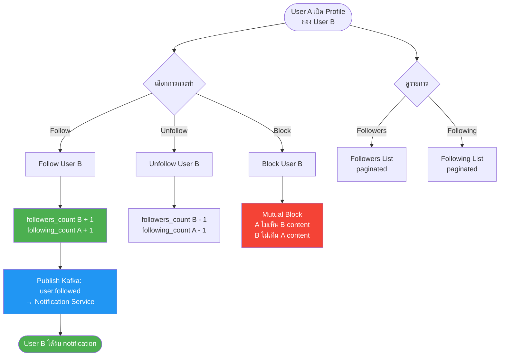
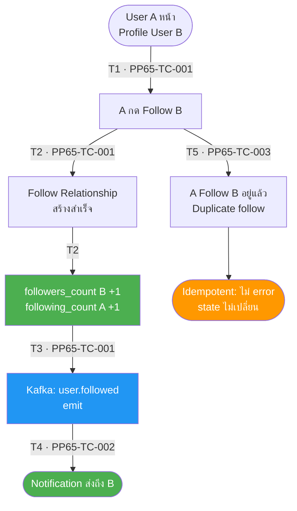
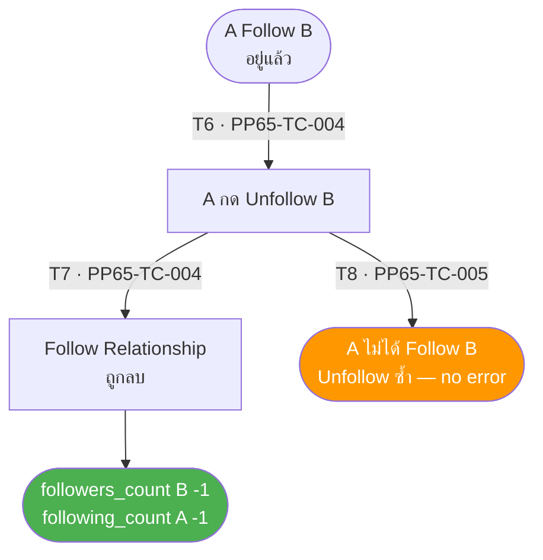
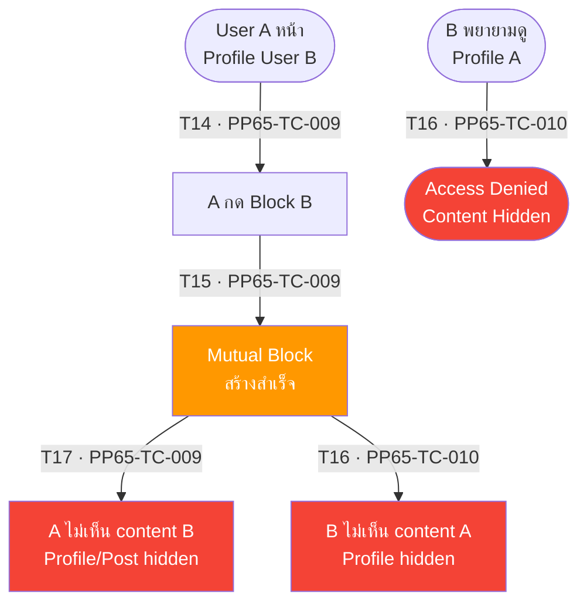

# PP-65 · Epic 3 — Social Graph — Flow Diagram

> Requirements → [PP-65_Epic_3_Social_Graph.md](../requirements/PP-65_Epic_3_Social_Graph/PP-65_Epic_3_Social_Graph.md)
> Jira → [PP-65](https://7-solutions.atlassian.net/browse/PP-65)
> Figma → [App UI Design](https://www.figma.com/design/PKyOOKQydjB98nVMOOyxy4/-PP--App-UI-Design)
> Test Design → [PP-65.design.md](./PP-65.design.md)

---

## Master Flow



---

## Sub-Flow 1: Follow User (AC 1.1, 1.2)

### State & Transition Reference

| Ref ID | Type | Label |
|--------|------|-------|
| S1 | State | User A อยู่หน้า Profile User B |
| S2 | State | A กด Follow B |
| S3 | State | Follow Relationship สร้างสำเร็จ |
| S4 | State | followers_count (B) + 1, following_count (A) + 1 |
| S5 | State | Kafka: user.followed emit |
| S6 | State | Notification Service แจ้งเตือน B |
| S7 | State | A Follow B อยู่แล้ว (duplicate follow attempt) |
| T1 | Transition | กด Follow |
| T2 | Transition | Relationship สร้างสำเร็จ — count อัปเดต |
| T3 | Transition | Kafka publish สำเร็จ |
| T4 | Transition | Notification ส่งถึง B |
| T5 | Transition | Duplicate follow — ระบบ handle idempotently |



---

## Sub-Flow 2: Unfollow User (AC 1.3)

### State & Transition Reference

| Ref ID | Type | Label |
|--------|------|-------|
| S9 | State | A Follow B อยู่แล้ว |
| S10 | State | A กด Unfollow B |
| S11 | State | Follow Relationship ถูกลบ |
| S12 | State | followers_count (B) - 1, following_count (A) - 1 |
| S13 | State | A ไม่ได้ Follow B (Unfollow ซ้ำ) |
| T6 | Transition | กด Unfollow |
| T7 | Transition | Relationship ลบสำเร็จ — count อัปเดต |
| T8 | Transition | Unfollow ซ้ำ — idempotent |



---

## Sub-Flow 3: Followers & Following Lists (AC 2.1, 2.2)

### State & Transition Reference

| Ref ID | Type | Label |
|--------|------|-------|
| S14 | State | User เข้าดู Followers List |
| S15 | State | แสดงรายการ paginated (avatar, display name, follow status) |
| S16 | State | User เข้าดู Following List |
| S17 | State | แสดงรายการ paginated (avatar, display name, follow status) |
| S18 | State | รายการว่าง (ยังไม่มี follower/following) |
| T9 | Transition | เปิด Followers List |
| T10 | Transition | เลื่อนหน้า (pagination) Followers |
| T11 | Transition | เปิด Following List |
| T12 | Transition | เลื่อนหน้า (pagination) Following |
| T13 | Transition | Followers/Following = 0 → Empty state |

```mermaid
flowchart TD
    S14([User เข้า\nFollowers List]) -->|"T9 · PP65-TC-006"| S15[แสดงรายการ paginated\navatar, display name, follow status]
    S15 -->|"T10 · PP65-TC-006"| S15B[โหลดหน้าถัดไป\npagination]
    S16([User เข้า\nFollowing List]) -->|"T11 · PP65-TC-007"| S17[แสดงรายการ paginated\navatar, display name, follow status]
    S17 -->|"T12 · PP65-TC-007"| S17B[โหลดหน้าถัดไป]
    S14 -->|"T13 · PP65-TC-008"| S18([Empty State\n"ยังไม่มี Followers"])
    S16 -->|"T13 · PP65-TC-008"| S18

    style S15 fill:#4CAF50,color:#fff
    style S17 fill:#4CAF50,color:#fff
    style S18 fill:#FF9800,color:#fff
```

---

## Sub-Flow 4: Block User (AC 3.1, 3.2)

### State & Transition Reference

| Ref ID | Type | Label |
|--------|------|-------|
| S19 | State | User A อยู่หน้า Profile User B |
| S20 | State | A กด Block B |
| S21 | State | Block Relationship สร้าง (mutual) |
| S22 | State | A ไม่เห็น content ของ B |
| S23 | State | B ไม่เห็น content ของ A |
| S24 | State | B พยายามดู Profile A |
| S25 | State | Access Denied / Hidden |
| T14 | Transition | กด Block |
| T15 | Transition | Mutual block สำเร็จ — A ไม่เห็น B |
| T16 | Transition | B พยายามเข้า Profile A — denied |
| T17 | Transition | A พยายามเห็น content B — hidden |



---

## State & Transition Coverage Summary

| Ref ID | Type | Label | Covered By TC |
|--------|------|-------|---------------|
| S1 | State | User A หน้า Profile User B | PP65-TC-001 PP65-TC-003 |
| S2 | State | A กด Follow B | PP65-TC-001 PP65-TC-003 |
| S3 | State | Follow Relationship สร้างสำเร็จ | PP65-TC-001 |
| S4 | State | followers_count B +1, following_count A +1 | PP65-TC-001 |
| S5 | State | Kafka: user.followed emit | PP65-TC-001 |
| S6 | State | Notification ส่งถึง B | PP65-TC-002 |
| S7 | State | Duplicate follow attempt | PP65-TC-003 |
| S9 | State | A Follow B อยู่แล้ว | PP65-TC-004 |
| S10 | State | A กด Unfollow B | PP65-TC-004 PP65-TC-005 |
| S11 | State | Follow Relationship ถูกลบ | PP65-TC-004 |
| S12 | State | followers_count B -1 | PP65-TC-004 |
| S13 | State | Unfollow ซ้ำ — idempotent | PP65-TC-005 |
| S14 | State | User เข้า Followers List | PP65-TC-006 PP65-TC-008 |
| S15 | State | Followers List paginated | PP65-TC-006 |
| S16 | State | User เข้า Following List | PP65-TC-007 PP65-TC-008 |
| S17 | State | Following List paginated | PP65-TC-007 |
| S18 | State | Empty state (no followers/following) | PP65-TC-008 |
| S19 | State | User A หน้า Profile User B (Block) | PP65-TC-009 |
| S20 | State | A กด Block B | PP65-TC-009 |
| S21 | State | Mutual Block สร้างสำเร็จ | PP65-TC-009 PP65-TC-010 |
| S22 | State | A ไม่เห็น content B | PP65-TC-009 |
| S23 | State | B ไม่เห็น content A | PP65-TC-010 |
| S24 | State | B พยายามดู Profile A | PP65-TC-010 |
| S25 | State | Access Denied / Content Hidden | PP65-TC-010 |
| T1 | Transition | กด Follow | PP65-TC-001 |
| T2 | Transition | Relationship สร้างสำเร็จ | PP65-TC-001 |
| T3 | Transition | Kafka publish สำเร็จ | PP65-TC-001 |
| T4 | Transition | Notification ส่งถึง B | PP65-TC-002 |
| T5 | Transition | Duplicate follow — idempotent | PP65-TC-003 |
| T6 | Transition | กด Unfollow | PP65-TC-004 |
| T7 | Transition | Relationship ลบสำเร็จ | PP65-TC-004 |
| T8 | Transition | Unfollow ซ้ำ — no error | PP65-TC-005 |
| T9 | Transition | เปิด Followers List | PP65-TC-006 |
| T10 | Transition | Pagination Followers | PP65-TC-006 |
| T11 | Transition | เปิด Following List | PP65-TC-007 |
| T12 | Transition | Pagination Following | PP65-TC-007 |
| T13 | Transition | Empty state | PP65-TC-008 |
| T14 | Transition | กด Block | PP65-TC-009 |
| T15 | Transition | Mutual block สำเร็จ | PP65-TC-009 |
| T16 | Transition | B ไม่เห็น content A | PP65-TC-010 |
| T17 | Transition | A ไม่เห็น content B | PP65-TC-009 |
