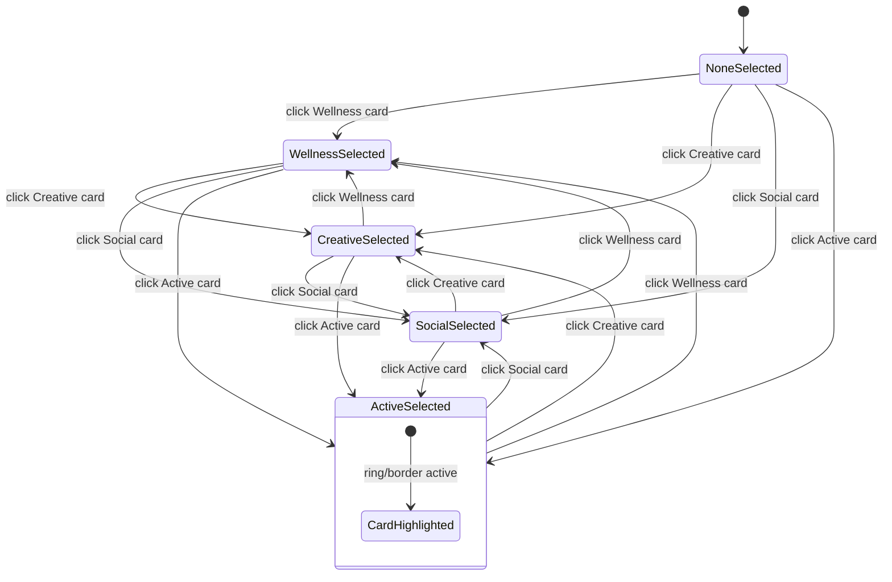
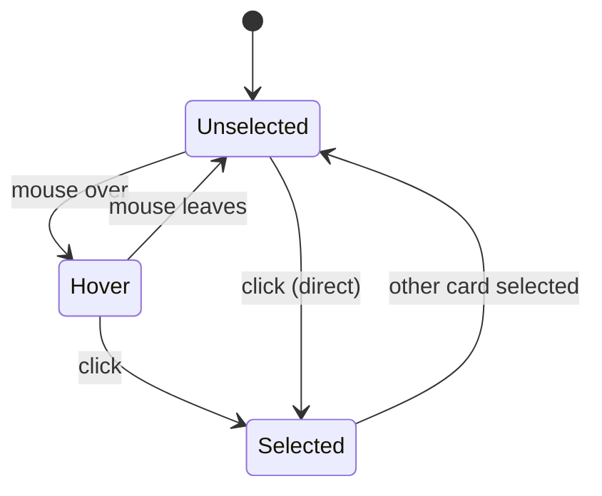
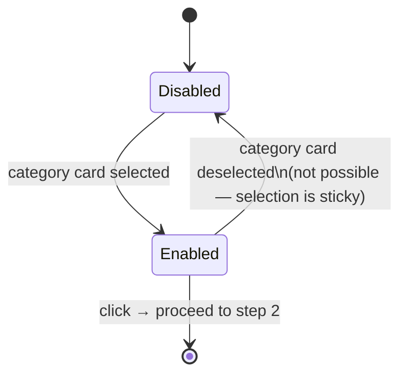
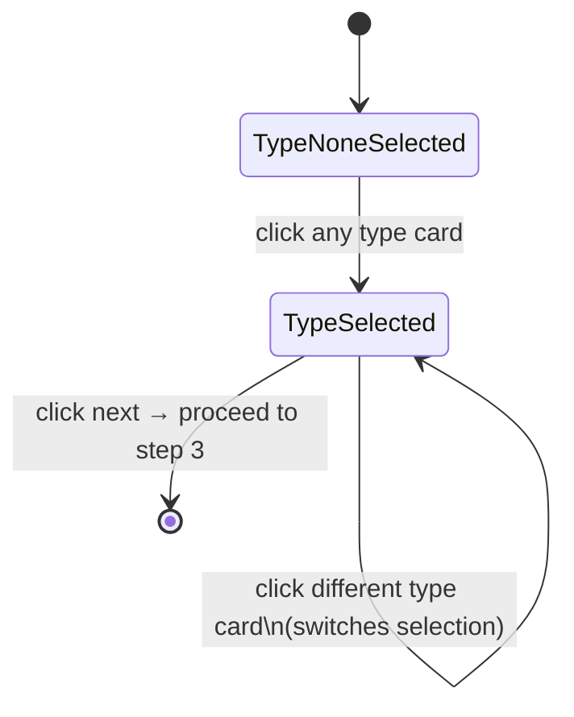
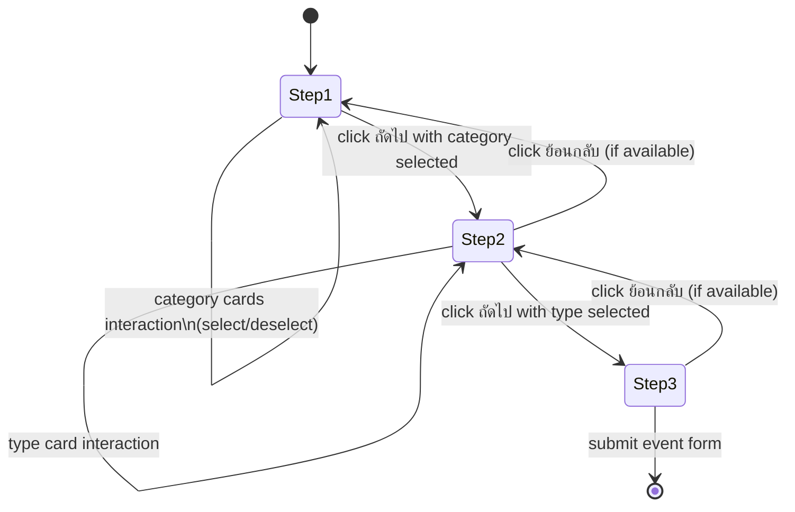

# Event Create — State Diagram

Route: `/event/create`

## Steps & Elements

### Step 1 — Category Selection

| Element | Type | Options |
|---|---|---|
| Active card | `button[class*="cursor-pointer h-28"]` | "Active / กิจกรรมเคลื่อนไหว" |
| Wellness card | `button[class*="cursor-pointer h-28"]` | "Wellness / สุขภาวะที่ดีทั้งกายใจ" |
| Creative card | `button[class*="cursor-pointer h-28"]` | "Creative / ความคิดสร้างสรรค์และแรงบันดาลใจ" |
| Social card | `button[class*="cursor-pointer h-28"]` | "Social / เชื่อมต่อกับสังคม" |
| Next Button | `button[type="button"]` | "ถัดไป" — disabled until a card is selected |

### Step 2 — Event Type Selection (within chosen category)

| Element | Type | Options (example: Active category) |
|---|---|---|
| Type card | `button[class*="cursor-pointer h-28"]` | "Running / Marathon — วิ่ง / มาราธ" |
| Type card | `button[class*="cursor-pointer h-28"]` | "Cycling — ปั่นจักรยาน" |
| Type card | `button[class*="cursor-pointer h-28"]` | "Sports Competition — การแข่งขันกี" |
| Type card | `button[class*="cursor-pointer h-28"]` | "Fitness / Yoga — ฟิตเนส / โยคะ" |
| Next Button | `button` | "ถัดไป" |

### Step 3 — Event Form (date/time, details, etc.)

Note: Step 3 was reached but no input fields were visible at the scroll position captured. Further scrolling required.

## States

| State | Description |
|---|---|
| Step 1 — Init | 4 category cards rendered. None selected. Next button disabled. |
| Category Card — Default | Card in neutral unselected state. |
| Category Card — Hover | Mouse over card. Visual highlight (border, shadow). |
| Category Card — Selected | Card clicked. Card shows active/selected indicator (e.g., ring, colored border, checkmark). Other cards return to default. |
| Next Button — Disabled | No category selected. Button is `disabled` / `data-disabled`. Cannot be clicked. |
| Next Button — Enabled | A category is selected. Button becomes active. |
| Next Button — Hover (enabled) | Mouse over enabled next button. Visual highlight. |
| Step 2 — Init | Category confirmed. Event type cards rendered for selected category. None selected. |
| Type Card — Default | Card in neutral unselected state. |
| Type Card — Hover | Mouse over card. Visual highlight. |
| Type Card — Selected | Card clicked. Selected indicator shown. Other type cards deselected. |
| Step 3 — Init | Event form appears with input fields for event details (name, date, description, etc.). |

## Element Validate

| Scope | Scenario | Count |
|---|---|---|
| Step 1 | Init (no selection) — next button disabled | × 1 |
| Step 1 | Select category → next button enables | × 1 |
| Step 1 | Card hover → visual highlight | × 4 |
| Step 1 | Card selected → active indicator | × 4 |
| Step 1 | Switch category selection | × 1 |
| Step 1 | Click next (category selected) → step 2 | × 1 |
| Step 2 | Init — type cards rendered for chosen category | × 1 |
| Step 2 | Type card hover → visual highlight | × N |
| Step 2 | Type card selected → active indicator | × N |
| Step 2 | Click next (type selected) → step 3 | × 1 |

## State Diagrams

### 1. Category Cards — Selection Scope (Step 1)

### 2. Category Card — Hover & Selection Scope

### 3. Next Button — Enablement Scope (Step 1)

### 4. Event Type Cards — Selection Scope (Step 2)

### 5. Full Flow — Page Lifecycle

## Screenshots Reference

| State | Screenshot |
|---|---|
| Step 1 — init (no selection) |  |
| Step 1 — next button disabled |  |
| Category Active — hover |  |
| Category Active — selected |  |
| Step 1 — next button enabled |  |
| Category Wellness — hover |  |
| Category Wellness — selected |  |
| Step 2 — init |  |
| Type 0 (Running) — hover |  |
| Type 0 (Running) — selected |  |
| Type 1 (Cycling) — hover |  |
| Type 1 (Cycling) — selected |  |
| Step 3 — init |  |

## Notes

- **Next button disabled state**: The Next button (step 1) has `data-disabled` attribute and is genuinely disabled when no category is selected. It becomes enabled only after a category card is clicked. This is a distinct state from the default hover state.
- **Category card buttons**: Category cards are `button` elements with class `cursor-pointer h-28`. The sidebar also has `cursor-pointer` buttons — category cards are distinguished by `h-28` (fixed height 112px).
- **Event type cards in step 2**: Type cards shown in step 2 are specific to the selected category. For "Active" category: Running/Marathon, Cycling, Sports Competition, Fitness/Yoga. Other categories would show different type options.
- **Step 3 form**: No input fields were visible at the initial scroll position of step 3. The form content requires scrolling. Manual exploration needed for step 3 fields.
- **Modal overlay interference**: During automation, clicking "ถัดไป" was blocked in some states by an overlay div (inert presentation layer). Force-click was used to proceed. This may indicate a modal/dialog was open in the background.
- **Create event blocked for Pending accounts**: Attempting to reach `/event/create` from the event list shows a blocking dialog "กรุณายื่นเอกสารก่อนสร้างอีเวนต์" for PENDING_SUBMISSION accounts. Direct URL navigation bypasses this in the staging environment.
