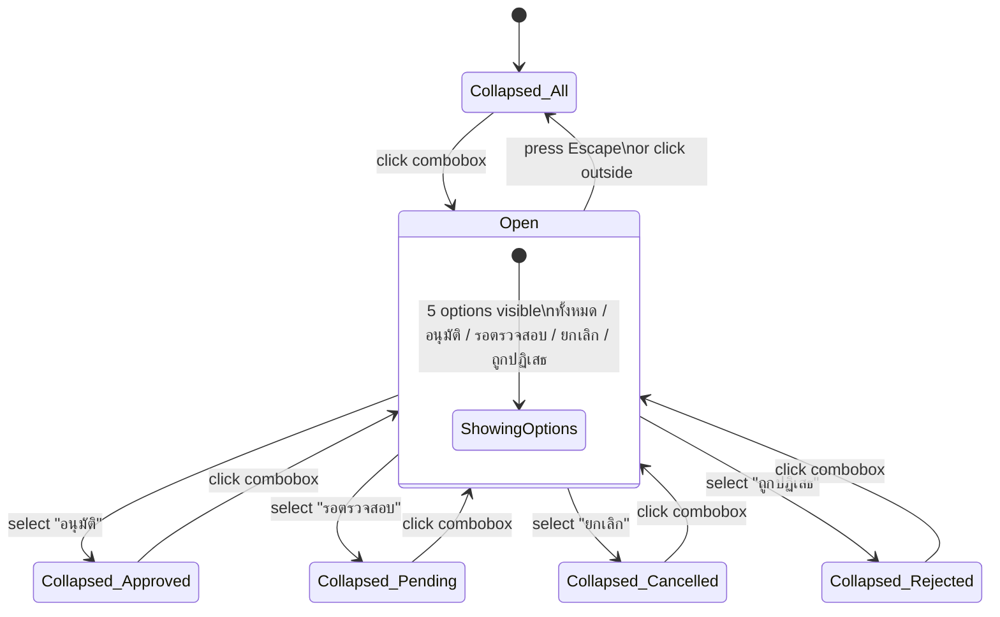
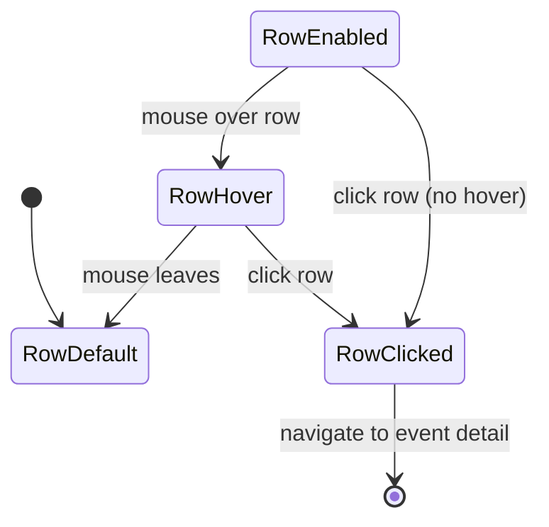
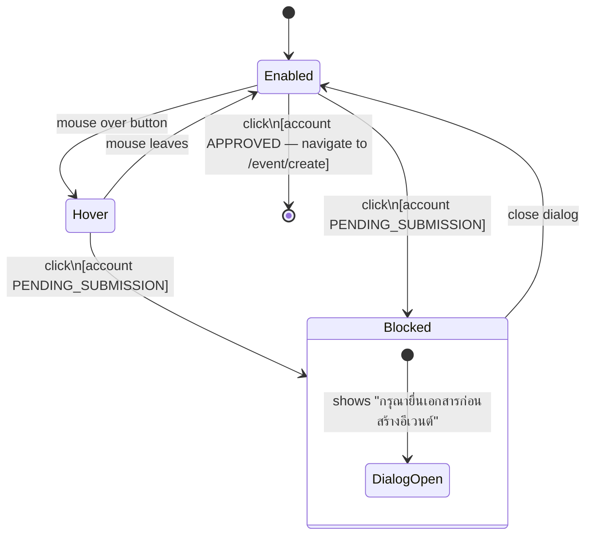
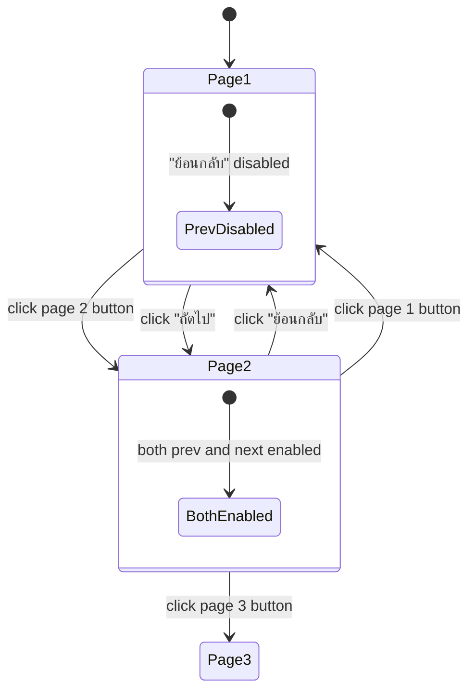

# Event List — State Diagram

Route: `/event`

## Elements Found

| Element | Type | Detail |
|---|---|---|
| Status Filter | `[role="combobox"]` | Default: "ทั้งหมด▼". Options: ทั้งหมด / อนุมัติ / รอตรวจสอบ / ยกเลิก / ถูกปฏิเสธ |
| Create Event Button | `button` | Text "+ สร้างอีเวนต์" |
| Table Rows | `tbody tr` | 5 rows visible per page |
| Pagination — Prev | `a[role="button"]` | Text "ย้อนกลับ" |
| Pagination — Page Number | `a[role="button"]` | Numbers: 1, 2, …, 9, 10 |
| Pagination — Next | `a[role="button"]` | Text "ถัดไป" |

## States

| State | Description |
|---|---|
| Page — Init | Event list loaded. Table shows all events. Filter at "ทั้งหมด". |
| Filter — Default | Combobox showing "ทั้งหมด▼". Collapsed. |
| Filter — Hover | Mouse over combobox. Visual highlight. |
| Filter — Open | Combobox clicked. Dropdown shows 5 options. |
| Filter — Selected | Option selected. Combobox displays selected option. Table re-filters. |
| Table — Empty | No events match filter. Empty state shown. |
| Table Row — Default | Row rendered with event data. No hover. |
| Table Row — Hover | Mouse over row. Row background changes (highlighted). |
| Table Row — Clicked | Row clicked. Detail modal or detail page opens. |
| Create Button — Default | "+ สร้างอีเวนต์" button. Enabled. |
| Create Button — Hover | Button visual changes on hover. |
| Create Button — Blocked (Pending) | Account is PENDING_SUBMISSION. Clicking opens a dialog: "กรุณายื่นเอกสารก่อนสร้างอีเวนต์". |
| Pagination — Default | Page number buttons rendered. Current page highlighted. |
| Pagination — Prev — Disabled | On page 1. "ย้อนกลับ" button greyed/disabled. |
| Pagination — Next — Enabled | On page 1. "ถัดไป" enabled. |
| Pagination — Page N — Hover | Mouse over a page number button. |
| Pagination — Page N — Active | Current page number highlighted. |

## Element Validate

| Scope | Scenario | Count |
|---|---|---|
| Filter | Default → Open (click) | × 1 |
| Filter | Open → Close (Escape or click outside) | × 1 |
| Filter | Select "อนุมัติ" → table shows approved events only | × 1 |
| Filter | Select "รอตรวจสอบ" → table shows pending events | × 1 |
| Filter | Select "ยกเลิก" → table shows cancelled events | × 1 |
| Filter | Select "ถูกปฏิเสธ" → table shows rejected events | × 1 |
| Filter | Select "ทั้งหมด" → table shows all events | × 1 |
| Table Row | Hover row → highlight | × 1 |
| Table Row | Click row → open detail | × 1 |
| Create Button | Click with Pending account → dialog blocked | × 1 |
| Pagination | Click page 2 → table updates | × 1 |
| Pagination | Click "ถัดไป" → advance one page | × 1 |
| Pagination | Click "ย้อนกลับ" → go back one page | × 1 |

## State Diagrams

### 1. Status Filter — Dropdown Scope

### 2. Table Row — Interaction Scope

### 3. Create Event Button — Lifecycle Scope

### 4. Pagination — Navigation Scope

## Screenshots Reference

| State | Screenshot |
|---|---|
| Page init |  |
| Filter — hover |  |
| Filter — open |  |
| Filter — selected (option 1) |  |
| Filter — reset (ทั้งหมด) |  |
| Create button — hover |  |
| Create button — blocked dialog |  |
| Table row — hover |  |
| Pagination page 1 |  |
| Pagination page 2 — loaded |  |
| Page 2 button — hover |  |
| Next page button — hover |  |
| Prev page button — hover |  |

## Notes

- **Create event blocked**: For accounts with PENDING_SUBMISSION status, clicking "+ สร้างอีเวนต์" opens a modal dialog: "กรุณายื่นเอกสารก่อนสร้างอีเวนต์" (Please submit documents before creating an event). The button is not visually disabled — it appears enabled but clicking shows a blocking dialog.
- **Pagination structure**: Pages 1, 2, …, 9, 10 visible (total 10 pages with 5 events per page = ~50 events). The "..." ellipsis is a non-clickable gap indicator.
- **Table row click navigation**: Clicking a row navigates to the event detail page. The detail page was observed briefly after click.
- **Filter options confirmed**: ทั้งหมด / อนุมัติ / รอตรวจสอบ / ยกเลิก / ถูกปฏิเสธ (5 options total).
