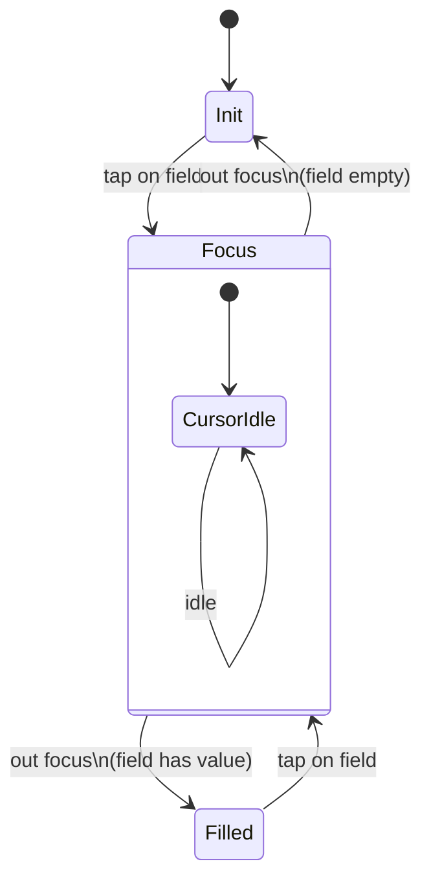

# Field Cursor States — Base State Diagram

> **Base diagram** — inherited by all input field state diagrams in this project.
> Do not add field-specific validation here. Reference this file from specific element diagrams.

## States

| State | Description |
|---|---|
| Init | Field is rendered but not interacted with. Placeholder text visible. No cursor. |
| Focus | User tapped/clicked the field. Cursor is active and blinking inside the field. |
| Filled | User has typed a value and moved focus away. Value is visible. No cursor. |

## Cursor Sub-states (within Focus)

When in Focus, the cursor idles between two positions — before and after the typed value. On a blank field the cursor sits at the left edge. This sub-state does not affect validation logic but is visible in screenshots.

## Element Validate

| Scope | Scenario | Count |
|---|---|---|
| Cursor | Init → Focus (tap field) → Init (out focus, empty) | × 1 |
| Cursor | Init → Focus → Filled (out focus, has value) | × 1 |
| Cursor | Filled → Focus (tap field again) | × 1 |

## State Diagram

