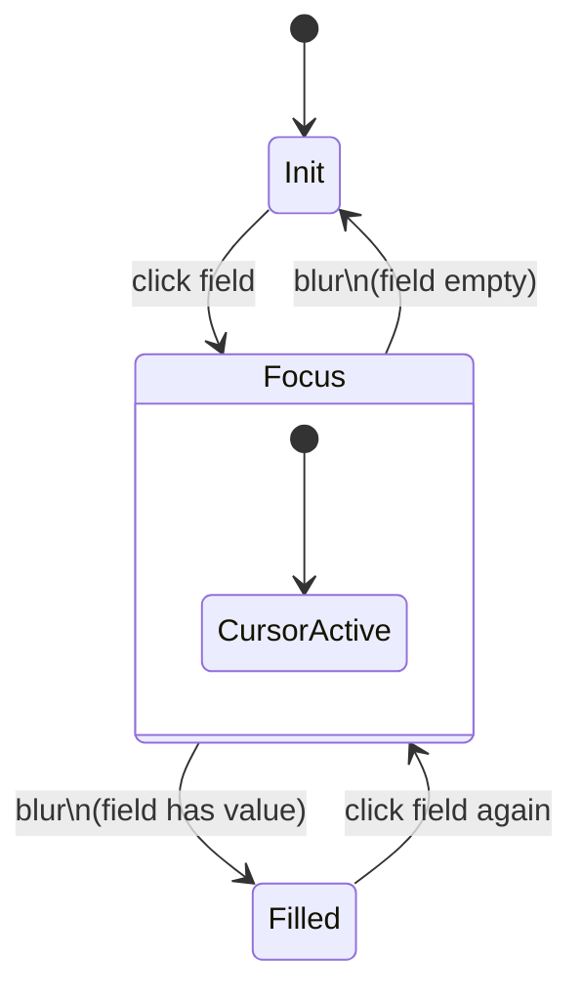
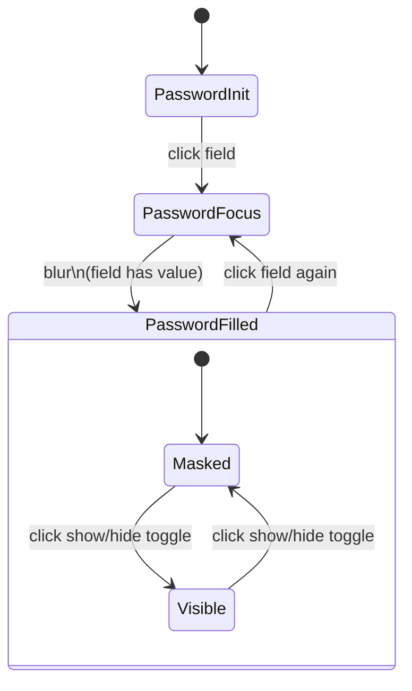
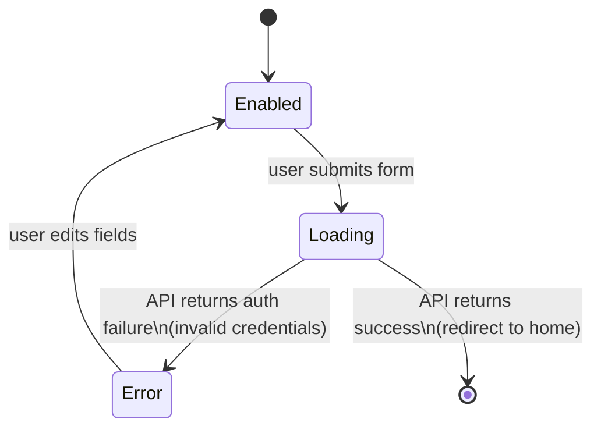
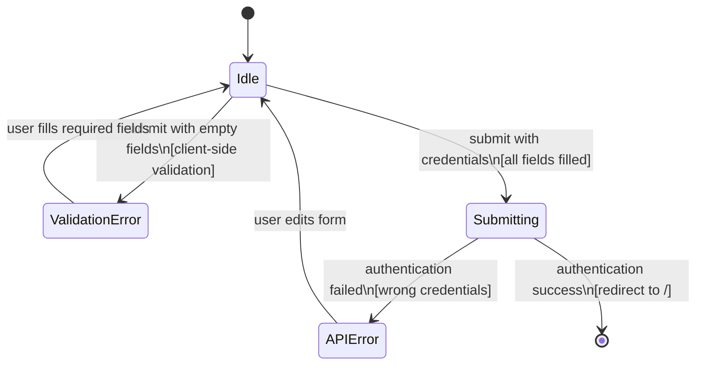

# Login Form — State Diagram

> Inherits: [field-cursor-states.diagram.md](./field-cursor-states.diagram.md)

## States

| State | Description |
|---|---|
| Init | Form rendered with empty email and password fields. Placeholder text visible. |
| Email — Focus | Email field clicked. Cursor active inside field. |
| Email — Filled | Email value typed and focus moved away. Value retained. |
| Email — Error | Email field has validation error (empty on submit, or invalid format). Red border + error message below. |
| Password — Focus | Password field clicked. Cursor active, characters masked as dots. |
| Password — Filled | Password value typed and focus moved away. Value masked. |
| Password — Visible | Show/hide toggle clicked. Password characters shown as plain text (input type changes to `text`). |
| Password — Hidden | Show/hide toggle clicked again. Password characters masked again (input type reverts to `password`). |
| Password — Error | Password field has validation error (empty on submit). Red border + error message below. |
| Submit — Default | Submit button rendered. Active/enabled. Text "เข้าสู่ระบบ". |
| Submit — Loading | API request in-flight after click. Button may show spinner / disabled state during request. |
| Submit — Error (API) | Login failed — invalid credentials. Error message displayed on page (e.g., wrong email/password). |
| Register Link — Default | "สมัครที่นี่" link visible below login form. |
| Register Link — Hover | Link underlined or color changes on hover. |

## Element Validate

| Scope | Scenario | Count |
|---|---|---|
| Cursor | Email: Init → Focus (click) | × 1 |
| Cursor | Email: Focus → Filled (blur with value) | × 1 |
| Cursor | Email: Filled → Focus (click again) | × 1 |
| Cursor | Password: Init → Focus (click) | × 1 |
| Cursor | Password: Focus → Filled (blur with value) | × 1 |
| Value | Password: masked → visible (toggle click) | × 1 |
| Value | Password: visible → masked (toggle click again) | × 1 |
| Submission | Submit empty form → both fields show error | × 1 |
| Submission | Submit valid credentials → loading → success (redirect) | × 1 |
| Submission | Submit invalid credentials → API error shown | × 1 |

## State Diagrams

### 1. Email Field — Cursor Scope

> Inherits base cursor behavior from [field-cursor-states.diagram.md](./field-cursor-states.diagram.md)

### 2. Password Field — Value & Visibility Scope

### 3. Submit Button — Lifecycle Scope

### 4. Full Form — Submission Scope

## Screenshots Reference

| State | Screenshot |
|---|---|
| Login form — init |  |
| Email field — focus (empty) |  |
| Email field — focus (filled) |  |
| Email field — blur (filled) |  |
| Password field — focus (empty) |  |
| Password field — focus (filled) |  |
| Password — visible (show) |  |
| Password — hidden (hide) |  |
| Submit — validation empty |  |
| Submit — invalid credentials error |  |

## Notes

- **Show/hide toggle**: `button[type="button"]` with SVG icon, positioned `absolute right-3 top-1/2`. Clicking toggles the `input[name="password"]` type between `password` and `text`.
- **Submit loading state**: The button shows a loading/spinner state during the API call. It was captured briefly; the loading state is short-lived (< 1s on fast connections).
- **Register link**: `a[href="/register"]` with text "สมัครที่นี่". Hover state changes color.
- **No forgot password link**: No forgot-password link was found on the login page in the current staging environment.
