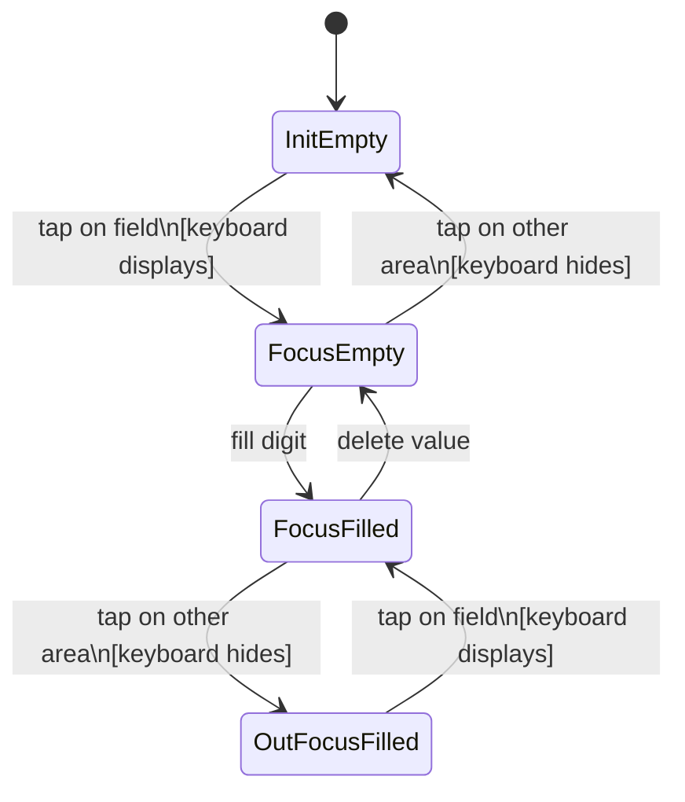
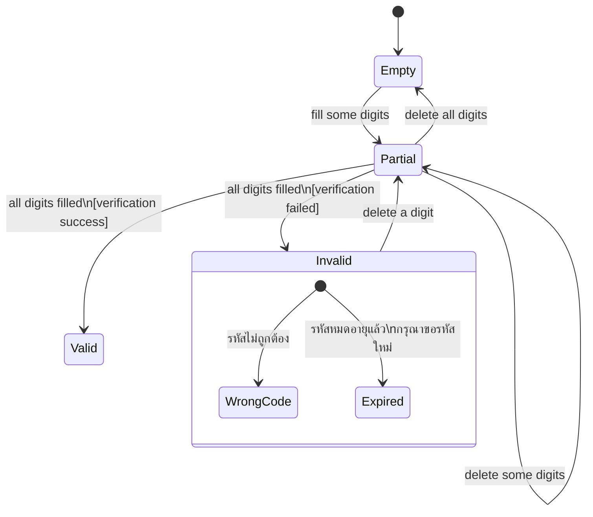
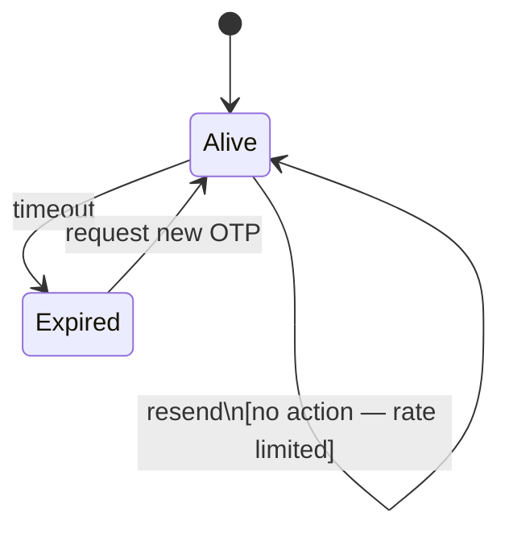

# OTP / Verify Field — State Diagram

> Inherits: [field-cursor-states.diagram.md](./field-cursor-states.diagram.md)

## States

### Single Field (cursor behavior)

| State | Description |
|---|---|
| Init (empty) | Box is empty, no cursor, placeholder visible |
| Focus (empty) | Box tapped, cursor active, keyboard displayed |
| Focus (filled) | Digit typed, cursor active |
| Out Focus (filled) | Focus moved away, digit retained, keyboard hidden |

### All Fields (group submission state)

| State | Description |
|---|---|
| Empty | All boxes empty — initial state |
| Partial (filled) | Some but not all digits entered |
| Valid (all) | All digits filled + verification success |
| Invalid (all) | All digits filled + verification failed |
| Invalid — Wrong Code | รหัสไม่ถูกต้อง — error shown below boxes |
| Invalid — Expired | รหัสหมดอายุแล้ว กรุณาขอรหัสใหม่ — expiry error shown |

### OTP Token

| State | Description |
|---|---|
| Alive | OTP is valid and within expiry window |
| Expired | OTP has timed out — user must request a new one |

## Element Validate

| Scope | Scenario | Count |
|---|---|---|
| Cursor | Single field: Init → Focus (keyboard displays) | × 1 |
| Cursor | Single field: Focus → Init (out focus empty, keyboard hides) | × 1 |
| Field value | All filled — partial (not all boxes) | × 1 |
| Field value | All filled — all boxes (auto-submit triggers) | × 1 |
| Auto submit | All digits filled — verification success | × 1 |
| Auto submit | All digits filled — verification failed (wrong code) | × 1 |
| Auto submit | All digits filled — OTP already expired | × 1 |
| OTP request | 1st request — OTP sent, timer starts | × 1 |
| OTP request | Resend before expiry — no action / rate limited | × 1 |
| OTP request | Request new after expired — new OTP issued | × 1 |

## State Diagrams

### 1. Single OTP Box — Cursor & Value States

### 2. All OTP Boxes — Group Submission States

### 3. OTP Token — Lifecycle States

