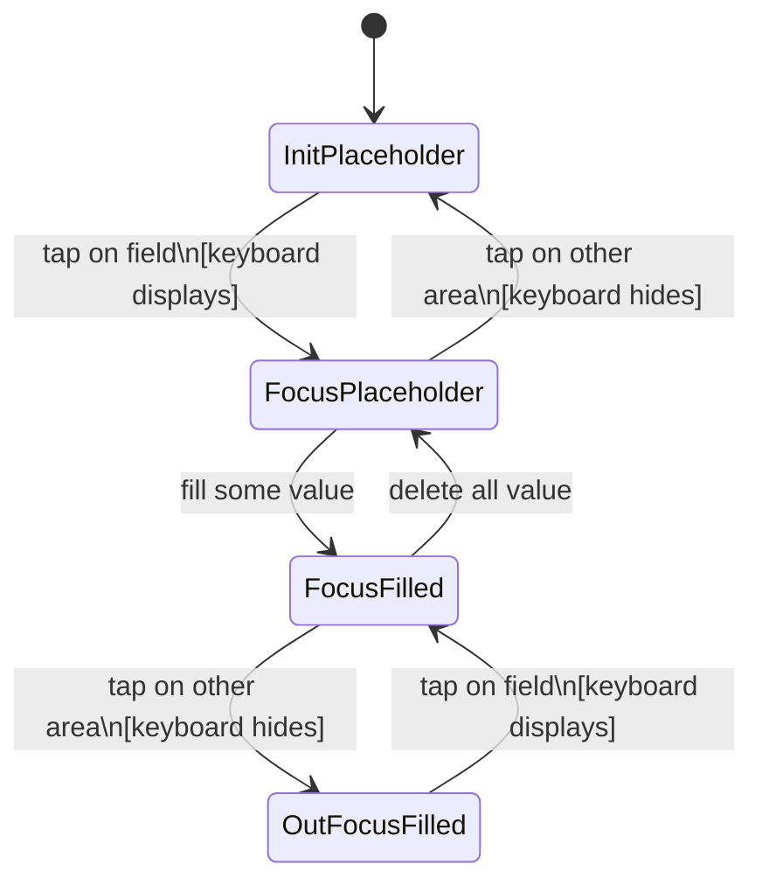
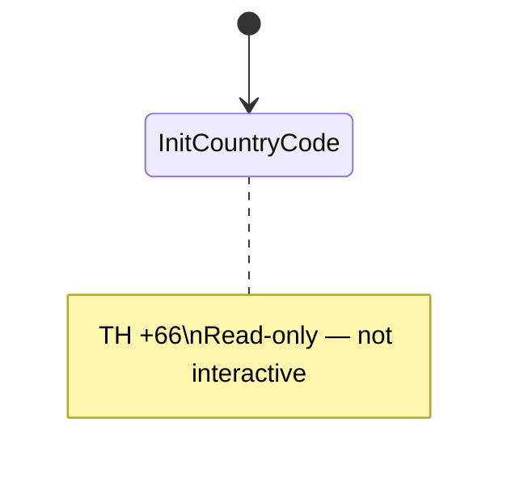
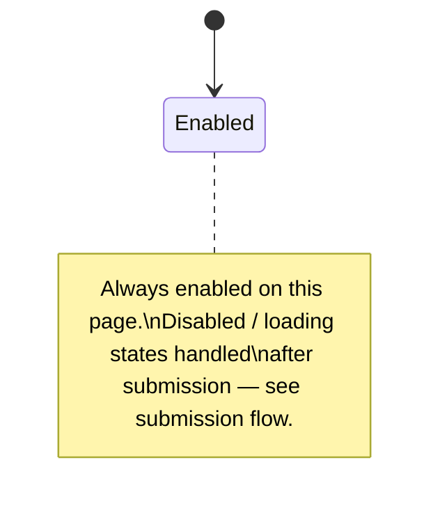

# Phone Number Field — State Diagram

> Inherits: [field-cursor-states.diagram.md](./field-cursor-states.diagram.md)

## States

| State | Description |
|---|---|
| Country Code — Init | Flag + country code prefix (e.g. TH +66) — static, not editable |
| Phone — Init (placeholder) | Placeholder text visible, no cursor, no value |
| Phone — Focus (placeholder) | Field tapped, cursor active, keyboard displayed, no value yet |
| Phone — Focus (filled) | Value typed, cursor active, keyboard still displayed |
| Phone — Out Focus (filled) | Focus moved away, value retained, keyboard hidden |
| Send OTP Button — Init (enabled) | Button always enabled regardless of field state |

## Element Validate

| Scope | Scenario | Count |
|---|---|---|
| Cursor | Init → Focus (keyboard displays) | × 1 |
| Cursor | Focus → Init (out focus empty, keyboard hides) | × 1 |
| Field value | Filled boundary: min digits (too short) | × 1 |
| Field value | Filled boundary: valid length (exact) | × 1 |
| Field value | Filled boundary: max+1 digits (too long / blocked) | × 1 |
| Submission | Submit empty — field required error | × 1 |
| Submission | Submit valid local phone number — accepted | × 1 |
| Submission | Submit invalid format — inline error shown | × 1 |

## State Diagrams

### 1. Phone Number Field — Cursor & Value States

### 2. Country Code — Static State

### 3. Send OTP Button — Static State

