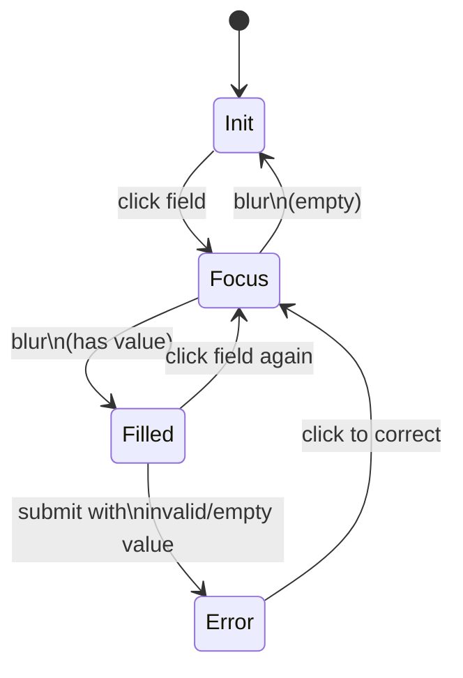
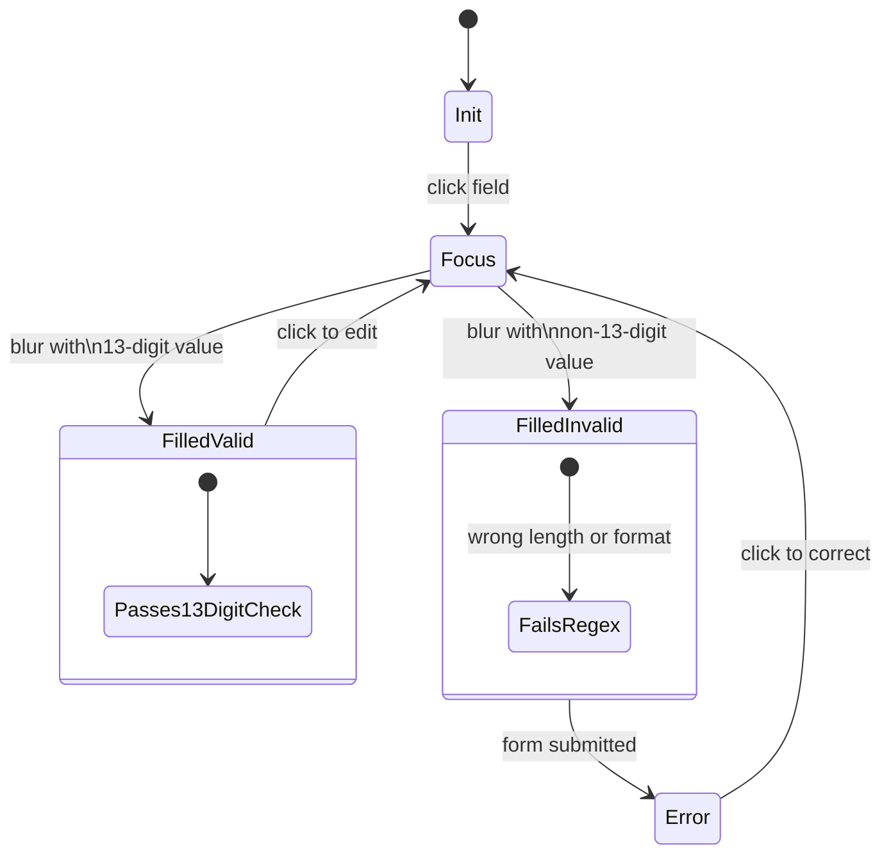
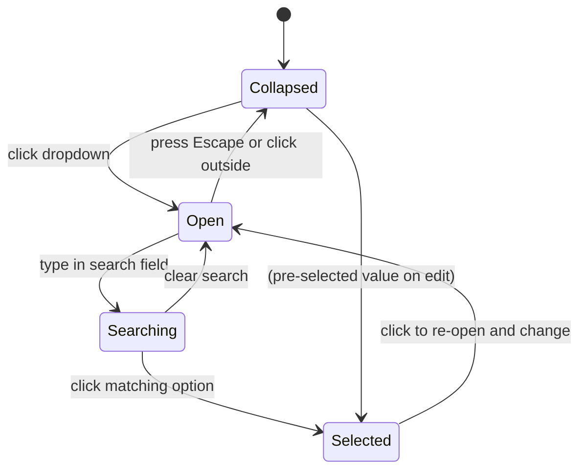
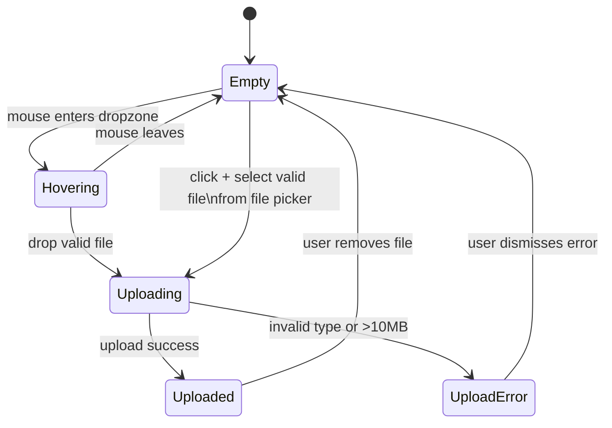
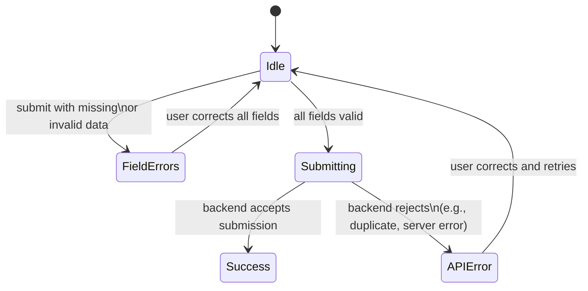

# Profile Individual Form — State Diagram

> Inherits: [field-cursor-states.diagram.md](./field-cursor-states.diagram.md)

Route: `/profile/individual`

## Fields Found

| # | Input Name | Type | Placeholder | Section |
|---|---|---|---|---|
| 0 | `name` | text | กรอกชื่อ | Personal Info |
| 1 | `surname` | text | กรอกนามสกุล | Personal Info |
| 2 | `phone` | text | กรอกเบอร์โทร | Personal Info |
| 3 | `idCard` | text | กรอกเลขบัตรประจำตัวประชาชน | Personal Info |
| 4 | — (textarea) | textarea | กรอกที่อยู่ | Address |
| 5 | — | text | -ค้นหา- (search) | Address (province/district dropdown) |
| 6 | — | text | — | Address (sub-district) |
| 7 | — | text | -ค้นหา- (search) | Address |
| 8 | — | text | — | Address |
| 9 | — | text | -ค้นหา- (search) | Address |
| 10+ | — | file | — | Document Upload (ID card, house registration, etc.) |
| Bank fields | — | text | — | Bank Account Section |

Note: Total 17+ inputs including text, textarea, file, and address-search fields across 4 sections.

## Sections

| Section | Content |
|---|---|
| 1. Personal Info (ข้อมูลส่วนตัว) | Name, surname, phone, ID card number |
| 2. Address (ที่อยู่) | Address text, province, district, sub-district (dropdown search fields) |
| 3. Documents (เอกสาร) | File upload dropzones (ID card, house registration) |
| 4. Bank Account (บัญชีธนาคาร) | Bank name, account number, account name |

## States

| State | Description |
|---|---|
| Field — Init | Field empty, placeholder visible. |
| Field — Focus | Field clicked. Cursor active. |
| Field — Filled | Value typed and focus moved away. |
| Field — Error | Field empty or invalid on submit. Red border + error message. |
| ID Card — Valid | 13-digit ID number passes regex. No error. |
| ID Card — Invalid | Non-13 digits or invalid format. Error shown. |
| Address Textarea — Focus | Textarea clicked, cursor active. |
| Address Textarea — Filled | Address text entered. |
| Address Dropdown — Init | Dropdown button shows default text. Collapsed. |
| Address Dropdown — Open | Dropdown clicked. Search field visible + list of options. |
| Address Dropdown — Selected | Option selected. Dropdown shows selected value. |
| Dropzone — Default | File upload area displayed. "วาง หรือ คลิกเพื่ออัปโหลด" text. |
| Dropzone — Hover | Mouse over dropzone. Visual highlight (dashed border changes color). |
| Dropzone — File Selected | File chosen. Filename/thumbnail displayed. |
| Dropzone — Upload Error | Invalid file type or file too large. Error message shown. |
| Submit — Default | Submit/Next button enabled. |
| Submit — Validation Error | Required fields empty on submit. Field errors shown. |
| Next/Back Buttons | Navigation between form sections/steps. |

## Element Validate

| Scope | Scenario | Count |
|---|---|---|
| Cursor | name: Init → Focus → Filled | × 1 |
| Cursor | surname: Init → Focus → Filled | × 1 |
| Cursor | phone: Init → Focus → Filled | × 1 |
| Cursor | idCard: Init → Focus → Filled | × 1 |
| Cursor | address textarea: Init → Focus → Filled | × 1 |
| Value | idCard: valid 13-digit — no error | × 1 |
| Value | idCard: invalid format — error shown | × 1 |
| Value | Address dropdown: Init → Open → Selected | × 3 (province/district/sub) |
| Value | File upload: valid file (PDF/JPG/PNG ≤10MB) | × 1 |
| Value | File upload: invalid type | × 1 |
| Value | File upload: over 10MB | × 1 |
| Submission | Submit empty form → all required field errors | × 1 |
| Submission | Submit with valid data → success | × 1 |

## State Diagrams

### 1. Text Fields (name / surname / phone) — Cursor Scope

> Inherits base cursor behavior from [field-cursor-states.diagram.md](./field-cursor-states.diagram.md)

### 2. ID Card Field — Value & Validation Scope

### 3. Address Dropdown — Value Scope

### 4. File Upload Dropzone — Lifecycle Scope

### 5. Submit — Submission Scope

## Screenshots Reference

| State | Screenshot |
|---|---|
| Form init |  |
| Form scroll — pos 0 |  |
| Form scroll — pos 400 |  |
| Form scroll — pos 800 |  |
| Form scroll — pos 1200 |  |
| Form scroll — pos 1600 |  |
| Form scroll — pos 2000 |  |
| Form scroll — pos 2400 |  |
| Form scroll — pos 2800 |  |
| Fields filled (partial) |  |
| Account type label — hover |  |
| Account type label — selected |  |
| Submit — validation empty |  |

## Notes

- **Address dropdowns**: Province, district, and sub-district are implemented as searchable dropdowns (search field + list). They use `input[placeholder="-ค้นหา-"]` for the search input. The dropdown is closed and blocked during interaction in some contexts (modal overlay interference during automation).
- **ID card validation**: 13-digit regex validation is expected per requirements. Frontend validation triggers on blur or submit.
- **File upload**: Inputs are `input[type="file"]`. The visible area is a styled dropzone wrapper. File type (PDF, JPG, PNG) and size (max 10MB) validation occurs before upload.
- **Bank account section**: Located at the bottom of the form (high scroll position). Bank name, account number, account name fields were found in the input list but not individually captured due to scroll-blocking during automated exploration.
- **Multi-section form**: The form may be a single-page scrollable form or a multi-step wizard. Further manual exploration needed to confirm.
