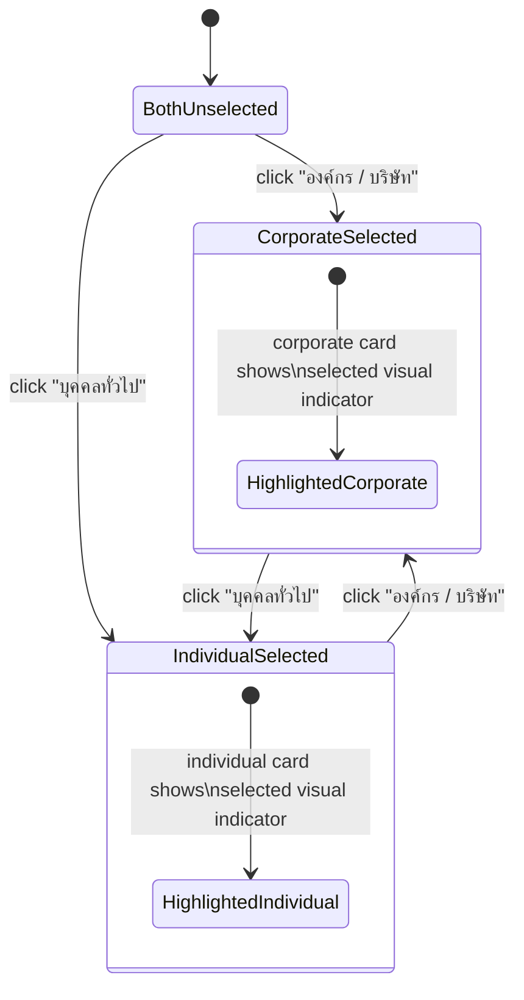
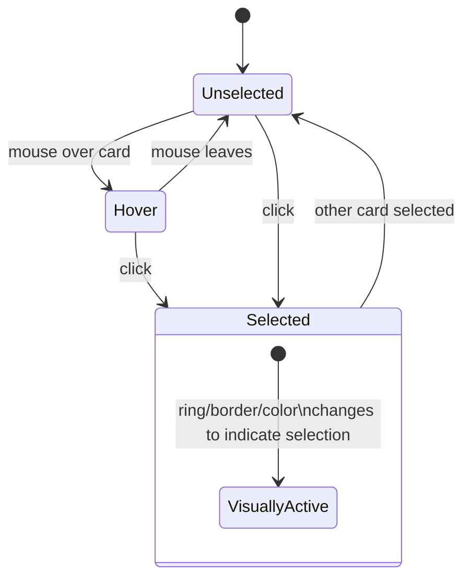
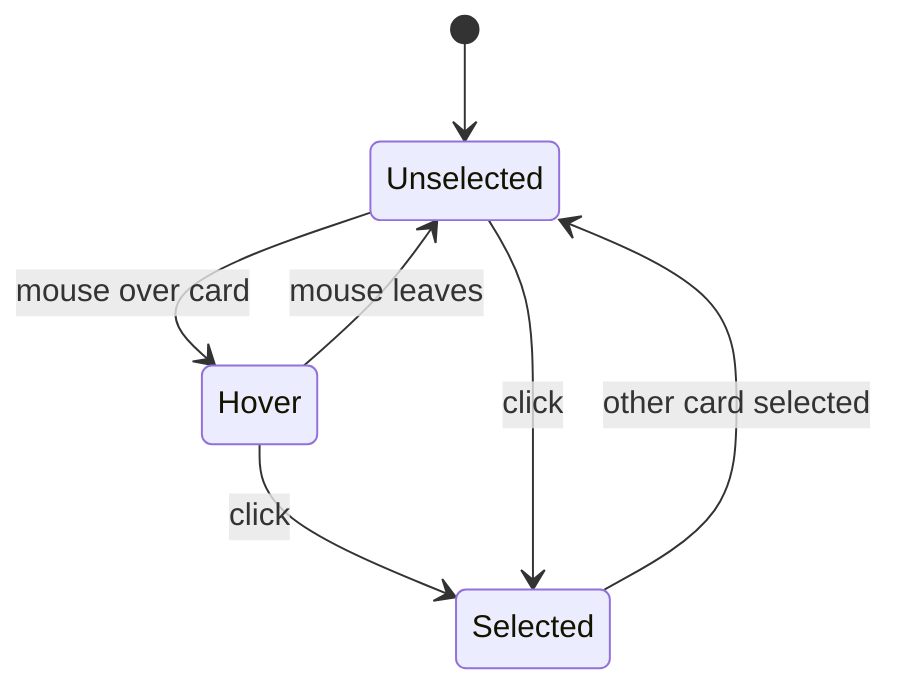

# Profile Type Selection — State Diagram

Route: `/profile`

## Elements Found

| Element | Tag | Text |
|---|---|---|
| Corporate Card | `label` | "องค์กร / บริษัท — เหมาะสำหรับบริษัทหรือทีมที่ต้องการจัดการอีเวนท์" |
| Individual Card | `label` | "บุคคลทั่วไป — สำหรับผู้ใช้งานทั่วไปที่อยากสร้างอีเวนท์ของตัวเอง" |

Note: Both cards are implemented as `<label>` elements wrapping a radio input or similar input control. Clicking either label selects the corresponding type.

## States

| State | Description |
|---|---|
| Init | Both cards rendered. Neither selected (or default selected). |
| Card — Default | Card rendered in neutral state. Not selected. |
| Card — Hover | Mouse over card. Visual highlight (border change, shadow, or background). |
| Card — Selected | Card clicked. Visual indicator shows selected state (e.g., colored border, checkmark, ring). |
| Corporate — Selected | "องค์กร / บริษัท" card selected. Individual card returns to default. |
| Individual — Selected | "บุคคลทั่วไป" card selected. Corporate card returns to default. |
| Submit — (observed) | After clicking either label, page stays on `/profile`. Navigation to individual/corporate profile form requires a separate confirm/next action. |

## Element Validate

| Scope | Scenario | Count |
|---|---|---|
| Selection | Corporate card: Default → Hover → Selected | × 1 |
| Selection | Individual card: Default → Hover → Selected | × 1 |
| Selection | Corporate → Individual (switch selection) | × 1 |
| Selection | Individual → Corporate (switch selection) | × 1 |

## State Diagrams

### 1. Type Selection Cards — Selection Scope

### 2. Individual Card — Hover & Selection Scope

### 3. Corporate Card — Hover & Selection Scope

## Screenshots Reference

| State | Screenshot |
|---|---|
| Profile type — init |  |
| Corporate card — hover |  |
| Corporate card — selected |  |
| Individual card — hover |  |
| Individual card — selected |  |

## Notes

- **Navigation behavior**: After clicking either label, the page URL stays at `/profile`. The selection does NOT immediately navigate to `/profile/individual` or `/profile/corporate`. A separate "Next" or confirm action must trigger navigation. This behavior may differ from requirements — see req-clarify notes.
- **Label implementation**: Cards are `<label>` elements, not `<button>` or `<a>` elements. The underlying radio input determines selection state.
- **Mutual exclusion**: Selecting one card deselects the other — standard radio button behavior.
- **Disabled state**: Neither card showed a disabled state during exploration.
