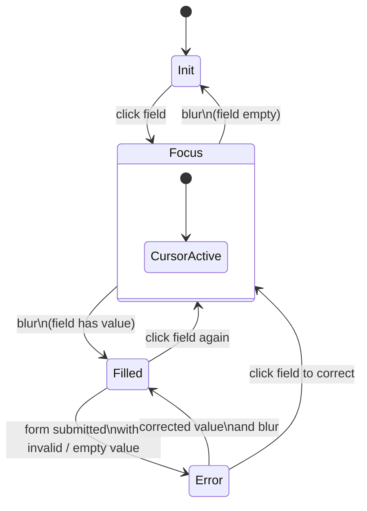
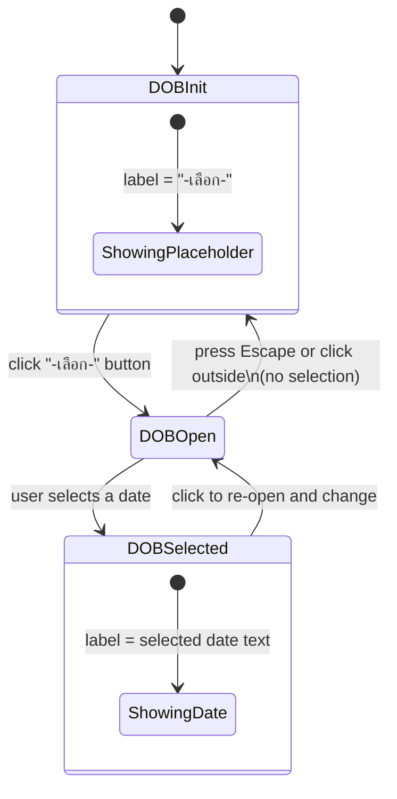
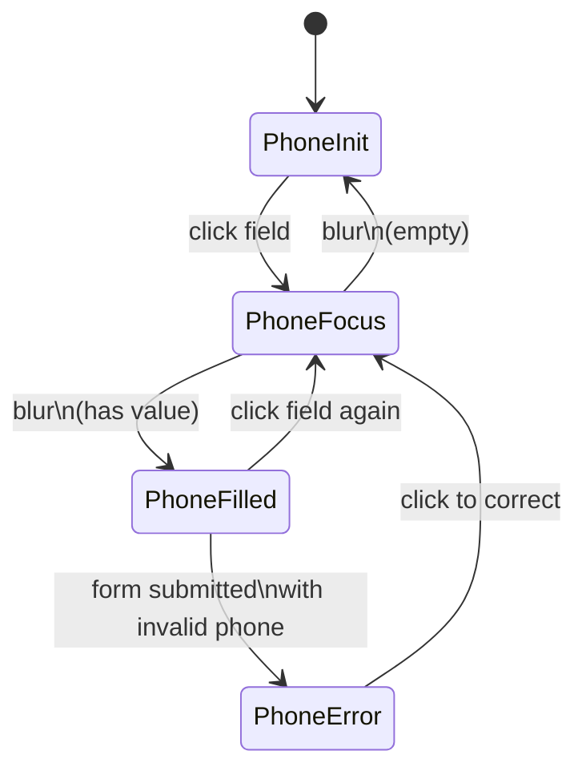
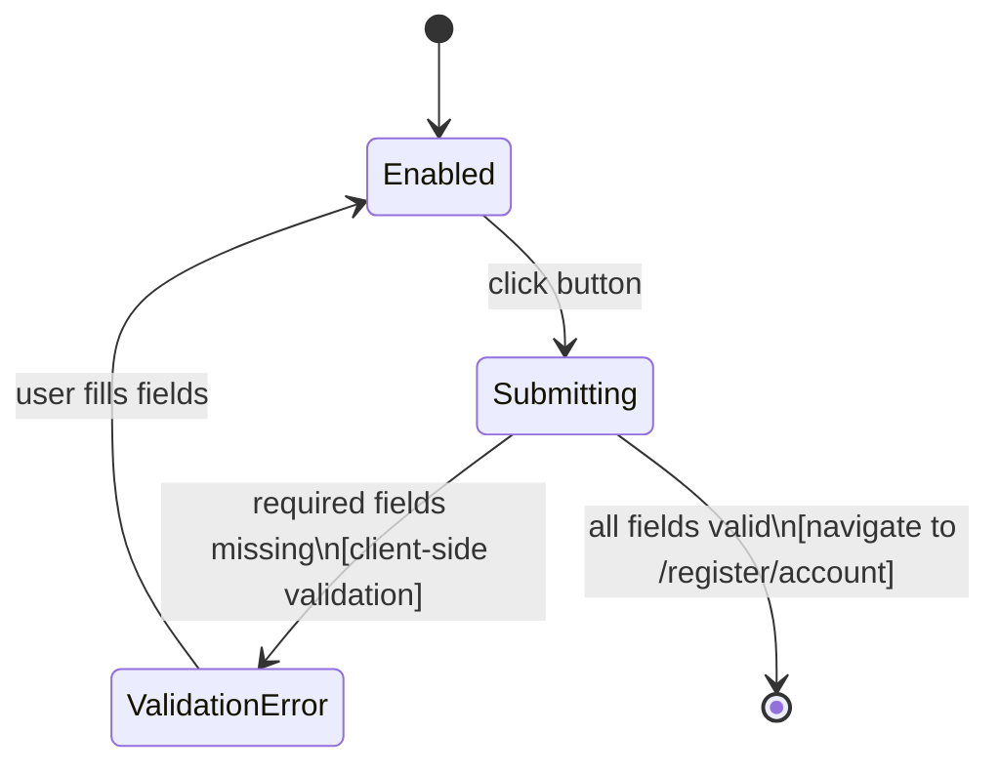
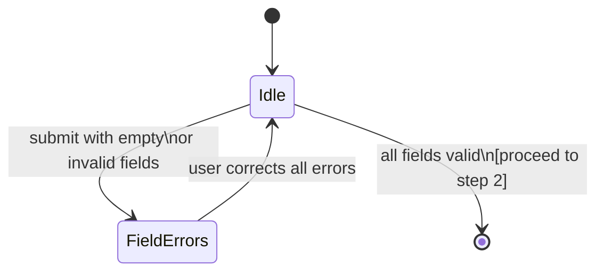

# Register Step 1 — State Diagram

> Inherits: [field-cursor-states.diagram.md](./field-cursor-states.diagram.md)

Route: `/register`

## Fields Found

| Field | Input Name | Type | Placeholder |
|---|---|---|---|
| Display Name | `displayName` | text | กรอกชื่อผู้ใช้งาน |
| First Name | `firstName` | text | กรอกชื่อ |
| Last Name | `lastName` | text | กรอกนามสกุล |
| Date of Birth | — | button (`-เลือก-`) | Custom dropdown |
| Phone | `phone` | text | กรอกเบอร์โทร |
| Next Button | — | submit | ถัดไป |

## States

| State | Description |
|---|---|
| Init | Form rendered. All text fields empty with placeholder. DOB button shows "-เลือก-". |
| Field — Focus | A text field clicked. Cursor active inside field. |
| Field — Filled | Value entered and focus moved away. Value retained. |
| Field — Error | Field left empty and form submitted. Red border and error message below field. |
| DOB — Init | Button displays "-เลือก-". No date selected. |
| DOB — Open | Button clicked. Dropdown opens showing selectable date options. |
| DOB — Selected | A date is chosen. Button text updates to show selected value. |
| Phone — Focus | Phone input clicked. Cursor active. |
| Phone — Filled | Phone number entered. Value retained on blur. |
| Phone — Error | Phone field empty on submit, or invalid format entered. |
| Next Button — Default | Button always enabled (no client-side disable based on filled state). Text "ถัดไป". |
| Next Button — Submitting | Button clicked. Brief loading state during validation/navigation. |

## Element Validate

| Scope | Scenario | Count |
|---|---|---|
| Cursor | displayName: Init → Focus → Filled | × 1 |
| Cursor | firstName: Init → Focus → Filled | × 1 |
| Cursor | lastName: Init → Focus → Filled | × 1 |
| Cursor | phone: Init → Focus → Filled | × 1 |
| Value | DOB: Init → Open → Selected | × 1 |
| Value | DOB: Closed without selection → stays "-เลือก-" | × 1 |
| Submission | Submit all empty → required field errors shown | × 1 |
| Submission | Submit with DOB missing → DOB required error | × 1 |
| Submission | Submit all valid → navigate to step 2 | × 1 |

## State Diagrams

### 1. Text Fields (displayName / firstName / lastName) — Cursor Scope

> Inherits base cursor behavior from [field-cursor-states.diagram.md](./field-cursor-states.diagram.md)

### 2. DOB Picker — Value Scope

### 3. Phone Field — Cursor & Value Scope

> See also: [phone-field-states.diagram.md](./phone-field-states.diagram.md)

### 4. Next Button — Lifecycle Scope

### 5. Full Form — Submission Scope

## Screenshots Reference

| State | Screenshot |
|---|---|
| Form init |  |
| displayName — focus |  |
| displayName — filled |  |
| firstName — focus |  |
| firstName — filled |  |
| lastName — focus |  |
| lastName — filled |  |
| DOB — dropdown open |  |
| Phone — focus |  |
| Phone — filled |  |
| Next button — default |  |
| Next button — hover |  |
| Form — validation errors |  |

## Notes

- **DOB picker**: Implemented as a custom `button[type="button"]` dropdown (label "-เลือก-"), not a native `input[type="date"]`. Only one dropdown was found — the DOB picker may be a single combined selector or may expand into day/month/year sub-dropdowns when opened.
- **Phone field**: Uses `input[type="text"]` not `input[type="tel"]`. No country code prefix visible in step 1 registration (unlike the standalone phone-field component described in phone-field-states.diagram.md).
- **No disabled state on Next button**: The Next button is always enabled regardless of field state. Validation occurs on submit.
- **DOB dropdown options**: When opened, no visible `[role="option"]` elements were found — the dropdown may render options in a portal or with a slight delay. Requires manual observation.
