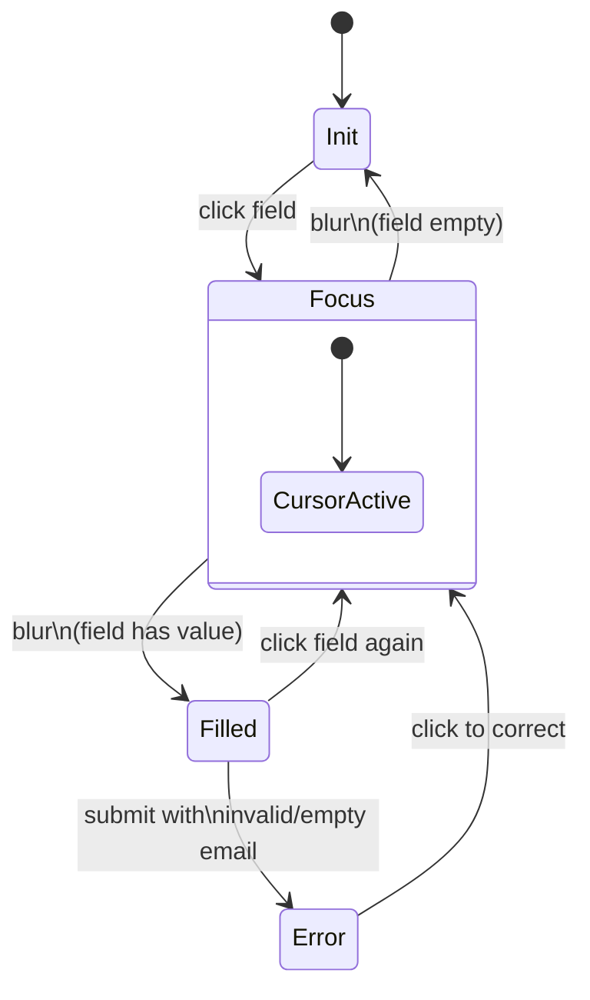
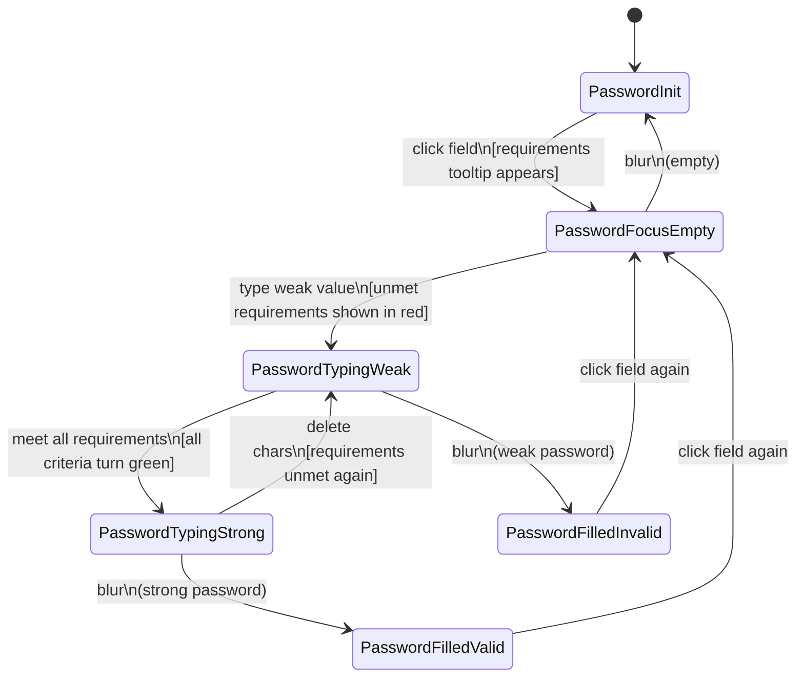
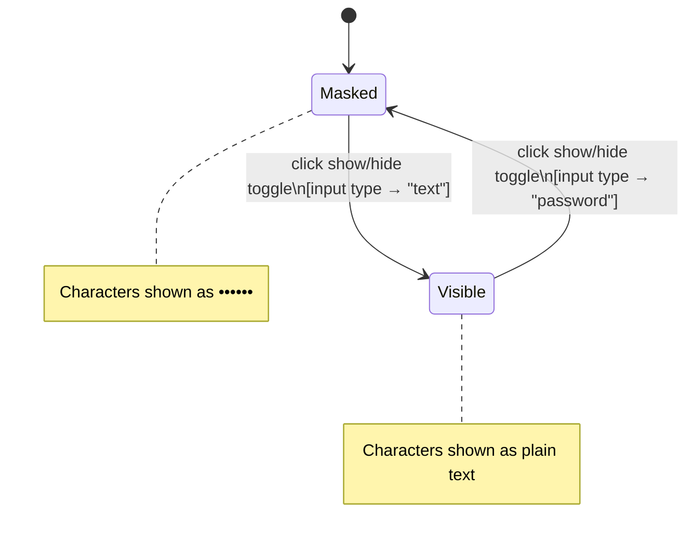
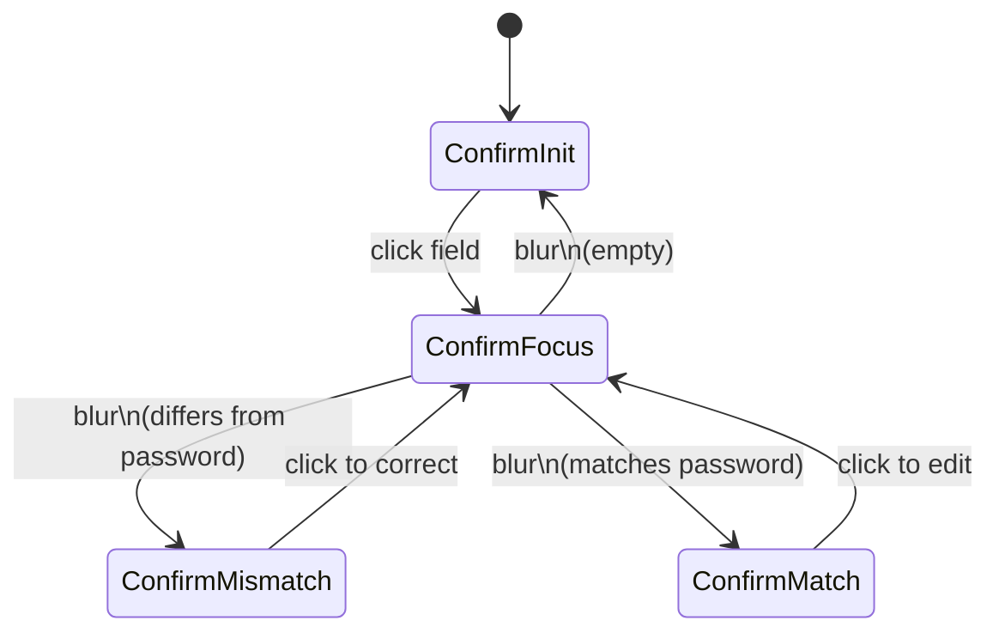
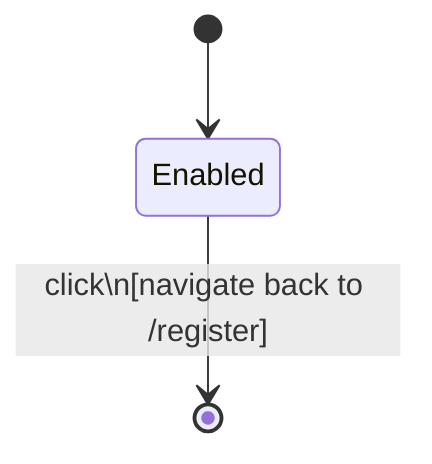
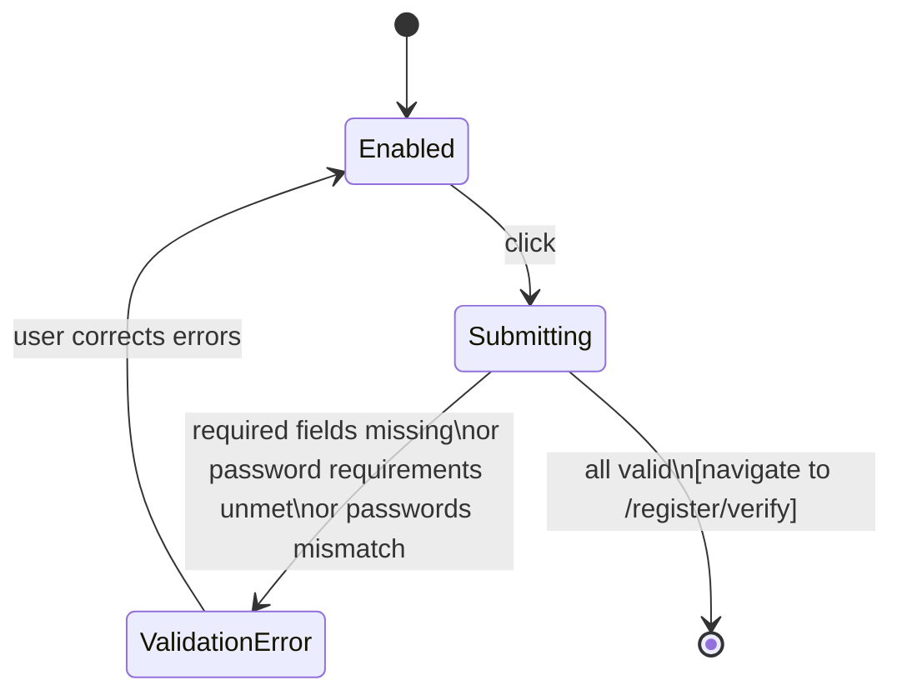

# Register Step 2 — State Diagram

> Inherits: [field-cursor-states.diagram.md](./field-cursor-states.diagram.md)

Route: `/register/account`

## Fields Found

| Field | Input Name | Type | Placeholder |
|---|---|---|---|
| Email | `email` | email | กรอกอีเมล |
| Password | `password` | password | กรอกรหัสผ่าน |
| Confirm Password | `confirmPassword` | password | กรอกรหัสผ่านอีกครั้ง |
| Password Show/Hide Toggle (1) | — | button (icon) | For password field |
| Password Show/Hide Toggle (2) | — | button (icon) | For confirm password field |
| Back Button | — | button | ย้อนกลับ |
| Next Button | — | submit | ถัดไป |

## States

| State | Description |
|---|---|
| Email — Init | Field empty, placeholder "กรอกอีเมล" visible. |
| Email — Focus | Field clicked. Cursor active. |
| Email — Filled | Email typed and focus moved away. |
| Email — Error | Empty on submit or invalid email format. Red border + error message. |
| Password — Focus (empty) | Password field clicked. Requirements tooltip/popover appears above or beside field. |
| Password — Weak | Partial password entered. Requirements checklist shows unmet criteria (red X). |
| Password — Strong | All password requirements met. Requirements checklist shows all green checkmarks. |
| Password — Filled (valid) | Focus moved away after meeting all requirements. No error state. |
| Password — Filled (invalid) | Focus moved away with weak password. Error state shown. |
| Password — Visible | Show/hide toggle clicked. Characters unmasked. |
| Password — Hidden | Show/hide toggle clicked. Characters masked. |
| Confirm — Focus | Confirm password field clicked. |
| Confirm — Mismatch | Value differs from password field. Error: passwords do not match. |
| Confirm — Match | Value matches password field. No error. |
| Confirm — Visible | Show/hide toggle for confirm field clicked. Characters unmasked. |
| Back Button — Default | "ย้อนกลับ" button. Enabled. Navigates to step 1. |
| Back Button — Hover | Visual highlight on hover. |
| Next Button — Default | "ถัดไป" submit button. Enabled. |
| Next Button — Submitting | Brief loading state while navigating to step 3. |

## Element Validate

| Scope | Scenario | Count |
|---|---|---|
| Cursor | Email: Init → Focus → Filled | × 1 |
| Cursor | Password: Init → Focus (tooltip appears) → Filled | × 1 |
| Cursor | Confirm: Init → Focus → Filled | × 1 |
| Value | Password: weak (fails requirements) | × 1 |
| Value | Password: strong (passes all requirements) | × 1 |
| Value | Password: toggle show/hide (× 2 — password + confirm fields) | × 2 |
| Value | Confirm: mismatch (passwords differ) | × 1 |
| Value | Confirm: match (passwords identical) | × 1 |
| Submission | Submit all empty → field errors shown | × 1 |
| Submission | Submit with weak password → password error | × 1 |
| Submission | Submit with mismatched confirm → confirm error | × 1 |
| Submission | Submit with valid email + strong password + matching confirm → step 3 | × 1 |
| Navigation | Back button → navigate to step 1 | × 1 |

## State Diagrams

### 1. Email Field — Cursor Scope

> Inherits base cursor behavior from [field-cursor-states.diagram.md](./field-cursor-states.diagram.md)

### 2. Password Field — Value & Requirements Scope

### 3. Password Visibility — Toggle Scope

### 4. Confirm Password — Value Scope

### 5. Back Button — Lifecycle Scope

### 6. Next Button — Submission Scope

## Screenshots Reference

| State | Screenshot |
|---|---|
| Form init |  |
| Email — focus |  |
| Email — filled |  |
| Password — focus + requirements |  |
| Password — weak |  |
| Password — strong |  |
| Password — toggle on (visible) |  |
| Password — toggle off (hidden) |  |
| Confirm — mismatch |  |
| Confirm — match |  |
| Back button — hover |  |
| Form — validation empty |  |

## Notes

- **Password requirements tooltip**: Appears on focus of the password field. Shows a checklist of criteria (e.g., min 8 chars, uppercase, number, special character). Criteria are shown as red/unmet and green/met as the user types.
- **Two show/hide toggles**: Both password and confirm password fields each have their own `button[type="button"]` toggle (SVG icon, `absolute right-3 top-1/2` positioned). They operate independently.
- **No email duplication check at this step**: Duplicate email validation (if any) happens server-side after step 3 (email verify). Frontend only validates format.
- **Back button**: Navigates to `/register` (step 1). No data loss — form state appears to be preserved during step navigation.
