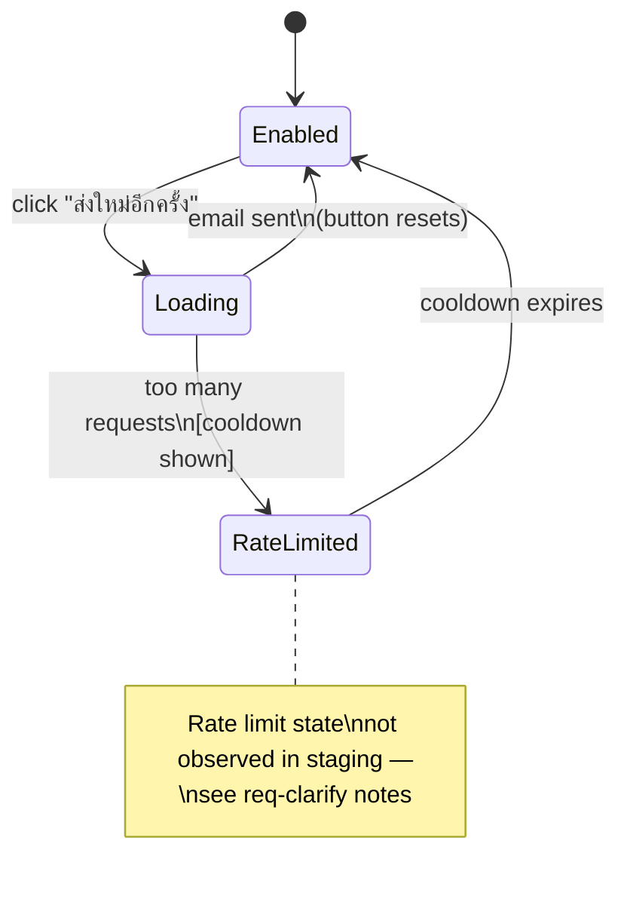
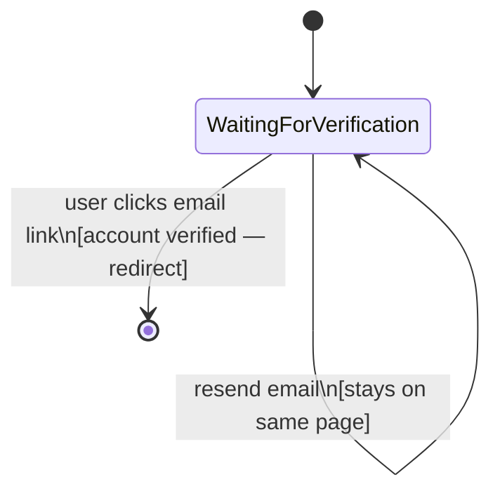

# Register Step 3 (Email Verify) — State Diagram

Route: `/register/verify`

## Fields Found

| Element | Type | Text |
|---|---|---|
| Resend Button | `button[type="button"]` | ส่งใหม่อีกครั้ง |

## States

| State | Description |
|---|---|
| Page — Init | Verify page shown after step 2 submission. Instruction text displayed. Resend button rendered. |
| Resend Button — Default | Button enabled. Text "ส่งใหม่อีกครั้ง". Ready to resend verification email. |
| Resend Button — Hover | Visual highlight on hover (color or underline change). |
| Resend Button — Loading | Button clicked. Email being re-sent. May show spinner or be briefly disabled. |
| Resend Button — Success | Email re-sent. Confirmation message or button resets. |
| Resend Button — Rate Limited | Too many resend requests. Button may be disabled or show a cooldown message. (Not observed — see Notes) |
| Page — Verified | User clicks email verification link → account confirmed → redirect to login or home. (Not triggerable from this page directly) |

## Element Validate

| Scope | Scenario | Count |
|---|---|---|
| Lifecycle | Page renders on step 3 arrival | × 1 |
| Submission | Resend button click → email re-sent | × 1 |
| Submission | Resend button click — rapid repeated clicks | × 1 |
| Lifecycle | Email link clicked externally → account verified → redirect | × 1 |

## State Diagrams

### 1. Resend Button — Lifecycle Scope

### 2. Page — Verification Lifecycle Scope

## Screenshots Reference

| State | Screenshot |
|---|---|
| Page init |  |
| Resend — default |  |
| Resend — hover |  |
| Resend — after click |  |
| Page — after resend |  |

## Notes

- **Single interactive element**: Only one interactive element exists on `/register/verify` — the resend button "ส่งใหม่อีกครั้ง". There are no input fields on this page.
- **Resend loading state**: The click triggered the resend action but no observable visual loading state (spinner, disabled) was captured in the brief window — may be too fast to observe, or loading state is not implemented.
- **Rate limiting**: A cooldown/rate-limit state after repeated resend clicks was not observed. This is flagged in req-clarify notes.
- **Verification via email link**: The "verified" state cannot be triggered from within the app — it requires clicking the link sent to the email address. This state is documented as expected behavior but not capturable in automated exploration.
